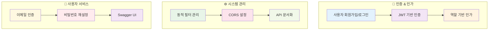

# 🔐 Auth-Server Spring Security

> Spring Security를 활용한 인증 및 인가 서버 구현

이 프로젝트는 Spring Security를 활용한 인증 및 인가 서버를 구현합니다. 사용자 접근 관리, 인증, 동적 필터 구성을 위한 견고하고 유연한 프레임워크를 제공합니다.

## ✨ 주요 기능

### 🎯 핵심 기능 상세
- **🔑 사용자 관리**: 회원가입, 로그인, 프로필 관리
- **🛡️ JWT 인증**: 토큰 기반 무상태 인증 시스템
- **👥 역할 기반 권한**: Admin/User 역할별 세분화된 접근 제어
- **🔧 동적 필터**: 재배포 없는 보안 필터 런타임 구성
- **🌐 CORS 지원**: 크로스 오리진 요청 관리
- **📧 이메일 서비스**: 인증 코드 및 비밀번호 재설정
- **📚 API 문서**: Swagger UI를 통한 인터랙티브 API 문서

## 시작하기

자세한 설치 및 실행 방법은 `backend/docs/Setup_and_Run.md` 파일을 참고하세요.

## 문서

이 프로젝트는 Auth-Server의 다양한 측면을 다루는 포괄적인 문서를 제공합니다. 주요 문서 섹션은 다음과 같습니다:

*   **API 문서**: 모든 REST API 엔드포인트의 상세 명세(요청/응답 형식, 인증 요구사항 등)
    *   [API 문서 보기](backend/docs/API_Documentation.md)

*   **데이터 모델**: 애플리케이션 전반에서 사용되는 핵심 데이터 모델 및 엔티티(필드, 관계 등)
    *   [데이터 모델 보기](backend/docs/Data_Models_Entities.md)

*   **동적 필터 관리**: 런타임에 보안 필터를 재배포 없이 구성할 수 있는 동적 필터 시스템 설명
    *   [필터 관리 문서 보기](backend/docs/Filter_Management.md)

*   **보안 개요**: JWT 기반 인증, 인가 흐름, 주요 보안 컴포넌트 등 보안 아키텍처 심층 설명
    *   [보안 개요 보기](backend/docs/Security_Overview.md)

## 프로젝트 구조

*   `backend/`: Spring Boot 애플리케이션 소스 코드
*   `backend/docs/`: 상세 문서 파일

## 문제 해결

자주 발생하는 문제와 해결 방법은 `backend/docs/Troubleshooting.md`를 참고하세요.

## 기여

프로젝트 기여 방법은 추후 추가될 예정입니다.

## 라이선스

이 프로젝트는 MIT 라이선스를 따릅니다. 자세한 내용은 LICENSE.md 파일을 참고하세요.
