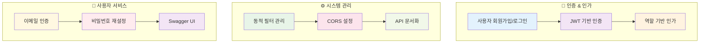
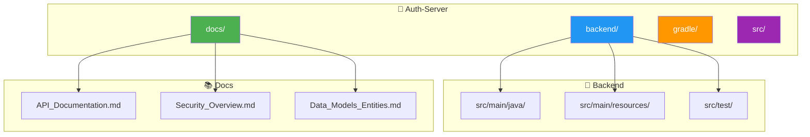

# 🔐 Auth-Server Spring Security

> Spring Security를 활용한 인증 및 인가 서버 구현

[](https://spring.io/projects/spring-boot)
[](https://spring.io/projects/spring-security)
[](https://github.com/jwtk/jjwt)
[](https://opensource.org/licenses/MIT)

이 프로젝트는 Spring Security를 활용한 인증 및 인가 서버를 구현합니다. 사용자 접근 관리, 인증, 동적 필터 구성을 위한 견고하고 유연한 프레임워크를 제공합니다.

## ✨ 주요 기능



### 🎯 핵심 기능 상세
- **🔑 사용자 관리**: 회원가입, 로그인, 프로필 관리
- **🛡️ JWT 인증**: 토큰 기반 무상태 인증 시스템
- **👥 역할 기반 권한**: Admin/User 역할별 세분화된 접근 제어
- **🔧 동적 필터**: 재배포 없는 보안 필터 런타임 구성
- **🌐 CORS 지원**: 크로스 오리진 요청 관리
- **📧 이메일 서비스**: 인증 코드 및 비밀번호 재설정
- **📚 API 문서**: Swagger UI를 통한 인터랙티브 API 문서

## 🚀 시작하기

### 📋 사전 요구사항
- ☕ **Java** JDK 11 이상
- 🌱 **Spring Boot** 3.0+
- 🐘 **PostgreSQL** 또는 **MySQL**
- 📧 **SMTP 서버** (이메일 서비스용)

### 🛠️ 설치 및 실행
자세한 설치 및 실행 방법은 [`backend/docs/Setup_and_Run.md`](backend/docs/Setup_and_Run.md) 파일을 참고하세요.

```bash
# 1. 저장소 클론
git clone <repository-url>
cd Auth-server

# 2. 의존성 설치 및 빌드
./gradlew build

# 3. 애플리케이션 실행
./gradlew bootRun
```

## 📚 문서

```mermaid
graph LR
    subgraph "📖 문서 구조"
        A[API 문서]
        B[데이터 모델]
        C[보안 가이드]
        D[필터 관리]
        E[문제 해결]
    end
    
    A --> B
    B --> C
    C --> D
    D --> E
    
    style A fill:#2196f3,color:#fff
    style B fill:#4caf50,color:#fff
    style C fill=#ff9800,color:#fff
    style D fill:#9c27b0,color:#fff
    style E fill:#f44336,color:#fff
```

이 프로젝트는 Auth-Server의 다양한 측면을 다루는 포괄적인 문서를 제공합니다:

### 📋 문서 목록

| 📄 문서 | 📝 설명 | 🔗 링크 |
|---------|---------|---------|
| 🔌 **API 문서** | 모든 REST API 엔드포인트의 상세 명세 | [API 문서 보기](backend/docs/API_Documentation.md) |
| 🗃️ **데이터 모델** | 애플리케이션 전반의 핵심 데이터 모델 및 엔티티 | [데이터 모델 보기](backend/docs/Data_Models_Entities.md) |
| 🛡️ **보안 개요** | JWT 인증, 인가 흐름, 보안 컴포넌트 심층 설명 | [보안 개요 보기](backend/docs/Security_Overview.md) |
| 🔧 **동적 필터** | 런타임 보안 필터 구성 시스템 설명 | [필터 관리 문서 보기](backend/docs/Filter_Management.md) |
| ⚠️ **문제 해결** | 자주 발생하는 문제와 해결 방법 | [`backend/docs/Troubleshooting.md`](backend/docs/Troubleshooting.md) |

## 🏗️ 프로젝트 구조



### 📂 디렉토리 설명
- **`backend/`**: Spring Boot 애플리케이션 소스 코드
  - `src/main/java/`: 주요 애플리케이션 코드
  - `src/main/resources/`: 설정 파일 및 리소스
  - `src/test/`: 테스트 코드
- **`docs/`**: 상세 문서 파일
  - API 명세서, 보안 가이드, 데이터 모델 문서 등

## ⚠️ 문제 해결

자주 발생하는 문제와 해결 방법은 [`backend/docs/Troubleshooting.md`](backend/docs/Troubleshooting.md)를 참고하세요.

### 🔧 일반적인 문제들

| 문제 | 해결 방법 |
|------|----------|
| 🔴 포트 충돌 | `application.yml`에서 `server.port` 변경 |
| 🔴 데이터베이스 연결 실패 | 데이터베이스 URL 및 자격 증명 확인 |
| 🔴 JWT 토큰 오류 | `JWT_SECRET` 환경 변수 설정 확인 |
| 🔴 이메일 발송 실패 | SMTP 설정 및 자격 증명 확인 |

## 🤝 기여하기

프로젝트에 기여하고 싶으시다면:

1. 🍴 저장소 포크
2. 🌟 새로운 기능 브랜치 생성 (`git checkout -b feature/amazing-feature`)
3. 💾 변경사항 커밋 (`git commit -m 'feat: Add amazing feature'`)
4. 📤 브랜치에 푸시 (`git push origin feature/amazing-feature`)
5. 🔀 Pull Request 생성

### 📝 기여 가이드라인
- 코드 스타일 가이드 준수
- 테스트 코드 작성
- 문서 업데이트
- 명확한 커밋 메시지 작성

## 📄 라이선스

이 프로젝트는 MIT 라이선스를 따릅니다. 자세한 내용은 [LICENSE.md](LICENSE.md) 파일을 참고하세요.

---

> 💡 **팁**: 더 자세한 정보나 도움이 필요하시면 [문서](backend/docs/)를 확인하거나 이슈를 생성해 주세요!
