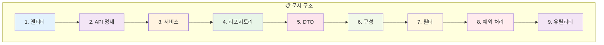
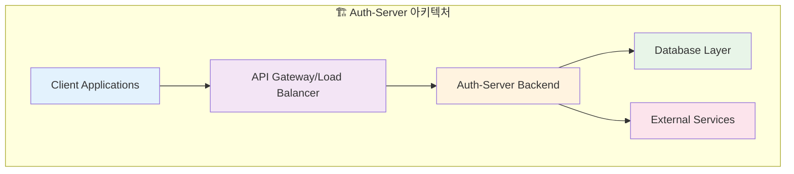
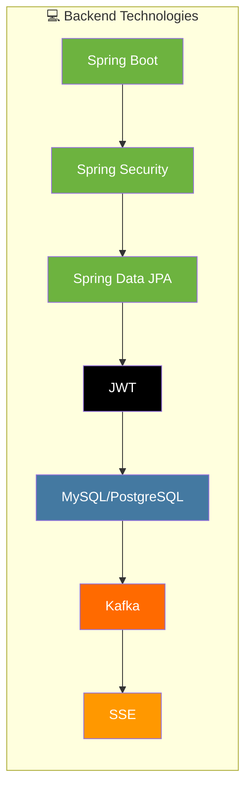
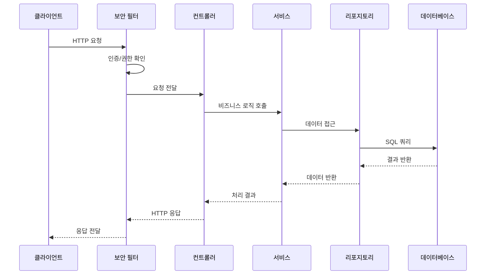

# 🚀 Auth-Server 백엔드 문서

Auth-Server 백엔드 문서에 오신 것을 환영합니다. 이 문서는 백엔드 시스템의 개요, 아키텍처(코드베이스에서 추론된), 그리고 이 문서의 구조를 제공합니다.

## 📚 문서 구조

이 문서는 다음 섹션으로 구성되어 있습니다:

### 📖 문서 목록

| 📄 문서                 | 📝 설명                                                      | 🔗 링크                                             |
| ----------------------- | ------------------------------------------------------------ | --------------------------------------------------- |
| 🗃️ **엔티티**           | 애플리케이션에서 사용되는 모든 JPA 엔티티에 대한 상세한 설명 | [Entities](./1_Entities.md)                         |
| 🔌 **API 명세**         | 모든 REST API 엔드포인트에 대한 포괄적인 세부 정보           | [API Specification](./2_API_Specification.md)       |
| ⚙️ **서비스**           | 비즈니스 로직 계층에 대한 설명                               | [Services](./3_Services.md)                         |
| 📊 **리포지토리**       | 데이터 액세스 계층 구성 요소에 대한 정보                     | [Repositories](./4_Repositories.md)                 |
| 📦 **DTO**              | 데이터 전송 객체에 대한 설명                                 | [DTOs](./5_DTOs.md)                                 |
| 🔧 **구성**             | Spring Boot 및 애플리케이션 구성에 대한 세부 정보            | [Configuration](./6_Configuration.md)               |
| 🛡️ **필터**             | 요청/응답 필터에 대한 정보                                   | [Filters](./7_Filters.md)                           |
| ⚠️ **예외 처리**        | 커스텀 예외 및 오류 처리에 대한 문서                         | [Exceptions](./8_Exceptions.md)                     |
| 🛠️ **유틸리티 및 기타** | 유틸리티 클래스 및 기타 구성 요소에 대한 세부 정보           | [Utilities and Others](./9_Utilities_And_Others.md) |

## 🎯 고수준 개요

### 🔑 주요 책임

- **🔐 사용자 인증 및 권한 부여**: JWT 기반 보안 시스템
- **📧 이메일 서비스**: 인증 코드 및 알림 발송
- **📱 실시간 통신**: SSE(Server-Sent Events)를 통한 실시간 업데이트
- **📚 데이터 관리**: 사용자, 일기, 설정 데이터 관리
- **🔄 통합**: 외부 서비스 및 OAuth 공급자와의 통합

### 🛠️ 기술 스택

### 📈 주요 특징

- ✅ **확장 가능한 아키텍처**: 모듈식 설계로 유지보수성 향상
- ✅ **보안 우선**: JWT 기반 인증 및 역할 기반 접근 제어
- ✅ **실시간 기능**: SSE를 통한 실시간 이벤트 스트리밍
- ✅ **비동기 처리**: Kafka를 이용한 메시지 큐잉
- ✅ **종합적인 API**: RESTful API 설계 원칙 준수
- ✅ **문서화**: 포괄적인 API 및 시스템 문서

## 🔧 시스템 구성 요소 상호작용

---

> 💡 **참고**: 이 섹션은 코드베이스에 대한 더 자세한 분석 후에 백엔드 구성 요소의 주요 책임과 상호작용을 설명하기 위해 채워질 예정입니다.

## 🤝 기여 가이드

이 문서를 개선하는 데 기여하고 싶으시다면:

1. 📝 오타나 부정확한 정보를 발견하시면 이슈를 생성해 주세요
2. 🔧 새로운 기능이나 구성 요소가 추가되면 해당 문서를 업데이트해 주세요
3. 📊 다이어그램이나 시각적 설명을 추가하여 문서의 이해도를 높여주세요

---

> 📚 **다음 단계**: 각 개별 문서를 읽어보시고, 시스템의 특정 측면에 대해 더 자세히 알아보세요.
