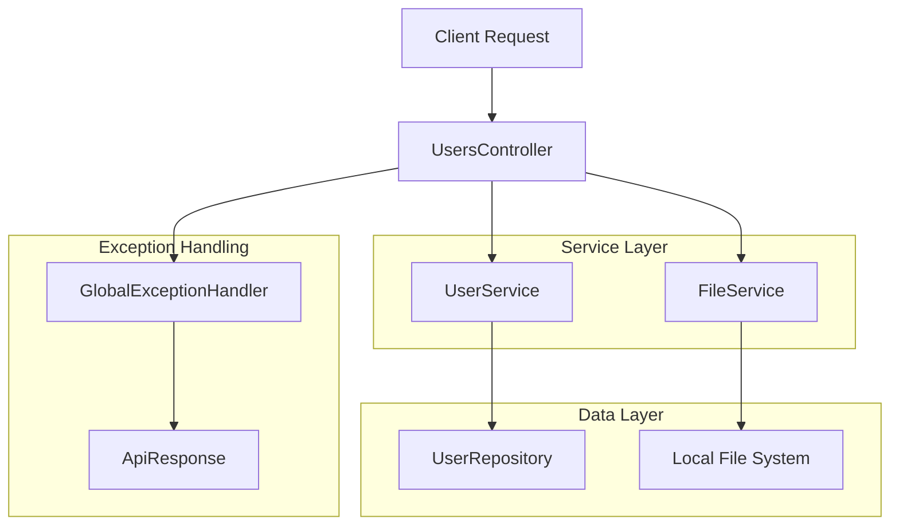

# 🔄 리팩토링 완료 보고서

## 📋 개요

이번 리팩토링은 **역할과 책임 분리(Separation of Concerns)** 원칙에 따라 코드의 구조를 개선하고, 유지보수성과 확장성을 향상시키는 것을 목표로 했습니다.

## 🎯 주요 개선 사항

### 1. 📁 FileService 도입

#### 🔧 변경 전
```java
// UsersController에서 파일 처리 로직 직접 구현
@PostMapping("/public/profileUpload")
public ResponseEntity<?> fileUpload(@RequestParam("profile") MultipartFile[] files) {
    // 파일 유효성 검사, 저장, URL 생성 등 모든 로직이 Controller에 존재
}
```

#### ✅ 변경 후
```java
// 파일 처리 책임을 FileService로 분리
@PostMapping("/public/profileUpload")
public ResponseEntity<ApiResponse<Map<String, String>>> fileUpload(@RequestParam("profile") MultipartFile[] files) {
    String fileUrl = fileService.storeProfileImage(file); // 단순한 서비스 호출
    return ResponseEntity.ok(ApiResponse.success("업로드 성공", uploadResults));
}
```

#### 📈 효과
- **단일 책임 원칙**: Controller는 HTTP 요청/응답에만 집중
- **확장성**: 파일 저장소를 로컬에서 클라우드(S3 등)로 변경 시 Service만 교체하면 됨
- **재사용성**: 다른 Controller에서도 FileService 활용 가능

### 2. 🏗️ 공통 응답 구조 도입

#### 🔧 변경 전
```java
// 메서드마다 다른 응답 형식
return ResponseEntity.ok("success");                    // String
return ResponseEntity.ok(Map.of("key", "value"));       // Map
return ResponseEntity.ok(true);                         // Boolean
```

#### ✅ 변경 후
```java
// 일관된 ApiResponse<T> 사용
return ResponseEntity.ok(ApiResponse.success("메시지", data));
return ResponseEntity.ok(ApiResponse.success("성공"));
```

#### 📈 효과
- **일관성**: 모든 API가 동일한 응답 구조 사용
- **타입 안전성**: 제네릭을 통한 컴파일 타임 타입 체크
- **프론트엔드 친화적**: 예측 가능한 응답 구조

### 3. ⚠️ 체계적인 예외 처리

#### 🔧 변경 전
```java
// 각 메서드에서 개별적으로 예외 처리
@PostMapping("/public/join")
public ResponseEntity<?> join(@RequestBody JoinRequest request) {
    ResponseEntity<?> save = userService.join(request);
    if (save.getStatusCode() == HttpStatus.CONFLICT)
        return ResponseEntity.status(HttpStatus.CONFLICT).body("already exist");
    // ...
}
```

#### ✅ 변경 후
```java
// 서비스에서 예외 발생, GlobalExceptionHandler에서 중앙 처리
@PostMapping("/public/join")
public ResponseEntity<ApiResponse<String>> join(@RequestBody JoinRequest request) {
    userService.join(request); // 예외 발생 시 GlobalExceptionHandler가 처리
    return ResponseEntity.ok(ApiResponse.success("회원가입 성공"));
}

// UserService
public User join(JoinRequest request) {
    if (repository.existsByUserName(request.userId())) {
        throw new CustomException(ErrorType.USERNAME_ALREADY_EXISTS);
    }
    // ...
}
```

#### 📈 효과
- **중앙 집중식 예외 처리**: 모든 예외를 한 곳에서 관리
- **깔끔한 Controller**: 비즈니스 로직에만 집중
- **일관된 에러 응답**: 모든 에러가 동일한 형식으로 반환

### 4. 🧪 향상된 테스트 용이성

#### 📈 효과
- **Mock 객체 활용**: FileService를 Mock으로 대체하여 Controller 단위 테스트 가능
- **독립적인 테스트**: 각 레이어별로 독립적인 테스트 작성 가능
- **빠른 테스트**: 파일 시스템 의존성 제거로 테스트 속도 향상

## 🏛️ 새로운 아키텍처



## 📦 새로 생성된 컴포넌트

### 1. 🗂️ 파일 서비스
- `FileService` (인터페이스)
- `LocalFileService` (구현체)

### 2. 📡 공통 응답
- `ApiResponse<T>` (제네릭 응답 DTO)

### 3. ⚠️ 예외 처리
- `GlobalExceptionHandler` (@ControllerAdvice)
- `ErrorType` (확장된 에러 타입)

## 🚀 향후 확장 가능성

### 1. 클라우드 스토리지 지원
```java
@Service
@ConditionalOnProperty(name = "file.storage.type", havingValue = "s3")
public class S3FileService implements FileService {
    // AWS S3 구현
}
```

### 2. 다양한 파일 타입 지원
```java
public interface FileService {
    String storeProfileImage(MultipartFile file);
    String storeDocument(MultipartFile file);     // 새로운 메서드 추가
    String storeVideo(MultipartFile file);        // 새로운 메서드 추가
}
```

### 3. 비동기 처리
```java
@Async
public CompletableFuture<String> storeProfileImageAsync(MultipartFile file) {
    // 비동기 파일 처리
}
```

## 💡 코드 품질 개선 효과

| 지표 | 개선 전 | 개선 후 | 개선 효과 |
|------|---------|---------|-----------|
| **Controller 책임** | 파일처리+HTTP처리 | HTTP처리만 | 🎯 단일 책임 |
| **응답 일관성** | 메서드별 상이 | 통일된 구조 | 📐 표준화 |
| **예외 처리** | 분산 처리 | 중앙 집중 | 🏗️ 관리 용이성 |
| **테스트 용이성** | 어려움 | 쉬움 | 🧪 품질 향상 |
| **확장성** | 제한적 | 유연함 | 🚀 미래 대응 |

## 🎉 결론

이번 리팩토링을 통해:
1. **코드의 가독성과 유지보수성**이 크게 향상되었습니다.
2. **각 클래스의 책임이 명확해져** 코드 이해가 쉬워졌습니다.
3. **일관된 API 응답 구조**로 프론트엔드 개발이 용이해졌습니다.
4. **중앙집중식 예외 처리**로 에러 관리가 체계화되었습니다.
5. **확장성이 향상되어** 향후 요구사항 변경에 유연하게 대응할 수 있습니다.

이제 코드는 **SOLID 원칙**을 더 잘 준수하며, **클린 아키텍처**의 특징을 갖추게 되었습니다.
