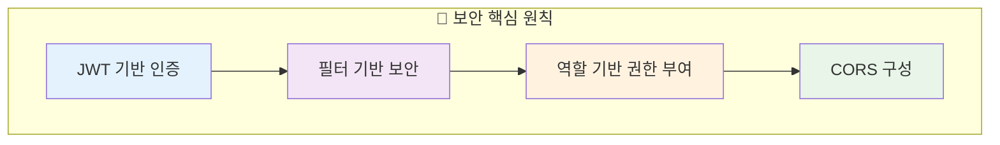
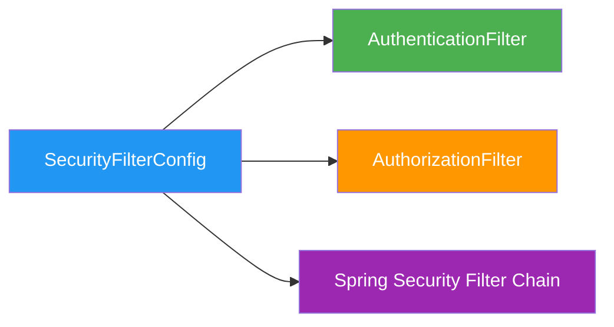
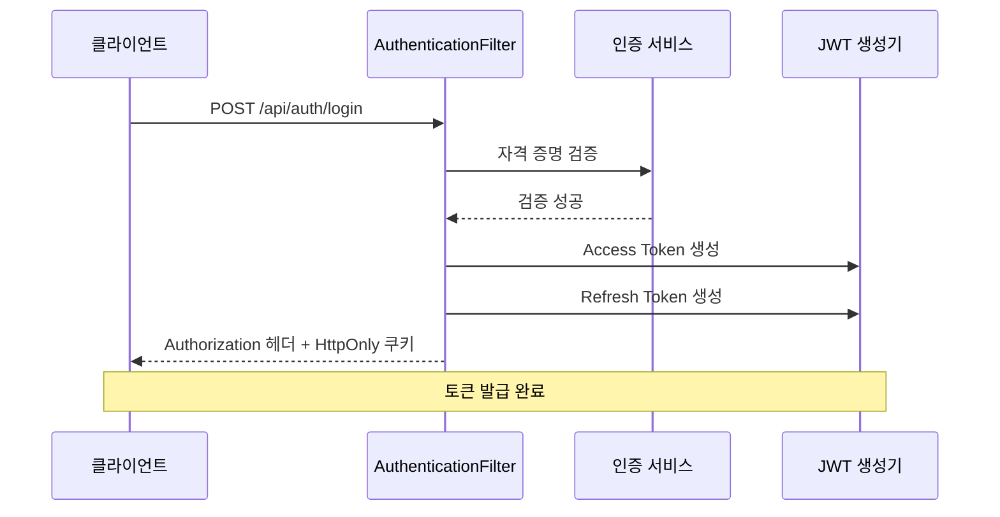
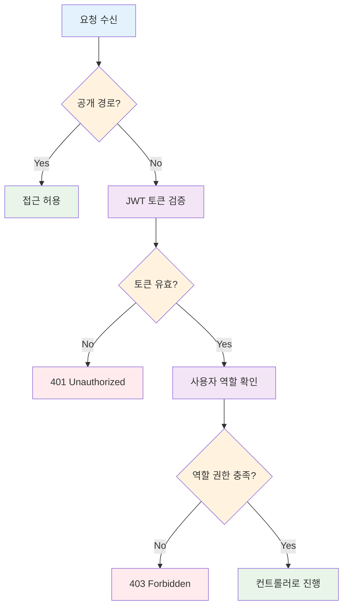
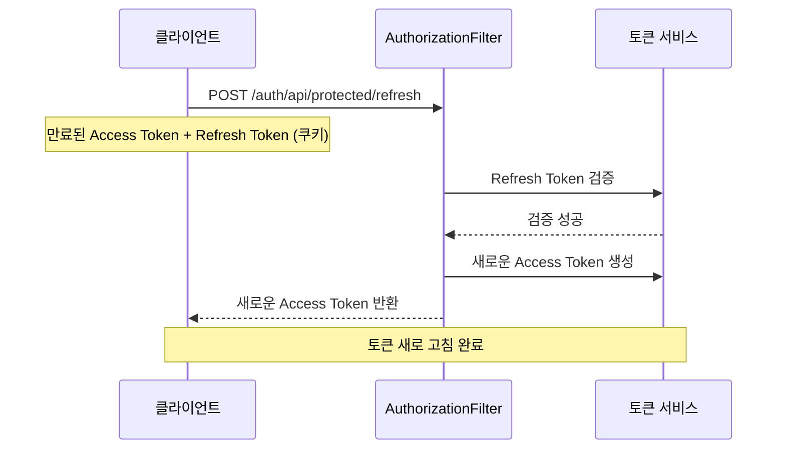

# 🔐 보안 개요

이 문서는 Auth-Server Spring Security 애플리케이션의 보안 아키텍처를 설명하며, 인증, 권한 부여, 그리고 JSON Web Token(JWT) 사용에 중점을 둡니다.

## 🎯 핵심 원칙

- **JWT 기반 인증**: 사용자가 한 번 인증하면 JWT를 받고, 이후 요청에서 이를 사용합니다.
- **필터 기반 보안**: 커스텀 Spring Security 필터가 인증 및 권한 부여 로직을 처리합니다.
- **역할 기반 권한 부여**: 특정 API 엔드포인트에 대한 접근은 사용자 역할(예: `ROLE_ADMIN`)에 따라 제한됩니다.
- **CORS 구성**: 다양한 오리진에서 안전한 통신을 허용하기 위한 적절한 Cross-Origin Resource Sharing(CORS) 설정이 구성되어 있습니다.

## 🔧 주요 구성 요소

### 🛡️ SecurityFilterConfig

- **목적**: Spring Security 필터 체인을 구성하고 커스텀 필터를 등록합니다.
- **위치**: `com.authentication.auth.config.SecurityFilterConfig.java`
- **기능**:
  - `AuthenticationFilter`와 `AuthorizationFilter`를 Spring Security 필터 체인에 등록합니다.
  - 이러한 커스텀 필터가 올바른 순서로 실행되도록 보장합니다.

### 🔑 AuthenticationFilter

- **목적**: 로그인 요청을 처리하고 JWT를 생성하여 사용자 인증을 처리합니다.
- **위치**: `com.authentication.auth.filter.AuthenticationFilter.java`
- **기능**:
  - 로그인 요청을 가로챕니다 (예: `/api/auth/login`).
  - 사용자 자격 증명을 검증합니다.
  - 인증이 성공하면 Access Token과 Refresh Token을 생성합니다.
  - Access Token을 `Authorization` 헤더에 추가하고 Refresh Token을 `HttpOnly` 쿠키로 설정합니다.

### 🛡️ AuthorizationFilter

- **목적**: JWT를 검증하고 사용자 역할과 요청 경로를 기반으로 접근 제어를 시행하여 권한 부여를 처리합니다.
- **위치**: `com.authentication.auth.filter.AuthorizationFilter.java`
- **기능**:
  - 보호된 리소스에 대한 들어오는 요청을 가로챕니다.
  - `Authorization` 헤더에서 JWT를 추출하고 검증합니다.
  - JWT에서 사용자 역할을 파싱합니다.
  - 인증된 사용자가 요청된 경로에 액세스하는 데 필요한 역할을 가지고 있는지 확인합니다.
  - 특히 `SecurityConstants.ADMIN_API_PATH`로 시작하는 경로에 대해 `ROLE_ADMIN` 또는 `ADMIN`을 확인합니다.
  - 공개 경로(`SecurityConstants.PUBLIC_PATHS`에 정의됨)가 권한 부여 확인을 우회하도록 허용합니다.
  - 토큰 새로 고침 요청을 처리합니다.

### 📋 SecurityConstants

- **목적**: JWT 비밀키, 토큰 만료 시간, 다양한 API 경로 패턴을 포함한 보안 관련 상수를 정의합니다.
- **위치**: `com.authentication.auth.others.constants.SecurityConstants.java`
- **주요 상수**:
  - `JWT_SECRET`: JWT 서명을 위한 비밀키
  - `ACCESS_TOKEN_EXPIRATION_TIME`: Access Token 만료 시간
  - `REFRESH_TOKEN_EXPIRATION_TIME`: Refresh Token 만료 시간
  - `PUBLIC_API_PATH`: 공개 엔드포인트의 기본 경로 (예: `/api/public/**`)
  - `ADMIN_API_PATH`: 관리자 전용 엔드포인트의 기본 경로 (예: `/api/admin/**`)
  - `/api/auth/login`, `/api/auth/join`, `/api/public/emailSend`, `/swagger-ui.html` 등과 같은 특정 공개 경로

### 🌐 WebConfig (CORS 구성)

- **목적**: 웹 브라우저가 다른 오리진에서 API에 요청을 만들 수 있도록 Cross-Origin Resource Sharing(CORS)을 구성합니다.
- **위치**: `com.authentication.auth.config.WebConfig.java`
- **기능**:
  - 지정된 오리진에서의 요청을 허용합니다 (예: `http://localhost:8080`, `http://localhost:3000`, `http://localhost:7078`, `http://localhost:7077`, `https://oss-emotion.nodove.com`).
  - 일반적인 HTTP 메서드를 허용합니다 (`GET`, `POST`, `PUT`, `DELETE`, `OPTIONS`).
  - 모든 헤더를 허용합니다.
  - 클라이언트에 `Authorization` 헤더를 노출합니다.
  - 자격 증명(쿠키, HTTP 인증)을 허용합니다.
  - 프리플라이트 요청에 대한 최대 연령을 설정합니다.

## 🔄 인증 플로우

1. **사용자 로그인**: 사용자가 자격 증명과 함께 `/api/auth/login`에 `POST` 요청을 보냅니다.
2. **AuthenticationFilter**: 요청을 가로채고, 자격 증명을 검증하며, 성공하면 JWT Access Token과 Refresh Token을 생성합니다.
3. **토큰 발급**: Access Token은 `Authorization` 헤더에 반환되고, Refresh Token은 `HttpOnly` 쿠키로 설정됩니다.
4. **후속 요청**: 보호된 리소스의 경우, 클라이언트는 `Authorization: Bearer <token>` 헤더에 Access Token을 포함합니다.
5. **AuthorizationFilter**: 요청을 가로채고, Access Token을 검증하고, 사용자 역할을 추출하여 사용자가 요청된 리소스에 액세스할 권한이 있는지 확인합니다.

## 🛡️ 권한 부여 플로우

1. **요청 가로채기**: `AuthorizationFilter`가 모든 들어오는 요청을 가로챕니다.
2. **공개 경로 확인**: 요청된 경로가 공개 경로(`SecurityConstants`에 정의됨)인 경우, 필터는 추가 권한 부여 확인 없이 진행합니다.
3. **토큰 검증**: 보호된 경로의 경우, 필터는 JWT를 검증하려고 시도합니다. 유효하지 않거나 누락된 경우 무권한 응답이 반환됩니다.
4. **역할 기반 접근**: 토큰이 유효한 경우, 필터는 사용자의 역할(JWT에서 추출됨)이 요청된 리소스에 대한 액세스를 허용하는지 확인합니다. 예를 들어, `/api/admin/**` 경로에 대한 액세스에는 `ADMIN` 역할이 필요합니다.
5. **접근 결정**: 토큰 유효성과 역할 확인을 기반으로, 요청은 컨트롤러로 진행하거나 적절한 HTTP 상태 코드(예: `401 Unauthorized`, `403 Forbidden`)로 거부됩니다.

## 🔄 토큰 새로 고침 메커니즘

Access Token이 만료되면, 클라이언트는 만료된 Access Token과 Refresh Token(쿠키를 통해 전송됨)과 함께 `/auth/api/protected/refresh`에 `POST` 요청을 보낼 수 있습니다. `AuthorizationFilter`가 이 요청을 처리하고, Refresh Token을 검증하며, 새로운 Access Token을 발급합니다.

## 📊 보안 구성 요약

| 구성 요소 | 역할 | 위치 |
|-----------|------|------|
| 🛡️ SecurityFilterConfig | 필터 체인 구성 | `config.SecurityFilterConfig.java` |
| 🔑 AuthenticationFilter | 로그인 및 토큰 생성 | `filter.AuthenticationFilter.java` |
| 🛡️ AuthorizationFilter | 권한 부여 및 토큰 검증 | `filter.AuthorizationFilter.java` |
| 📋 SecurityConstants | 보안 상수 정의 | `constants.SecurityConstants.java` |
| 🌐 WebConfig | CORS 구성 | `config.WebConfig.java` |

---

> 💡 **보안 팁**: JWT 토큰은 민감한 정보를 포함하므로 안전하게 저장하고 전송해야 합니다. HTTPS를 사용하고 토큰을 안전한 저장소에 보관하세요.
