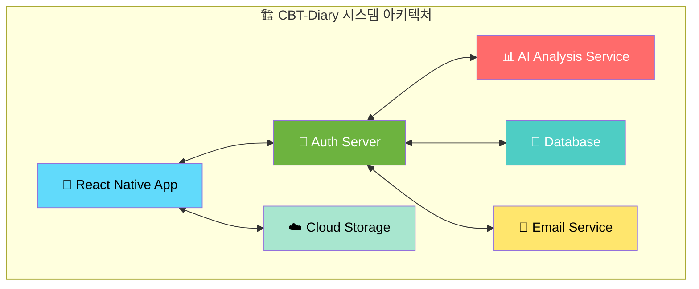

# 📚 CBT-Diary
> AI 프롬프트를 활용한 감정분석(CBT) 일기 애플리케이션

## ✨ 주요 기능

- **🧠 AI 감정 분석**: 일기 내용을 기반으로 한 감정 상태 분석
- **💡 CBT 추천**: 인지행동치료 기반 개선 제안
- **📊 통계 대시보드**: 감정 변화 추적 및 시각화
- **🔐 안전한 인증**: OAuth2 기반 로그인 시스템
- **📱 크로스 플랫폼**: iOS와 Android 모두 지원

## 🔗 API 문서
[📖 API 문서 보기](https://cbt-diary-team.github.io/CBT-Diary/index.html)

## `git commit 규칙`

|type|활용상황|예제|
|:---|:---|:---|
|feat|새로운 기능 추가|사용자 로그인 기능 추가|
|fix|버그 수정|잘못된 계산 로직 수정|
|docs|문서 수정|README 파일에 설치 방법 추가|
|style|코드 스타일 변경 (코드 포매팅, 세미콜론 누락 등)|코드에서 불필요한 세미콜론 제거|
|design|사용자 UI 디자인 변경 (CSS 등) 기능 추가|메인 페이지 버튼 스타일 변경|
|test|테스트 코드, 리팩토링 (Test Code)|로그인 기능에 대한 단위 테스트 추가|
|refactor|리팩토링|중복된 코드 함수로 리팩토링|
|build|빌드 파일 수정|Webpack 설정 파일 수정|
|ci|CI 설정 파일 수정|GitHub Actions 워크플로우 파일 수정|
|perf|성능 개선|API 응답 속도를 높이기 위한 쿼리 최적화|
|chore|자잘한 수정이나 빌드 업데이트|패키지 버전 업데이트|
|rename|파일 혹은 폴더명을 수정만 한 경우|login.js 파일명을 auth.js로 변경|
|remove|파일을 삭제만 한 경우|사용되지 않는 old_styles.css 파일 삭제|

## `git Branch `

- `main` : 배포 가능한 안정적인 버전(보호 규칙 적용, PR로만 병합)
- `develop` : 개발 중인 최신 코드가 포함된 브랜치
- `feature/*` : 새로운 기능을 개발하는 브랜치
- `release/*` : 배포 준비 단계에서 사용하는 브랜치
- `hotfix/*` : 배포된 코드에서 긴급한 수정이 필요할 때 사용하는 브랜치

| 브랜치 유형  | 네이밍 규칙 | 예시 |
|--------------|------------|------|
| 메인 브랜치  | `main` | `main` |
| 개발 브랜치  | `develop` | `develop` |
| 기능 개발    | `feature/기능-이름` | `feature/login-system` |
| 버그 수정    | `bugfix/버그-설명` | `bugfix/fix-login-error` |
| 긴급 수정    | `hotfix/이슈-설명` | `hotfix/critical-payment-bug` |
| 배포 준비    | `release/버전번호` | `release/1.2.0` |
