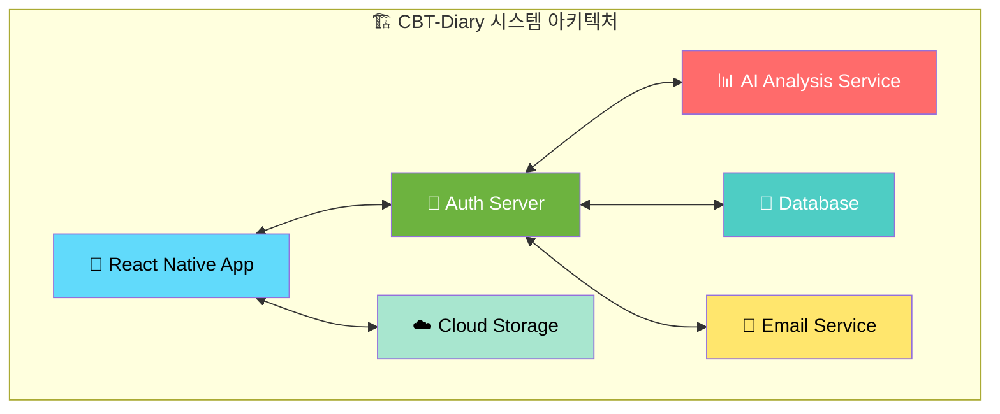
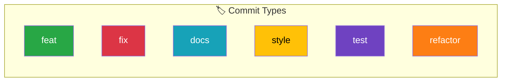
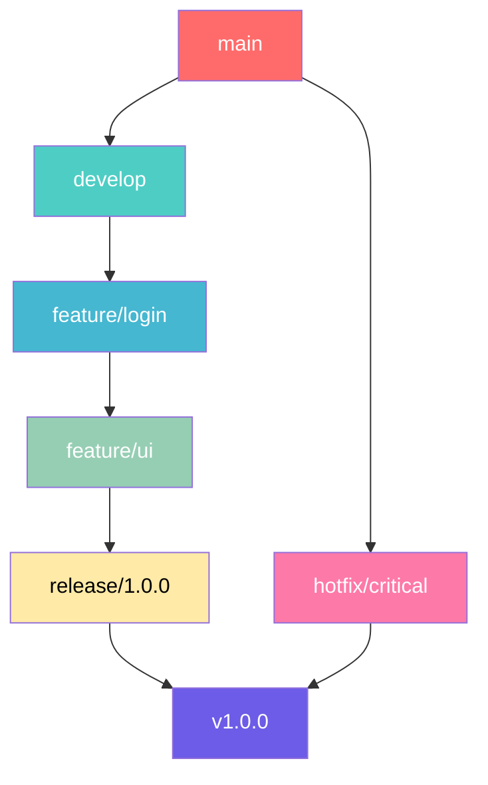

# 📚 CBT-Diary

> AI 프롬프트를 활용한 감정분석(CBT) 일기 애플리케이션

[](https://opensource.org/licenses/MIT)
[](https://reactnative.dev/)
[](https://spring.io/projects/spring-boot)



## ✨ 주요 기능

- **🧠 AI 감정 분석**: 일기 내용을 기반으로 한 감정 상태 분석
- **💡 CBT 추천**: 인지행동치료 기반 개선 제안
- **📊 통계 대시보드**: 감정 변화 추적 및 시각화
- **🔐 안전한 인증**: OAuth2 기반 로그인 시스템
- **📱 크로스 플랫폼**: iOS와 Android 모두 지원

## 🔗 API 문서

[📖 API 문서 보기](https://cbt-diary-team.github.io/CBT-Diary/index.html)

## 📝 Git Commit 규칙



| 🏷️ Type    | 📝 활용상황                   | 💡 예제                                          |
| :--------- | :---------------------------- | :----------------------------------------------- |
| `feat`     | 새로운 기능 추가              | `feat: 사용자 로그인 기능 추가`                  |
| `fix`      | 버그 수정                     | `fix: 잘못된 계산 로직 수정`                     |
| `docs`     | 문서 수정                     | `docs: README 파일에 설치 방법 추가`             |
| `style`    | 코드 스타일 변경              | `style: 코드에서 불필요한 세미콜론 제거`         |
| `design`   | UI 디자인 변경                | `design: 메인 페이지 버튼 스타일 변경`           |
| `test`     | 테스트 코드 추가/수정         | `test: 로그인 기능에 대한 단위 테스트 추가`      |
| `refactor` | 리팩토링                      | `refactor: 중복된 코드 함수로 리팩토링`          |
| `build`    | 빌드 파일 수정                | `build: Webpack 설정 파일 수정`                  |
| `ci`       | CI 설정 파일 수정             | `ci: GitHub Actions 워크플로우 파일 수정`        |
| `perf`     | 성능 개선                     | `perf: API 응답 속도 향상을 위한 쿼리 최적화`    |
| `chore`    | 자잘한 수정이나 빌드 업데이트 | `chore: 패키지 버전 업데이트`                    |
| `rename`   | 파일/폴더명 수정              | `rename: login.js 파일명을 auth.js로 변경`       |
| `remove`   | 파일 삭제                     | `remove: 사용되지 않는 old_styles.css 파일 삭제` |

## 🌳 Git Branch 전략



### 🔄 브랜치 설명

- **`main`** : 배포 가능한 안정적인 버전 (보호 규칙 적용, PR로만 병합)
- **`develop`** : 개발 중인 최신 코드가 포함된 브랜치
- **`feature/*`** : 새로운 기능을 개발하는 브랜치
- **`release/*`** : 배포 준비 단계에서 사용하는 브랜치
- **`hotfix/*`** : 배포된 코드에서 긴급한 수정이 필요할 때 사용하는 브랜치

### 📋 브랜치 네이밍 규칙

| 🌿 브랜치 유형 | 🏷️ 네이밍 규칙      | 💡 예시                       |
| -------------- | ------------------- | ----------------------------- |
| 🏠 메인 브랜치 | `main`              | `main`                        |
| 🔧 개발 브랜치 | `develop`           | `develop`                     |
| ✨ 기능 개발   | `feature/기능-이름` | `feature/login-system`        |
| 🐛 버그 수정   | `bugfix/버그-설명`  | `bugfix/fix-login-error`      |
| 🚨 긴급 수정   | `hotfix/이슈-설명`  | `hotfix/critical-payment-bug` |
| 🚀 배포 준비   | `release/버전번호`  | `release/1.2.0`               |

---

## 🚀 시작하기

### 📋 사전 요구사항

- **Node.js** v18 이상
- **Java** JDK 11 이상
- **Android Studio** (Android 개발용)
- **Xcode** (iOS 개발용, macOS만)

### 🛠️ 설치 및 실행

1. **저장소 클론**

   ```bash
   git clone https://github.com/your-username/CBT-Diary.git
   cd CBT-Diary
   ```

2. **프론트엔드 설정**

   ```bash
   cd CBT-front
   npm install
   npx react-native start
   ```

3. **백엔드 설정**
   ```bash
   cd Auth-server
   ./gradlew bootRun
   ```

## 📁 프로젝트 구조

```
CBT-Diary/
├── 📱 CBT-front/          # React Native 앱
├── 🔐 Auth-server/        # Spring Boot 백엔드
├── 📚 docs/               # 프로젝트 문서
├── 🏗️ build.gradle       # 전체 빌드 설정
└── 📄 README.md           # 이 파일
```

## 🤝 기여하기

1. 프로젝트 포크
2. 기능 브랜치 생성 (`git checkout -b feature/amazing-feature`)
3. 변경사항 커밋 (`git commit -m 'feat: Add amazing feature'`)
4. 브랜치 푸시 (`git push origin feature/amazing-feature`)
5. Pull Request 생성

## 📞 문의 및 지원

- 📧 **이메일**: [프로젝트 이메일]
- 🐛 **버그 리포트**: [Issues](../../issues)
- 💡 **기능 요청**: [Issues](../../issues)

---

> 💡 **팁**: 더 자세한 정보는 [문서 폴더](./docs/)를 확인해주세요!
