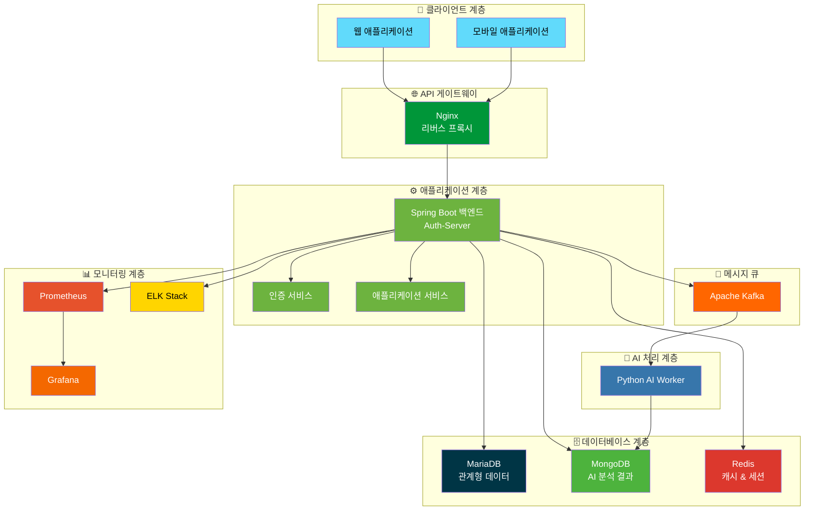
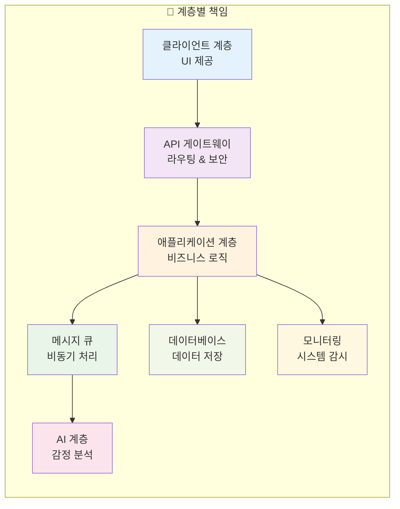
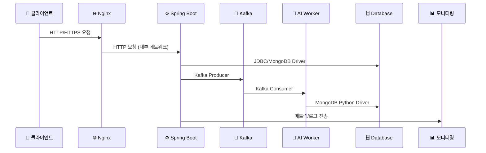
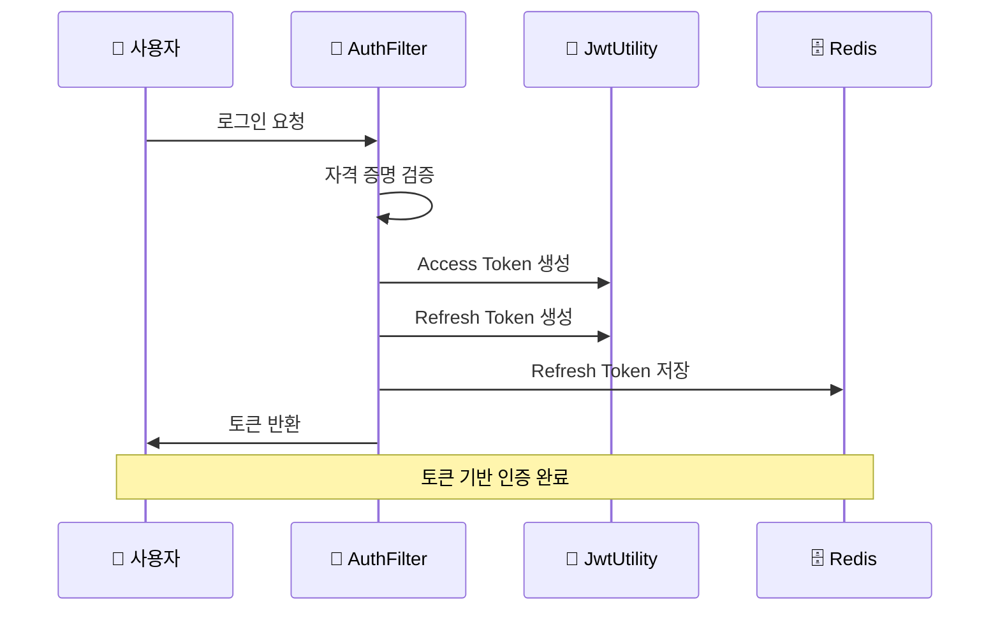

# 🏗️ 2장: 시스템 아키텍처

## 2.1. 전체 시스템 아키텍처 (상위 수준 아키텍처)

### 2.1.1. 개념적 아키텍처 다이어그램



시스템은 다중 계층 아키텍처로 설계되었습니다:

**1. 👥 클라이언트 계층**
- 사용자 인터페이스를 나타내는 계층
- 웹 애플리케이션 및/또는 모바일 애플리케이션으로 구성
- HTTP/HTTPS 요청을 통해 백엔드 서비스와 상호작용

**2. 🌐 API 게이트웨이 (Nginx)**
- 리버스 프록시로 작동하여 들어오는 클라이언트 요청 처리
- SSL 종료, 백엔드 인스턴스 간 로드 밸런싱 담당
- 요청을 적절한 서비스로 라우팅

**3. ⚙️ 애플리케이션 계층 (Spring Boot 백엔드)**
- Java와 Spring Boot로 구축된 핵심 백엔드 서비스
- 비즈니스 로직, 사용자 인증, 데이터 관리 담당
- 다음 서비스들을 포함:
  - **인증 서비스**: Spring Security를 사용한 사용자 관리
  - **애플리케이션 서비스**: 사용자 관리, 일기 관리, 설정 관리

**4. 📨 메시지 큐 (Apache Kafka)**
- 비동기 통신을 위한 메시지 큐
- 애플리케이션 계층과 AI 처리 계층 간의 결합도 감소
- 확장성과 내결함성 제공

**5. 🤖 AI 처리 계층 (Python AI Worker)**
- 별도의 Python 기반 AI 워커 구성요소
- Kafka에서 메시지 소비하여 AI 기반 감정 분석 수행
- 분석 결과를 MongoDB에 저장

**6. 🗄️ 데이터베이스 계층**
- **MariaDB**: 사용자 계정, 역할, 핵심 일기 항목 등 관계형 데이터
- **MongoDB**: AI 분석 결과, 로그, 유연한 스키마 데이터
- **Redis**: 캐싱, 사용자 세션, 리프레시 토큰, 임시 데이터

**7. 📊 모니터링 계층**
- **Prometheus**: 시스템 구성 요소에서 메트릭 수집
- **Grafana**: 메트릭 시각화 및 대시보드 제공
- **ELK Stack**: 중앙 집중식 로깅 및 분석

### 2.1.2. 각 계층의 역할 및 책임



#### 📋 상세 책임 분담

| 계층 | 주요 책임 | 세부 기능 |
|------|----------|----------|
| 👥 **클라이언트 계층** | 사용자 인터페이스 제공 | 일기 작성, 분석 결과 조회, 설정 관리 |
| 🌐 **API 게이트웨이** | 요청 라우팅 및 보안 | SSL 종료, 로드 밸런싱, 요청 라우팅 |
| ⚙️ **애플리케이션 계층** | 핵심 비즈니스 로직 | 사용자 관리, 인증/인가, 일기 CRUD |
| 📨 **메시지 큐** | 비동기 통신 | 결합도 감소, 확장성, 내결함성 |
| 🤖 **AI 처리 계층** | 지능형 분석 | 감정 분석, 사고 패턴 인식, 대안 제안 |
| 🗄️ **데이터베이스 계층** | 데이터 지속성 | 사용자 데이터, AI 결과, 캐시 관리 |
| 📊 **모니터링 계층** | 시스템 감시 | 메트릭 수집, 로깅, 대시보드 |

### 2.1.3. 구성 요소 인터페이스 및 데이터 교환 프로토콜



#### 🔌 프로토콜 및 연결 방식

| 연결 | 프로토콜 | 설명 |
|------|----------|------|
| 클라이언트 ↔ Nginx | HTTP/HTTPS | 보안 통신 |
| Nginx ↔ Spring Boot | HTTP | 내부 네트워크 통신 |
| Spring Boot ↔ MariaDB | JDBC | Spring Data JPA 사용 |
| Spring Boot ↔ MongoDB | MongoDB Driver | Spring Data MongoDB 사용 |
| Spring Boot ↔ Redis | Redis Client | Spring Data Redis 사용 |
| Spring Boot ↔ Kafka | Kafka Producer | Java Kafka 클라이언트 |
| Kafka ↔ AI Worker | Kafka Consumer | Python Kafka 클라이언트 |
| AI Worker ↔ MongoDB | PyMongo | Python MongoDB 드라이버 |

## 2.2. 상세 모듈 아키텍처

### 2.2.1. 🔐 인증/인가 서비스 (Auth Service)

```mermaid
graph TB
    subgraph "🔒 Spring Security 필터 체인"
        A[SecurityConfig]
        B[AuthenticationFilter]
        C[AuthorizationFilter]
        D[JwtVerificationFilter]
    end
    
    subgraph "🎫 JWT 관리"
        E[JwtUtility]
        F[TokenProvider]
        G[RedisService]
    end
    
    subgraph "👤 사용자 관리"
        H[PrincipalDetailService]
        I[UserDetailsService]
    end
    
    A --> B
    B --> C
    C --> D
    B --> E
    E --> F
    F --> G
    B --> H
    H --> I
    
    style A fill:#2196f3,color:#fff
    style B fill=#4caf50,color:#fff
    style C fill:#ff9800,color:#fff
    style D fill:#9c27b0,color:#fff
    style E fill:#f44336,color:#fff
    style F fill:#00bcd4,color:#fff
    style G fill:#795548,color:#fff
    style H fill:#607d8b,color:#fff
    style I fill:#8bc34a,color:#fff
```

#### 🛡️ Spring Security 필터 체인 구성

**1. SecurityConfig.java**
- CSRF, 폼 로그인, HTTP Basic 인증 비활성화
- 무상태 세션 관리 정책 (JWT에 적합)
- CORS 구성
- URL 기반 권한 부여 규칙 정의
- 공개 경로 (`/api/public/**`) 모든 사용자에게 허용

**2. AuthenticationFilter.java**
- `/api/auth/login` POST 엔드포인트 전용 필터
- `LoginRequest` (userId, password) 처리
- 인증 성공 시 JWT 토큰 생성 및 반환
- 리프레시 토큰을 Redis에 저장

**3. AuthorizationFilter.java**
- 추가 권한 부여 검사 수행
- `/api/admin/` 경로에 대한 ADMIN 역할 확인
- 공개 경로에 대한 필터링 건너뛰기

**4. JwtVerificationFilter.java**
- JWT 토큰 검증 담당
- `Authorization` 헤더에서 토큰 파싱
- 토큰 유효성 검사 및 SecurityContext 설정

#### 🎫 JWT 발급, 검증 및 재발급 로직



**토큰 관리 프로세스:**
- **발급**: `JwtUtility.buildToken()`을 사용하여 HS512 알고리즘으로 토큰 생성
- **검증**: 토큰 서명 및 만료 시간 확인
- **재발급**: 리프레시 토큰을 사용한 새 액세스 토큰 발급
- **저장**: Redis를 통한 리프레시 토큰 관리

---

> 💡 **참고**: 이 아키텍처는 확장 가능하고 유지보수가 용이하도록 설계되었으며, 각 계층의 역할이 명확하게 분리되어 있습니다.
