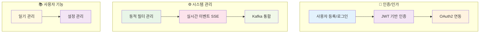
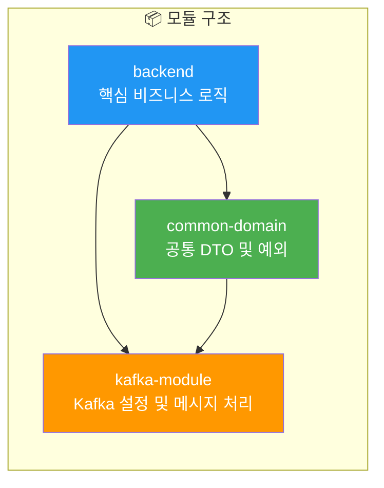
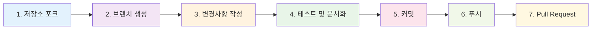

# Auth-Server 백엔드 문서

Auth-Server 백엔드 문서에 오신 것을 환영합니다. 이 문서는 백엔드 시스템, 아키텍처, 그리고 문서 구조에 대한 개요를 제공합니다.

## 🎯 개요

Auth-Server 프로젝트는 사용자 인증, 권한 부여 및 관련 기능을 처리하도록 설계된 포괄적인 백엔드 솔루션입니다. 강력한 보안 기능과 실시간 이벤트 알림을 제공하면서 사용자, 설정 및 일기를 관리하는 핵심 역할을 합니다.

## ✨ 주요 기능

### 🔐 인증 및 보안
- **사용자 등록 및 로그인**: 신규 사용자 가입 및 기존 사용자 로그인을 위한 보안 메커니즘
- **JWT 기반 인증 및 권한 부여**: 보호된 리소스 접근을 위한 토큰 기반 보안
- **OAuth2 연동**: 제3자 인증 공급자 지원

### ⚙️ 시스템 관리
- **동적 필터 관리**: 요청/응답 필터 관리를 위한 유연한 시스템 (보안 문서에서 상세 설명)
- **실시간 이벤트 SSE**: 클라이언트에 실시간 업데이트를 푸시하기 위한 Server-Sent Events
- **Kafka 통합**: 확장성과 복원력 향상을 위한 Kafka를 이용한 비동기 이벤트 처리

### 📚 사용자 기능
- **일기 및 설정 관리**: 사용자가 개인 일기와 애플리케이션 설정을 관리할 수 있는 기능

## 🏗️ 아키텍처

백엔드는 모듈식 설계를 따르며, 주로 다음으로 구성됩니다:

- `backend`: 핵심 비즈니스 로직, 컨트롤러, JPA 엔티티를 포함하는 메인 애플리케이션 모듈
- `common-domain`: 데이터 전송 객체(DTO)와 공통 예외 클래스를 위한 공유 모듈
- `kafka-module`: Kafka 관련 설정 및 메시지 처리를 담당

이러한 모듈식 접근 방식은 관심사의 분리와 유지보수성을 촉진합니다.

## 📚 문서 구조

이 문서 모음은 다음 장으로 구성되어 있습니다:

### 📋 목차

| 📖 문서 | 📝 설명 | 🔗 링크 |
|---------|---------|---------|
| 📌 개요 | 소개, 개요 및 목차 | [README](./README.md) |
| 🏗️ 시스템 아키텍처 | 아키텍처 설계, 구성요소 및 상호작용에 대한 상세한 인사이트 | [System Architecture](./System_Architecture.md) |
| 🔌 API 상세 명세 | 모든 REST API 엔드포인트, 요청/응답 형식 및 인증 요구사항에 대한 포괄적인 문서 | [API Documentation](./API_Documentation.md) |
| 🗃️ 데이터 모델링 | JPA 엔티티 및 DTO 설명 | - |
| └ 📊 데이터 모델 엔티티 | `backend` 모듈 내 JPA 엔티티 설명 | [Data Models Entities](./Data_Models_Entities.md) |
| └ 🔄 공통 도메인 모델 | `common-domain` 모듈의 DTO 및 모델 설명 | [Common Domain Models](./Common_Domain_Models.md) |
| 📊 플로우 및 다이어그램 | 주요 애플리케이션 플로우 및 프로세스의 시각적 표현 | [Flows & Diagrams](./Flows_And_Diagrams.md) |
| 🔄 트랜잭션 관리 | 서비스 간 트랜잭션 관리 방법에 대한 설명 | [Transaction Management](./Transaction_Management.md) |
| 🔐 보안 설계 | 보안 메커니즘, 인증/권한 부여 전략 및 필터 구성에 대한 심층 분석 | [Security Overview](./Security_Overview.md) |
| 🚀 배포 및 운영 | Auth-Server 배포, 구성 및 운영을 위한 가이드라인 | [Deployment & Operations](./Deployment_And_Operations.md) |
| 📖 부록 | 보충 자료, 용어집 또는 기타 관련 정보 | [Appendix](./Appendix.md) |

## 🤝 기여 안내

Auth-Server 문서와 프로젝트 자체를 개선하기 위한 기여를 환영합니다. 기여 방법은 다음과 같습니다:

### 🐛 문제 보고 또는 변경 제안

- 문서에서 오류, 불일치 또는 개선할 부분을 발견하시면 프로젝트의 이슈 트래커에 이슈를 열어주세요.
- 가능한 경우 구체적인 예시와 함께 문제나 제안을 명확하게 설명해 주세요.

### 📝 스타일 가이드라인

- 명확성, 간결성, 기존 문서와의 일관성을 목표로 합니다.
- 모든 문서 파일에는 마크다운을 사용해 주세요.

### 🔄 변경사항 제출

1. 저장소를 포크합니다.
2. 변경사항을 위한 새 브랜치를 생성합니다 (예: `docs/fix-typo` 또는 `feature/add-oauth-details`).
3. 변경사항을 작성하고, 코드 변경의 경우 적절한 문서화와 테스트를 보장합니다.
4. 명확하고 설명적인 커밋 메시지로 변경사항을 커밋합니다.
5. 포크한 저장소에 브랜치를 푸시합니다.
6. 메인 프로젝트 저장소에 대해 변경사항을 상세히 설명하는 풀 리퀘스트를 엽니다.

여러분의 기여에 진심으로 감사드립니다! 🙏

---

> 💡 **팁**: 이 문서는 지속적으로 업데이트되고 있습니다. 최신 정보는 각 개별 문서를 참조해 주세요.
