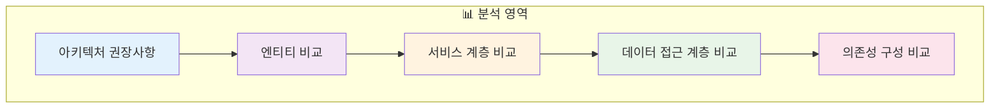
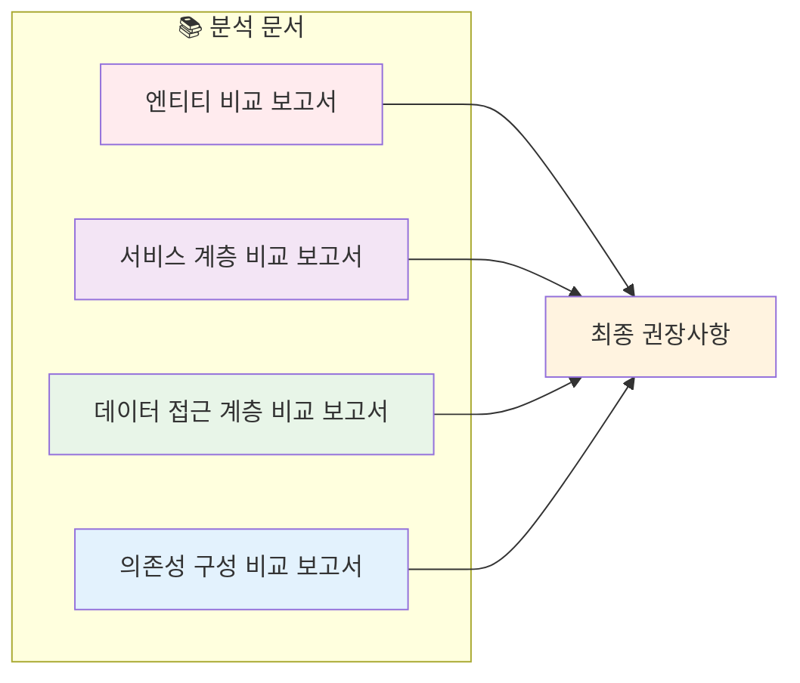
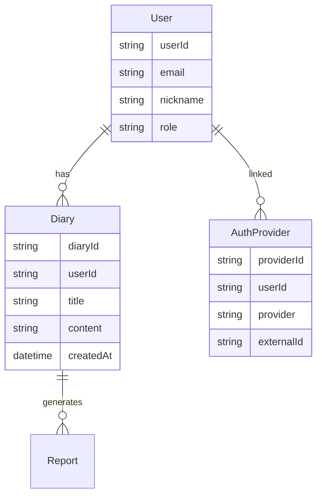
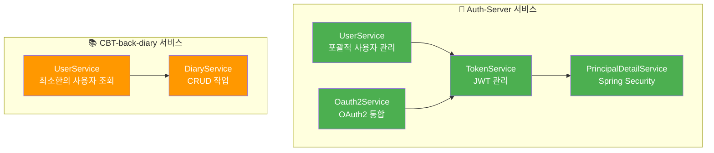
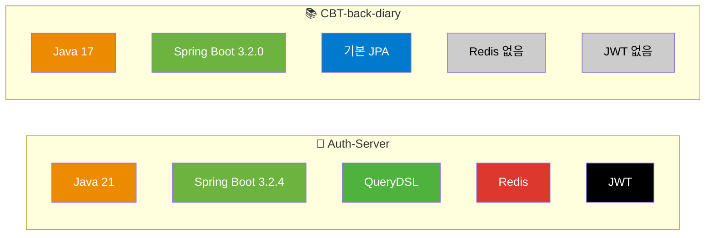
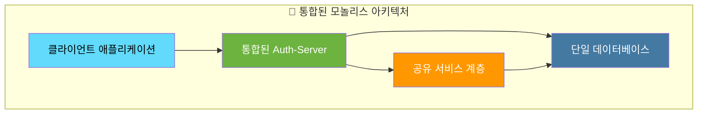
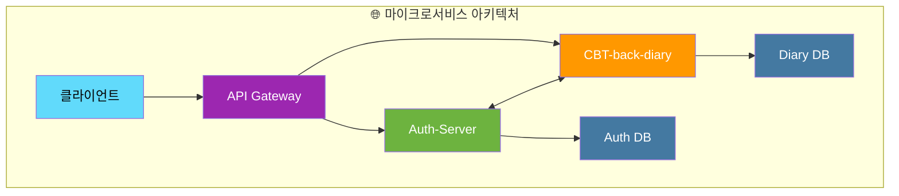
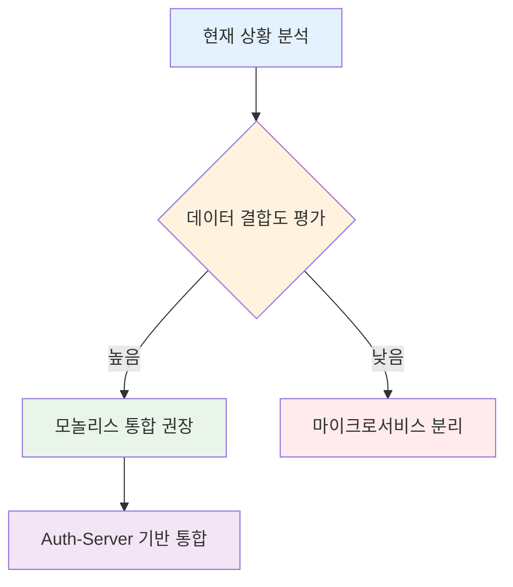
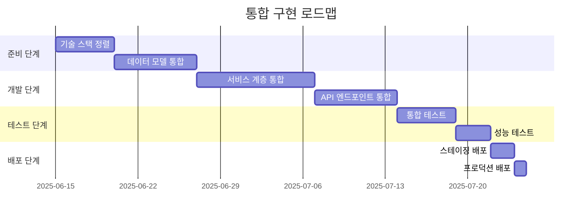

# 🔄 CBT 프로젝트 통합 분석 보고서 (Rev. 3.0)

## 📋 목차

## 1. 🏗️ 아키텍처 권장사항

# 🏛️ 아키텍처 권장 보고서: Auth-Server & CBT-back-diary

## 1. 📖 서론

이 보고서는 `Auth-Server`와 `CBT-back-diary` 프로젝트의 통합 또는 분리에 대한 아키텍처 권장사항을 제공합니다. 이 권장사항은 다음 문서들에 기록된 상세 분석을 기반으로 합니다:

- `entity_comparison_report.md`
- `service_layer_comparison_report.md`
- `data_access_layer_comparison_report.md`
- `dependency_config_comparison_report.md`

**목표**: 데이터 결합도, 기술 스택 정렬, 운영 역량, 향후 유지보수성을 고려하여 가장 적합한 아키텍처 접근 방식(모놀리스 또는 마이크로서비스)을 결정합니다.

## 2. 📊 주요 비교 분석 결과 요약

이전 분석 보고서에서 도출된 다음 핵심 포인트들이 이 결정에 중요합니다:

### 🔗 엔티티 중복 및 결합도

- **엔티티 중복**: `User`, `AuthProvider`, `Diary`와 같은 핵심 엔티티가 두 프로젝트 모두에 존재하며, `User`와 `AuthProvider` 엔티티에 상당한 중복이 있습니다.
- **강한 의존성**: `CBT-back-diary`의 `Diary` 엔티티는 `User` 엔티티에 강한 의존성을 가집니다 (외래 키 `user_id`).
- **기능 확장**: Auth-Server도 `Diary` 엔티티, `Report` 엔티티, `DiaryReportLink`를 포함하고 있어 기본 인증을 넘어선 일기 관련 기능을 처리하도록 설계되었음을 시사합니다.

### ⚙️ 서비스 계층 기능성

- **Auth-Server**: OAuth2 통합, JWT 관리, Spring Security 통합을 포함한 포괄적인 사용자 관리 및 인증 시스템을 보유합니다.
- **CBT-back-diary**: 현재 최소한의 `UserService`를 가지고 있으며, 주로 (모의) 사용자 세부 정보 검색에 중점을 둡니다.

### 🗄️ 데이터 접근 계층

| 프로젝트 | 기술 스택 | 특징 |
|----------|-----------|------|
| 🔐 **Auth-Server** | QueryDSL + Spring Data JPA | 복잡한 사용자 관리를 위한 커스텀 쿼리 |
| 📚 **CBT-back-diary** | Spring Data JPA + JPQL | 파생 쿼리 및 JPQL 의존 |

### 🛠️ 기술 스택 및 의존성

**주요 차이점:**
- **Java 버전**: Auth-Server (Java 21) vs CBT-back-diary (Java 17)
- **Spring Boot**: Auth-Server (3.2.4) vs CBT-back-diary (3.2.0)
- **JPA 설정**: Auth-Server (`ddl-auto: none`) vs CBT-back-diary (`ddl-auto: update`)

## 3. 🔍 아키텍처 접근 방식 평가

### 3.1. 🏢 모놀리스 통합

#### ✅ 장점

| 💚 장점 | 📝 설명 |
|---------|---------|
| **중복 제거** | 중복된 `User`, `AuthProvider` 엔티티 및 중복 사용자 관리 로직 제거 |
| **데이터 일관성 단순화** | 단일 데이터베이스로 강력한 트랜잭션 일관성 보장 |
| **지연 시간 감소** | 직접 메서드 호출로 서비스 간 API 호출보다 빠른 성능 |
| **개발/배포 단순화** | 단일 코드베이스로 관리, 빌드, 배포가 용이 |
| **Auth-Server 강점 활용** | 성숙한 인증, 권한 부여, JWT 관리 기능 직접 활용 |
| **원자적 트랜잭션** | 사용자와 일기 데이터를 단일 트랜잭션으로 처리 |

#### ❌ 단점

| 🔴 단점 | 📝 설명 |
|---------|---------|
| **기술 통합 노력** | Java 버전 통일, Spring Boot 버전 정렬 필요 |
| **애플리케이션 복잡성 증가** | 더 크고 복잡한 모놀리스로 인한 빌드 시간 증가 |
| **확장성 도전** | 특정 부분의 독립적 확장 어려움 |
| **배포 경직성** | 전체 애플리케이션 재배포 필요 |
| **CBT-back-diary 단순성 손실** | 간단한 서비스가 복잡한 시스템에 통합됨 |

### 3.2. 🔗 마이크로서비스 분리

#### ✅ 장점

| 💚 장점 | 📝 설명 |
|---------|---------|
| **관심사 분리** | 인증/사용자 관리와 일기 기능 간 명확한 경계 |
| **독립적 개발/배포** | 각 서비스의 독립적 업데이트 및 배포 |
| **기술 다양성** | 서비스별 특화된 기술 스택 선택 가능 |
| **독립적 확장성** | 각 서비스의 로드 요구사항에 따른 개별 확장 |
| **장애 격리** | 한 서비스의 문제가 다른 서비스에 미치는 영향 최소화 |

#### ❌ 단점

| 🔴 단점 | 📝 설명 |
|---------|---------|
| **서비스 간 통신 오버헤드** | API 호출로 인한 네트워크 지연 및 복잡성 |
| **데이터 일관성 도전** | 여러 서비스 간 데이터 동기화 복잡성 |
| **중복된 모델/DTO** | 사용자 정보의 중복 표현 필요 |
| **분산 트랜잭션** | 여러 서비스에 걸친 트랜잭션 관리 복잡성 |
| **운영 복잡성** | 여러 서비스 관리, 모니터링, 디버깅의 복잡성 |

## 4. 💡 권장사항

**🎯 권장사항: Auth-Server를 기반으로 한 모놀리스 통합**

### 🔍 근거

1. **🔗 강한 데이터 결합도**: `CBT-back-diary`의 `Diary` 기능은 본질적으로 `User` 엔티티와 밀접하게 연결되어 있습니다.

2. **📈 운영 단순성**: 현재 팀 규모와 운영 역량을 고려할 때 모놀리스가 더 적합합니다.

3. **🛠️ 기술 성숙도**: Auth-Server의 성숙한 인증 및 권한 부여 시스템을 활용할 수 있습니다.

4. **⚡ 성능 최적화**: 단일 애플리케이션 내에서의 직접 메서드 호출이 API 호출보다 빠릅니다.

### 📋 구현 단계

### 🚀 다음 단계

1. **기술 스택 표준화** (Java 21, Spring Boot 3.2.4)
2. **엔티티 모델 통합** 및 중복 제거
3. **서비스 계층 통합** 및 기능 통합
4. **테스트 전략** 수립 및 실행
5. **점진적 마이그레이션** 계획 수립

---

> 💡 **참고**: 이 권장사항은 현재 프로젝트 상태와 팀 역량을 기반으로 하며, 향후 프로젝트 규모가 확장되면 마이크로서비스로의 분해를 재고려할 수 있습니다.
