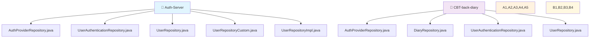
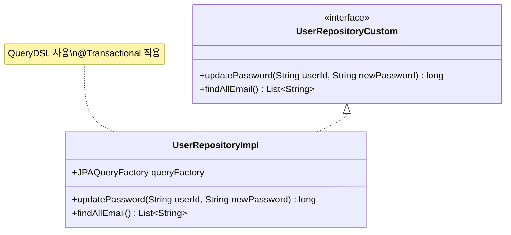
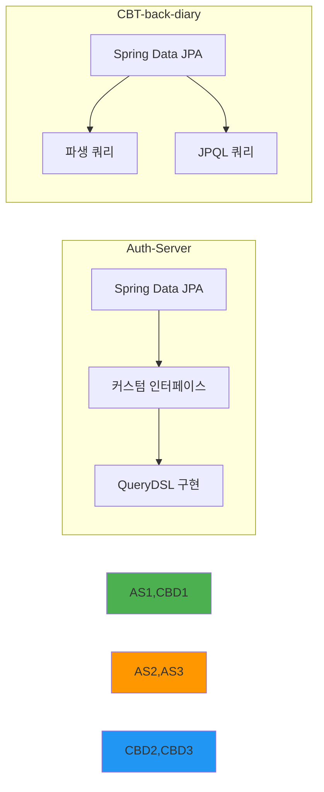
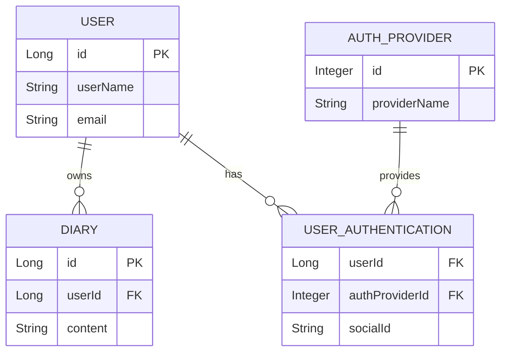
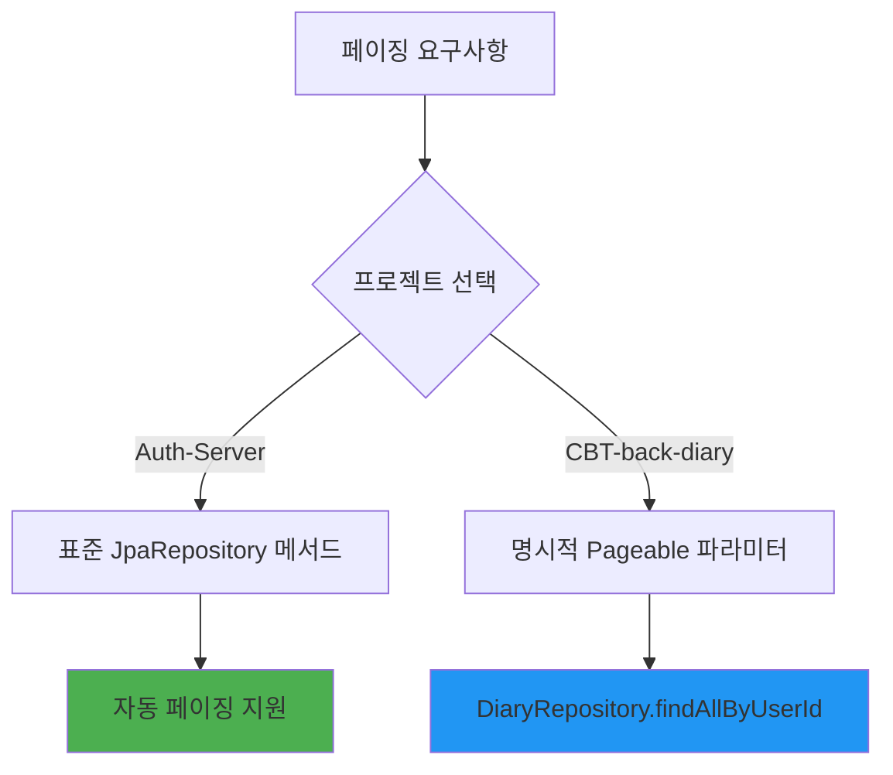
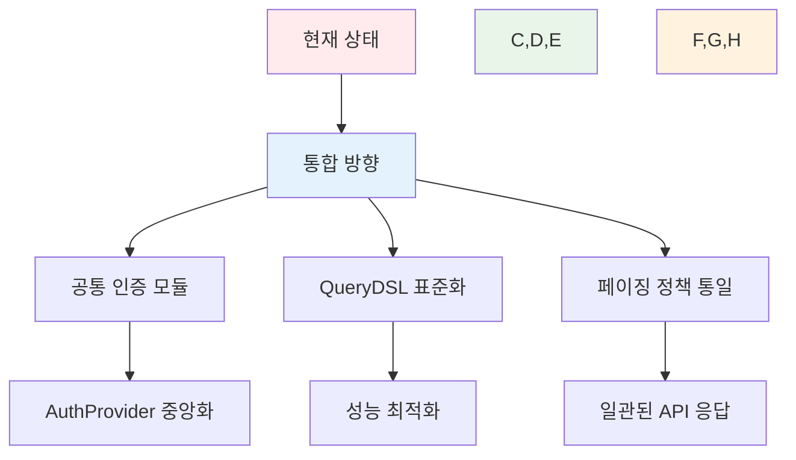

# 📊 데이터 접근 계층 비교 보고서

> 이 보고서는 `Auth-Server`와 `CBT-back-diary` 프로젝트의 리포지토리 계층을 분석하고 비교하여, 구조, 커스텀 쿼리, QueryDSL 사용량 및 잠재적 결합도를 중점적으로 검토합니다.

## 📋 분석 대상 리포지토리 파일



> ⚠️ **참고**: Auth-Server의 `Diary`, `Report`, `EmailVerification`, `SettingsOption`, `UserCustomSetting` 리포지토리는 `Auth-server/backend/src/main/java/com/authentication/auth/repository/` 디렉토리에서 발견되지 않았습니다.

## 🔍 리포지토리 상세 분석

### 📝 1. Auth-Server 리포지토리

#### 🔐 AuthProviderRepository
```java
// JpaRepository<AuthProvider, Integer> 확장
```

| 메서드 | 타입 | 설명 |
|--------|------|------|
| `findByProviderName(String providerName)` | 표준 파생 쿼리 | 제공자 이름으로 인증 제공자 검색 |

#### 🔑 UserAuthenticationRepository
```java
// JpaRepository<UserAuthentication, UserAuthenticationId> 확장
```

| 메서드 | 타입 | 설명 |
|--------|------|------|
| `findByAuthProvider_ProviderNameAndSocialId(String providerName, String socialId)` | 파생 쿼리 | 제공자 이름과 소셜 ID로 사용자 인증 레코드 검색 |

#### 👤 UserRepository
```java
// JpaRepository<User, Long> 및 UserRepositoryCustom 확장
```

| 메서드 | 타입 | 설명 |
|--------|------|------|
| `findByUserName(String userName)` | 파생 쿼리 | 사용자명으로 사용자 검색 |
| `existsByEmail(String email)` | 파생 쿼리 | 이메일 존재 여부 확인 |
| `existsByUserName(String userName)` | 파생 쿼리 | 사용자명 존재 여부 확인 |

#### 🛠️ UserRepositoryCustom & UserRepositoryImpl



**📊 QueryDSL 사용 현황**:
- ✅ **사용**: `JPAQueryFactory` 활용
- 🔄 `updatePassword`: 사용자명 기반 비밀번호 업데이트 (`@Transactional`)
- 📧 `findAllEmail`: 모든 이메일 주소 조회
- ❌ **페이징**: 커스텀 메서드에서 미구현

### 📝 2. CBT-back-diary 리포지토리

#### 🔐 AuthProviderRepository
```java
// JpaRepository<AuthProvider, Integer> 확장
```

| 메서드 | 타입 | 설명 |
|--------|------|------|
| `findByProviderName(String providerName)` | 파생 쿼리 | Auth-Server와 동일한 메서드 |

#### 📖 DiaryRepository
```java
// JpaRepository<Diary, Long> 확장
```

| 메서드 | 타입 | 페이징 지원 | 설명 |
|--------|------|-------------|------|
| `findByIdAndUserId(Long diaryId, Long userId)` | 파생 쿼리 | ❌ | 특정 사용자의 특정 일기 검색 |
| `findAllByUserId(Long userId, Pageable pageable)` | 파생 쿼리 | ✅ | 사용자의 모든 일기 페이징 조회 |

#### 🔑 UserAuthenticationRepository
```java
// JpaRepository<UserAuthentication, UserAuthenticationId> 확장
```

| 메서드 | 타입 | 설명 |
|--------|------|------|
| `findByUserId(Long userId)` | 파생 쿼리 | 사용자 ID로 인증 정보 목록 조회 |
| `findByUserIdAndProviderName(Long userId, String providerName)` | 커스텀 JPQL | 사용자 ID와 제공자명으로 인증 정보 조회 |
| `findFirstByUserId(Long userId)` | 파생 쿼리 | 사용자의 첫 번째 인증 레코드 조회 |

**🔍 JPQL 커스텀 쿼리 예시**:
```sql
SELECT ua FROM UserAuthentication ua 
WHERE ua.user.id = :userId AND ua.authProvider.providerName = :providerName
```

#### 👤 UserRepository
```java
// JpaRepository<User, Long> 확장
```

| 메서드 | 타입 | 설명 |
|--------|------|------|
| `findByEmail(String email)` | 파생 쿼리 | 이메일로 사용자 검색 |
| `findByUserName(String userName)` | 파생 쿼리 | 사용자명(닉네임)으로 사용자 검색 |

**📊 QueryDSL 사용 현황**: ❌ 파생 쿼리만 사용

## 📈 분석 결과 요약

### 🏗️ 리포지토리 구조 비교



### 🔗 QueryDSL 사용량 비교

| 프로젝트 | QueryDSL 사용 | 구현 방식 | 주요 기능 |
|----------|---------------|-----------|-----------|
| **Auth-Server** | ✅ 적극 사용 | `UserRepositoryImpl` | 배치 업데이트, 프로젝션 쿼리 |
| **CBT-back-diary** | ❌ 미사용 | 파생 쿼리 + JPQL | 표준 CRUD 작업 |

### 🔗 결합도 및 도메인 간 데이터 접근



**🔍 결합도 분석**:
- 📖 **DiaryRepository**: `userId` 기반 필터링 (자연스러운 외래키 관계)
- 🔑 **UserAuthenticationRepository**: 사용자-인증제공자 연결 목적
- 🔄 **AuthProviderRepository**: 두 프로젝트에서 거의 동일한 구조

### 📊 데이터 접근 패턴 복잡도

| 측면 | Auth-Server | CBT-back-diary |
|------|-------------|----------------|
| **쿼리 도구** | QueryDSL + 파생 쿼리 | 파생 쿼리 + JPQL |
| **복잡도** | 높음 (성능 최적화) | 낮음 (단순함) |
| **페이징** | 기본 지원 | 명시적 `Pageable` 사용 |
| **트랜잭션** | `@Transactional` 적용 | 표준 JPA 트랜잭션 |

### 📄 페이징 메커니즘



## 🎯 종합 결론

### ✅ 강점

**Auth-Server**:
- 🚀 QueryDSL을 통한 고성능 쿼리 최적화
- 🏗️ 명확한 커스텀 리포지토리 패턴
- 🔄 복잡한 업데이트 작업 지원

**CBT-back-diary**:
- 🎯 단순하고 직관적인 데이터 접근
- 📄 명시적 페이징 지원
- 🔍 JPQL을 통한 유연한 쿼리

### ⚠️ 개선 필요사항

1. **Auth-Server**: 커스텀 메서드의 페이징 지원 부족
2. **CBT-back-diary**: 복잡한 쿼리 최적화 도구 부재
3. **공통**: AuthProvider 중복 관리 가능성

### 🔮 통합 권장사항



> 💡 **결론**: 두 프로젝트 모두 Spring Data JPA를 효과적으로 활용하고 있으며, Auth-Server는 성능 최적화에, CBT-back-diary는 단순성에 중점을 두고 있습니다. 완전한 비교를 위해서는 Auth-Server의 누락된 엔티티 리포지토리들이 필요합니다.
