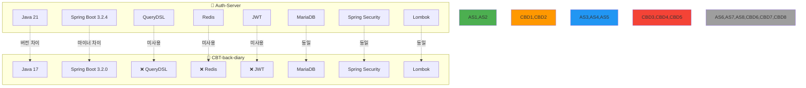
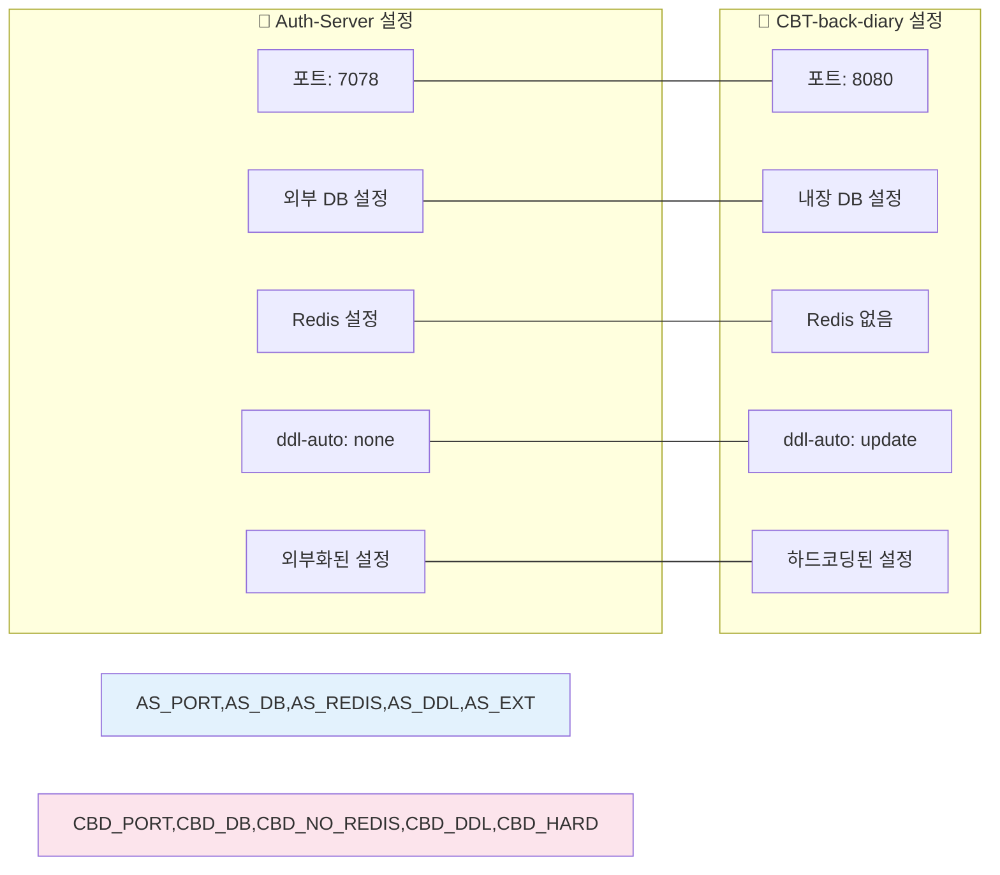
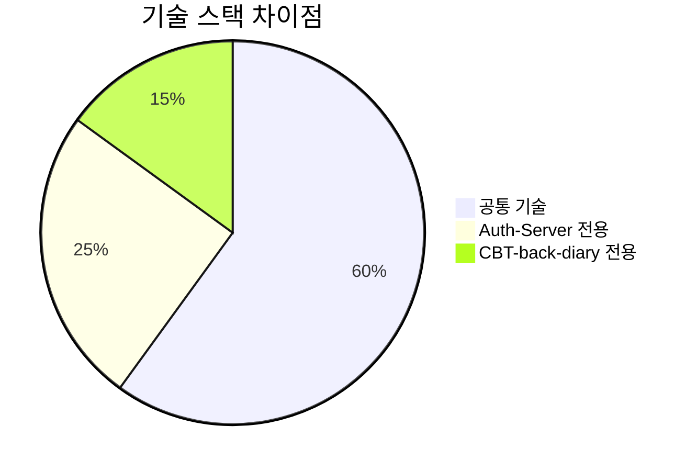
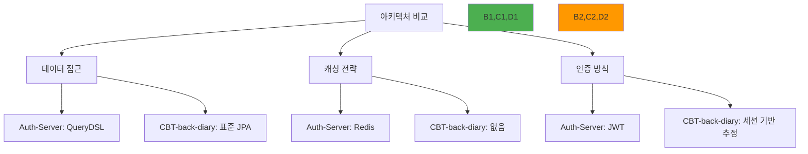
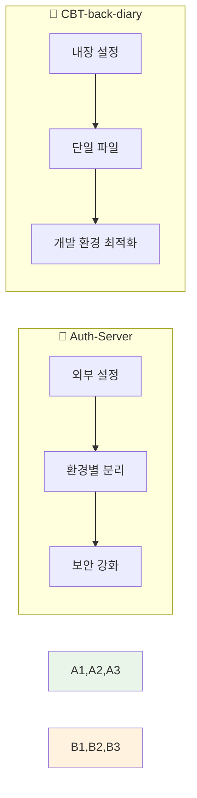
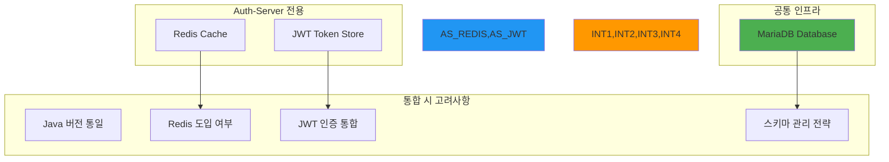
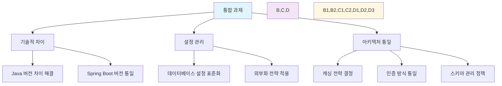
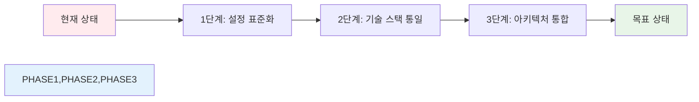

# 🔧 의존성 및 설정 비교 보고서

> 이 보고서는 `Auth-Server`와 `CBT-back-diary` 프로젝트의 빌드 설정과 애플리케이션 속성을 통합하여 비교 분석합니다. Auth-Server 정보는 서브태스크 설명을 기반으로 하며, CBT-back-diary 정보는 이전에 읽은 프로젝트 파일들을 기반으로 합니다.

## 📦 I. 빌드 및 의존성 비교

### 📊 상세 비교 테이블

| 🔧 기능 | 🔷 Auth-Server | 🔶 CBT-back-diary | 📝 비고 |
|---------|----------------|-------------------|---------|
| **Java 버전** | ☕ 21 | ☕ 17 | Java 버전 차이 존재 |
| **Spring Boot** | 🍃 3.2.4 | 🍃 3.2.0 | 마이너 버전 차이, 둘 다 Spring Boot 3.x |
| **데이터베이스 드라이버** | 🗄️ `mariadb-java-client` | 🗄️ `mariadb-java-client` | 둘 다 MariaDB 사용 |
| **Spring Data JPA** | ✅ `spring-boot-starter-data-jpa` | ✅ `spring-boot-starter-data-jpa` | 일관성 있음 |
| **Spring Security** | 🔒 `spring-boot-starter-security` | 🔒 `spring-boot-starter-security` | 일관성 있음 |
| **QueryDSL** | ✅ `com.querydsl:querydsl-jpa` | ❌ 미포함 | Auth-Server만 QueryDSL 활용 |
| **Redis 클라이언트** | ✅ `spring-boot-starter-data-redis` | ❌ 미포함 | Auth-Server만 Redis 사용 |
| **JWT 라이브러리** | ✅ `io.jsonwebtoken:jjwt-*` | ❌ 미포함 | Auth-Server만 JWT 토큰 인증 |
| **Lombok** | ✅ `org.projectlombok:lombok` | ✅ `org.projectlombok:lombok` | 일관성 있음 |

## ⚙️ II. 설정 속성 비교

### 📋 속성 상세 비교

| ⚙️ 속성 | 🔷 Auth-Server | 🔶 CBT-back-diary | 📝 비고 |
|---------|----------------|-------------------|---------|
| **서버 포트** | 🚪 `7078` | 🚪 `8080` | 포트 차이 |
| **DB URL** | 🔗 외부화 (`application-database.properties`) | 🔗 `jdbc:mariadb://localhost:3306/emotion_db` | Auth-Server는 외부 설정, CBT는 `emotion_db` 사용 |
| **DB 사용자명** | 👤 외부화 | 👤 `root` | Auth-Server는 외부화, CBT는 `root` |
| **DB 비밀번호** | 🔐 외부화 | 🔐 `password` (하드코딩) | Auth-Server는 외부화, CBT는 하드코딩 |
| **DB 방언** | 🗣️ `MariaDBDialect` | 🗣️ `MariaDBDialect` | 일관성 있음 |
| **JPA ddl-auto** | 📝 `none` | 📝 `update` | 스키마 관리 전략 차이 |
| **JPA show-sql** | 🔍 미지정 (기본 `false`) | 🔍 `true` | CBT-back-diary는 SQL 로깅 |
| **Redis 설정** | ✅ 추정 (의존성 존재) | ❌ 해당 없음 | Auth-Server만 Redis 설정 |
| **설정 import** | 🔗 `spring.config.import` 사용 | ❌ 미사용 | Auth-Server는 외부 속성 파일 |

## 📊 분석 결과 요약

### 🔄 주요 의존성 및 기술 차이점

#### 🆚 버전 차이
- **Java**: Auth-Server(21) > CBT-back-diary(17) 
- **Spring Boot**: Auth-Server(3.2.4) > CBT-back-diary(3.2.0)

#### 🔧 아키텍처 차이

### ⚙️ 설정 관리 관행

#### 📈 설정 방식 평가

| 측면 | 🔷 Auth-Server | 🔶 CBT-back-diary | 🏆 권장사항 |
|------|----------------|-------------------|-------------|
| **보안성** | 🟢 높음 (외부화) | 🟡 낮음 (하드코딩) | Auth-Server 방식 |
| **유연성** | 🟢 높음 (환경별) | 🟡 제한적 | Auth-Server 방식 |
| **단순성** | 🟡 복잡 | 🟢 단순 | 상황에 따라 |
| **운영 안정성** | 🟢 높음 | 🔴 위험 | Auth-Server 방식 |

### 🏗️ 인프라 의존성

## 🎯 통합을 위한 영향 분석

### ⚠️ 주요 고려사항

### 📋 통합 체크리스트

#### 🔧 기술 스택 통일
- [ ] **Java 버전**: 21로 통일 (호환성 검토 필요)
- [ ] **Spring Boot**: 최신 안정 버전으로 통일
- [ ] **의존성**: Redis, JWT 필요성 검토 및 도입

#### ⚙️ 설정 관리 개선
- [ ] **외부화**: CBT-back-diary 설정 외부화
- [ ] **보안**: 하드코딩된 비밀번호 제거
- [ ] **환경별**: 개발/운영 환경 분리

#### 🗄️ 데이터베이스 정책
- [ ] **스키마 관리**: `ddl-auto` 정책 통일
- [ ] **연결 설정**: 통합 데이터베이스 또는 분리 정책 결정
- [ ] **마이그레이션**: 기존 데이터 통합 방안

## 💡 권장사항

### 🏆 우선순위별 개선 방안

1. **🔥 긴급 (보안)**
   - CBT-back-diary 하드코딩된 설정 외부화
   - 운영 환경 보안 설정 강화

2. **⚡ 중요 (호환성)**
   - Java 버전 통일 및 호환성 테스트
   - Spring Boot 버전 동기화

3. **🔧 개선 (아키텍처)**
   - Redis 캐싱 전략 도입 검토
   - JWT 기반 통합 인증 시스템 구축

### 🎯 통합 시나리오

> 💡 **결론**: 이 비교 분석은 두 프로젝트 간의 기술 선택과 설정 관행에서 중요한 차이점을 보여주며, 통합 시나리오에서 반드시 해결해야 할 과제들을 명확히 제시합니다.
