# 🔧 서비스 계층 비교 보고서

> 이 보고서는 `Auth-Server`와 `CBT-back-diary` 프로젝트의 핵심 서비스 클래스들을 분석하고 비교하여, 각각의 책임, 로직, 그리고 잠재적 중복을 중점적으로 검토합니다.

## 👥 1. UserService 비교 분석

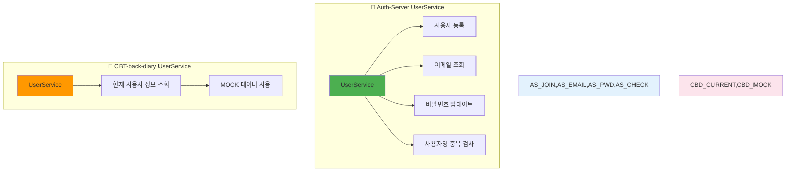

### 🔷 Auth-Server: `UserService`

#### 📋 주요 책임

- ✅ 사용자 등록 (서비스 가입)
- 📧 사용자 ID로 이메일 조회
- 🔐 사용자 비밀번호 업데이트
- 🔍 사용자명(사용자 ID) 중복 검사

#### 🛠️ 핵심 메서드

| 메서드                               | 기능                | 구현 세부사항                                                                             |
| ------------------------------------ | ------------------- | ----------------------------------------------------------------------------------------- |
| `join(JoinRequest)`                  | 📝 신규 사용자 생성 | 비밀번호 암호화, 사용자명/이메일 중복 검사, 초기 상태 설정 (`WAITING`, `isPremium=false`) |
| `getEmailByUserId(String)`           | 📧 이메일 조회      | `userName`으로 사용자 이메일 페치                                                         |
| `UpdateUserPassword(String, String)` | 🔐 비밀번호 변경    | 새 비밀번호 암호화 후 업데이트                                                            |
| `checkUserNameIsDuplicate(String)`   | 🔍 중복 검사        | `userName` 존재 여부 확인                                                                 |

**📊 트랜잭션 사용**: 모든 공개 메서드에 `@Transactional` 적용 (읽기-쓰기 기본 동작)

### 🔶 CBT-back-diary: `UserService`

#### 📋 주요 책임

- 👤 "현재" 사용자 세부 정보 조회
- 🔧 `MOCK_USER_ID_LONG` 의존 (개발 중 또는 Spring Security 컨텍스트 통합 대기)

#### 🛠️ 핵심 메서드

| 메서드                    | 기능                | 구현 세부사항                                                                                                                                 |
| ------------------------- | ------------------- | --------------------------------------------------------------------------------------------------------------------------------------------- |
| `getCurrentUserDetails()` | 👤 현재 사용자 정보 | 사용자 세부사항(ID, 닉네임, 이메일, 이메일 인증, 제공자 타입, 역할)을 `UserDto`로 반환. Mock ID로 DB 조회, 실패시 하드코딩된 Mock 데이터 사용 |

**📊 트랜잭션 사용**: `@Transactional(readOnly = true)` 적용

### 🔍 비교 분석

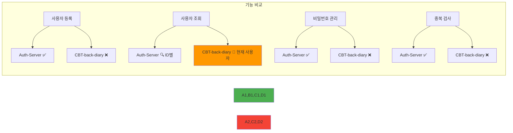

#### 🎯 유사점 및 차이점

| 측면              | 🔷 Auth-Server               | 🔶 CBT-back-diary        | 📝 분석                             |
| ----------------- | ---------------------------- | ------------------------ | ----------------------------------- |
| **기능 범위**     | 🌟 포괄적 (등록, 관리, 검증) | 🔍 제한적 (조회 중심)    | Auth-Server가 더 완전한 사용자 관리 |
| **비즈니스 로직** | 🔐 직접 등록, 비밀번호 해싱  | 🔗 OAuth 흐름 의존       | 현재 직접적 중복 최소               |
| **트랜잭션 관리** | ⚠️ 읽기 전용 최적화 여지     | ✅ 적절한 읽기 전용 사용 | CBT가 더 정확한 트랜잭션 관리       |
| **통합 가능성**   | 🏗️ 기반 서비스로 활용        | 🔧 특화 기능 추가        | 높은 통합 잠재력                    |

## 📖 2. CBT-back-diary: `DiaryService`

```mermaid
graph TD
    A[DiaryService] --> B[CRUD 작업]
    B --> C[생성: createDiaryPost]
    B --> D[조회: getDiaryPostById]
    B --> E[수정: updateDiaryPost]

    C --> F[사용자 연결 - MOCK_USER_ID]
    D --> G[@Transactional readOnly]
    E --> H[AI 필드 제외 업데이트]

    A --> I[mapToDto: 엔티티-DTO 변환]

    style A fill:#2196f3
    style C,D,E fill:#4caf50
    style F fill:#ff9800
    style G,H fill:#9c27b0
    style I fill:#607d8b
```

### 📋 주요 책임

- 📝 일기 항목에 대한 CRUD (생성, 읽기, 업데이트) 작업 관리

### 🛠️ 핵심 기능

| 메서드                                          | 트랜잭션                          | 기능 설명                                                      |
| ----------------------------------------------- | --------------------------------- | -------------------------------------------------------------- |
| `createDiaryPost(CreateDiaryPostRequest)`       | `@Transactional`                  | 새 일기 항목 생성, 사용자 연결 (현재 `MOCK_USER_ID_LONG` 사용) |
| `getDiaryPostById(Long)`                        | `@Transactional(readOnly = true)` | ID로 특정 일기 게시물 조회                                     |
| `updateDiaryPost(Long, UpdateDiaryPostRequest)` | `@Transactional`                  | 제목과 내용 업데이트 (AI 관련 필드 제외)                       |
| `mapToDto(Diary)`                               | Private                           | `Diary` 엔티티를 `DiaryPostDto`로 변환                         |

**⚠️ 현재 제한사항**:

- `MOCK_USER_ID_LONG` 사용으로 실제 사용자 컨텍스트 통합 대기
- 사용자별 접근 권한 검사를 위한 TODO 항목 존재

## 🔐 3. Auth-Server: 전문 서비스들

### 🌐 OAuth2Service

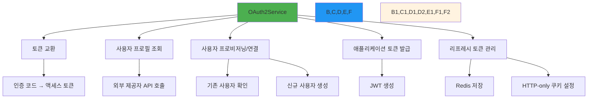

#### 🎯 핵심 책임

- **🔄 토큰 교환**: OAuth2 인증 코드 그랜트 플로우 관리
- **👤 사용자 프로필 검색**: 액세스 토큰으로 외부 제공자에서 프로필 정보 가져오기
- **🔗 사용자 연결**: 로컬 DB에서 OAuth ID 연결된 사용자 확인/생성
- **🎫 토큰 발급**: 성공적인 OAuth 인증 후 애플리케이션별 JWT 생성
- **♻️ 리프레시 토큰**: OAuth 제공자의 리프레시 토큰을 Redis에 저장

#### 🛠️ 지원 제공자

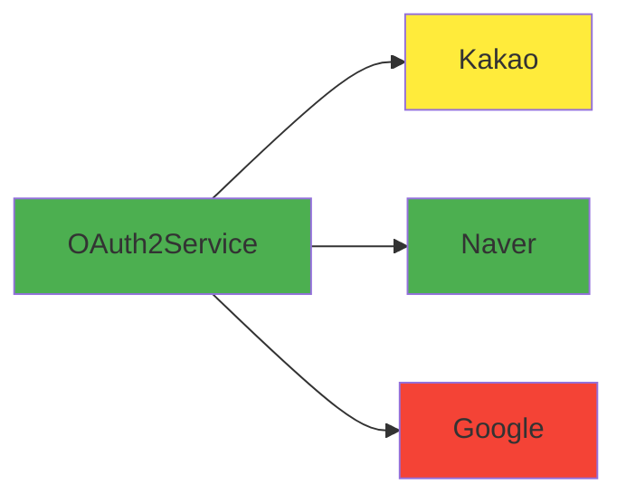

### 🔄 TokenService

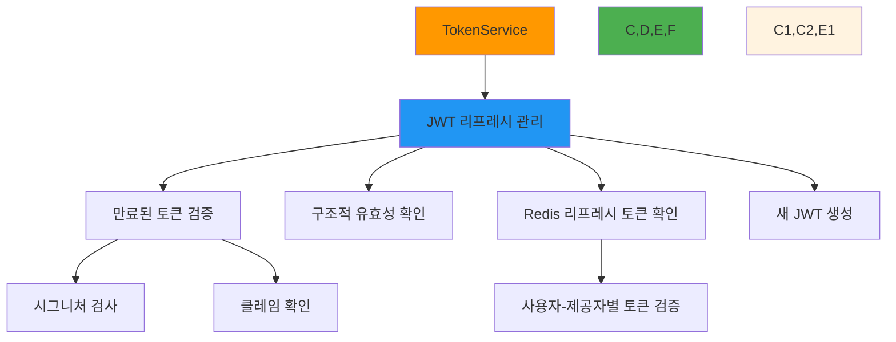

#### 🎯 핵심 기능

- 📋 만료된 JWT와 제공자 정보 수신
- ✅ 만료된 토큰의 구조적 유효성 검증
- 🔍 Redis에서 해당 리프레시 토큰 존재 및 유효성 확인
- 🆕 새로운 JWT 생성

### 🔒 PrincipalDetailService

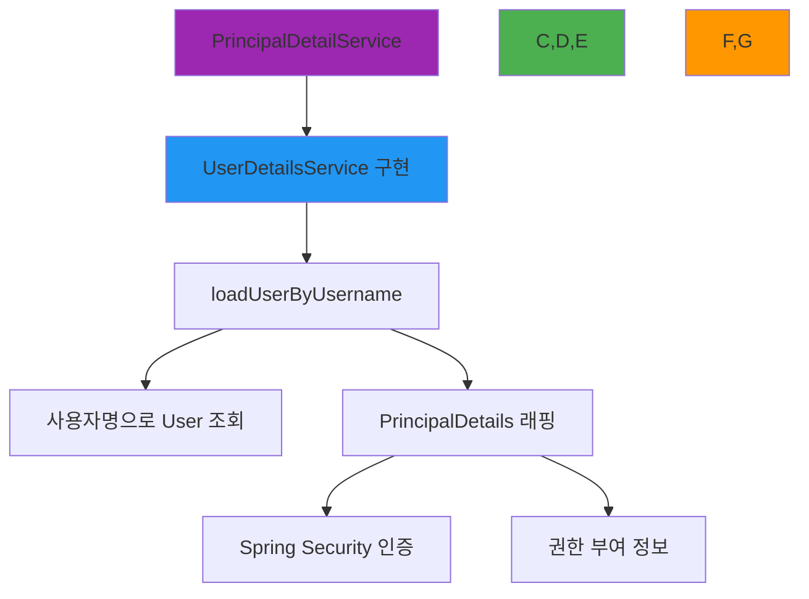

#### 🎯 역할

- 🔗 Spring Security의 `UserDetailsService` 인터페이스 구현
- 👤 인증 과정에서 사용자명으로 `User` 조회
- 🛡️ `UserDetails`를 구현한 `PrincipalDetails`로 래핑

## 📊 주요 발견사항 요약

### 🔄 UserService 중복 및 차이점

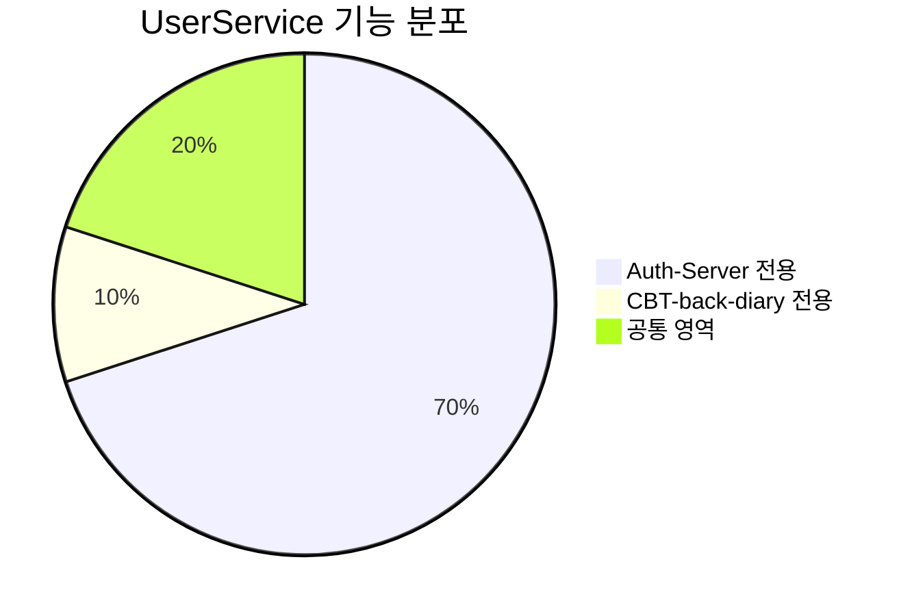

| 측면              | 🔷 Auth-Server           | 🔶 CBT-back-diary     | 🎯 통합 방향          |
| ----------------- | ------------------------ | --------------------- | --------------------- |
| **완성도**        | 🌟 포괄적 사용자 관리    | 🔧 최소한의 조회 기능 | Auth-Server 기반 통합 |
| **비즈니스 로직** | 🔐 직접 등록, 검증, 관리 | 📋 OAuth 기반 조회    | 높은 통합 잠재력      |
| **트랜잭션 관리** | ⚠️ 개선 여지             | ✅ 올바른 읽기 전용   | CBT 방식 적용 권장    |

### 📖 DiaryService 특징

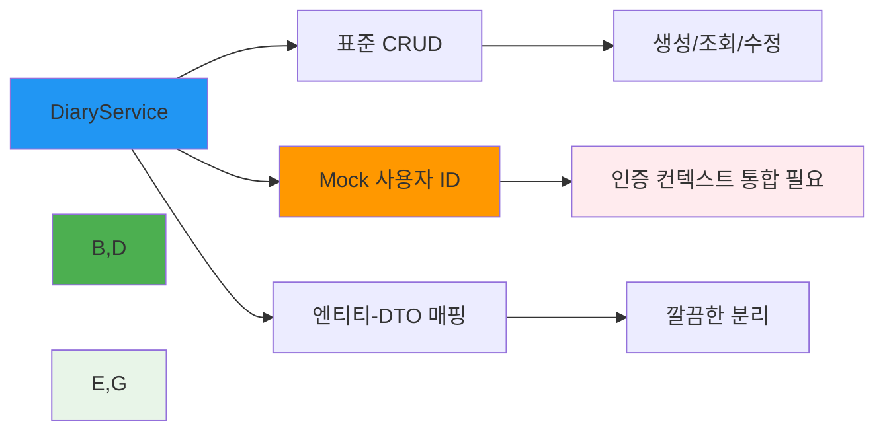

### 🔐 Auth-Server 전문 서비스

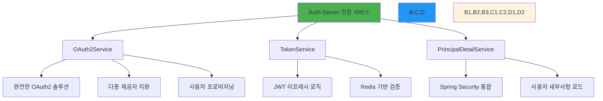

## 🎯 통합 전략 및 권장사항

### 🏗️ 아키텍처 통합 방향

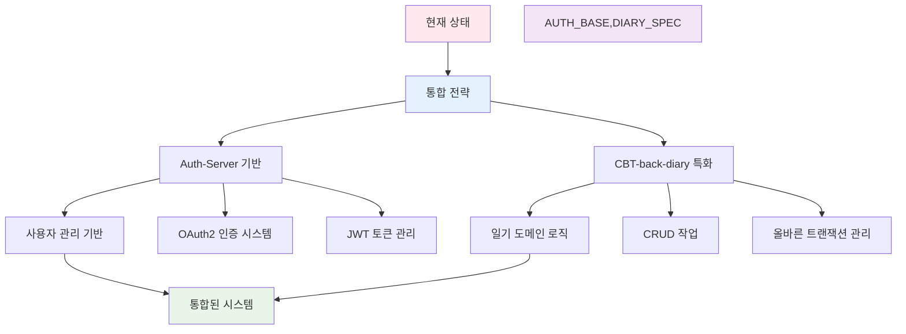

### 📋 통합 체크리스트

#### 🔧 서비스 통합

- [ ] **UserService**: Auth-Server 버전을 기반으로 통합
- [ ] **DiaryService**: Mock ID를 실제 인증 컨텍스트로 교체
- [ ] **OAuth 서비스**: Auth-Server의 OAuth2Service 활용
- [ ] **토큰 관리**: TokenService 통합

#### 💡 최적화 개선

- [ ] **트랜잭션**: 읽기 전용 작업에 `readOnly = true` 적용
- [ ] **보안 강화**: 사용자별 접근 권한 검사 구현
- [ ] **에러 처리**: 통일된 예외 처리 전략

### 🎯 우선순위별 실행 계획

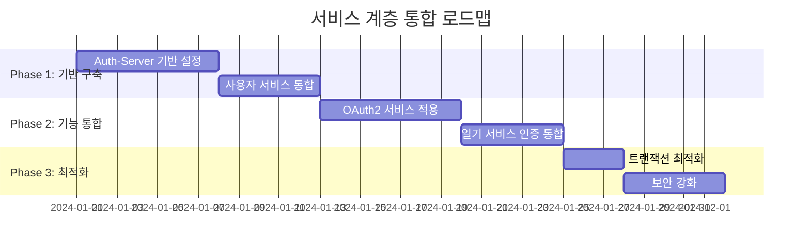

## 💡 결론 및 제안

### ✅ 주요 강점

1. **🔷 Auth-Server**: 완전한 인증 및 사용자 관리 기반 제공
2. **🔶 CBT-back-diary**: 도메인별 비즈니스 로직과 올바른 트랜잭션 관리
3. **🔗 상호 보완성**: 두 시스템의 강점이 서로 보완

### 🎯 통합 목표

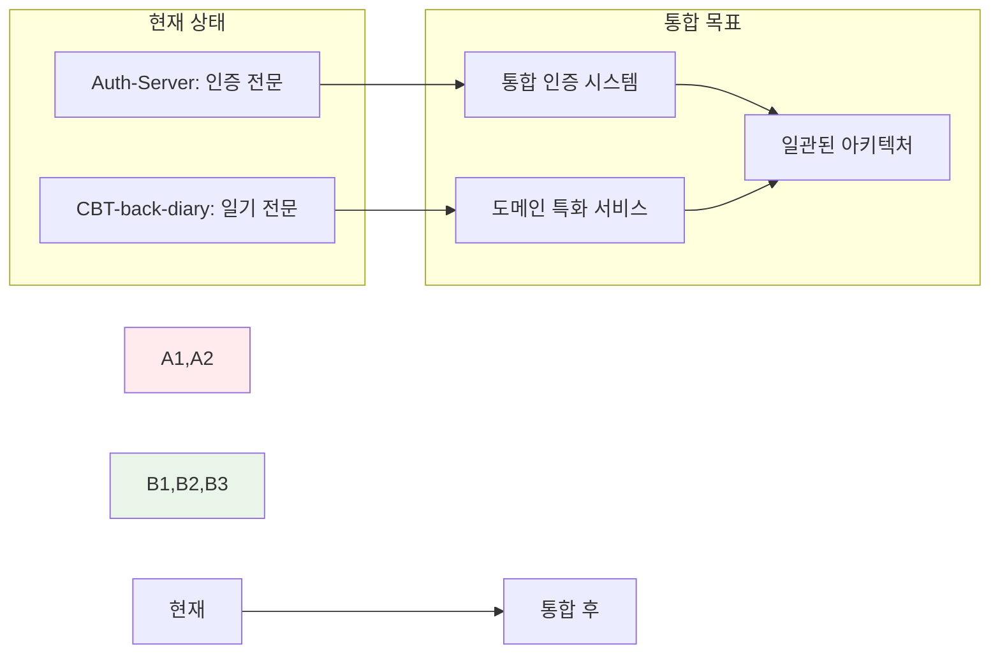

> 💡 **최종 권장사항**: Auth-Server가 더 완전한 인증 및 핵심 사용자 관리 기반을 제공하는 반면, CBT-back-diary는 일기별 비즈니스 로직을 제공합니다. 통합 시 Auth-Server를 기반으로 하여 CBT-back-diary의 도메인 특화 기능을 추가하는 방향이 가장 효과적일 것입니다.
