# 🏛️ 아키텍처 권장 보고서: Auth-Server & CBT-back-diary

## 📖 1. 서론

이 보고서는 `Auth-Server`와 `CBT-back-diary` 프로젝트의 통합 또는 분리에 대한 아키텍처 권장사항을 제공합니다. 이 권장사항은 다음 문서들에 기록된 엔티티, 서비스 계층, 데이터 접근 계층, 빌드/설정 파일에 대한 상세 분석을 기반으로 합니다:

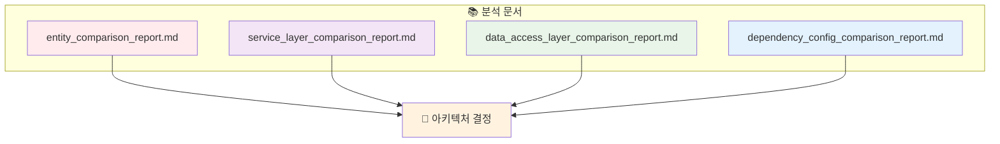

**🎯 목표**: 데이터 결합도, 기술 스택 정렬, 운영 역량, 향후 유지보수성을 고려하여 가장 적합한 아키텍처 접근 방식(모놀리스 또는 마이크로서비스)을 결정합니다.

## 📊 2. 주요 비교 분석 결과 요약

이전 분석 보고서에서 도출된 다음 핵심 포인트들이 이 결정에 중요합니다:

### 🔗 엔티티 중복 및 결합도

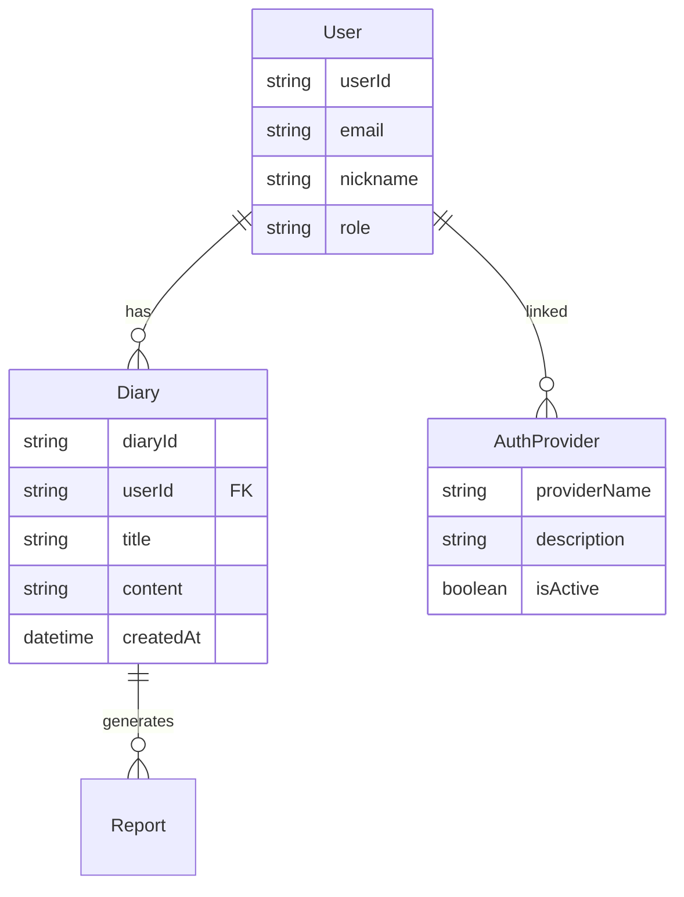

- **🔄 핵심 엔티티**: `User`, `AuthProvider`, `Diary`와 같은 핵심 엔티티가 두 프로젝트에 모두 존재하며, `User`와 `AuthProvider` 엔티티에서 상당한 중복이 있습니다.
- **📊 강한 의존성**: `CBT-back-diary`의 `Diary` 엔티티는 `User` 엔티티에 강한 의존성을 가집니다(외래키 `user_id`).
- **🔧 기존 기능**: Auth-Server에도 `Diary` 엔티티, `Report` 엔티티, `DiaryReportLink`가 포함되어 있어, 기본 인증을 넘어서 일기 관련 기능을 처리하도록 설계되었거나 진화하고 있음을 시사합니다.

### ⚙️ 서비스 계층 기능

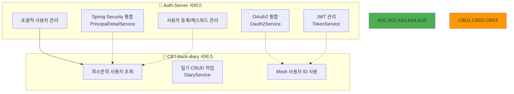

- **🔷 Auth-Server**: OAuth2 통합(`Oauth2Service`), JWT 관리(`TokenService`), Spring Security 통합(`PrincipalDetailService`)을 포함한 포괄적인 사용자 관리 및 인증 시스템을 보유합니다.
- **🔶 CBT-back-diary**: 현재 `UserService`는 최소한이며, 주로 (모의) 사용자 세부정보 조회에 중점을 둡니다. `DiaryService`는 현재 모의 사용자 ID를 사용하여 일기에 대한 CRUD 작업을 처리합니다.

### 🗄️ 데이터 접근 계층

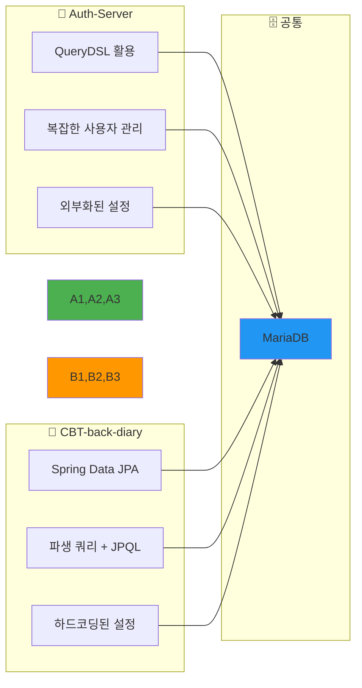

### 🔧 기술 스택 및 의존성

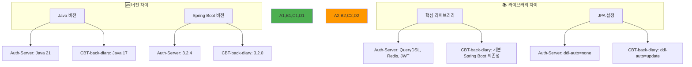

**주요 차이점**:
- **Java 버전**: Auth-Server (Java 21) vs. CBT-back-diary (Java 17)
- **Spring Boot 버전**: Auth-Server (3.2.4) vs. CBT-back-diary (3.2.0) - 둘 다 3.x 계열로 양호
- **핵심 라이브러리**: Auth-Server는 QueryDSL, Redis, JWT 라이브러리 사용
- **JPA 설정**: Auth-Server는 `ddl-auto=none` (운영에 안전), CBT-back-diary는 `update` (개발에 편리)

## 🔍 3. 아키텍처 접근 방식 평가

### 🏗️ 3.1. 모놀리스 통합

`CBT-back-diary` 기능을 `Auth-Server`에 통합하는 방식 (Auth-Server가 기반으로 더 완전한 기능을 제공).

#### ✅ 장점

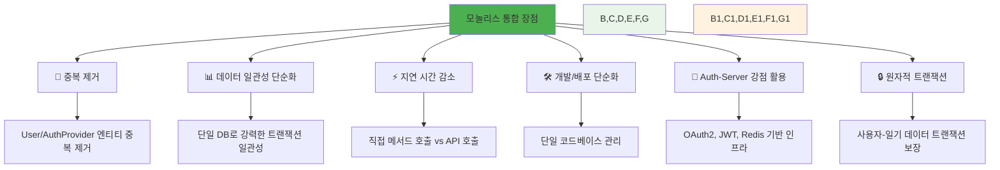

#### ❌ 단점

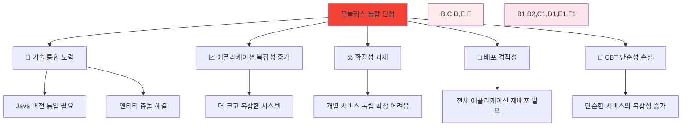

### 🔗 3.2. 마이크로서비스 분리

`Auth-Server`와 `CBT-back-diary`를 API를 통해 통신하는 별도 서비스로 유지하는 방식.

#### ✅ 장점

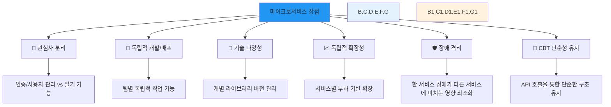

#### ❌ 단점

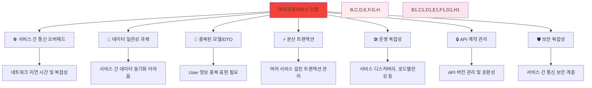

## 🎯 4. 권장사항

### ✅ **권장사항: Auth-Server를 기반으로 한 모놀리스 통합**

#### 📋 근거

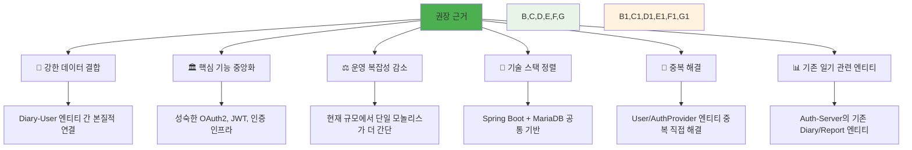

1. **🔗 강한 데이터 결합**: `CBT-back-diary`의 `Diary` 기능이 본질적으로 `User` 엔티티와 연결되어 있어, 마이크로서비스 간 이 관계를 관리하면 API 호출, 데이터 동기화, 트랜잭션 무결성 측면에서 상당한 복잡성이 발생합니다.

2. **🏛️ 핵심 기능 중앙화**: `Auth-Server`가 사용자 관리, 인증(OAuth2, JWT), 권한 부여에 대한 더 성숙하고 기능이 풍부한 플랫폼을 제공합니다.

3. **⚖️ 운영 복잡성 감소**: 현재 설정은 두 개의 밀접하게 관련된 도메인을 제안합니다. 이 애플리케이션의 예상 규모에서는 잘 구조화된 단일 모놀리스를 관리하는 것이 분산 시스템의 복잡성을 수반하는 두 마이크로서비스를 관리하는 것보다 운영상 더 간단할 수 있습니다.

4. **🔧 기술 스택 정렬**: 
   - 두 프로젝트 모두 Spring Boot와 MariaDB를 사용
   - Spring Boot 버전(3.2.4와 3.2.0)이 매우 가깝고 동일한 주 버전(3.x)
   - Java 버전 차이(21 vs. 17)는 Java 21로 표준화하여 관리 가능

5. **🔄 중복 해결**: 모놀리식 접근 방식은 `User` 및 `AuthProvider` 엔티티와 관련 로직의 중복을 직접적으로 해결합니다.

6. **📊 Auth-Server의 기존 일기 관련 엔티티**: Auth-Server에 `Diary`, `Report`, `DiaryReportLink` 엔티티가 존재한다는 것은 이미 순수 인증을 넘어서는 기능을 처리하도록 설계되었거나 진화하고 있음을 시사합니다.

### 🛠️ 통합 전략 (모놀리스 선택 시)

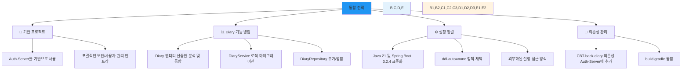

#### 📁 기반 프로젝트
- **Auth-Server**를 기반 프로젝트로 사용 (포괄적인 보안 및 사용자 관리 인프라 때문)

#### 📊 Diary 기능 병합
- CBT-back-diary의 `Diary` 엔티티와 Auth-Server의 `Diary` 엔티티를 신중히 분석하여 통합 모델 결정
- `DiaryService` 로직을 Auth-Server로 마이그레이션하여 Auth-Server의 `User` 엔티티와 보안 컨텍스트를 직접 사용
- Diary 관련 리포지토리(`DiaryRepository`)를 Auth-Server에 추가하거나 병합

#### ⚙️ 설정 정렬
- Java 21 및 Spring Boot 3.2.4 (또는 최신 안정 3.x 버전)로 표준화
- Auth-Server의 `ddl-auto=none` 정책 채택 및 데이터베이스 마이그레이션 구현 (Flyway 또는 Liquibase 사용)
- Auth-Server의 외부화된 설정 접근 방식을 모델로 한 `application.properties` 통합

#### 🔧 의존성 관리
- CBT-back-diary의 필요한 의존성(Auth-Server에 아직 없는 경우)을 Auth-Server의 `build.gradle`에 추가

### 🤔 마이크로서비스 고려사항 (모놀리스가 선택되지 않는 경우)

권장사항에도 불구하고 마이크로서비스 접근 방식을 추구하는 경우, 다음 사항들이 중요합니다:

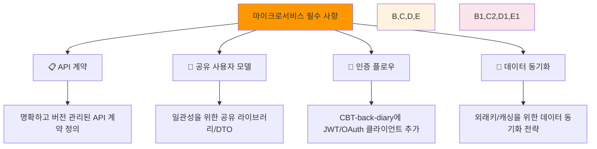

**📋 API 계약**: 사용자 인증, 권한 부여, 필요한 사용자 정보 검색을 위한 Auth-Server와 CBT-back-diary 간의 명확하고 버전 관리된 API 계약 정의

**👥 공유 사용자 모델**: 불일치를 피하기 위한 사용자 표현을 위한 공유 라이브러리 또는 명확한 DTO 생성

**🔐 인증 플로우**: CBT-back-diary에 토큰 검증 및 사용자 컨텍스트를 위한 Auth-Server와 상호작용하는 강력한 클라이언트 측 로직 구현

**🔄 데이터 동기화**: CBT-back-diary에서 로컬로 필요할 수 있는 사용자 데이터 처리 전략 (외래키 제약이나 로컬 캐싱을 위해)

---

## 💡 결론

사용자 데이터를 중심으로 한 긴밀한 결합과 Auth-Server의 기존 포괄적 기능을 고려할 때, **모놀리스로의 병합이 현재 단계에서 이 두 구성 요소에 대해 더 실용적이고 효율적인 접근 방식**으로 보입니다.

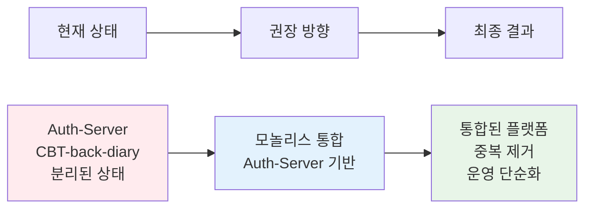
