# 🗄️ 데이터 접근 계층 비교 보고서

> 이 보고서는 `Auth-Server`와 `CBT-back-diary` 프로젝트의 리포지토리 계층을 분석하고 비교하여, 구조, 커스텀 쿼리, QueryDSL 사용량 및 잠재적 결합도를 중점적으로 검토합니다.

## 📋 분석 대상 리포지토리 파일

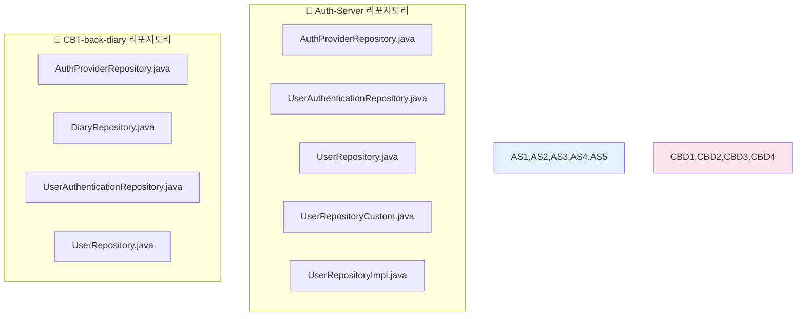

> ⚠️ **참고**: Auth-Server의 `Diary`, `Report`, `EmailVerification`, `SettingsOption`, `UserCustomSetting` 리포지토리는 `Auth-server/backend/src/main/java/com/authentication/auth/repository/` 디렉토리에서 발견되지 않았습니다.

## 🔍 리포지토리 상세 분석

### 🔷 1. Auth-Server 리포지토리

#### 🔐 AuthProviderRepository

```java
extends JpaRepository<AuthProvider, Integer>
```

| 메서드                                    | 타입           | 설명                             |
| ----------------------------------------- | -------------- | -------------------------------- |
| `findByProviderName(String providerName)` | 표준 파생 쿼리 | 제공자 이름으로 인증 제공자 검색 |

#### 🔑 UserAuthenticationRepository

```java
extends JpaRepository<UserAuthentication, UserAuthenticationId>
```

| 메서드                                                       | 타입      | 설명                                            |
| ------------------------------------------------------------ | --------- | ----------------------------------------------- |
| `findByAuthProvider_ProviderNameAndSocialId(String, String)` | 파생 쿼리 | 제공자 이름과 소셜 ID로 사용자 인증 레코드 검색 |

#### 👤 UserRepository

```java
extends JpaRepository<User, Long> and UserRepositoryCustom
```

| 메서드                              | 타입      | 설명                     |
| ----------------------------------- | --------- | ------------------------ |
| `findByUserName(String userName)`   | 파생 쿼리 | 사용자명으로 사용자 검색 |
| `existsByEmail(String email)`       | 파생 쿼리 | 이메일 존재 여부 확인    |
| `existsByUserName(String userName)` | 파생 쿼리 | 사용자명 존재 여부 확인  |

#### 🛠️ UserRepositoryCustom 인터페이스

```java
// 커스텀 메서드 정의 (QueryDSL 또는 복잡한 JPQL 사용)
```

| 메서드                                              | 반환 타입      | 설명                     |
| --------------------------------------------------- | -------------- | ------------------------ |
| `updatePassword(String userId, String newPassword)` | `long`         | 사용자 비밀번호 업데이트 |
| `findAllEmail()`                                    | `List<String>` | 모든 이메일 주소 조회    |

#### ⚙️ UserRepositoryImpl 구현체

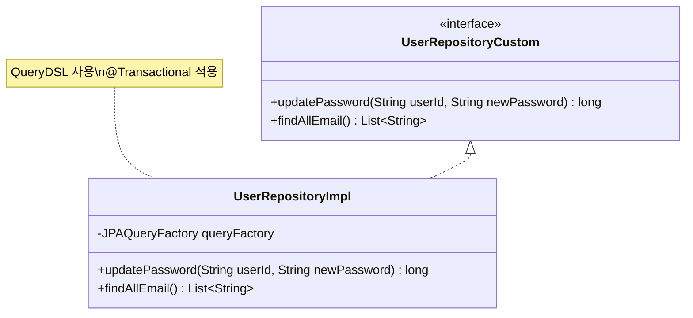

**📊 QueryDSL 사용 현황**:

- ✅ **사용**: `JPAQueryFactory` 활용
- 🔄 `updatePassword`: 사용자명 기반 비밀번호 업데이트 (`@Transactional`)
- 📧 `findAllEmail`: 모든 이메일 주소 조회
- ❌ **페이징**: 커스텀 메서드에서 미구현 (표준 JpaRepository 메서드에서는 지원)

### 🔶 2. CBT-back-diary 리포지토리

#### 🔐 AuthProviderRepository

```java
extends JpaRepository<AuthProvider, Integer>
```

| 메서드                                    | 타입           | 설명                                 |
| ----------------------------------------- | -------------- | ------------------------------------ |
| `findByProviderName(String providerName)` | 표준 파생 쿼리 | Auth-Server와 동일한 메서드 시그니처 |

#### 📖 DiaryRepository

```java
extends JpaRepository<Diary, Long>
```

| 메서드                                            | 페이징 지원 | 설명                           |
| ------------------------------------------------- | ----------- | ------------------------------ |
| `findByIdAndUserId(Long diaryId, Long userId)`    | ❌          | 특정 사용자의 특정 일기 검색   |
| `findAllByUserId(Long userId, Pageable pageable)` | ✅          | 사용자의 모든 일기 페이징 조회 |

**📄 페이징**: `findAllByUserId`에서 명시적으로 `Pageable` 사용

#### 🔑 UserAuthenticationRepository

```java
extends JpaRepository<UserAuthentication, UserAuthenticationId>
```

| 메서드                                      | 타입        | 설명                                    |
| ------------------------------------------- | ----------- | --------------------------------------- |
| `findByUserId(Long userId)`                 | 파생 쿼리   | 사용자 ID로 인증 정보 목록 조회         |
| `findByUserIdAndProviderName(Long, String)` | 커스텀 JPQL | 사용자 ID와 제공자명으로 인증 정보 조회 |
| `findFirstByUserId(Long userId)`            | 파생 쿼리   | 사용자의 첫 번째 인증 레코드 조회       |

**🔍 JPQL 커스텀 쿼리 예시**:

```sql
SELECT ua FROM UserAuthentication ua
WHERE ua.user.id = :userId AND ua.authProvider.providerName = :providerName
```

**📊 QueryDSL 사용 현황**: ❌ 파생 쿼리와 JPQL만 사용

#### 👤 UserRepository

```java
extends JpaRepository<User, Long>
```

| 메서드                            | 타입      | 설명                             |
| --------------------------------- | --------- | -------------------------------- |
| `findByEmail(String email)`       | 파생 쿼리 | 이메일로 사용자 검색             |
| `findByUserName(String userName)` | 파생 쿼리 | 사용자명(닉네임)으로 사용자 검색 |

**📊 QueryDSL 사용 현황**: ❌ 파생 쿼리만 사용

## 📈 분석 결과 요약

### 🏗️ 리포지토리 구조 비교

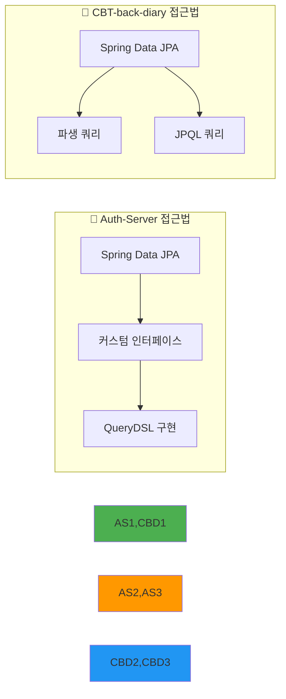

**핵심 차이점**:

- **🔷 Auth-Server**: 커스텀 리포지토리 인터페이스(`UserRepositoryCustom`)와 구현체(`UserRepositoryImpl`) 패턴을 통해 QueryDSL 활용
- **🔶 CBT-back-diary**: 파생 쿼리 메서드와 `@Query` 어노테이션을 통한 JPQL 활용

### 🔗 QueryDSL 사용량 비교

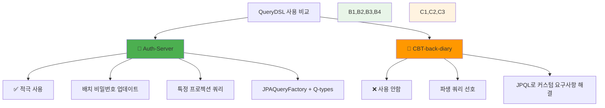

### 🔗 결합도 및 도메인 간 데이터 접근

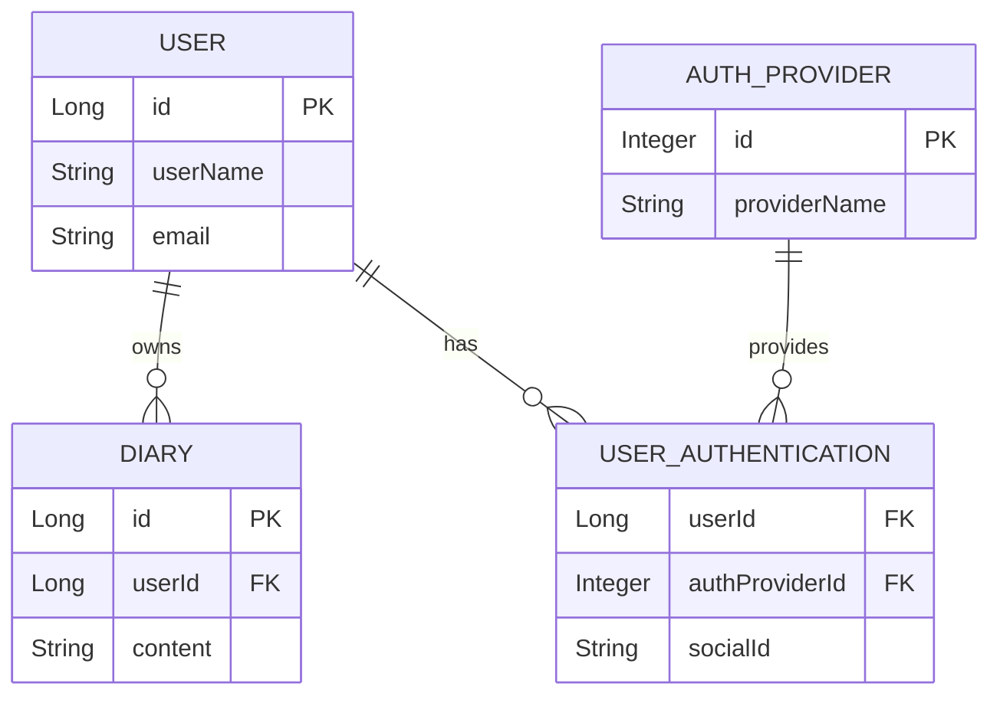

**🔍 결합도 분석**:

| 프로젝트           | 리포지토리                     | 결합도 유형     | 설명                               |
| ------------------ | ------------------------------ | --------------- | ---------------------------------- |
| **CBT-back-diary** | `DiaryRepository`              | 자연스러운 결합 | `userId` 기반 필터링 (외래키 관계) |
| **CBT-back-diary** | `UserAuthenticationRepository` | 본질적 결합     | 사용자-인증제공자 연결 목적        |
| **공통**           | `AuthProviderRepository`       | 중복 가능성     | 거의 동일한 구조로 통합 가능       |

### 📊 데이터 접근 패턴 복잡도

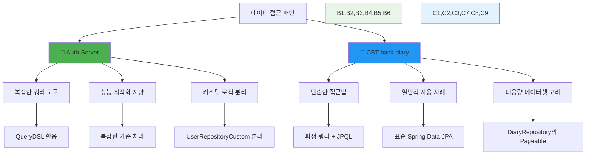

### 📄 페이징 메커니즘

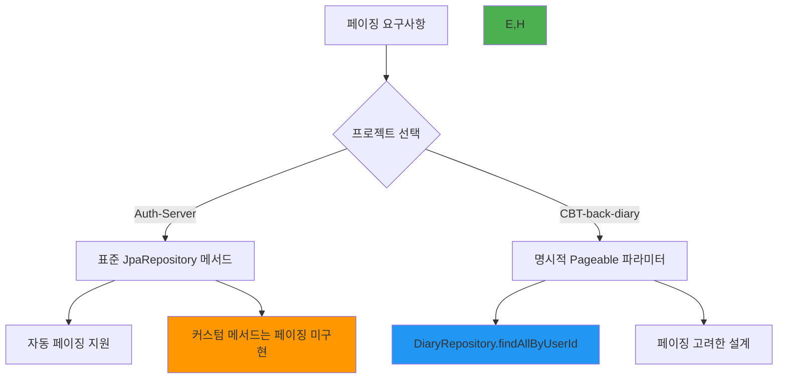

**페이징 현황**:

- **🔶 CBT-back-diary**: `DiaryRepository`에서 명시적 `Pageable` 사용 (표준 Spring Data JPA 기능)
- **🔷 Auth-Server**: 커스텀 QueryDSL 메서드 `findAllEmail`은 페이징 미구현

## 🎯 종합 결론

### ✅ 강점 분석

#### 🔷 Auth-Server 강점

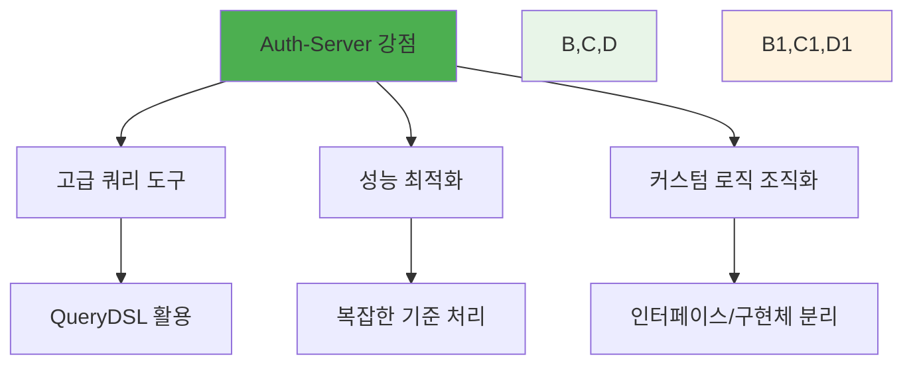

#### 🔶 CBT-back-diary 강점

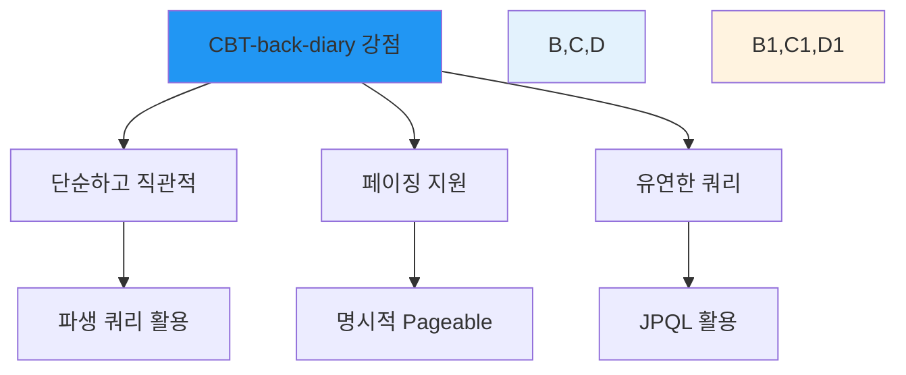

### ⚠️ 개선 필요사항

| 프로젝트              | 개선 영역            | 권장사항                                |
| --------------------- | -------------------- | --------------------------------------- |
| **🔷 Auth-Server**    | 커스텀 메서드 페이징 | QueryDSL 메서드에 페이징 지원 추가      |
| **🔶 CBT-back-diary** | 복잡한 쿼리 최적화   | 성능이 중요한 부분에 QueryDSL 도입 검토 |
| **공통**              | AuthProvider 중복    | 중앙화된 AuthProvider 관리              |

### 🔮 통합 권장사항

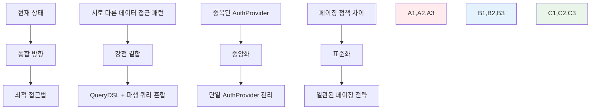

## 💡 최종 권장사항

### 🎯 통합 전략

1. **Auth-Server의 QueryDSL 인프라 활용**: 복잡한 쿼리와 성능 최적화
2. **CBT-back-diary의 페이징 패턴 채택**: 명시적이고 일관된 페이징 지원
3. **중복 제거**: AuthProvider 리포지토리 통합 또는 정규화

### 📋 실행 계획

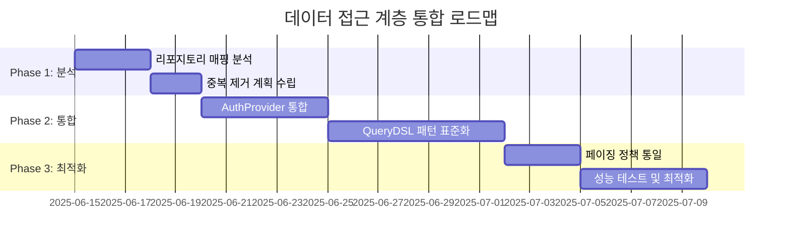

> 💡 **결론**: 두 프로젝트 모두 Spring Data JPA를 효과적으로 활용하고 있으며, Auth-Server는 성능 최적화에, CBT-back-diary는 단순성과 페이징에 중점을 두고 있습니다. 통합 시 각각의 강점을 결합하여 더 강력하고 일관된 데이터 접근 계층을 구축할 수 있습니다.
