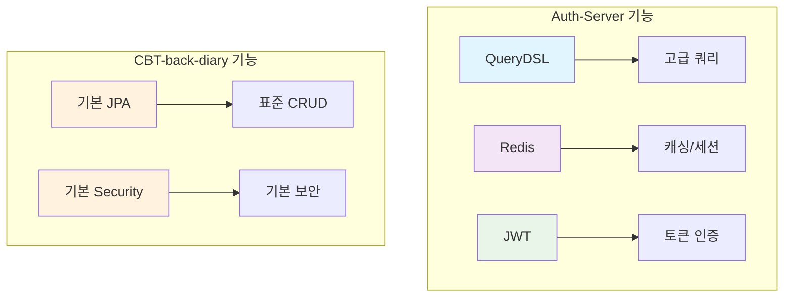
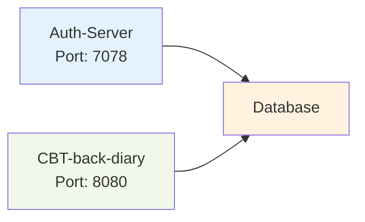
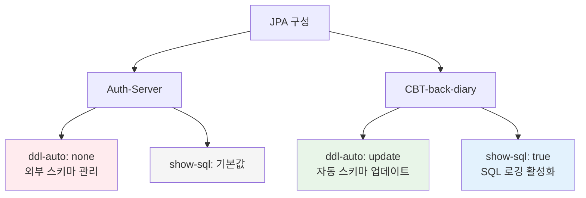
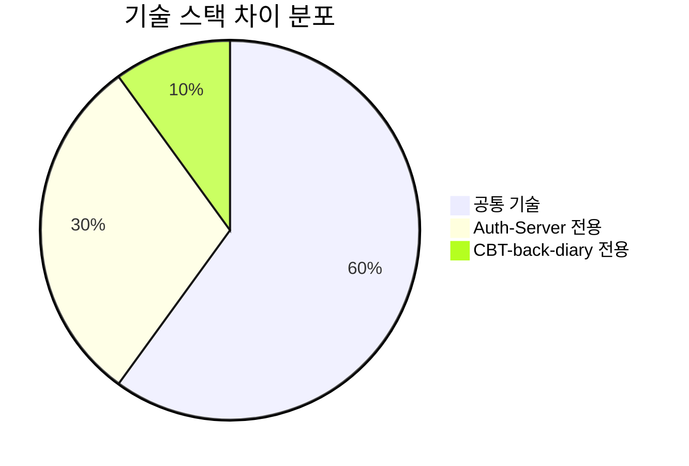
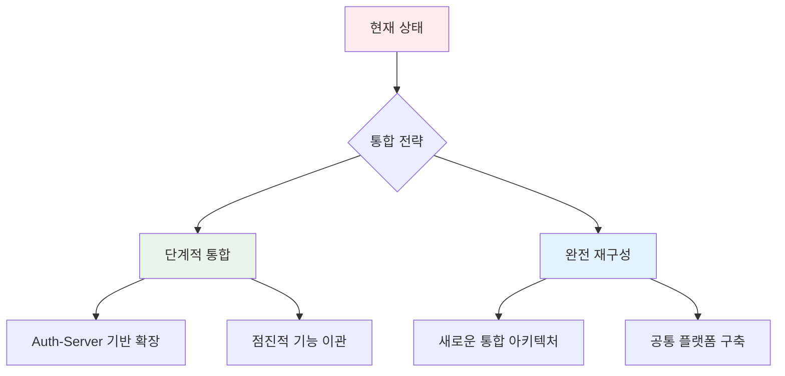

# 종속성 및 구성 비교 보고서

> 📋 **보고서 개요**  
> 본 보고서는 `Auth-Server`와 `CBT-back-diary` 프로젝트의 빌드 구성 및 애플리케이션 속성을 통합하고 비교합니다.

---

## 📌 목차

- [I. 빌드 및 종속성 비교](#i-빌드-및-종속성-비교)
- [II. 구성 속성 비교](#ii-구성-속성-비교)
- [결과 요약](#결과-요약)

---

## I. 빌드 및 종속성 비교

### 🔧 주요 기술 스택 비교

| 구성 요소                 | Auth-Server              | CBT-back-diary           | 비고                                    |
| :------------------------ | :----------------------- | :----------------------- | :-------------------------------------- |
| **Java 버전**             | ☀️ 21                    | ⚡ 17                    | Java 버전 차이 존재                     |
| **Spring Boot**           | 🌸 3.2.4                 | 🌸 3.2.0                 | 마이너 버전 차이. 둘 다 Spring Boot 3.x |
| **데이터베이스 드라이버** | 🗄️ `mariadb-java-client` | 🗄️ `mariadb-java-client` | 둘 다 MariaDB 사용                      |
| **Spring Data JPA**       | ✅ 포함                  | ✅ 포함                  | 일관성 유지                             |
| **Spring Security**       | 🔐 포함                  | 🔐 포함                  | 일관성 유지                             |

### 📊 고급 기능 비교

### 🔍 상세 종속성 분석

| 기능                 | Auth-Server                         | CBT-back-diary | 영향도                          |
| :------------------- | :---------------------------------- | :------------- | :------------------------------ |
| **QueryDSL**         | ✅ `com.querydsl:querydsl-jpa`      | ❌ 없음        | 🔴 높음 - 데이터 접근 방식 차이 |
| **Redis 클라이언트** | ✅ `spring-boot-starter-data-redis` | ❌ 없음        | 🔴 높음 - 캐싱 전략 차이        |
| **JWT 라이브러리**   | ✅ `io.jsonwebtoken:jjwt-*`         | ❌ 없음        | 🔴 높음 - 인증 방식 차이        |
| **Lombok**           | ✅ 포함                             | ✅ 포함        | 🟢 낮음 - 일관성                |

---

## II. 구성 속성 비교

### 🌐 서버 및 네트워크 설정

### 📊 구성 속성 상세 비교

| 속성            | Auth-Server      | CBT-back-diary                             | 보안 등급    |
| :-------------- | :--------------- | :----------------------------------------- | :----------- |
| **서버 포트**   | `7078`           | `8080`                                     | 🟡 중간      |
| **DB URL**      | 🔒 외부화됨      | `jdbc:mariadb://localhost:3306/emotion_db` | 🔴 높음      |
| **DB 사용자명** | 🔒 외부화됨      | `root`                                     | 🔴 높음      |
| **DB 비밀번호** | 🔒 외부화됨      | `password` (하드코딩)                      | 🔴 매우 높음 |
| **DB 방언**     | `MariaDBDialect` | `MariaDBDialect`                           | 🟢 낮음      |

### 🏗️ JPA 구성 전략

### 🔧 인프라 구성 차이점

| 구성 요소           | Auth-Server                    | CBT-back-diary | 통합 고려사항          |
| :------------------ | :----------------------------- | :------------- | :--------------------- |
| **Redis 구성**      | ✅ 구성됨                      | ❌ 없음        | Redis 의존성 추가 필요 |
| **외부 구성**       | ✅ `spring.config.import` 사용 | ❌ 없음        | 보안 강화 필요         |
| **환경별 프로파일** | ✅ 지원                        | ❓ 불명확      | 프로덕션 배포 고려     |

---

## 🎯 결과 요약

### 🔴 주요 차이점

#### 1. **종속성 및 기술 차이**

- **Java 버전**: Auth-Server (Java 21) vs CBT-back-diary (Java 17)
- **Spring Boot**: 마이너 버전 차이 (3.2.4 vs 3.2.0)
- **고급 기능**: Auth-Server가 QueryDSL, Redis, JWT 활용

#### 2. **구성 관리 방식**

| 측면           | Auth-Server      | CBT-back-diary     | 권장사항              |
| :------------- | :--------------- | :----------------- | :-------------------- |
| **보안성**     | 🟢 높음 (외부화) | 🔴 낮음 (하드코딩) | Auth-Server 방식 채택 |
| **운영성**     | 🟢 우수          | 🔴 부족            | 환경별 구성 분리      |
| **유지보수성** | 🟢 우수          | 🔴 부족            | 구성 외부화 필요      |

### 🔄 통합을 위한 고려사항

#### 즉시 해결 필요

1. **Java 버전 통일** - 버전 호환성 확인
2. **보안 구성 강화** - CBT-back-diary 보안 설정 개선
3. **종속성 정렬** - Redis, JWT 등 공통 기술 스택 구성

#### 중장기 계획

1. **스키마 관리 전략** - `ddl-auto` 정책 통일
2. **인프라 통합** - 공통 Redis, 데이터베이스 클러스터
3. **구성 관리** - 통합 환경별 구성 전략

### 💡 통합 권장사항

> ⚠️ **중요**: 두 시스템의 기술 선택과 구성 관리 방식의 차이는 통합 시나리오에서 반드시 해결해야 할 핵심 과제입니다.

---

**📅 작성일**: 2024년 6월 16일  
**🔍 분석 범위**: 빌드 구성, 애플리케이션 속성, 종속성 관리  
**📊 데이터 소스**: Auth-Server 명세, CBT-back-diary 프로젝트 파일
