# 서비스 레이어 비교 분석 보고서

> 📋 **보고서 개요**  
> 본 보고서는 `Auth-Server`와 `CBT-back-diary` 프로젝트의 핵심 서비스 클래스들을 분석하고 비교하여, 각각의 책임, 로직, 그리고 잠재적 중복 영역을 파악합니다.

---

## 📌 목차

- [1. UserService 비교](#1-userservice-비교)
- [2. CBT-back-diary: DiaryService](#2-cbt-back-diary-diaryservice)
- [3. Auth-Server: 전문 서비스들](#3-auth-server-전문-서비스들)
- [핵심 발견사항 요약](#핵심-발견사항-요약)

---

## 1. UserService 비교

### 🔐 Auth-Server: `UserService` 분석

#### 주요 책임
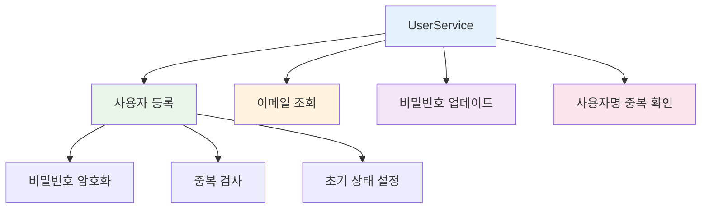

#### 핵심 메서드 분석

| 메서드 | 기능 | 트랜잭션 | 보안 수준 |
|:-------|:-----|:---------|:----------|
| `join()` | 🆕 신규 사용자 생성 | `@Transactional` | 🔴 높음 |
| `getEmailByUserId()` | 📧 이메일 조회 | `@Transactional` | 🟡 중간 |
| `UpdateUserPassword()` | 🔑 비밀번호 변경 | `@Transactional` | 🔴 높음 |
| `checkUserNameIsDuplicate()` | ✅ 중복 확인 | `@Transactional` | 🟢 낮음 |

### 🎯 CBT-back-diary: `UserService` 분석

#### 현재 구현 상태
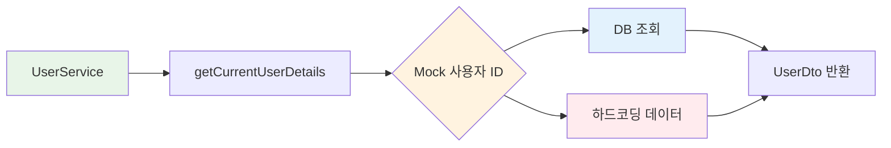

#### 핵심 특징

| 특징 | 설명 | 상태 | 개선 필요도 |
|:-----|:-----|:-----|:-----------|
| **사용자 조회** | 현재 사용자 정보 반환 | 🔶 Mock 기반 | 🔴 높음 |
| **Provider 타입** | OAuth 제공자 식별 | 🔶 부분 구현 | 🟡 중간 |
| **트랜잭션 관리** | `@Transactional(readOnly = true)` | ✅ 적절 | 🟢 낮음 |

### 🔄 UserService 비교 요약

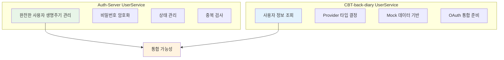

#### 주요 차이점

| 측면 | Auth-Server | CBT-back-diary | 통합 권장사항 |
|:-----|:------------|:---------------|:-------------|
| **기능 범위** | 🟢 완전한 CRUD | 🔶 조회 중심 | Auth-Server 기반 확장 |
| **인증 방식** | 🔐 직접 등록 + OAuth | 🔶 OAuth 준비 단계 | OAuth 통합 완료 |
| **데이터 관리** | 🗄️ 실제 DB 연동 | 🔶 Mock 데이터 | 실제 데이터 통합 |

---

## 2. CBT-back-diary: DiaryService

### 📖 DiaryService 핵심 기능

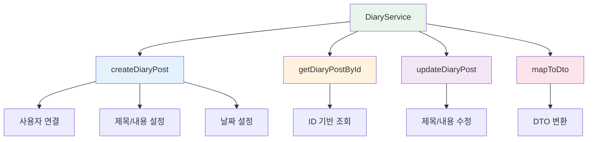

### 🔧 메서드별 기능 분석

| 메서드 | 기능 | 트랜잭션 | 현재 상태 | 개선 필요사항 |
|:-------|:-----|:---------|:----------|:-------------|
| `createDiaryPost()` | 📝 다이어리 생성 | `@Transactional` | 🔶 Mock 사용자 | 실제 사용자 컨텍스트 |
| `getDiaryPostById()` | 🔍 다이어리 조회 | `@Transactional(readOnly = true)` | ✅ 완성 | 권한 검사 추가 |
| `updateDiaryPost()` | ✏️ 다이어리 수정 | `@Transactional` | ✅ 완성 | 권한 검사 추가 |
| `mapToDto()` | 🔄 DTO 변환 | N/A | ✅ 완성 | - |

### 🚨 주요 개선 필요사항

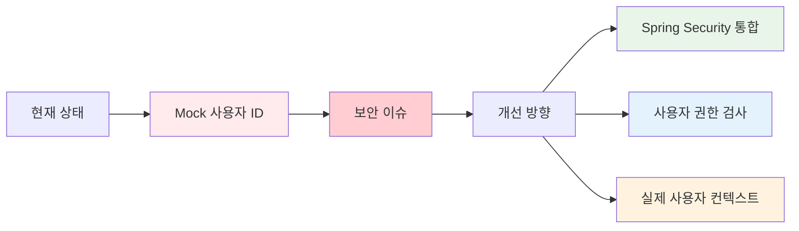

---

## 3. Auth-Server: 전문 서비스들

### 🔐 OAuth2Service 분석

#### 핵심 역할 및 기능
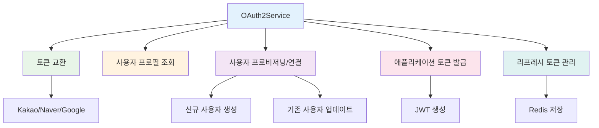

#### OAuth2 플로우 다이어그램
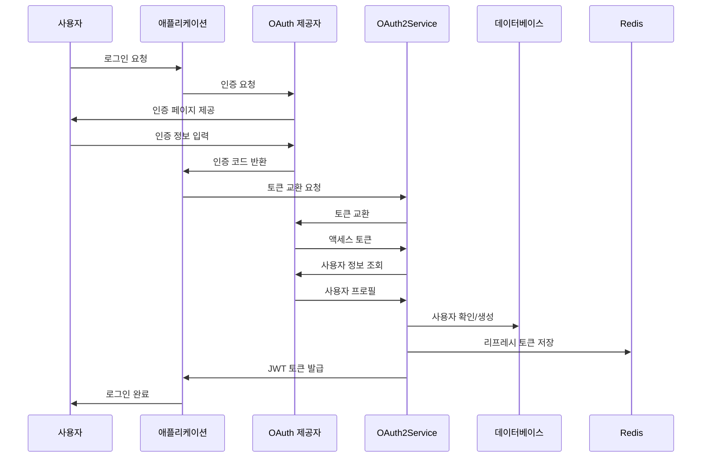

### 🔑 TokenService 분석

#### 토큰 갱신 프로세스
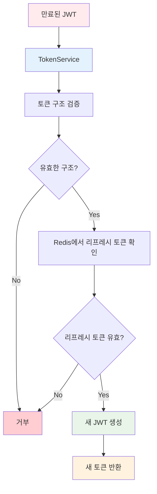

### 🛡️ PrincipalDetailService 분석

#### Spring Security 통합
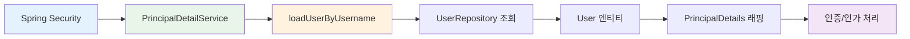

---

## 🎯 핵심 발견사항 요약

### 🔄 UserService 중복 및 차이점

#### 중복 가능성 분석
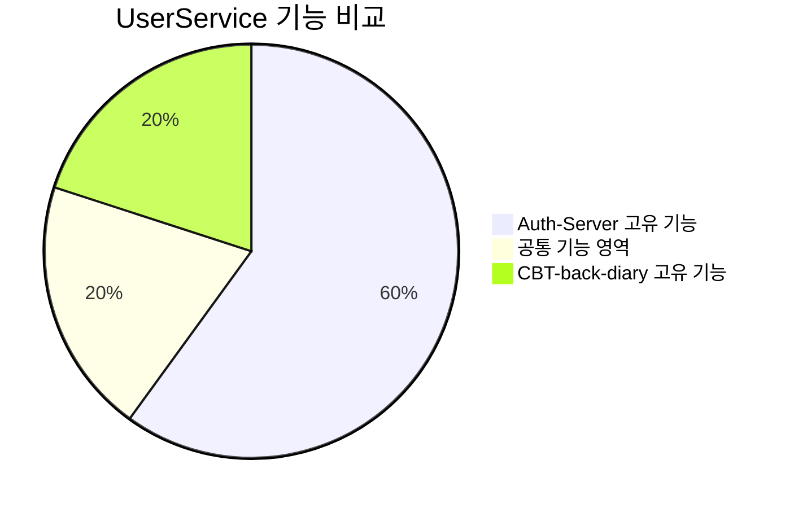

| 영역 | 중복도 | 통합 난이도 | 권장사항 |
|:-----|:-------|:-----------|:---------|
| **사용자 등록** | 🔴 높음 | 🟡 중간 | Auth-Server 로직 활용 |
| **사용자 조회** | 🟡 중간 | 🟢 낮음 | 인터페이스 통합 |
| **인증 관리** | 🔴 높음 | 🔴 높음 | OAuth2 통합 필요 |

### 📊 서비스 레이어 아키텍처 비교

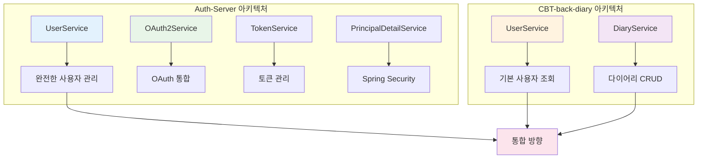

### 🎯 통합 권장사항

#### 단계별 통합 전략
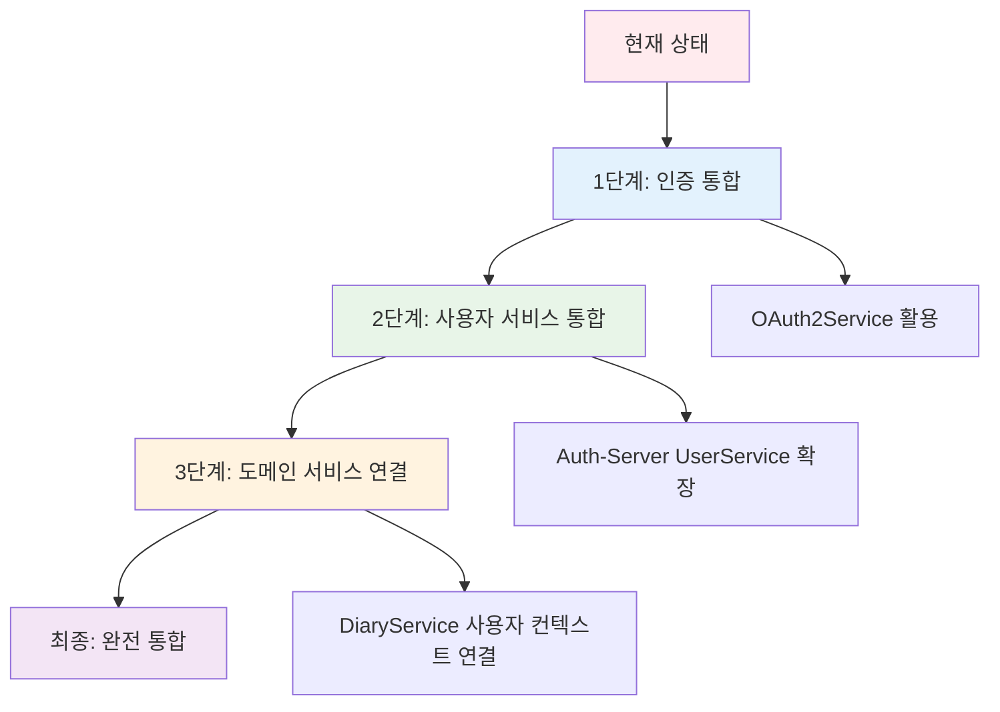

#### 우선순위별 작업 항목

| 순위 | 작업 | 복잡도 | 영향도 | 설명 |
|:-----|:-----|:-------|:-------|:-----|
| 🥇 **1순위** | OAuth2 통합 | 🔴 높음 | 🔴 높음 | CBT-back-diary에 OAuth2 인증 적용 |
| 🥈 **2순위** | 사용자 컨텍스트 | 🟡 중간 | 🔴 높음 | Mock 사용자 → 실제 사용자 컨텍스트 |
| 🥉 **3순위** | 권한 검사 | 🟡 중간 | 🟡 중간 | 다이어리 접근 권한 검사 로직 |
| 4순위 | 서비스 통합 | 🟢 낮음 | 🟡 중간 | 공통 인터페이스 정의 및 구현 |

### 💡 최종 통합 비전

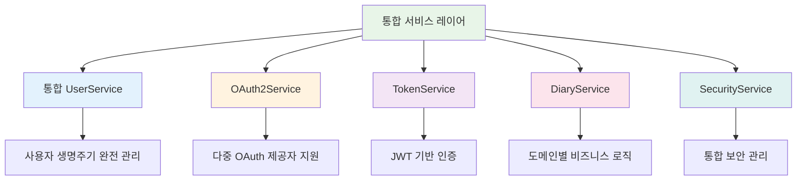

> 🎯 **핵심 결론**: Auth-Server는 더 완전한 인증 및 핵심 사용자 관리 기반을 제공하며, CBT-back-diary는 다이어리 특화 비즈니스 로직을 제공합니다. 통합 시 Auth-Server를 인증 기반으로 활용하고 CBT-back-diary의 도메인 로직을 확장하는 것이 효과적입니다.

---

**📅 작성일**: 2024년 6월 16일  
**🔍 분석 범위**: 서비스 레이어 아키텍처, 비즈니스 로직 비교  
**📊 분석 대상**: UserService, DiaryService, OAuth2Service, TokenService, PrincipalDetailService
