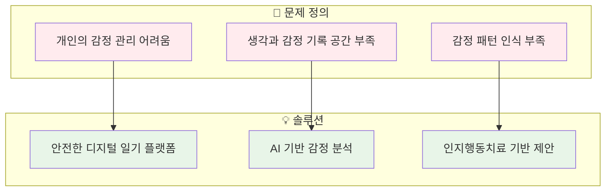
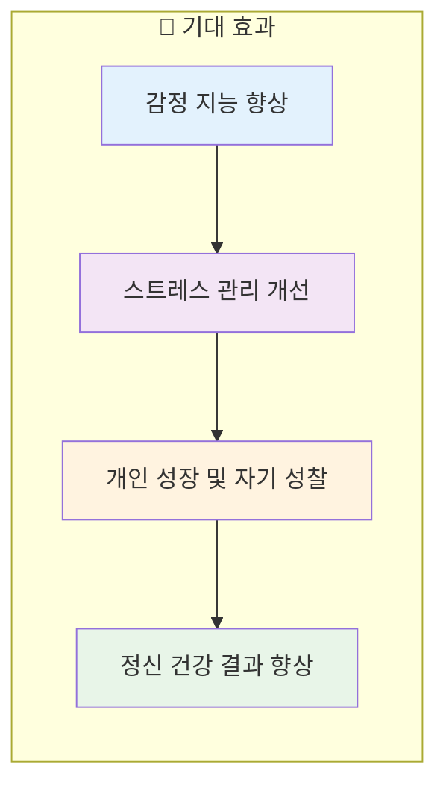
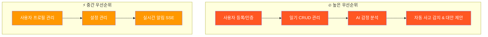
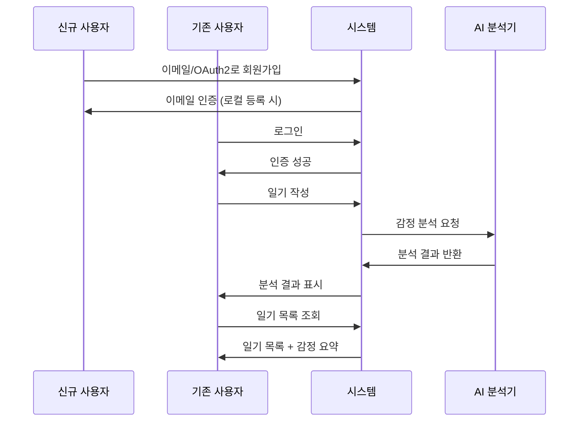
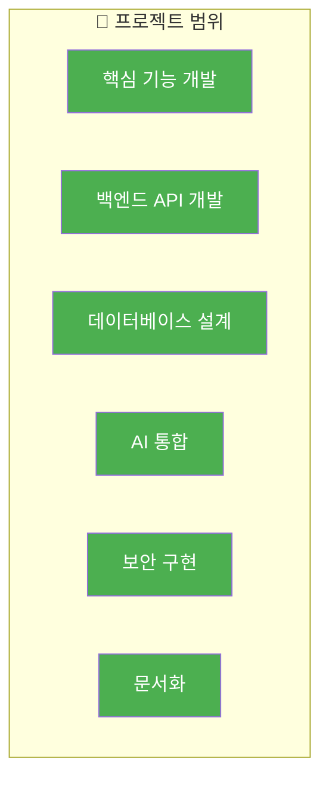
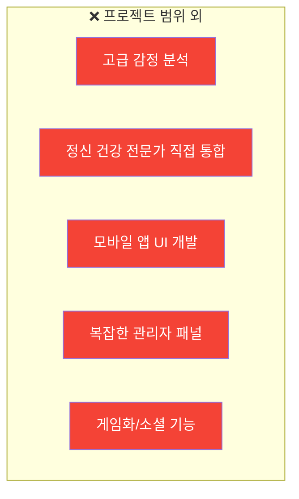

# 📋 1장: 프로젝트 개요

## 1.1. 📚 프로젝트 배경 및 목표

### 1.1.1. 문제 정의 및 솔루션

이 프로젝트는 개인이 자신의 생각, 감정, 일상 경험을 기록할 수 있는 전용적이고 안전한 공간의 필요성을 해결하는 것을 목표로 합니다. 오늘날의 빠른 속도의 세상에서 자신의 감정 상태를 이해하고 관리하는 것은 정신 건강에 매우 중요합니다. 많은 사람들이 자신의 감정을 효과적으로 추적하고 성찰할 수 있는 도구나 인식이 부족합니다.

이 애플리케이션인 "감정 기반 AI 일기 애플리케이션"은 안전한 디지털 일기 플랫폼을 제공함으로써 솔루션을 제공합니다. 단순한 메모 작성을 넘어서, AI 기반 감정 분석을 통합하여 사용자가 자신의 기록에 대한 더 깊은 통찰을 얻을 수 있도록 도와줍니다. AI는 감정 패턴을 식별하고, 잠재적으로 부정적인 사고 순환을 감지하며, 대안적인 관점을 제안함으로써 사용자가 자신의 감정적 풍경을 더 잘 이해할 수 있도록 도와줍니다.

### 1.1.2. 프로젝트 최종 목표 및 기대 효과

이 프로젝트의 궁극적인 목표는 사용자가 감정적 인식을 개선하고 전반적인 심리적 웰빙을 향상시키는 것입니다.

**기대 효과:**

- **💡 감정 지능 향상**: 사용자는 자신의 감정과 그 뒤에 있는 유발 요인에 대한 더 나은 이해를 개발합니다.
- **🧘 스트레스 관리 개선**: 패턴과 부정적인 생각을 식별함으로써 사용자는 스트레스를 더 효과적으로 관리하는 방법을 배울 수 있습니다.
- **🌱 개인 성장 및 자기 성찰**: 일기는 자기 성찰의 도구 역할을 하며, 시간이 지남에 따라 개인적인 통찰과 성장을 촉진합니다.
- **💚 정신 건강 결과 향상**: 전문적인 도움을 대체하는 것은 아니지만, 이 애플리케이션은 우려스러운 사고 패턴의 조기 식별과 긍정적인 정신 건강 습관 육성을 위한 가치 있는 도구가 될 수 있습니다.

## 1.2. ✨ 주요 기능 정의

### 1.2.1. 핵심 기능 목록 및 우선순위

**🔥 높은 우선순위 (필수 기능)**

| 기능                                     | 설명                  | 우선순위 |
| ---------------------------------------- | --------------------- | -------- |
| 🔐 **사용자 등록 및 인증**               | 로컬 및 OAuth2 통합   | 높음     |
| └ 이메일 인증을 통한 로컬 등록           | -                     | -        |
| └ OAuth2 통합 (Google, Kakao, Naver)     | -                     | -        |
| └ 안전한 API 액세스를 위한 JWT 기반 인증 | -                     | -        |
| 📝 **일기 항목 관리**                    | CRUD 작업             | 높음     |
| └ 일기 항목 생성, 읽기, 업데이트, 삭제   | -                     | -        |
| └ 항목의 제목 및 내용                    | -                     | -        |
| 🧠 **AI 기반 감정 분석**                 | 일기 항목의 감정 분석 | 높음     |
| └ 감정 감지를 위한 일기 내용 분석        | -                     | -        |
| 💡 **자동 사고 감지 & 대안 제안**        | 웰빙을 위한 부가 가치 | 높음     |
| └ 잠재적으로 부정적인 사고 패턴 식별     | -                     | -        |
| └ AI 기반 대안적 건설적 사고 제안        | -                     | -        |

**⚡ 중간 우선순위**

| 기능                      | 설명                           | 우선순위 |
| ------------------------- | ------------------------------ | -------- |
| 👤 **사용자 프로필 관리** | 프로필 정보 보기 및 업데이트   | 중간     |
| ⚙️ **설정 관리**          | 애플리케이션 설정 커스터마이징 | 중간     |
| 📡 **실시간 알림 (SSE)**  | 실시간 업데이트 및 알림        | 중간     |

### 1.2.2. 사용자 스토리 및 사용 사례

**사용자 시나리오:**

🆕 **신규 사용자:**

- 이메일과 비밀번호 또는 OAuth2 제공자(Google, Kakao, Naver)를 통해 등록할 수 있습니다.
- 로컬 등록 시 이메일 인증이 필요합니다.

👤 **기존 사용자:**

- 자격 증명 또는 OAuth2를 사용하여 로그인할 수 있습니다.

📝 **일기 작성:**

- 로그인 후 제목(선택사항)과 내용을 제공하여 새로운 일기 항목을 작성할 수 있습니다.
- 저장 후 AI가 항목을 처리합니다.

👀 **일기 보기:**

- 사용자는 과거 항목 목록을 볼 수 있으며, 감지된 감정의 요약을 확인할 수 있습니다.
- 항목을 선택하여 전체 내용과 관련 AI 분석을 볼 수 있습니다.

✏️ **일기 편집/삭제:**

- 사용자는 기존 항목의 내용이나 제목을 편집하거나 완전히 삭제할 수 있습니다.

👤 **프로필 관리:**

- 사용자는 프로필 페이지로 이동하여 닉네임, 프로필 사진을 업데이트하거나 비밀번호를 변경할 수 있습니다.

⚙️ **설정 커스터마이징:**

- 사용자는 설정 페이지에 액세스하여 알림 설정과 같은 선호사항을 조정할 수 있습니다.

## 1.3. 🎯 프로젝트 범위

### 1.3.1. 포함된 기능 (In-Scope)

✅ **포함된 기능:**

- 1.2.1절에 나열된 모든 핵심 기능
- Java Spring Boot를 사용한 백엔드 API 개발
- 사용자 데이터, 일기 항목, AI 분석 결과를 위한 데이터베이스 설계 및 구현 (MariaDB, MongoDB, Redis 사용)
- 감정 분석 및 사고 제안을 위한 Kafka를 통한 Python 기반 AI 워커 모듈과의 통합
- 안전한 JWT 기반 인증 및 권한 부여
- 사용자 로그인을 위한 OAuth2 통합
- SSE를 사용한 실시간 알림
- API 문서화 (Swagger)
- 구성 암호화

### 1.3.2. 제외된 기능 (Out-of-Scope)

❌ **제외된 기능:**

- **고급 감정 분석**: 핵심 감정 감지 및 사고 제안을 넘어선 기능 (예: 세밀한 감정 점수, 장기간에 걸친 트렌드 분석)
- **정신 건강 전문가와의 직접 통합**: 사용자를 치료사나 상담사와 연결하는 기능 없음
- **모바일 애플리케이션 UI 개발**: 이 문서는 백엔드와 핵심 애플리케이션 로직에 중점을 둠
- **복잡한 관리자 패널**: 커스텀 이메일 발송과 같은 관리자 수준 작업은 있지만, 전체 애플리케이션 관리를 위한 완전한 관리 인터페이스는 명시적으로 상세화되지 않음
- **게임화 또는 소셜 기능**: 소셜 공유, 커뮤니티 또는 게임화된 진행 추적 요소 없음

## 1.4. 🛠️ 기술 스택 및 개발 환경

### 1.4.1. 프론트엔드, 백엔드, 데이터베이스, AI/ML, 인프라, 모니터링

```mermaid
graph TB
    subgraph "🖥️ 백엔드"
        A[Java 21]
        B[Spring Boot 3.2.4]
        C[Spring Security]
        D[Spring Data JPA]
    end

    subgraph "🗄️ 데이터베이스"
        E[MariaDB]
        F[MongoDB]
        G[Redis]
    end

    subgraph "🤖 AI/ML"
        H[Python]
        I[Kafka]
        J[NLP 라이브러리]
    end

    subgraph "☁️ 인프라"
        K[Docker]
        L[Nginx]
    end

    subgraph "📊 모니터링"
        M[Prometheus]
        N[Grafana]
        O[ELK Stack]
    end

    A --> B
    B --> C
    C --> D

    E --> F
    F --> G

    H --> I
    I --> J

    K --> L

    M --> N
    N --> O

    style A fill:#ed8b00,color:#fff
    style B fill:#6db33f,color:#fff
    style E fill:#003545,color:#fff
    style F fill:#4DB33D,color:#fff
    style G fill:#DC382D,color:#fff
    style H fill:#3776ab,color:#fff
    style I fill:#ff6600,color:#fff
    style K fill:#2496ED,color:#fff
    style L fill:#009639,color:#fff
    style M fill:#E6522C,color:#fff
    style N fill:#F46800,color:#fff
```

### 🔧 상세 기술 스택

**백엔드:**

- **Java 21**: 최신 LTS 버전
- **Spring Boot 3.2.4**:
  - Spring Web
  - Spring Security
  - Spring Data JPA
  - Spring Boot OAuth2 Client
  - Spring Data Redis
  - Spring Data Elasticsearch
  - Spring Data MongoDB

**데이터베이스:**

- **MariaDB**: 관계형 데이터 (사용자 계정, 핵심 일기 항목)
- **MongoDB**: 문서 기반 데이터 (AI 분석 결과, 유연한 일기 내용)
- **Redis**: 캐싱, 세션 관리, 리프레시 토큰

**AI/ML:**

- **Python**: AI 워커 모듈용 (추정)
- **Kafka**: 백엔드와 AI 워커 모듈 간의 비동기 통신
- **NLP 라이브러리**: AI 워커 모듈의 문서/코드에서 상세화 예정

**인프라:**

- **Docker**: 컨테이너화 및 배포
- **Nginx**: 리버스 프록시, 로드 밸런서

**모니터링:**

- **Prometheus**: 메트릭 수집
- **Grafana**: 메트릭 시각화 및 대시보드
- **ELK Stack**: 로그 집계 및 분석 (Elasticsearch, Logstash, Kibana)

**프론트엔드:**

- 현재 백엔드 중심 분석에서는 상세화되지 않음
- 별도 구성 요소로 가정 (예: 웹 애플리케이션 또는 모바일 앱)

---

> 💡 **참고**: 이 프로젝트 개요는 전체 시스템의 청사진을 제공하며, 각 구성 요소의 상세한 구현은 후속 챕터에서 다룹니다.
