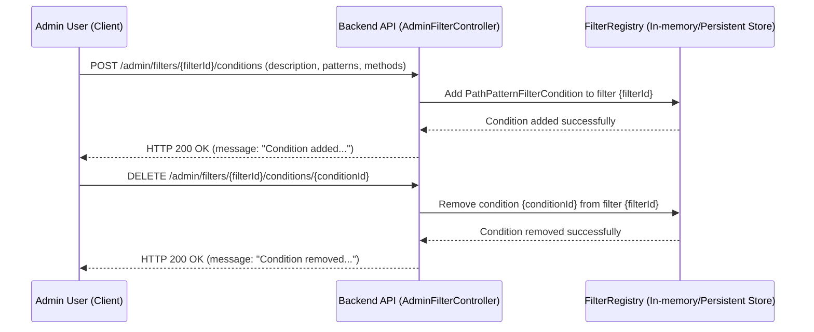
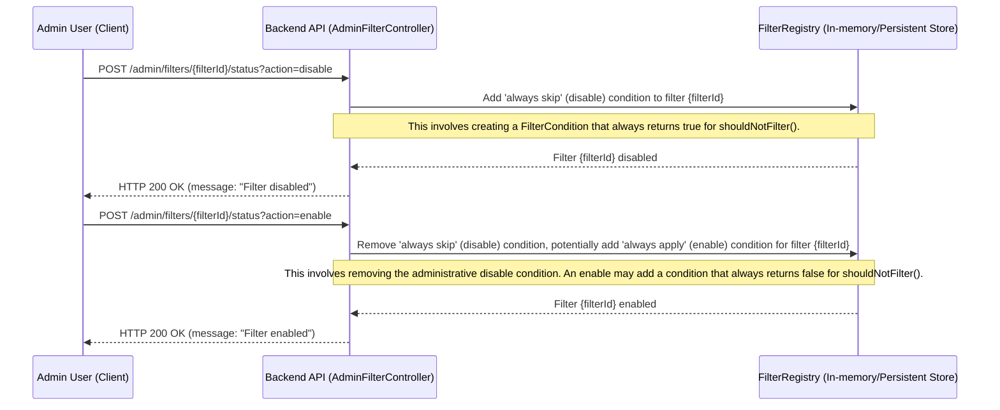
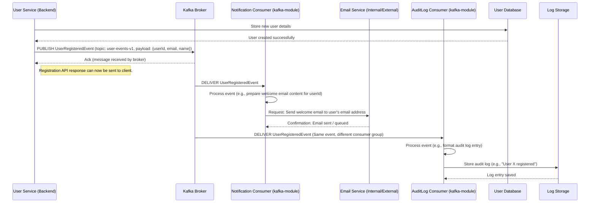

# 5장: 주요 운영 플로우 및 다이어그램

## 소개

이 문서는 Auth-Server 애플리케이션 내에서 사용자에게 노출되는 주요 플로우와 내부 시스템 플로우를 설명합니다. 이 다이어그램과 설명은 다양한 컴포넌트가 어떻게 상호작용하여 특정 기능(회원가입, 비동기 이벤트 처리 등)을 달성하는지 명확히 보여줍니다.

---

## 1. 사용자 회원가입 및 이메일 인증 플로우

이 플로우는 신규 사용자가 계정을 등록하고, 이메일을 인증한 뒤, 로그인하는 과정을 설명합니다.

**텍스트 설명:**

일반적인 순서는 다음과 같습니다.

1.  **이메일 제출 및 인증 코드 요청:**
    *   사용자가 이메일 주소를 입력합니다.
    *   클라이언트가 백엔드로 `POST /api/public/emailSend` 요청을 보냅니다.
    *   백엔드 API는 이메일 서비스에 인증 코드 생성을 요청합니다.
    *   이메일 서비스(또는 백엔드 내 컴포넌트)는 이 코드를 임시 저장소(예: 캐시, 임시 테이블)에 이메일과 함께 저장합니다.
    *   이메일 서비스가 인증 코드(또는 코드가 포함된 링크)를 사용자에게 이메일로 전송합니다.
    *   백엔드 API는 클라이언트에 인증 이메일이 전송되었음을 응답합니다.

2.  **이메일 코드 인증:**
    *   사용자가 이메일을 받아 인증 코드를 확인합니다.
    *   클라이언트가 이메일과 인증 코드를 백엔드로 `POST /api/public/emailCheck` 요청으로 보냅니다.
    *   백엔드 API는 저장된 코드와 제출된 코드를 비교하여 유효성을 검사합니다.
    *   코드가 유효하면, 백엔드는 이메일 인증 성공을 알립니다. 이 이메일은 회원가입 과정에서 "인증됨"으로 간주됩니다.

3.  **회원가입 폼 제출:**
    *   사용자가 회원가입 폼(아이디, 비밀번호, 이름, 닉네임, 전화번호, 생년월일, 성별, 프로필 이미지 URL 등)을 작성합니다(이메일은 이미 인증됨).
    *   클라이언트가 모든 정보를 담아 `POST /api/public/join` 요청을 보냅니다.
    *   백엔드 API는 제출된 데이터를 검증합니다(아이디/닉네임 중복, 비밀번호 정책 등).
    *   이메일 인증이 완료된 상태이므로, 사용자 DB에 "ACTIVE" 상태로 신규 사용자 레코드가 생성됩니다.
    *   백엔드 API는 회원가입 성공을 클라이언트에 응답합니다.

4.  **사용자 로그인:**
    *   사용자가 새로 등록한 아이디와 비밀번호로 로그인을 시도합니다.
    *   클라이언트가 `POST /api/auth/login` 요청을 보냅니다.
    *   백엔드 API는 사용자 DB에서 인증을 수행합니다.

5.  **JWT 발급:**
    *   인증에 성공하면, 백엔드 API는 다음과 같은 JWT를 생성합니다:
        *   **Access Token:** 짧은 유효기간, 보호된 API 접근에 사용
        *   **Refresh Token:** 더 긴 유효기간, Access Token 재발급에 사용
    *   백엔드 API는 Access Token을 클라이언트에 응답(본문 또는 `Authorization` 헤더)으로 보냅니다.
    *   Refresh Token은 보통 HttpOnly, Secure 쿠키로 전송되어 XSS 위험을 줄입니다.

**다이어그램 (MermaidJS 시퀀스 다이어그램):**

```mermaid
sequenceDiagram
    participant Client
    participant Backend API
    participant Email Service
    participant TempCode Store (e.g., Redis Cache)
    participant User Database

    Client->>Backend API: POST /api/public/emailSend (email)
    Backend API->>Email Service: Request verification code for email
    Email Service->>TempCode Store (e.g., Redis Cache): Store code against email
    Email Service-->>Backend API: Code generated & stored
    Email Service->>Client: Send verification email with code
    Backend API-->>Client: Email sent notification

    Client->>Backend API: POST /api/public/emailCheck (email, code)
    Backend API->>TempCode Store (e.g., Redis Cache): Verify code for email
    TempCode Store (e.g., Redis Cache)-->>Backend API: Code valid / invalid
    alt Code is Valid
        Backend API-->>Client: Email verification successful
    else Code is Invalid
        Backend API-->>Client: Email verification failed
        Note right of Client: User may retry emailSend or correct code
    end

    Client->>Backend API: POST /api/public/join (registration details including verified email)
    Backend API->>User Database: Validate details (uniqueness etc.)
    User Database-->>Backend API: Validation OK
    Backend API->>User Database: Create user record (status: ACTIVE)
    User Database-->>Backend API: User created successfully
    Backend API-->>Client: Registration successful

    Client->>Backend API: POST /api/auth/login (userId, password)
    Backend API->>User Database: Authenticate user credentials
    User Database-->>Backend API: Authentication success
    Backend API->>Backend API: Generate JWT (Access & Refresh Token)
    Backend API-->>Client: Return Access Token (e.g., in body/header)
    Backend API-->>Client: Set Refresh Token (HttpOnly, Secure cookie)
```

---

## 2. 관리자 필터 관리 플로우

이 플로우는 관리자가 `AdminFilterController` 엔드포인트를 사용해 시스템의 동적 필터를 관리하는 과정을 설명합니다. 이를 통해 런타임에 요청 처리 동작을 조정할 수 있습니다.

**컨텍스트:** `AdminFilterController`는 필터 목록 조회, 필터에 조건 추가/제거(필터가 특정 요청에 대해 동작할지 결정), 필터 전체 활성화/비활성화 등의 엔드포인트를 제공합니다.

### 2.1. 필터 조건 추가/제거

**텍스트 설명:**

*   **조건 추가:**
    1.  관리자가 특정 필터에 새 조건을 추가하길 요청합니다.
    2.  클라이언트가 `/admin/filters/{filterId}/conditions`로 조건 정보(예: URL 패턴, HTTP 메서드)를 담아 `POST` 요청을 보냅니다.
    3.  백엔드 API의 `AdminFilterController`가 요청을 받습니다.
    4.  `FilterRegistry`(또는 유사한 구성 저장소)와 상호작용하여 해당 필터에 새 조건을 추가합니다.
    5.  `FilterRegistry`가 추가 완료를 확인합니다.
    6.  백엔드 API가 관리자에게 성공 응답을 반환합니다.
*   **조건 제거:**
    1.  관리자가 필터에서 기존 조건을 제거하길 요청합니다.
    2.  클라이언트가 `/admin/filters/{filterId}/conditions/{conditionId}`로 `DELETE` 요청을 보냅니다.
    3.  `AdminFilterController`가 요청을 받습니다.
    4.  `FilterRegistry`에 해당 조건 제거를 지시합니다.
    5.  `FilterRegistry`가 제거 완료를 확인합니다.
    6.  백엔드 API가 관리자에게 성공 응답을 반환합니다.

**다이어그램 (MermaidJS 시퀀스 다이어그램):**



### 2.2. 필터 활성화/비활성화

**텍스트 설명:**

1.  관리자가 특정 필터를 활성화 또는 비활성화하길 요청합니다.
2.  클라이언트가 `/admin/filters/{filterId}/status?action=enable`(또는 `?action=disable`)로 `POST` 요청을 보냅니다.
3.  `AdminFilterController`가 요청을 받습니다.
4.  **비활성화**의 경우, 컨트롤러는 해당 필터에 대해 항상 `shouldNotFilter = true`(즉, 필터 로직이 항상 건너뛰어짐)를 반환하는 특수 `FilterCondition`을 `FilterRegistry`에 추가합니다. 기존의 관리용 활성/비활성 조건은 제거됩니다.
5.  **활성화**의 경우, 관리용 "비활성화" 조건을 제거합니다. 필터가 기본적으로 전역 적용되어야 한다면, 항상 `shouldNotFilter = false`를 반환하는 관리용 "활성화" 조건을 추가할 수 있습니다.
6.  `FilterRegistry`가 상태 변경을 확인합니다.
7.  백엔드 API가 성공 응답을 반환합니다.

**다이어그램 (MermaidJS 시퀀스 다이어그램):**



---

## 3. Kafka 이벤트 처리 플로우

**소개:** Auth-Server는 비동기 이벤트 처리를 위해 Apache Kafka를 사용합니다. 이를 통해 서비스 간 결합도를 낮추고, 복원력을 높이며, 알림 전송이나 분석 트리거와 같은 백그라운드 작업을 기본 요청-응답 사이클에 영향을 주지 않고 처리할 수 있습니다. `kafka-module`이 이 중심에 있으며, 이벤트에 반응하는 컨슈머를 포함합니다.

### 3.1. 예시 이벤트: 사용자 회원가입 알림

이 플로우는 사용자가 회원가입을 완료한 후, 환영 이메일이 비동기적으로 전송되는 과정을 보여줍니다.

**텍스트 설명:**

1.  **이벤트 발행:**
    *   사용자가 DB에 성공적으로 생성된 후(`UsersController` 또는 `UserService` 등에서), 서비스는 특정 Kafka 토픽(예: `user-events-topic`)에 `UserRegisteredEvent`(또는 유사 이벤트)를 발행합니다.
    *   이 이벤트에는 사용자 ID, 이메일, 이름 등 관련 정보가 포함됩니다.
    *   발행 서비스는 Kafka 브로커에 이벤트를 전송하고, 브로커로부터 수신 확인(acknowledgment)을 받습니다. 이로써 회원가입 플로우는 알림 전송을 기다리지 않고 완료될 수 있습니다.

2.  **이벤트 소비 및 처리:**
    *   `kafka-module` 내의 Kafka 컨슈머(예: `NotificationServiceConsumer`)가 `user-events-topic`을 구독합니다.
    *   Kafka 브로커가 이 컨슈머에 `UserRegisteredEvent` 메시지를 전달합니다.
    *   컨슈머는 이벤트를 처리합니다. 예를 들어:
        *   메시지 역직렬화
        *   필요한 데이터(이메일, 이름 등) 추출
        *   환영 이메일 내용 준비
    *   이후 컨슈머는 이메일 서비스(내부 또는 외부)와 상호작용하여 해당 사용자에게 환영 이메일을 전송합니다.

3.  **추가 작업(선택):**
    *   동일 토픽을 구독하는 다른 컨슈머는 다음과 같은 작업을 할 수 있습니다:
        *   감사 로그 기록
        *   분석 대시보드 업데이트
        *   신규 사용자 리소스 프로비저닝 등

**다이어그램 (MermaidJS 시퀀스 다이어그램):**



### 3.2. 기타 Kafka 이벤트 예시

*   **일기 분석 트리거:**
    *   새 일기 작성/수정 시, `DiaryEntryModifiedEvent`를 발행할 수 있습니다.
    *   `kafka-module`의 컨슈머가 이를 받아 AI 서비스(내부/외부)에 감정 분석 또는 대안적 사고 생성을 요청하고, 결과를 일기에 반영할 수 있습니다.
*   **사용자 설정 변경 알림:**
    *   중요한 사용자 설정 변경 시, 이벤트를 발행할 수 있습니다.
    *   컨슈머는 캐시 무효화, 관련 데이터 업데이트, 사용자 알림 전송 등을 수행할 수 있습니다.
*   **보안 이벤트:**
    *   반복된 로그인 실패, 비밀번호 변경 등 이벤트를 Kafka로 발행하여, 사기 탐지나 보안 알림 시스템이 이를 소비할 수 있습니다.

이러한 예시는 Kafka를 활용한 다양한 비동기 작업이 시스템의 유연성과 응답성을 높여줌을 보여줍니다.

---

필요한 부분만 따로 떼어내거나, 추가 설명이 필요하면 말씀해 주세요!
