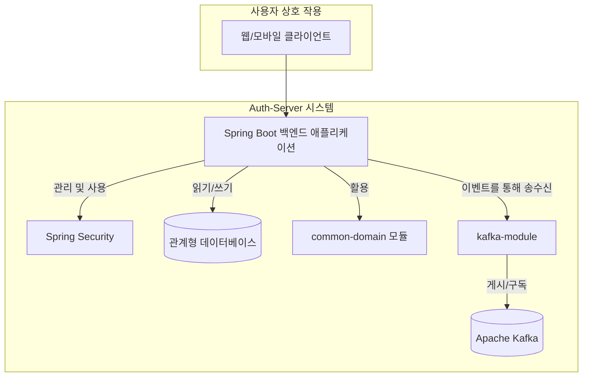

# 2장: 시스템 아키텍처

## 소개

이 문서는 Auth-Server 시스템 아키텍처에 대한 자세한 설명을 제공합니다. 주요 구성 요소, 상호 작용 방식, 그리고 Kafka를 통한 이벤트 기반 통신과 같은 특정 아키텍처 패턴을 설명합니다.

## 전체 아키텍처 설명

Auth-Server는 Spring Boot를 사용하여 구축된 모듈식 모놀리식 애플리케이션으로 설계되었습니다. 사용자 관리, 인증, 권한 부여 및 기타 관련 기능과 관련된 핵심 비즈니스 로직을 캡슐화합니다.

시스템의 주요 구성 요소는 다음과 같습니다.

*   **Spring Boot 백엔드 (`backend` 모듈):**
    *   REST 컨트롤러, 서비스 계층, 데이터 접근 계층(리포지토리)을 포함하는 애플리케이션의 핵심입니다.
    *   사용자 등록, 로그인, 일기 관리, 설정 등의 주요 비즈니스 로직을 구현합니다.
    *   모놀리식 애플리케이션으로 구성되어 있지만, 관심사 분리를 촉진하기 위해 모듈식 내부 설계를 갖추고 있습니다.

*   **Spring Security:**
    *   Spring Boot 백엔드에 통합된 Spring Security는 인증 및 권한 부여 처리에 중추적인 역할을 합니다.
    *   사용자 자격 증명, 토큰 생성(JWT), API 엔드포인트에 대한 접근 제어 규칙을 관리합니다.
    *   또한 타사 인증을 위한 OAuth2 통합을 용이하게 합니다.

*   **데이터베이스:**
    *   시스템은 데이터 지속성을 위해 관계형 데이터베이스를 사용합니다. (특정 유형, 예: PostgreSQL, MySQL은 구성 가능하며, 개발 및 테스트 환경에서는 H2가 자주 사용됩니다.)
    *   사용자 프로필, 자격 증명, 일기 항목, 애플리케이션 설정, 감사 로그를 포함한 모든 중요한 데이터를 저장합니다.

*   **캐시 (개념적):**
    *   현재 코드베이스 분석에서는 명시적으로 자세히 설명되어 있지 않지만, 성능 향상을 위해 캐싱 계층(예: Redis 또는 EhCache 사용)을 통합할 수 있습니다.
    *   그 목적은 사용자 세션, 구성 매개변수 또는 인기 있는 일기 항목과 같이 자주 접근하는 데이터를 캐시하여 데이터베이스 부하를 줄이고 응답 시간을 단축하는 것입니다. *(참고: 캐싱 구현 세부 정보는 미정이며 구현 시 문서화될 예정입니다).*

*   **`kafka-module`:**
    *   이 모듈은 Apache Kafka와의 통합을 담당합니다.
    *   메시지 생성 및 소비를 처리하여 애플리케이션의 여러 부분 간 또는 외부 시스템과의 비동기 처리 및 이벤트 기반 통신을 가능하게 합니다.
    *   알림 또는 로깅과 같은 작업에 대한 구성 요소의 결합도를 낮추고 복원력과 확장성을 향상시킵니다.

*   **`common-domain`:**
    *   이 모듈에는 공유 데이터 모델, 주로 데이터 전송 객체(DTO) 및 사용자 정의 예외 클래스가 포함됩니다.
    *   `backend` 모듈의 여러 계층 간 및 잠재적으로 `kafka-module`과의 데이터 교환을 위한 공통 어휘를 제공하여 코드 재사용성과 일관성을 촉진합니다.

**상위 수준 상호 작용:**

1.  클라이언트(예: 웹 또는 모바일 애플리케이션)는 REST API를 통해 **Spring Boot 백엔드**와 상호 작용합니다.
2.  **Spring Security**는 이러한 요청을 가로채 인증 및 권한 부여를 수행합니다.
3.  백엔드 서비스는 요청을 처리하고 데이터 저장 및 검색을 위해 **데이터베이스**와 상호 작용합니다.
4.  특정 작업(예: 사용자 등록, 중요한 업데이트)의 경우 백엔드 서비스는 **`kafka-module`**을 통해 Apache Kafka에 이벤트를 게시할 수 있습니다.
5.  **`kafka-module`**은 또한 Kafka에서 이벤트를 소비하여 백엔드 내에서 적절한 작업(예: 알림 전송, 다른 데이터 업데이트)을 트리거합니다.
6.  **`common-domain`** 모듈은 이러한 상호 작용 및 API 응답에 사용되는 데이터 구조(DTO)를 제공합니다.

## 구성 요소 다이어그램

다음은 시스템의 주요 구성 요소와 그 관계를 MermaidJS로 표현한 것입니다.

**다이어그램 설명:**

*   **클라이언트:** 시스템과 상호 작용하는 최종 사용자를 나타냅니다.
*   **Spring Boot 백엔드 애플리케이션:** 비즈니스 로직을 처리하는 핵심 애플리케이션입니다.
*   **Spring Security:** 보안 제어를 위해 백엔드에 내장되어 있습니다.
*   **관계형 데이터베이스:** 애플리케이션 데이터의 영구 저장소입니다.
*   **common-domain 모듈:** 공유 데이터 모델을 제공합니다.
*   **kafka-module:** Apache Kafka와의 상호 작용을 관리합니다.
*   **Apache Kafka:** 이벤트 기반 통신을 위한 메시지 브로커입니다.

## Kafka 메시징 흐름

Apache Kafka와의 통합은 이벤트 생산자와 소비자 간의 결합도를 낮추는 이벤트 기반 아키텍처를 가능하게 합니다.

**생산자:**

애플리케이션의 여러 부분이 Kafka 토픽에 메시지를 생산하는 역할을 할 수 있습니다. 예는 다음과 같습니다.

*   **사용자 서비스 (Spring Boot 백엔드 내):**
    *   **토픽:** `user-events-topic` (예시 이름)
    *   **이벤트:** 새 사용자가 성공적으로 등록하면 `USER_REGISTERED` 이벤트가 게시될 수 있습니다.
    *   **목적:** 환영 이메일 전송, 리소스 프로비저닝 또는 분석 업데이트와 같은 작업을 허용하여 시스템의 다른 부분이나 외부 서비스에 새 사용자 등록을 알립니다.
*   **일기 서비스 (Spring Boot 백엔드 내):**
    *   **토픽:** `diary-updates-topic` (예시 이름)
    *   **이벤트:** 사용자가 일기 항목을 생성, 업데이트 또는 삭제하면 `DIARY_ENTRY_MODIFIED` 이벤트가 게시될 수 있습니다.
    *   **목적:** (Kafka 소비자에 의해 트리거될 수 있는 SSE를 통해) 연결된 클라이언트에 대한 실시간 알림, 활동 로깅 또는 다른 시스템과의 데이터 동기화와 같은 기능을 활성화합니다.
*   **설정 서비스 (Spring Boot 백엔드 내):**
    *   **토픽:** `settings-changes-topic` (예시 이름)
    *   **이벤트:** 사용자가 중요한 설정을 변경하면 `USER_SETTINGS_UPDATED` 이벤트가 게시될 수 있습니다.
    *   **목적:** 감사 또는 시스템의 다른 부분에서 재구성 트리거.

**소비자:**

일반적으로 `kafka-module` 또는 전용 서비스 구성 요소 내에 있는 소비자는 Kafka 토픽을 수신하고 들어오는 메시지에 반응합니다.

*   **알림 서비스 (`kafka-module`의 일부 또는 별도 서비스일 수 있음):**
    *   **소비된 토픽:** `user-events-topic`
    *   **작업:** `USER_REGISTERED` 이벤트를 수신하면 이 서비스는 새 사용자에게 환영 이메일을 형식화하여 보낼 수 있습니다.
*   **실시간 이벤트 이미터 (`kafka-module` 및 SSE 컨트롤러를 활용할 수 있음):**
    *   **소비된 토픽:** `diary-updates-topic`
    *   **작업:** `DIARY_ENTRY_MODIFIED` 이벤트가 소비되면 이 구성 요소는 서버 발송 이벤트(SSE)를 통해 관련 연결된 사용자의 클라이언트에 알림을 푸시하여 실시간으로 보기를 업데이트할 수 있습니다.
*   **감사 로그 서비스 (`kafka-module`의 일부 또는 핵심 서비스일 수 있음):**
    *   **소비된 토픽:** `user-events-topic`, `settings-changes-topic`, `diary-updates-topic`
    *   **작업:** 사용자 활동 및 시스템 이벤트의 포괄적인 감사 추적을 만들기 위해 다양한 이벤트를 소비합니다. 이 로그는 별도의 데이터베이스 또는 로깅 시스템에 저장될 수 있습니다.

**일반적인 메시지 흐름 예시 (사용자 등록):**

1.  사용자가 API를 통해 등록 세부 정보를 제출합니다.
2.  Spring Boot 백엔드의 **사용자 서비스**는 등록을 처리하고 데이터를 확인한 후 새 사용자를 **데이터베이스**에 저장합니다.
3.  등록에 성공하면 **사용자 서비스**(또는 전용 이벤트 게시자)가 `USER_REGISTERED` 이벤트 메시지를 구성합니다.
4.  이 메시지는 **`kafka-module`**(생산자)에 의해 **Apache Kafka**의 `user-events-topic`에 게시됩니다.
5.  `kafka-module` 내의 **Kafka 소비자**(예: 이메일 알림 전용 소비자)가 `user-events-topic`을 구독합니다.
6.  소비자는 `USER_REGISTERED` 이벤트를 수신합니다.
7.  이벤트 데이터(예: 사용자 이메일 및 이름)를 기반으로 소비자는 **알림 서비스**를 트리거하여 사용자에게 환영 이메일을 보냅니다.
8.  다른 소비자(예: **감사 로그 서비스**)도 동일한 이벤트를 수신하고 감사 목적으로 기록할 수 있습니다.

이 비동기 흐름은 이메일 전송과 같이 잠재적으로 느린 작업으로 인해 사용자 등록 프로세스가 지연되지 않도록 보장하며 단일 이벤트에 의해 여러 독립적인 작업이 트리거될 수 있도록 합니다.
