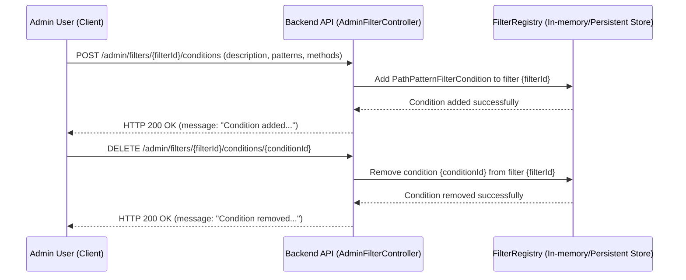
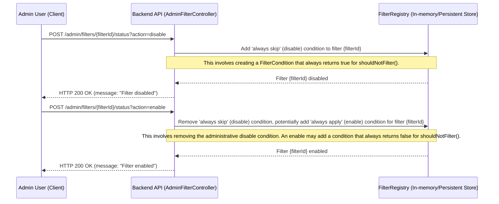
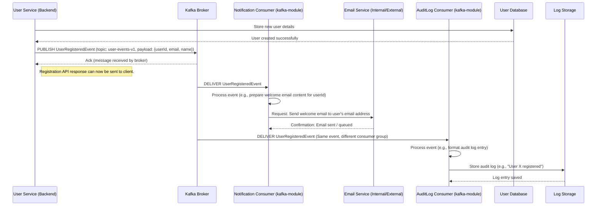

# Chapter 5: Key Operational Flows & Diagrams

## Introduction

This document illustrates important user-facing and internal system flows within the Auth-Server application. These diagrams and descriptions aim to clarify how different components interact to achieve specific functionalities, from user registration to asynchronous event processing.

---

## 1. User Registration and Email Verification Flow

This flow describes the process a new user undergoes to register an account, verify their email address, and subsequently log in.

**Textual Description:**

The typical sequence of events is as follows:

1.  **Email Submission & Verification Code Request:**
    *   The user provides their email address.
    *   Client sends a request to the backend (e.g., `POST /api/public/emailSend`) with the user's email.
    *   The Backend API triggers the Email Service to generate a verification code.
    *   The Email Service (or a component within the backend) stores this code temporarily (e.g., in cache or a temporary table) associated with the email.
    *   The Email Service sends an email containing the verification code (or a clickable link with the code) to the user.
    *   The Backend API responds to the Client, indicating that the verification email has been sent.

2.  **Email Code Verification:**
    *   The user receives the email and retrieves the verification code.
    *   Client sends the email and the verification code to the backend (e.g., `POST /api/public/emailCheck`).
    *   The Backend API validates the submitted code against the stored one for that email.
    *   If the code is valid, the backend confirms email verification. This email is now considered "verified" for the registration process.

3.  **User Registration Form Submission:**
    *   The user fills out the complete registration form (User ID, password, name, nickname, phone, birth date, gender, profile image URL, etc.) including their now-verified email.
    *   Client sends a request to the backend (e.g., `POST /api/public/join`) with all registration details.
    *   The Backend API validates the submitted data (e.g., checks for ID/nickname uniqueness, password policies).
    *   A new user record is created in the User Database with an "ACTIVE" status since email verification was completed prior to this step.
    *   The Backend API responds to the Client, confirming successful registration.

4.  **User Login:**
    *   The user attempts to log in using their newly registered credentials (User ID and password).
    *   Client sends a request to the backend (e.g., `POST /api/auth/login`).
    *   The Backend API authenticates the user against the User Database.

5.  **JWT Issuance:**
    *   Upon successful authentication, the Backend API generates a set of JSON Web Tokens (JWTs):
        *   **Access Token:** Short-lived, used to authorize access to protected API resources.
        *   **Refresh Token:** Longer-lived, used to obtain new Access Tokens without requiring the user to re-enter credentials.
    *   The Backend API sends the Access Token to the Client (typically in the response body or an `Authorization` header).
    *   The Refresh Token is typically sent as an HttpOnly, Secure cookie to mitigate XSS risks.

**Diagram (MermaidJS Sequence Diagram):**

```mermaid
sequenceDiagram
    participant Client
    participant Backend API
    participant Email Service
    participant TempCode Store (e.g., Redis Cache)
    participant User Database

    Client->>Backend API: POST /api/public/emailSend (email)
    Backend API->>Email Service: Request verification code for email
    Email Service->>TempCode Store (e.g., Redis Cache): Store code against email
    Email Service-->>Backend API: Code generated & stored
    Email Service->>Client: Send verification email with code
    Backend API-->>Client: Email sent notification

    Client->>Backend API: POST /api/public/emailCheck (email, code)
    Backend API->>TempCode Store (e.g., Redis Cache): Verify code for email
    TempCode Store (e.g., Redis Cache)-->>Backend API: Code valid / invalid
    alt Code is Valid
        Backend API-->>Client: Email verification successful
    else Code is Invalid
        Backend API-->>Client: Email verification failed
        Note right of Client: User may retry emailSend or correct code
    end

    Client->>Backend API: POST /api/public/join (registration details including verified email)
    Backend API->>User Database: Validate details (uniqueness etc.)
    User Database-->>Backend API: Validation OK
    Backend API->>User Database: Create user record (status: ACTIVE)
    User Database-->>Backend API: User created successfully
    Backend API-->>Client: Registration successful

    Client->>Backend API: POST /api/auth/login (userId, password)
    Backend API->>User Database: Authenticate user credentials
    User Database-->>Backend API: Authentication success
    Backend API->>Backend API: Generate JWT (Access & Refresh Token)
    Backend API-->>Client: Return Access Token (e.g., in body/header)
    Backend API-->>Client: Set Refresh Token (HttpOnly, Secure cookie)
```

---

## 2. Admin Filter Management Flows

These flows describe how an administrator manages dynamic filters in the system using the `AdminFilterController` endpoints. This allows for runtime adjustments to request processing behavior.

**Context:** The `AdminFilterController` provides endpoints for listing filters, adding or removing conditions to filters (which determine if a filter should execute for a given request), and enabling/disabling filters entirely.

### 2.1. Add/Remove Filter Conditions

**Textual Description:**

*   **Adding a Condition:**
    1.  The Admin User, through a client interface, requests to add a new condition to a specific filter.
    2.  The Client sends a `POST` request to `/admin/filters/{filterId}/conditions` with the condition details (e.g., URL patterns, HTTP methods).
    3.  The `AdminFilterController` in the Backend API receives the request.
    4.  It interacts with the `FilterRegistry` (or a similar configuration store) to add the new condition to the specified filter's configuration.
    5.  The `FilterRegistry` confirms the addition.
    6.  The Backend API returns a success response to the Admin User.
*   **Removing a Condition:**
    1.  The Admin User requests to remove an existing condition from a filter.
    2.  The Client sends a `DELETE` request to `/admin/filters/{filterId}/conditions/{conditionId}`.
    3.  The `AdminFilterController` receives this request.
    4.  It instructs the `FilterRegistry` to remove the specified condition from the filter.
    5.  The `FilterRegistry` confirms the removal.
    6.  The Backend API returns a success response.

**Diagram (MermaidJS Sequence Diagram):**



### 2.2. Enable/Disable Filter

**Textual Description:**

1.  The Admin User requests to enable or disable a specific filter.
2.  The Client sends a `POST` request to `/admin/filters/{filterId}/status?action=enable` (or `?action=disable`).
3.  The `AdminFilterController` receives the request.
4.  To **disable** a filter, the controller typically adds a special `FilterCondition` to the `FilterRegistry` for that filter which always evaluates to `shouldNotFilter = true` (meaning the filter logic will always be skipped). Any pre-existing administrative enable/disable conditions are removed.
5.  To **enable** a filter, the controller removes any administrative "disable" condition. If the filter should apply globally by default (unless other specific conditions cause it to be skipped), an administrative "enable" condition might be added that always evaluates to `shouldNotFilter = false`.
6.  The `FilterRegistry` confirms the state change.
7.  The Backend API returns a success response.

**Diagram (MermaidJS Sequence Diagram):**



---

## 3. Kafka Event Processing Flows

**Introduction:** The Auth-Server utilizes Apache Kafka for asynchronous event processing. This decouples services, improves resilience, and allows for background tasks like sending notifications or triggering analyses without impacting the primary request-response cycle. The `kafka-module` is central to this, containing consumers that react to these events.

### 3.1. Example Event: User Registration Notification

This flow illustrates how a notification (e.g., a welcome email) is sent asynchronously after a user registers.

**Textual Description:**

1.  **Event Publication:**
    *   After a user is successfully created in the User Database (e.g., by the `UsersController` or `UserService`), the service publishes a `UserRegisteredEvent` (or similar) to a specific Kafka topic (e.g., `user-events-topic`).
    *   This event typically contains relevant user information like user ID, email, and name.
    *   The publishing service sends the event to the Kafka Broker and receives an acknowledgment. The primary registration flow can then complete without waiting for the notification to be sent.

2.  **Event Consumption and Processing:**
    *   A Kafka consumer within the `kafka-module` (e.g., a `NotificationServiceConsumer`) is subscribed to the `user-events-topic`.
    *   The Kafka Broker delivers the `UserRegisteredEvent` message to this consumer.
    *   The consumer processes the event. This might involve:
        *   Deserializing the message.
        *   Extracting necessary data (user's email, name).
        *   Preparing the content for a welcome email.
    *   The consumer then interacts with an Email Service (which could be an internal component or an external service) to send the welcome email to the user.

3.  **Further Actions (Optional):**
    *   Other consumers subscribed to the same `user-events-topic` could perform different actions, such as:
        *   Logging the registration event for audit purposes.
        *   Updating analytics dashboards.
        *   Provisioning initial resources for the new user.

**Diagram (MermaidJS Sequence Diagram):**



### 3.2. Other Potential Kafka Events:

*   **Diary Entry Analysis Trigger:**
    *   When a new diary entry is created or updated, a `DiaryEntryModifiedEvent` could be published.
    *   A consumer in `kafka-module` could pick this up and trigger an AI service (internal or external) to perform sentiment analysis or generate alternative thoughts, then update the diary entry with the results.
*   **User Setting Change Notification:**
    *   If a critical user setting is changed, an event could be published.
    *   Consumers could react by invalidating caches, updating other related user data, or sending a notification to the user about the change.
*   **Security Events:**
    *   Events like repeated failed login attempts or password changes could be published to Kafka for consumption by fraud detection or security alerting systems.

These examples demonstrate the flexibility of using Kafka for various asynchronous tasks, enhancing the system's capabilities and responsiveness.
---
