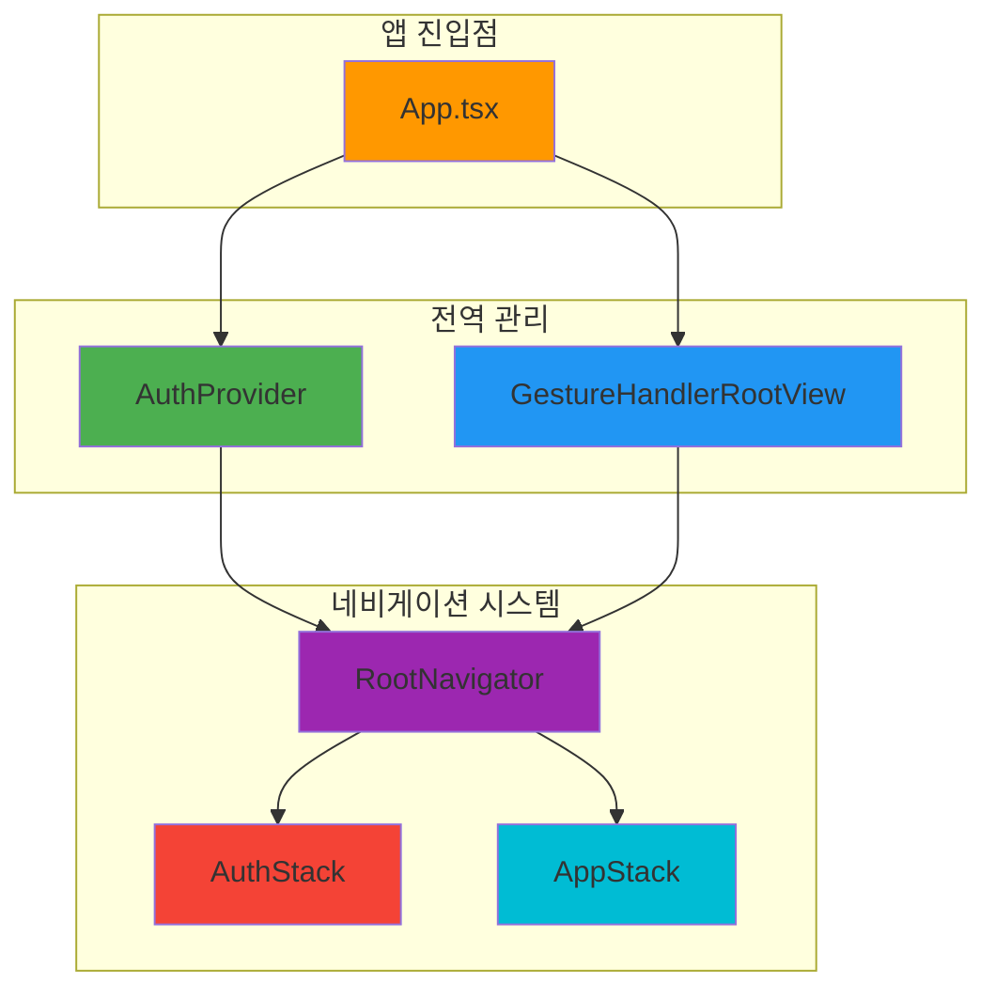
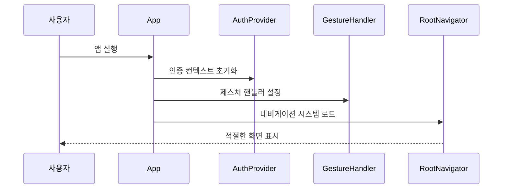
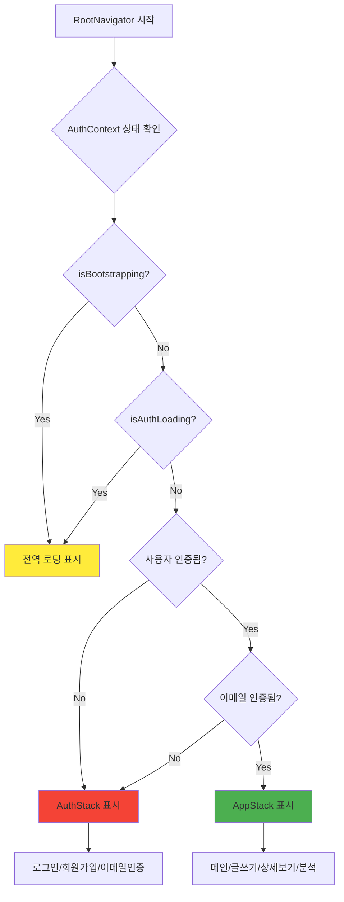
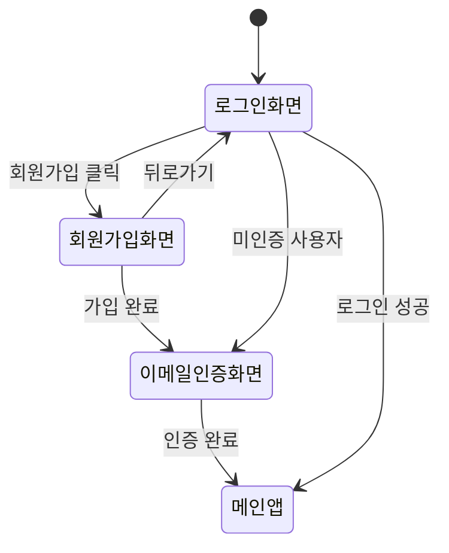
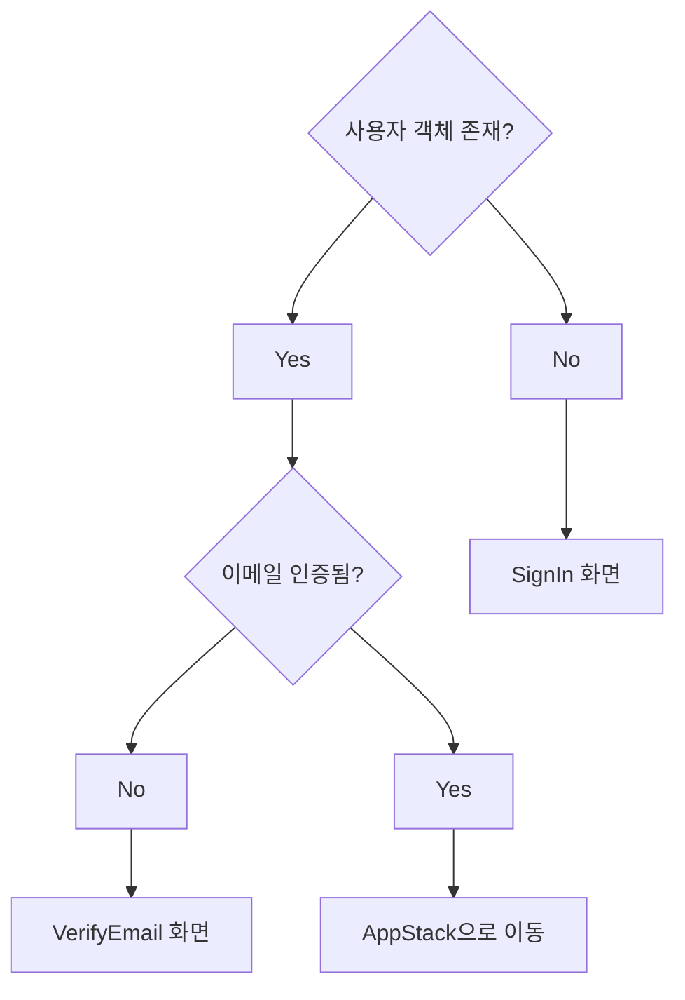
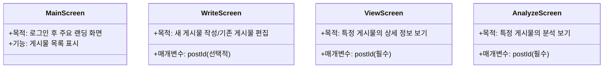
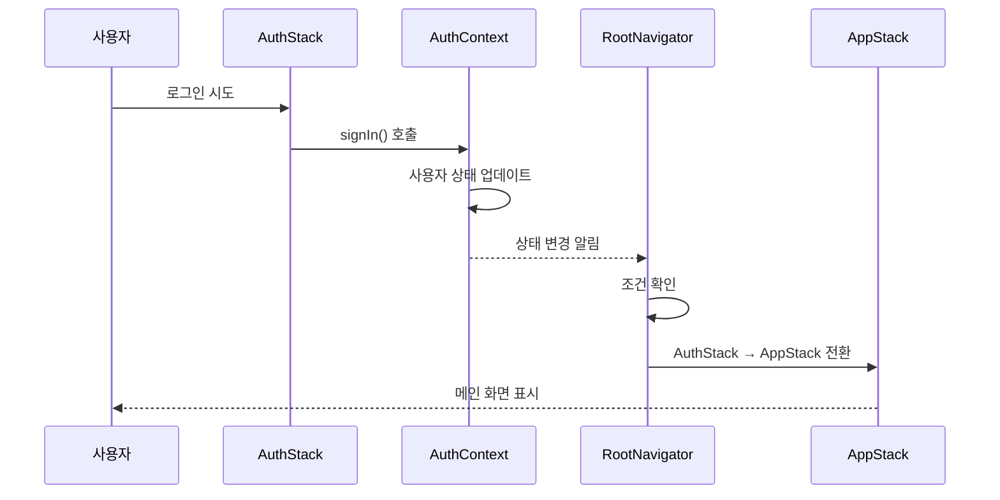
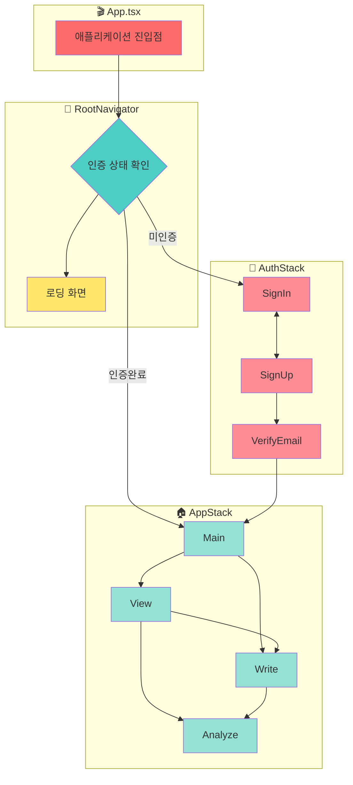

# 🚀 애플리케이션 플로우 및 네비게이션

이 문서는 네비게이션, 인증, 다양한 화면 스택의 구조에 초점을 맞춘 전체 애플리케이션 플로우를 설명합니다.



---

## 🎬 1. 진입점: `App.tsx`



애플리케이션의 진입점은 `App.tsx`입니다. 주요 역할은 다음과 같습니다:

### 🔧 주요 책임

- **`AuthProvider`로 애플리케이션 래핑**: 이 컴포넌트는 `src/context/AuthContext.tsx`에서 제공되며, 사용자 인증 상태(사용자 객체, 로딩 상태, 로그인/로그아웃 함수 등)를 관리하고 컨텍스트를 통해 애플리케이션 내 모든 컴포넌트에서 사용할 수 있도록 합니다.

- **`GestureHandlerRootView` 설정**: 애플리케이션 전체에서 제스처를 처리하는 데 필요하며, 일반적으로 네비게이션 라이브러리에서 사용됩니다.

- **`RootNavigator` 렌더링**: 이 컴포넌트는 최상위 네비게이션 로직 관리를 담당합니다.

```typescript
// App.tsx
import React from 'react';
import { GestureHandlerRootView } from 'react-native-gesture-handler';
import { AuthProvider } from './src/context/AuthContext';
import RootNavigator from './src/navigation/RootNavigator';

export default function App() {
  return (
    <GestureHandlerRootView style={{ flex: 1 }}>
      <AuthProvider>
        <RootNavigator />
      </AuthProvider>
    </GestureHandlerRootView>
  );
}
```

---

## 🧭 2. 루트 네비게이터: `RootNavigator.tsx`



`RootNavigator.tsx`는 네비게이션의 중앙 허브 역할을 합니다. 사용자에게 표시할 화면 세트(또는 네비게이션 스택)를 결정합니다.

### 🔄 로딩 상태 관리

- **부트스트래핑 확인**: `AuthContext`에서 `isBootstrapping`과 `isAuthLoading`을 확인합니다. 둘 중 하나라도 true이면(앱이 시작 중이거나 인증 프로세스가 진행 중일 때) 전역 `ActivityIndicator`를 표시합니다.

### 📱 스택 선택 로직

- **NavigationContainer 사용**: 네비게이션을 활성화합니다.
- **조건부 스택 렌더링**: 
  ```mermaid
  graph LR
      A{사용자 상태} --> B[미인증/이메일미확인]
      A --> C[인증완료]
      B --> D[AuthStack]
      C --> E[AppStack]
  ```

> **📝 참고**: 제공된 코드에서는 스택 전환 로직이 주석 처리되어 있고(`{/* {!user || !user.emailVerified ? <AuthStack /> : <AppStack />} */}`) 기본적으로 `<AppStack />`을 표시합니다. 이 문서에서는 의도된 로직이 이러한 스택 간 전환이라고 가정합니다.

```typescript
// src/navigation/RootNavigator.tsx
import React, { useContext } from 'react';
import { NavigationContainer } from '@react-navigation/native';
import { ActivityIndicator, View } from 'react-native';
import { AuthContext } from '../context/AuthContext';
import AuthStack from './AuthStack';
import AppStack from './AppStack';

export default function RootNavigator() {
  const { user, isBootstrapping, isAuthLoading } = useContext(AuthContext);

  if (isBootstrapping || isAuthLoading) {
    return (
      <View style={{ flex: 1, justifyContent: 'center', alignItems: 'center' }}>
        <ActivityIndicator size="large" />
      </View>
    );
  }

  return (
    <NavigationContainer>
      {!user || !user.emailVerified ? <AuthStack /> : <AppStack />}
    </NavigationContainer>
  );
}
```

---

## 🔐 3. 인증 플로우: `AuthStack.tsx`



`AuthStack.tsx`는 사용자 인증과 관련된 화면들을 관리합니다. `@react-navigation/native-stack`의 `createNativeStackNavigator`를 사용합니다. 이 스택의 모든 화면은 `headerShown: false`로 설정되어 있습니다.

### 📱 화면 구성

- **`SignInScreen` (컴포넌트: `LoginScreen`)**
  - 목적: 기존 사용자가 로그인할 수 있도록 합니다.

- **`SignUpScreen` (컴포넌트: `SignupScreen`)**
  - 목적: 새로운 사용자가 계정을 만들 수 있도록 합니다.

- **`VerifyEmailScreen` (컴포넌트: `EmailVerificationScreen`)**
  - 목적: 가입 후 또는 이메일이 아직 인증되지 않은 경우 사용자에게 이메일 주소 인증을 요청합니다.
  - 옵션: '이메일 인증' 제목을 가집니다.

### 🎯 초기 라우트 결정

`AuthStack`의 `initialRouteName`은 동적으로 결정됩니다:



```typescript
// src/navigation/AuthStack.tsx
export type AuthStackParamList = {
  SignIn: undefined;
  SignUp: undefined;
  VerifyEmail: undefined;
};

const Stack = createNativeStackNavigator<AuthStackParamList>();

export default function AuthStack() {
  const { user } = useContext(AuthContext);
  const initialRouteName: keyof AuthStackParamList =
    user && !user.emailVerified ? 'VerifyEmail' : 'SignIn';

  return (
    <Stack.Navigator
      initialRouteName={initialRouteName}
      screenOptions={{ headerShown: false }}
    >
      <Stack.Screen name="SignIn" component={LoginScreen} />
      <Stack.Screen name="SignUp" component={SignupScreen} />
      <Stack.Screen 
        name="VerifyEmail" 
        component={EmailVerificationScreen}
        options={{ title: '이메일 인증' }}
      />
    </Stack.Navigator>
  );
}
```

---

## 🏠 4. 메인 애플리케이션 플로우: `AppStack.tsx`

```mermaid
graph TB
    subgraph "AppStack 화면들"
        A[MainScreen]
        B[WriteScreen]
        C[ViewScreen]
        D[AnalyzeScreen]
    end
    
    A --> B: 새 글 작성
    A --> C: 글 상세보기
    C --> B: 글 편집
    C --> D: AI 분석 보기
    B --> D: 작성 후 분석
    
    style A fill:#4caf50
    style B fill:#ff9800
    style C fill:#2196f3
    style D fill:#9c27b0
```

`AppStack.tsx`는 사용자가 성공적으로 인증되고 이메일이 확인된 후 접근할 수 있는 애플리케이션의 메인 부분에 대한 네비게이션을 정의합니다. 마찬가지로 `createNativeStackNavigator`를 사용하며, 모든 화면에서 `headerShown: false`로 설정되어 있습니다.

### 📱 화면 구성



### 📋 타입 정의

```typescript
export type AppStackParamList = {
  Main: undefined;
  Write: { postId: string } | undefined;
  Analyze: { postId: string };
  View: { postId: string };
};
```

### 🔗 화면 간 네비게이션 패턴

| 출발 화면 | 목표 화면 | 트리거 | 매개변수 |
|-----------|-----------|--------|----------|
| Main | Write | FAB 버튼 클릭 | 없음 (새 글) |
| Main | View | 게시물 클릭 | postId |
| View | Write | 편집 버튼 | postId (편집) |
| View | Analyze | 분석 버튼 | postId |
| Write | Analyze | 작성 완료 후 | newPostId |

```typescript
// src/navigation/AppStack.tsx
const Stack = createNativeStackNavigator<AppStackParamList>();

export default function AppStack() {
  return (
    <Stack.Navigator screenOptions={{ headerShown: false }}>
      <Stack.Screen name="Main" component={MainScreen} />
      <Stack.Screen name="Write" component={WriteScreen} />
      <Stack.Screen name="View" component={ViewScreen} />
      <Stack.Screen name="Analyze" component={AnalyzeScreen} />
    </Stack.Navigator>
  );
}
```

---

## 🔄 5. 인증과 메인 애플리케이션 간 전환



`AuthStack`과 `AppStack` 간의 전환은 `RootNavigator`에 의해 관리됩니다.

### ➡️ AuthStack에서 AppStack으로

1. **로그인 프로세스**
   ```mermaid
   flowchart LR
       A[로그인/가입] --> B[이메일 인증]
       B --> C[AuthContext 업데이트]
       C --> D[RootNavigator 감지]
       D --> E[AppStack 마운트]
   ```

2. **단계별 설명**:
   - 사용자가 성공적으로 로그인(`SignInScreen`) 또는 가입(`SignUpScreen`)합니다.
   - 이메일 인증이 필요한 경우 `VerifyEmailScreen`으로 이동합니다.
   - 성공적인 로그인 및 이메일 인증 시 `AuthContext`가 `user` 상태를 업데이트합니다(`user.emailVerified`를 `true`로).
   - `RootNavigator`가 `AuthContext`의 변경을 감지합니다.
   - 조건 `!user || !user.emailVerified`가 `false`가 됩니다.
   - `RootNavigator`가 `AuthStack`을 언마운트하고 `AppStack`을 마운트합니다.

### ⬅️ AppStack에서 AuthStack으로

1. **로그아웃 프로세스**
   ```mermaid
   flowchart LR
       A[로그아웃 요청] --> B[AuthContext 상태 클리어]
       B --> C[RootNavigator 감지]
       C --> D[AuthStack 마운트]
   ```

2. **단계별 설명**:
   - 사용자가 `AppStack` 내에서 로그아웃합니다.
   - `AuthContext`에서 관리하는 로그아웃 액션이 `user` 상태를 지웁니다(`null` 또는 `undefined`로 설정).
   - `RootNavigator`가 이 변경을 감지합니다.
   - 조건 `!user || !user.emailVerified`가 `true`가 됩니다.
   - `RootNavigator`가 `AppStack`을 언마운트하고 `AuthStack`을 마운트합니다(일반적으로 `SignInScreen`으로 이동).

---

## 📊 전체 네비게이션 구조 요약



이 플로우는 사용자가 적절한 인증 및 확인 후에만 메인 애플리케이션 콘텐츠에 액세스할 수 있도록 하고, 세션이 유효하지 않거나 로그아웃할 때 인증 화면으로 리디렉션되도록 보장합니다.

> **📝 참고**: 앞서 언급했듯이 `RootNavigator.tsx`의 직접적인 전환은 현재 주석 처리되어 있어 기본적으로 `AppStack`을 사용합니다. 위의 설명은 두 스택의 존재와 `AuthContext`를 기반으로 한 일반적인 의도된 동작을 설명합니다.
