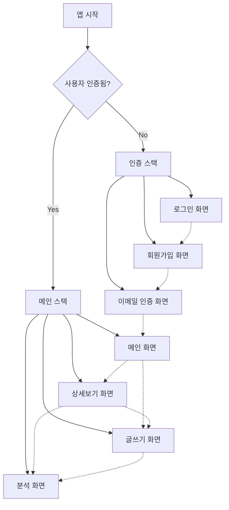
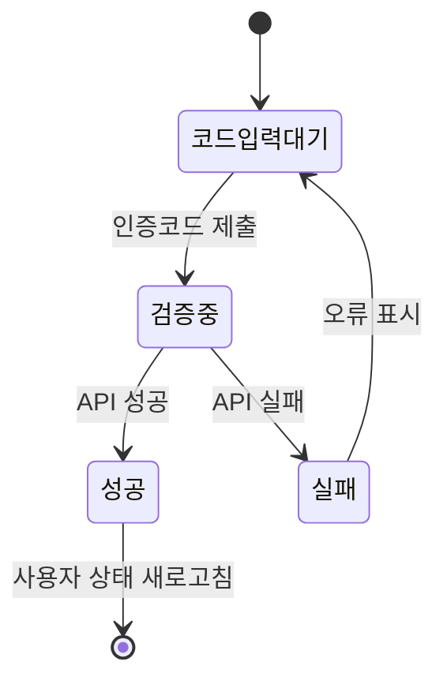
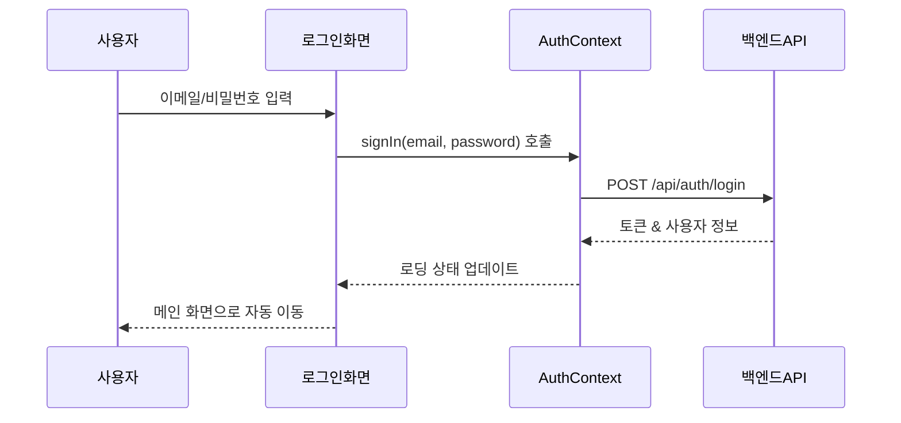
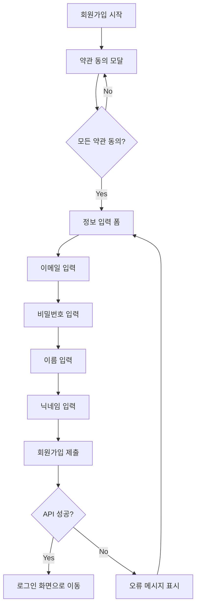
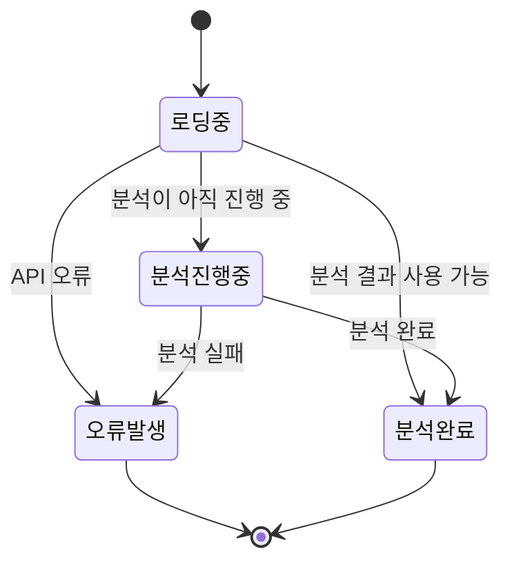
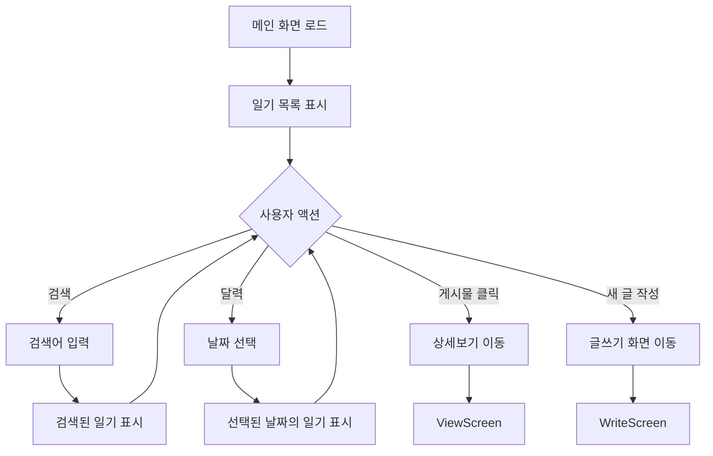
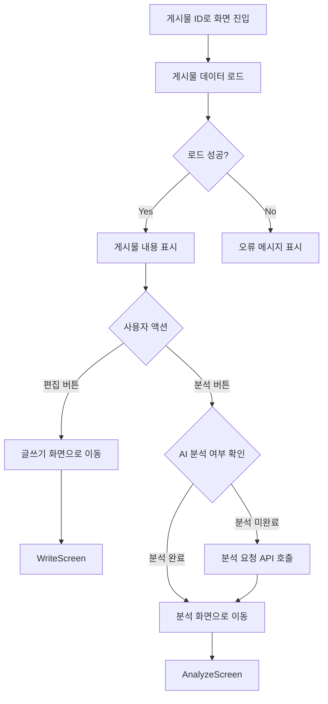
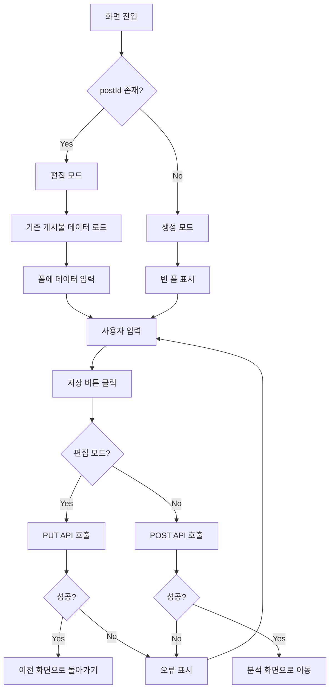
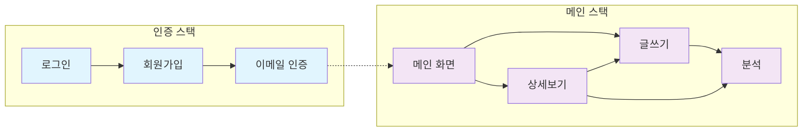

# 📱 화면 컴포넌트 문서

이 문서는 애플리케이션에서 화면으로 사용되는 React 컴포넌트들에 대한 상세 정보를 제공합니다.

---

## 🔐 인증 관련 화면

### 1. 📧 `EmailVerificationScreen.tsx` - 이메일 인증 화면

**📋 컴포넌트 정보**
- **컴포넌트명**: `EmailVerificationScreen`
- **목적**: 사용자가 이메일로 받은 인증 코드를 입력하여 이메일 주소를 확인할 수 있도록 합니다.

**⚙️ Props**
- `navigation`: `NativeStackScreenProps<AuthStackParamList, 'VerifyEmail'>`
  - `AuthStack` 내 다른 화면으로 이동하는데 사용됩니다.

**🔄 로컬 상태**
- `code` (문자열, 초기값: `''`)
  - 사용자가 입력한 인증 코드를 저장합니다.
  - `setCode`로 업데이트됩니다.
- `loading` (불린, 초기값: `false`)
  - 인증 API 호출이 진행 중인지를 나타냅니다.
  - `setLoading`으로 업데이트됩니다.

**🧭 네비게이션**
- 직접적인 네비게이션은 하지 않고, `AuthContext`의 `refreshUser`에 의존하여 인증 상태 변경을 트리거합니다.
- `RootNavigator`가 이를 처리합니다.

**🔗 컨텍스트 사용**
- `AuthContext`:
  - `refreshUser()`: 코드 인증 성공 후 호출되어 사용자의 인증 상태(`emailVerified` 포함)를 업데이트합니다.
  - `fetchWithAuth()`: `/api/auth/verify-email` 엔드포인트로 API 호출을 수행합니다.

---

### 2. 🔑 `SignInScreen.tsx` - 로그인 화면

**📋 컴포넌트 정보**
- **컴포넌트명**: `SignInScreen`
- **목적**: 사용자가 이메일과 비밀번호를 사용하여 애플리케이션에 로그인할 수 있도록 합니다.

**⚙️ Props**
- `navigation`: `NativeStackScreenProps<AuthStackParamList, 'SignIn'>`
  - `SignUpScreen`으로 이동하는데 사용됩니다.

**🔄 로컬 상태**
- `email` (문자열, 초기값: `''`)
  - 사용자가 입력한 이메일을 저장합니다.
  - `setEmail`로 업데이트됩니다.
- `password` (문자열, 초기값: `''`)
  - 사용자가 입력한 비밀번호를 저장합니다.
  - `setPassword`로 업데이트됩니다.

**🧭 네비게이션**
- `navigation.navigate('SignUp')`: "회원가입" 버튼을 눌렀을 때 `SignUpScreen`으로 이동합니다.

**🔗 컨텍스트 사용**
- `AuthContext`:
  - `signIn(email, password)`: 로그인 작업을 수행합니다. API 호출과 토큰의 안전한 저장을 처리합니다.
  - `isAuthLoading` (불린): 인증이 진행 중일 때 로그인 버튼에 `ActivityIndicator`를 표시하는데 사용됩니다.

---

### 3. ✍️ `SignupScreen.tsx` - 회원가입 화면

**📋 컴포넌트 정보**
- **컴포넌트명**: `SignupScreen`
- **목적**: 새로운 사용자가 이메일, 비밀번호, 이름, 닉네임을 제공하고 약관에 동의하여 계정을 등록할 수 있도록 합니다.

**⚙️ Props**
- `navigation`: `NativeStackScreenProps<AuthStackParamList, 'SignUp'>`
  - 성공적인 등록 후 `SignInScreen`으로 돌아가는데 사용됩니다.

**🔄 로컬 상태**
- `email` (문자열, 초기값: `''`): 사용자의 이메일을 저장합니다.
- `password` (문자열, 초기값: `''`): 사용자의 비밀번호를 저장합니다.
- `userName` (문자열, 초기값: `''`): 사용자의 실명을 저장합니다.
- `nickname` (문자열, 초기값: `''`): 사용자의 닉네임을 저장합니다.
- `modalVisible` (불린, 초기값: `true`): 약관 동의 모달의 표시 여부를 제어합니다.
- `agreePersonal` (불린, 초기값: `false`): 개인정보 정책 동의 여부를 추적합니다.
- `agreeTerms` (불린, 초기값: `false`): 서비스 약관 동의 여부를 추적합니다.

**🧭 네비게이션**
- `navigation.replace('SignIn')`: 성공적인 회원가입 후 현재 화면을 스택에서 교체하여 `SignInScreen`으로 이동합니다.

**🔗 컨텍스트 사용**
- 직접적인 컨텍스트 사용 없음. `/api/public/join`으로 공개 API 호출을 수행합니다.

---

## 🏠 메인 애플리케이션 화면

### 4. 🔍 `AnalyzeScreen.tsx` - AI 분석 화면

**📋 컴포넌트 정보**
- **컴포넌트명**: `AnalyzeScreen`
- **목적**: 사용자의 일기 항목에 대한 AI 생성 분석을 표시합니다. 분석이 아직 완료되지 않은 경우 진행 상태도 표시할 수 있습니다.

**⚙️ Props**
- `route`: `NativeStackScreenProps<AppStackParamList, 'Analyze'>`
  - 분석/표시할 일기 게시물의 ID인 `postId`를 매개변수로 포함합니다.

**🔄 로컬 상태**
- `isLoading` (불린, 초기값: `true`): 분석 데이터를 가져오는 중인지를 나타냅니다.
- `error` (문자열, 초기값: `''`): 데이터 가져오기 중 발생한 오류 메시지를 저장합니다.
- `inProgress` (객체 | null, 초기값: `null`): 진행 중인 분석에 대한 정보를 저장합니다.
  - 타입: `{ message: string; progress: number; estimatedRemaining: string } | null`
- `analysis` (`AnalysisResult` | null, 초기값: `null`): 가져온 분석 데이터를 저장합니다.
  - `AnalysisResult` 타입은 `id`, `emotionDetection`, `emotionSummary`, `automaticThought`, `promptForChange`, `alternativeThought`, `status`, `confidence`, `analyzedAt`을 포함합니다.

**🧭 네비게이션**
- 직접적인 네비게이션 없음.

**🔗 컨텍스트 사용**
- `AuthContext`:
  - `fetchWithAuth()`: `/api/diaries/{postId}/analysis`로 인증된 GET 요청을 수행합니다.
  - `user`: 데이터를 가져오기 전에 사용자가 로그인되어 있는지 확인합니다.

---

### 5. 📱 `MainScreen.tsx` - 메인 화면

**📋 컴포넌트 정보**
- **컴포넌트명**: `MainScreen`
- **목적**: 애플리케이션의 메인 화면입니다. 일기 항목 목록을 표시하고, 사용자가 항목을 검색하고, 달력을 사용하여 날짜별로 항목을 보고, 새 항목을 작성하러 이동할 수 있도록 합니다.

**⚙️ Props**
- `navigation`: `NativeStackScreenProps<AppStackParamList, 'Main'>`
  - `ViewScreen`(게시물 보기)과 `WriteScreen`(새 게시물 생성)으로 이동하는데 사용됩니다.

**🔄 로컬 상태**
- `searchText` (문자열, 초기값: `''`): 현재 검색 쿼리를 저장합니다.
- `selectedDate` (문자열 | null, 초기값: `null`): 달력에서 선택된 날짜를 저장합니다(YYYY-MM-DD 형식).
- `calendarVisible` (불린, 초기값: `false`): 달력 UI의 표시 여부를 토글합니다.
- `allDates` (문자열[], 초기값: `[]`): 일기 항목이 있는 날짜들의 배열을 저장합니다(YYYY-MM-DD).
- `currentPage` (숫자, 초기값: `0`): 일기 항목 페이지네이션의 현재 페이지를 추적합니다.
- `totalCount` (숫자, 초기값: `0`): 현재 필터(검색/날짜)에 따른 총 일기 항목 수입니다.
- `filteredPosts` (`Post[]`, 초기값: `[]`): 목록에 표시될 일기 게시물 배열입니다.
  - `Post` 타입: `{ id: string; title: string; date: string }`

**🧭 네비게이션**
- `navigation.navigate('View', { postId: item.id })`: 게시물 항목을 눌렀을 때 `ViewScreen`으로 이동합니다.
- `navigation.navigate('Write')`: 새 게시물 생성을 위한 플로팅 액션 버튼(FAB)을 눌렀을 때 `WriteScreen`으로 이동합니다.

**🔗 컨텍스트 사용**
- `AuthContext`:
  - `user`: 데이터를 가져오기 전에 사용자가 로그인되어 있는지 확인합니다.
  - `fetchWithAuth()`: `/api/diaries`로 모든 인증된 API 호출을 수행합니다(달력용 날짜 가져오기, 페이지네이션, 검색, 날짜 필터링과 함께 게시물 가져오기).

---

### 6. 👁️ `ViewScreen.tsx` - 상세보기 화면

**📋 컴포넌트 정보**
- **컴포넌트명**: `ViewScreen`
- **목적**: 특정 일기 게시물의 상세 정보(날짜, 제목, 내용)를 표시합니다. 게시물을 편집하거나 AI 분석을 보기/요청하는 옵션도 제공합니다.

**⚙️ Props**
- `route`: `NativeStackScreenProps<AppStackParamList, 'View'>`
  - 표시할 게시물을 식별하는 `postId`를 매개변수로 포함합니다.
- `navigation`: `NativeStackScreenProps<AppStackParamList, 'View'>`
  - `WriteScreen`(게시물 편집) 또는 `AnalyzeScreen`(분석 보기/요청)으로 이동하는데 사용됩니다.

**🔄 로컬 상태**
- `post` (`PostData` | null, 초기값: `null`): 가져온 일기 게시물 데이터를 저장합니다.
  - `PostData` 타입: `{ id: string; date: string; title: string; content: string; aiResponse: boolean }`
- `error` (문자열, 초기값: `''`): 게시물 가져오기가 실패할 경우 오류 메시지를 저장합니다.

**🧭 네비게이션**
- `navigation.navigate('Write', { postId })`: 현재 게시물을 편집하기 위해 `WriteScreen`으로 이동합니다.
- `navigation.navigate('Analyze', { postId: post.id })`: 현재 게시물에 대한 분석을 보거나 시작하기 위해 `AnalyzeScreen`으로 이동합니다.

**🔗 컨텍스트 사용**
- `AuthContext`:
  - `fetchWithAuth()`: 게시물 상세 정보를 가져오기 위한 `/api/diaryposts/{postId}` GET 요청과 아직 분석이 완료되지 않은 경우 AI 분석을 시작하기 위한 `/api/diaries/{postId}/analysis` POST 요청을 수행합니다.
  - `user`: 사용자 로그인 상태를 확인합니다.
  - `isAuthLoading`: 초기 인증 확인이 진행 중일 때 로딩 인디케이터를 표시합니다.

---

### 7. ✏️ `WriteScreen.tsx` - 글쓰기 화면

**📋 컴포넌트 정보**
- **컴포넌트명**: `WriteScreen`
- **목적**: 사용자가 새로운 일기 항목을 생성하거나 기존 항목을 편집할 수 있도록 합니다. 날짜, 제목, 내용 필드를 포함합니다.

**⚙️ Props**
- `route`: `NativeStackScreenProps<AppStackParamList, 'Write'>`
  - 선택적으로 `postId`를 매개변수로 포함할 수 있습니다. `postId`가 있으면 "편집 모드"로, 없으면 "생성 모드"로 작동합니다.
- `navigation`: `NativeStackScreenProps<AppStackParamList, 'Write'>`
  - 저장 후 돌아가거나 다른 화면으로 이동하는데 사용됩니다.

**🔄 로컬 상태**
- `postId` (문자열 | undefined): 편집 중인 게시물의 ID를 저장합니다.
- `date` (`Date` | undefined, 초기값: `undefined`): 일기 항목의 선택된 날짜를 저장합니다.
- `showPicker` (불린, 초기값: `false`): `DateTimePicker`의 표시 여부를 제어합니다.
- `title` (문자열, 초기값: `''`): 일기 항목의 제목을 저장합니다.
- `content` (문자열, 초기값: `''`): 일기 항목의 내용을 저장합니다.
- `isLoading` (불린, 초기값: `false`): API 호출(기존 게시물 가져오기, 생성, 업데이트)이 진행 중인지를 나타냅니다.

**🧭 네비게이션**
- `navigation.goBack()`: 기존 게시물을 성공적으로 업데이트하거나 기존 게시물 가져오기가 실패한 후 호출됩니다.
- `navigation.navigate('Analyze', { postId: newPostId })`: 새 게시물을 성공적으로 생성한 후 새 게시물의 ID와 함께 `AnalyzeScreen`으로 이동합니다.

**🔗 컨텍스트 사용**
- `AuthContext`:
  - `fetchWithAuth()`: 모든 인증된 API 호출에 사용됩니다:
    - GET `/api/diaryposts/{postId}` (편집 모드에서 기존 게시물 데이터 가져오기)
    - PUT `/api/diaryposts/{postId}` (기존 게시물 업데이트)
    - POST `/api/diaryposts` (새 게시물 생성)
  - `userToken`: API 호출을 하기 전에 사용자가 로그인되어 있는지 확인합니다.

---

## 📊 컴포넌트 상호작용 요약

---

## 📋 화면별 주요 기능 요약

| 화면 | 주요 기능 | API 엔드포인트 | 상태 관리 |
|------|-----------|----------------|-----------|
| 🔑 로그인 | 사용자 인증 | `/api/auth/login` | AuthContext |
| ✍️ 회원가입 | 계정 생성 | `/api/public/join` | 로컬 상태 |
| 📧 이메일 인증 | 이메일 확인 | `/api/auth/verify-email` | AuthContext |
| 📱 메인 | 일기 목록, 검색, 달력 | `/api/diaries` | 로컬 상태 |
| ✏️ 글쓰기 | 일기 작성/편집 | `/api/diaryposts` | 로컬 상태 |
| 👁️ 상세보기 | 일기 조회 | `/api/diaryposts/{id}` | 로컬 상태 |
| 🔍 분석 | AI 분석 결과 | `/api/diaries/{id}/analysis` | 로컬 상태 |
