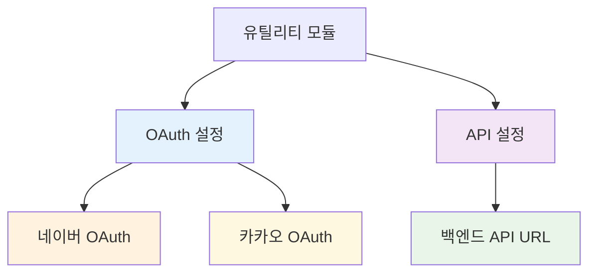
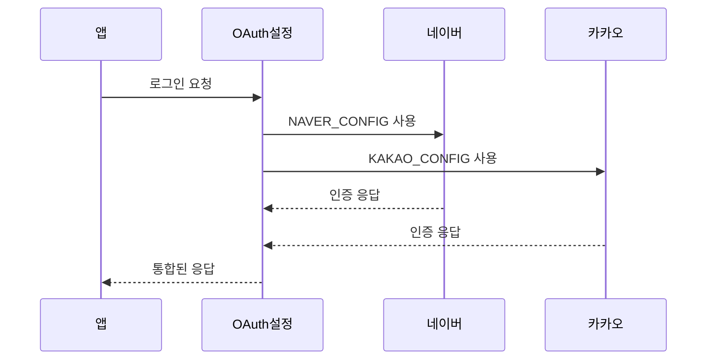
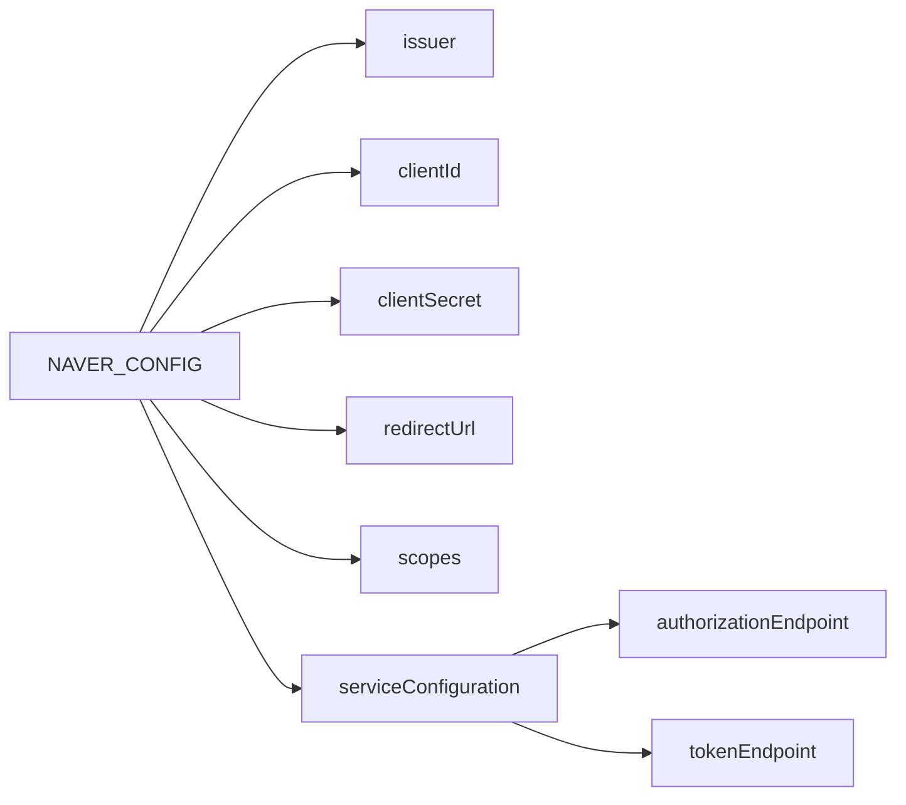
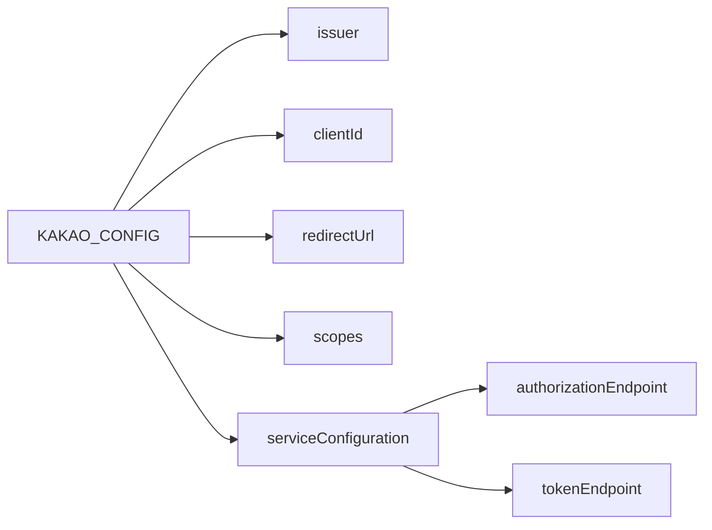
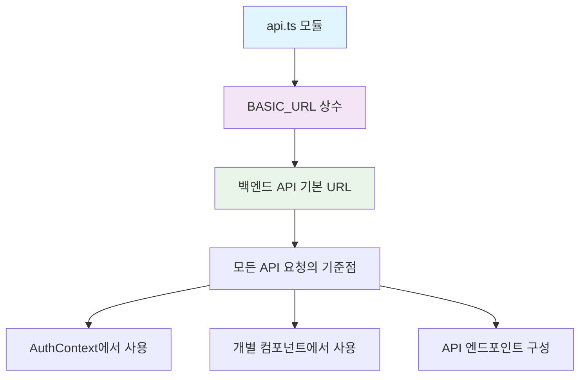
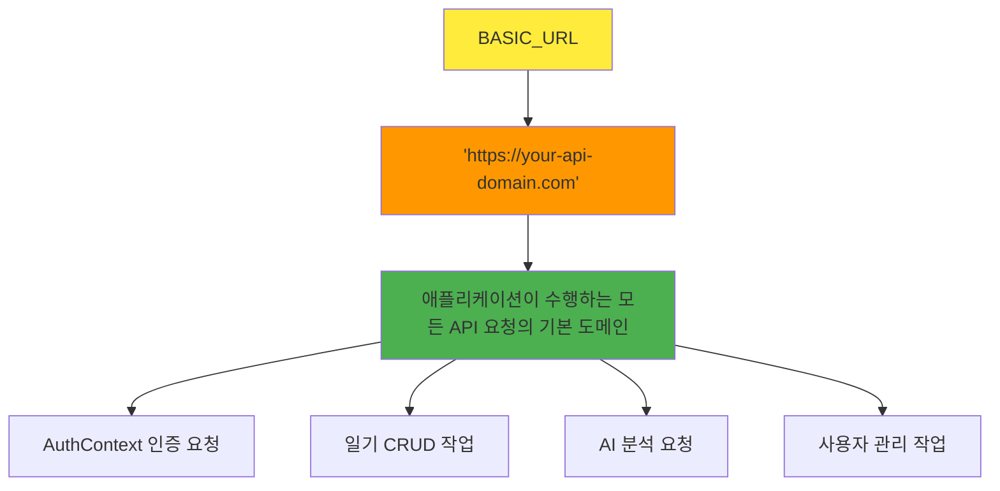
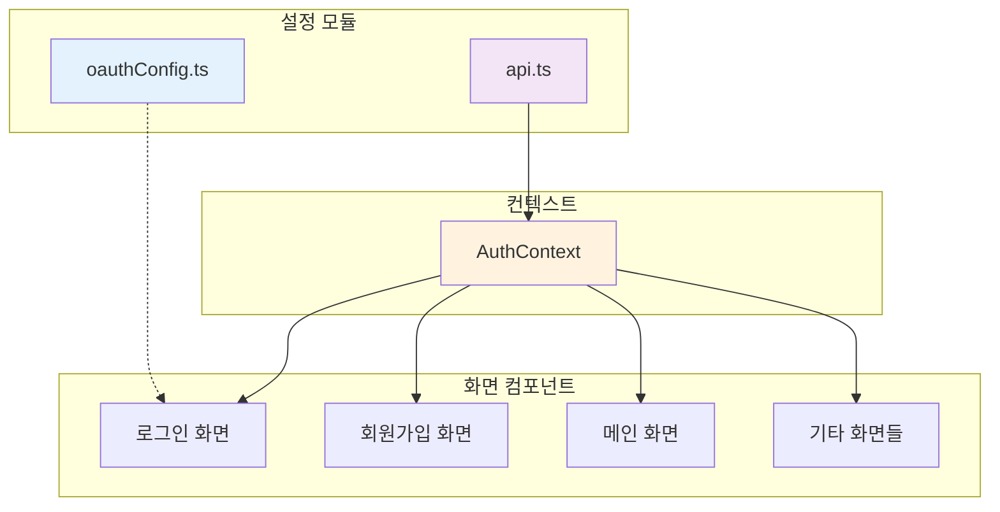
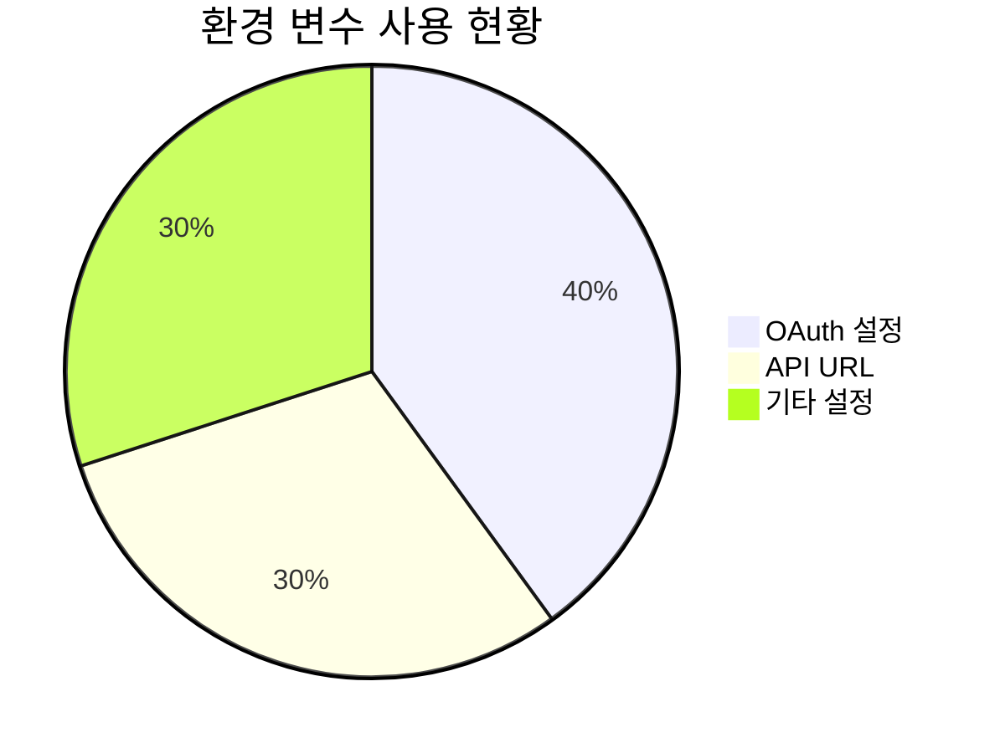

<!-- filepath: /workspace/CBT-Diary/docs/front/rev0.1/modules.md -->
# 🛠️ 유틸리티 모듈 문서

이 문서는 애플리케이션 내에서 사용되는 다양한 유틸리티 모듈들에 대한 상세 정보를 제공합니다. 여기에는 설정 상수와 헬퍼 함수들이 포함됩니다.



---

## 🔐 OAuth 설정 모듈

### 1. `oauthConfig.ts`



**📋 모듈 정보**
- **모듈명**: `oauthConfig.ts`
- **경로**: `CBT-front/src/auth/oauthConfig.ts`
- **목적**: 네이버와 카카오 OAuth 제공자를 위한 설정 객체를 제공합니다. 이러한 설정은 `react-native-app-auth`와 같은 라이브러리와 함께 소셜 로그인 기능을 통합하는 데 사용됩니다.

**📤 내보낸 멤버들**

#### `NAVER_CONFIG` (상수)



**🔧 값 구조**:
```typescript
{
  issuer: 'https://nid.naver.com',
  clientId: Config.NAVER_CLIENT_ID,
  clientSecret: Config.NAVER_CLIENT_SECRET,
  redirectUrl: 'com.yourapp://oauth/naver',
  scopes: ['profile'],
  serviceConfiguration: {
    authorizationEndpoint: 'https://nid.naver.com/oauth2.0/authorize',
    tokenEndpoint: 'https://nid.naver.com/oauth2.0/token',
  },
}
```

**📝 목적**: 네이버 OAuth 인증을 위한 모든 필요한 설정 세부사항을 포함합니다. 클라이언트 식별자, 리디렉션 URI, 요청된 스코프, 권한 부여 및 토큰 교환을 위한 서비스 엔드포인트가 포함됩니다.

#### `KAKAO_CONFIG` (상수)



**🔧 값 구조**:
```typescript
{
  issuer: 'https://kauth.kakao.com',
  clientId: Config.KAKAO_CLIENT_ID,
  redirectUrl: 'com.yourapp://oauth/kakao',
  scopes: ['profile_nickname', 'profile_image', 'account_email'],
  serviceConfiguration: {
    authorizationEndpoint: 'https://kauth.kakao.com/oauth/authorize',
    tokenEndpoint: 'https://kauth.kakao.com/oauth/token',
  },
}
```

**📝 목적**: 카카오 OAuth 인증을 위한 모든 필요한 설정 세부사항을 포함합니다. `NAVER_CONFIG`와 유사하지만, 클라이언트 ID, 리디렉션 URI, 스코프, 서비스 엔드포인트가 포함됩니다. 

> **💡 참고**: `clientSecret`은 일반적으로 카카오의 모바일 OAuth 플로우에서 클라이언트 측에 필요하지 않습니다.

---

## 🌐 API 설정 모듈

### 2. `api.ts`



**📋 모듈 정보**
- **모듈명**: `api.ts`
- **경로**: `CBT-front/src/constants/api.ts`
- **목적**: 애플리케이션의 백엔드 API를 위한 기본 URL을 중앙화합니다. 이를 통해 애플리케이션 전체에서 API 엔드포인트를 쉽게 업데이트할 수 있습니다.

**📤 내보낸 멤버들**

#### `BASIC_URL` (상수)



**🔧 값**: `'https://your-api-domain.com'` (문자열)

**📝 목적**: 애플리케이션이 수행하는 모든 API 요청의 기본 도메인을 정의합니다. 애플리케이션의 다른 부분에서는 이 상수를 사용하여 전체 API 엔드포인트 URL을 구성합니다.

> **⚠️ 주의**: 현재 값은 플레이스홀더로 보이며, 프로덕션 환경에서는 실제 API 도메인으로 교체되어야 합니다.

---

## 🔗 모듈 간 관계도



---

## 📊 환경 변수 의존성



### 🔑 필요한 환경 변수

| 변수명 | 사용 위치 | 목적 | 필수 여부 |
|--------|-----------|------|-----------|
| `NAVER_CLIENT_ID` | oauthConfig.ts | 네이버 OAuth 클라이언트 ID | ✅ 필수 |
| `NAVER_CLIENT_SECRET` | oauthConfig.ts | 네이버 OAuth 클라이언트 시크릿 | ✅ 필수 |
| `KAKAO_CLIENT_ID` | oauthConfig.ts | 카카오 OAuth 클라이언트 ID | ✅ 필수 |
| `API_BASE_URL` | api.ts | 백엔드 API 기본 URL | ⚠️ 권장 |

### 📋 설정 체크리스트

- [ ] `react-native-config` 패키지 설치 및 설정
- [ ] `.env` 파일에 모든 필요한 환경 변수 추가
- [ ] OAuth 앱 등록 (네이버, 카카오)
- [ ] 리디렉션 URL 설정
- [ ] 프로덕션/개발 환경별 설정 분리

---

## 🚀 사용 예시

```typescript
// OAuth 설정 사용 예시
import { NAVER_CONFIG, KAKAO_CONFIG } from './auth/oauthConfig';
import { authorize } from 'react-native-app-auth';

// 네이버 로그인
const naverLogin = async () => {
  const result = await authorize(NAVER_CONFIG);
  // 결과 처리...
};

// API URL 사용 예시
import { BASIC_URL } from './constants/api';

const apiEndpoint = `${BASIC_URL}/api/auth/login`;
```
