<!-- filepath: /workspace/CBT-Diary/docs/front/rev0.1/status_code.md -->
# 🌐 API 상호작용 및 상태 코드 처리

이 문서는 애플리케이션이 백엔드 API와 상호작용하는 방법, API 호출 수행 방법, 그리고 HTTP 상태 코드로 표시되는 오류를 포함한 응답 처리 방법을 설명합니다.

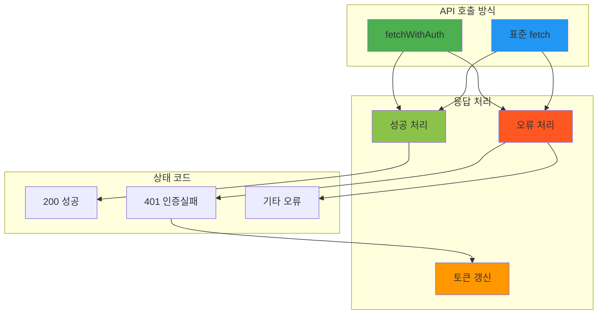

---

## 🔧 1. 일반적인 API 상호작용

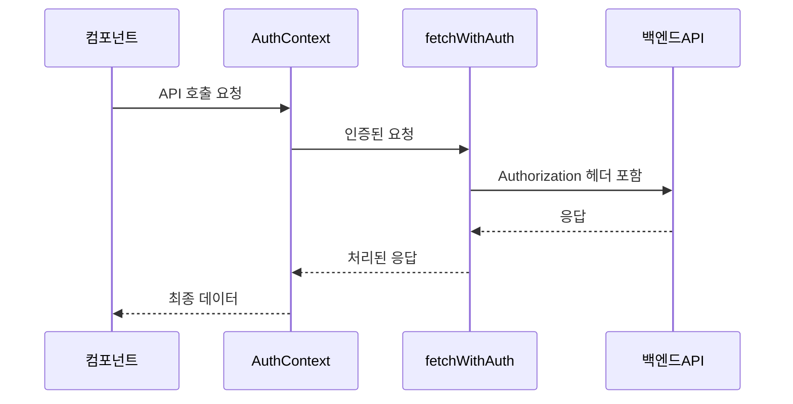

### 🛡️ 주요 메커니즘
- **인증된 API 호출**: 대부분의 인증된 API 호출은 `AuthContext.tsx`에서 제공하는 `fetchWithAuth` 함수를 사용합니다. 이 함수는 자동으로 `Authorization: Bearer <token>` 헤더와 `Content-Type: application/json`을 포함합니다.

### 🌐 기본 URL 설정
- **기본 URL**: `CBT-front/src/constants/api.ts`의 `BASIC_URL` 상수(예: `'https://your-api-domain.com'`)가 특정 API 엔드포인트 앞에 추가됩니다.

### 🔓 인증되지 않은 호출
- **공개 API**: 사용자 등록(`SignupScreen.tsx`의 `/api/public/join`)과 같은 일부 호출은 인증이 필요하지 않으므로 표준 `fetch` API를 사용합니다.

---

## ✅ 2. 성공 처리

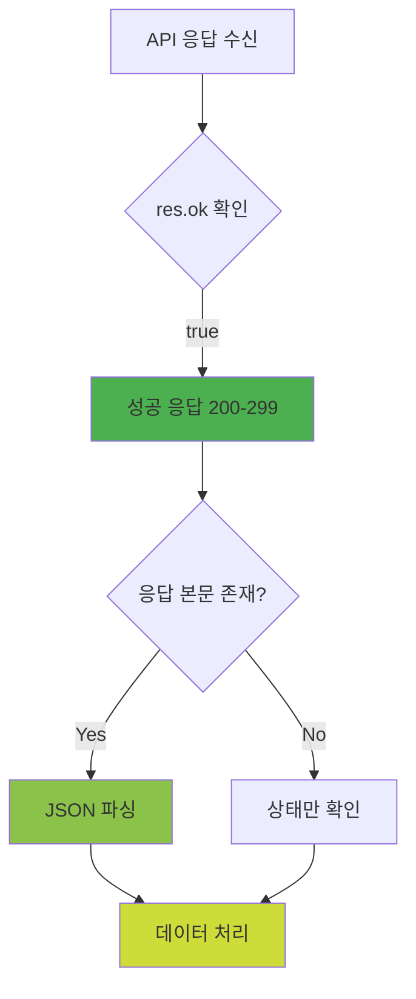

### 🎯 성공 확인
- **성공 식별**: 성공적인 HTTP 응답은 일반적으로 `if (res.ok)` 확인을 통해 식별됩니다(`res`는 Response 객체). 이는 일반적으로 200-299 범위의 상태 코드에 해당합니다.

### 📊 데이터 처리
- **JSON 파싱**: 요청이 성공하고 응답에 본문이 포함된 경우 `await res.json()`을 사용하여 JSON 콘텐츠를 파싱합니다.

### 💡 성공 처리 예시

#### 로그인 성공 (`SignInScreen.tsx`)


- `AuthContext`의 `signIn`을 통한 성공적인 로그인(`res.ok`)으로 응답에서 `access_token`과 `user` 파싱

#### 게시물 생성 성공 (`WriteScreen.tsx`)


- 게시물을 성공적으로 생성(`response.ok`)하면 `responseData`에서 `postId`를 파싱

#### 분석 데이터 가져오기 (`AnalyzeScreen.tsx`)
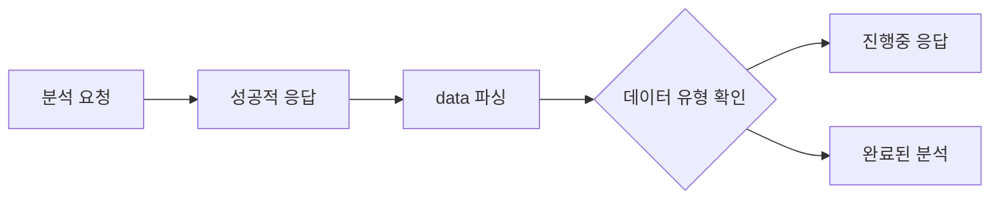

- 분석 데이터를 성공적으로 가져온 경우 `data`를 파싱하고 구조를 확인하여 "진행 중" 응답인지 완료된 "분석" 객체인지 결정

---

## ❌ 3. 오류 처리 전략

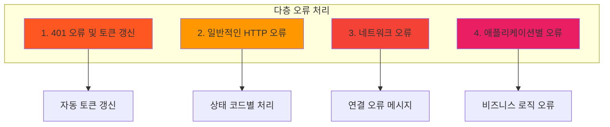

애플리케이션은 다층 오류 처리 전략을 사용합니다:

### 🔐 3.1. 인증 오류 (401) 및 토큰 갱신

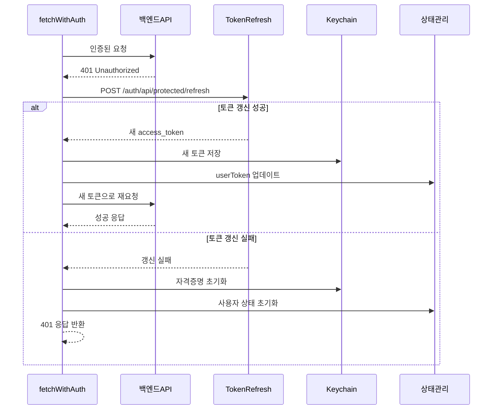

#### 🔄 중앙화된 처리
- **자동 처리**: `AuthContext.tsx`의 `fetchWithAuth` 함수에는 `401 Unauthorized` 오류를 처리하는 내장 로직이 있습니다.

#### ⚙️ 토큰 갱신 메커니즘
1. **토큰 갱신 시도**: `fetchWithAuth`를 통해 수행된 API 호출이 `401` 상태를 반환하는 경우
2. **갱신 요청**: `expiredToken`과 함께 `/auth/api/protected/refresh`에 POST 요청을 보내 토큰 갱신을 자동으로 시도
3. **갱신 성공**: 토큰 갱신이 성공하면(`refreshRes.ok`) 새 `access_token`을 받아 Keychain에 저장하고 `AuthContext`의 `userToken` 상태를 업데이트
4. **재시도**: 원본 API 요청을 새 토큰으로 다시 시도
5. **갱신 실패**: 토큰 갱신이 실패하면 Keychain에서 사용자 자격 증명을 지우고, `AuthContext`의 `userToken`과 `user`를 `null`로 설정(사실상 사용자 로그아웃), `fetchWithAuth` 함수는 `401` 상태의 `Response` 객체를 반환

#### 💡 컴포넌트에 미치는 영향
이러한 중앙화된 처리는 `fetchWithAuth`를 통해 호출하는 개별 컴포넌트들이 갱신 자체가 실패하여 로그아웃이 발생하는 경우가 아니라면 자체적인 401 처리를 구현할 필요가 없다는 것을 의미합니다.

### 🔍 3.2. 기타 HTTP 오류 상태 코드 (4xx, 5xx)

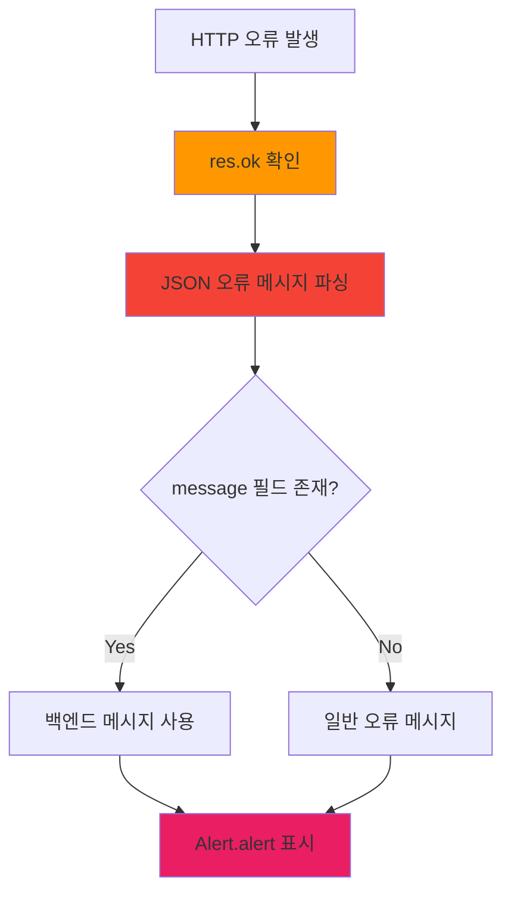

#### 📱 오류 확인 및 파싱
- **응답 확인**: 대부분의 API 호출 사이트에서 fetch 작업 후 `if (!res.ok)`를 확인합니다.
- **오류 메시지 파싱**:
  - `!res.ok`인 경우 일반적으로 응답 본문에서 JSON 오류 메시지를 파싱하려고 시도합니다: `const errJson = await res.json();` 또는 `const { message } = await res.json();`
  - 일반적으로 백엔드가 사람이 읽을 수 있는 오류가 포함된 `message` 필드가 있는 JSON 객체를 반환한다고 가정합니다.
  - 파싱이 실패하거나 `message`가 없으면 일반적으로 제네릭 오류 메시지를 사용합니다(예: `'서버 에러가 발생했습니다.'`, `'알 수 없는 오류가 발생했습니다'`, 또는 catch된 예외에서 `err.message`).

#### 💡 구체적인 처리 예시

**이메일 인증 화면 (`EmailVerificationScreen.tsx`)**
```typescript
if (!res.ok) {
  const { message } = await res.json();
  throw new Error(message || '인증 실패');
}
```

**분석 화면 (`AnalyzeScreen.tsx`)**
```typescript
if (!res.ok) {
  const errJson = await res.json();
  throw new Error(errJson.message || `서버 에러: ${res.status}`);
}
```

**상세보기 화면 (`ViewScreen.tsx`)** - 404 오류 구분 처리
```typescript
if (!res.ok) {
  if (res.status === 404) {
    throw new Error('해당 글을 찾을 수 없습니다.');
  } else {
    const errJson = await res.json();
    throw new Error(errJson.message || '서버 에러가 발생했습니다.');
  }
}
```

**글쓰기 화면 (`WriteScreen.tsx`)** - 생성/업데이트 게시물
```typescript
// PUT 요청의 경우
if (!res.ok) {
  const errJson = await res.json();
  Alert.alert('수정 실패', errJson.message || '서버 에러가 발생했습니다.');
  return;
}

// POST 요청의 경우
if (!response.ok) {
  const errorData = await response.json();
  Alert.alert('작성 실패', errorData.message || '서버 에러가 발생했습니다.');
  return;
}
```

### 🌐 3.3. 네트워크 및 기타 일반적인 오류

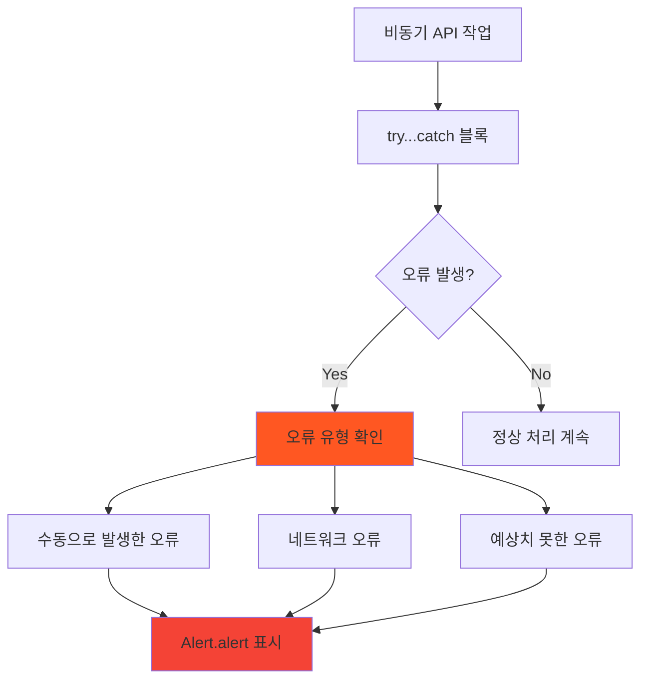

#### 🛡️ try...catch 블록
- **래핑**: 대부분의 비동기 API 작업은 `try...catch (err: any)` 블록으로 래핑됩니다.
- **오류 포착**: 이러한 블록은 다음을 포착합니다:
  - `!res.ok` 확인 후 수동으로 발생한 오류(위에서 설명한 대로)
  - 네트워크 오류(예: 서버에 연결할 수 없는 경우)
  - 요청/응답 생명주기 동안의 기타 예상치 못한 오류

#### 📱 사용자 알림
- **일반적인 알림**: `catch` 블록은 일반적으로 `Alert.alert('오류', err.message)` 또는 유사한 제네릭 제목을 사용하여 사용자에게 오류를 표시합니다.
- **네트워크 오류 예시**: `SignupScreen.tsx`의 네트워크 오류 예시: `Alert.alert('오류', '네트워크 오류가 발생했습니다');`

### 📢 3.4. 오류의 사용자 알림

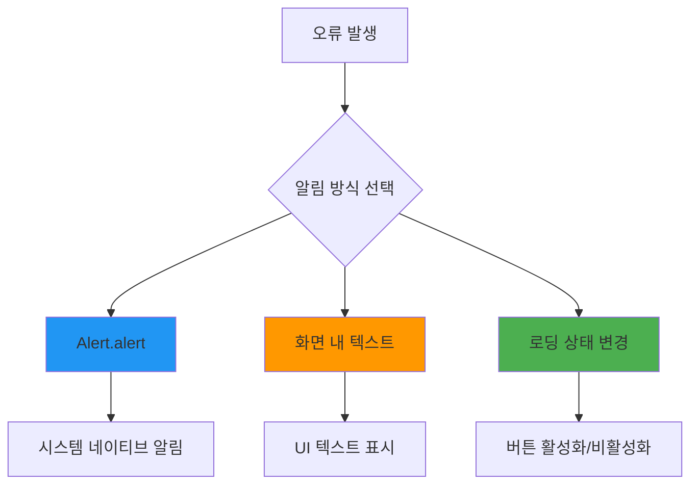

#### 🔔 주요 알림 방식

**`Alert.alert()` 사용**
- **가장 일반적인 방법**: API 오류를 사용자에게 알리는 가장 일반적인 방법은 `react-native`의 `Alert.alert(title, message)`입니다. 이는 네이티브 시스템 알림을 표시합니다.

**화면 내 메시지**
- **직접 UI 표시**: 경우에 따라 오류가 UI 내에서 직접 텍스트로 표시될 수 있습니다. 예를 들어, `AnalyzeScreen.tsx`는 `error` 상태 변수를 설정하고 이를 `<Text style={styles.errorText}>{error}</Text>`로 렌더링합니다.

**로딩 상태**
- **시각적 피드백**: `isLoading` 또는 `isAuthLoading` 상태는 API 호출 중에 시각적 피드백을 제공하여 사용자가 더 이상 상호작용하지 않도록 하고 작업이 진행 중임을 나타냅니다. 실패는 종종 이러한 로딩 상태를 `false`로 설정하는 결과를 가져옵니다.

---

## 📊 4. 특정 상태 코드/메시지

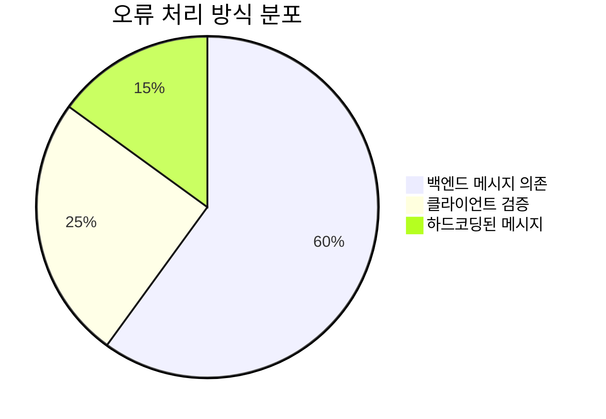

### 🏷️ 상태 코드 상수
- **명시적 상수 없음**: 코드베이스에는 HTTP 상태 코드에 대한 자체 상수를 정의하지 않는 것으로 보입니다(예: `const HTTP_STATUS_NOT_FOUND = 404;`). 표준 숫자(400, 401, 404, 500)를 `if (res.status === 404)`와 같은 확인에서 직접 사용합니다.

### 📨 백엔드 메시지 의존
- **JSON 응답**: 애플리케이션은 주로 JSON 응답에서 백엔드가 제공하는 오류 메시지(일반적으로 `message` 필드)에 의존합니다. 이러한 메시지는 `Alert.alert`를 통해 사용자에게 표시됩니다.

### ✅ 클라이언트 측 검증
- **API 호출 전 검증**: 일부 화면은 API 호출을 시도하기 전에 클라이언트 측 검증을 수행합니다:
  - `SignInScreen`: 이메일/비밀번호 형식
  - `SignupScreen`: 다양한 필드 검증
  - `WriteScreen`: 제목/내용 존재 여부
- 이들은 특정하고 클라이언트에서 정의된 메시지와 함께 `Alert.alert`를 사용하며 HTTP 상태 코드와는 관련이 없습니다.

---

## 📈 5. 상태 코드별 처리 전략

| 상태 코드 | 설명 | 처리 방법 | 사용자 경험 | 예시 |
|-----------|------|-----------|-------------|------|
| `200-299` | ✅ 성공 | 데이터 파싱 및 상태 업데이트 | 정상 동작 계속 | 로그인 성공, 데이터 로드 |
| `401` | 🔐 인증 실패 | 자동 토큰 갱신 시도 | 투명한 재인증 | 만료된 토큰 갱신 |
| `403` | 🚫 접근 금지 | 오류 메시지 표시 | 권한 부족 알림 | 관리자 전용 기능 |
| `404` | 🔍 찾을 수 없음 | 특별한 메시지 표시 | 리소스 없음 알림 | 삭제된 게시물 |
| `4xx` | ⚠️ 클라이언트 오류 | 백엔드 메시지 표시 | 입력 오류 수정 요청 | 잘못된 데이터 형식 |
| `5xx` | 💥 서버 오류 | 일반 오류 메시지 | 나중에 다시 시도 요청 | 서버 내부 오류 |

---

## 🔄 6. 토큰 생명주기 관리

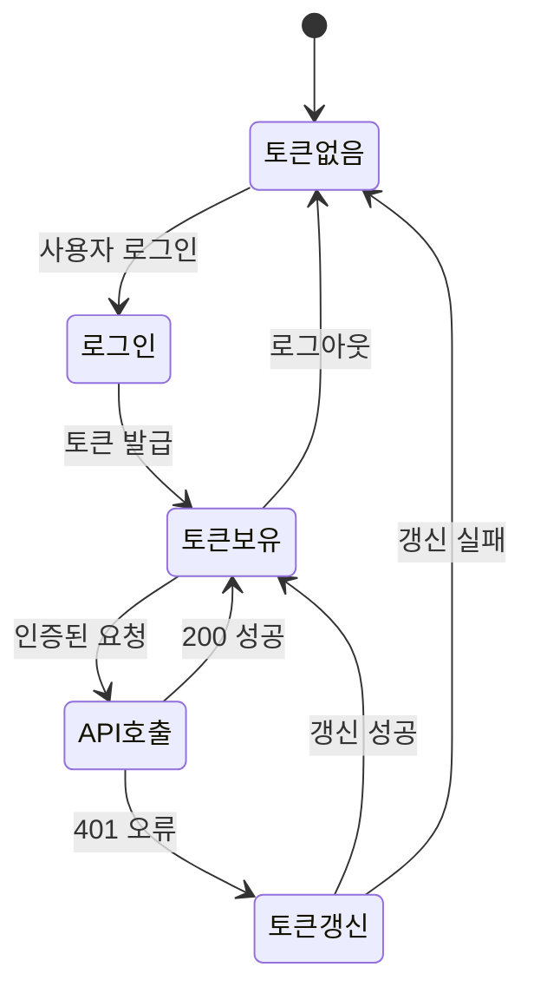

### 🔑 토큰 저장 및 관리
- **보안 저장**: 모든 토큰은 `react-native-keychain`을 사용하여 안전하게 저장됩니다.
- **자동 복원**: 앱 시작 시 저장된 토큰을 자동으로 복원합니다.
- **투명한 갱신**: 사용자가 인식하지 못하는 상태에서 토큰 갱신이 이루어집니다.

---

## 🛠️ 7. 개선 방안 및 모범 사례

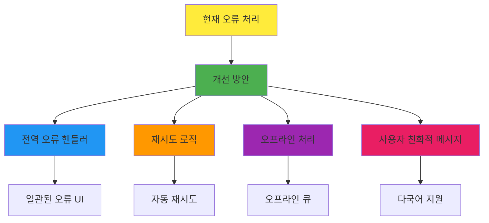

### ✅ 현재 시스템의 장점
- ✅ **자동 토큰 갱신**: 투명한 인증 관리로 사용자 경험 향상
- ✅ **중앙화된 처리**: `fetchWithAuth`를 통한 일관된 API 호출
- ✅ **즉각적인 피드백**: `Alert.alert`를 통한 사용자 알림
- ✅ **상태별 처리**: 404 등 특정 상태 코드에 대한 맞춤형 메시지

### 🚀 개선 가능한 영역
- 🔄 **Toast/Snackbar**: 비침습적인 오류 알림 방식 도입
- 🔄 **재시도 로직**: 네트워크 오류 시 자동 재시도 기능
- 🔄 **오프라인 지원**: 네트워크 복구 시 요청 큐 처리
- 🔄 **오류 로깅**: 디버깅을 위한 상세한 오류 로그
- 🔄 **상태 코드 상수**: HTTP 상태 코드 상수 정의로 가독성 향상

### 📝 코드 예시: 개선된 오류 처리

```typescript
// 개선된 오류 처리 예시
const handleApiError = (error: any, statusCode?: number) => {
  switch (statusCode) {
    case 404:
      return '요청하신 정보를 찾을 수 없습니다.';
    case 403:
      return '접근 권한이 없습니다.';
    case 500:
      return '서버에 일시적인 문제가 발생했습니다. 잠시 후 다시 시도해주세요.';
    default:
      return error.message || '알 수 없는 오류가 발생했습니다.';
  }
};
```

요약하면, 애플리케이션은 자동 토큰 갱신이 포함된 강력한 인증 요청을 위해 `fetchWithAuth`를 사용합니다. 오류 처리는 일반적으로 `response.ok` 확인, 비정상 응답에 대한 백엔드의 JSON 메시지 파싱, 그리고 `Alert.alert`를 사용한 사용자 알림을 포함합니다. 401에 대한 특정 처리(토큰 갱신)는 `AuthContext`에서 중앙화되어 있으며, 404나 일반적인 서버 오류와 같은 다른 오류는 호출 사이트에서 처리됩니다.
