# 🚀 프론트엔드-백엔드 통합 TODO 및 상태

이 문서는 프론트엔드 기능(문서화 및 구현된)과 백엔드 API(`docs/auth-server/rev2.1/API_Documentation.md` 및 `Auth-server/backend/docs/API_Documentation.md`에 문서화된) 간의 연결 상태, 완료 상태 및 식별된 격차를 설명합니다.

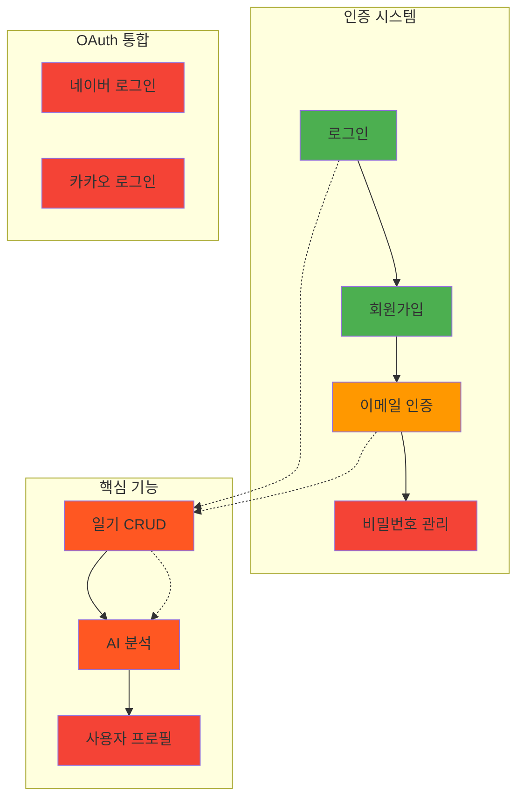

---

## 🔐 사용자 인증

### 1. 사용자 로그인

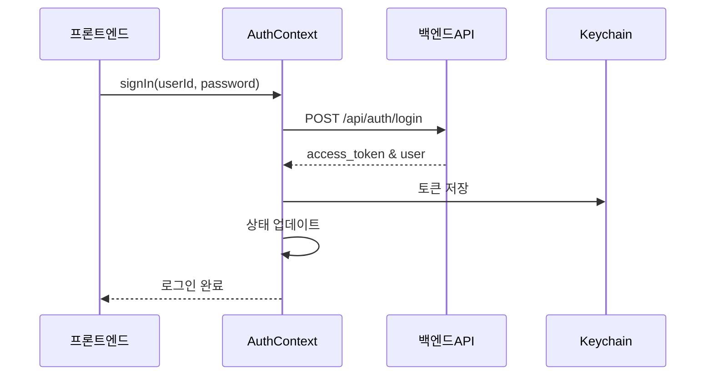

**📋 기능 정보**
- **기능명**: 사용자 인증 - 로그인
- **프론트엔드 구현 상태**: ✅ **완료**
- **백엔드 API 엔드포인트**:
  - `POST /api/auth/login` (사용자명/비밀번호 로그인)
  - `POST /auth/api/protected/refresh` (토큰 갱신)
  - `GET /api/users/me` (로그인/토큰 갱신 후 사용자 정보 가져오기)

**🔗 연결/통합 참고사항**:
- ✅ `AuthContext`의 `signIn` 함수를 통해 `/api/auth/login`과 성공적으로 통합
- ✅ 토큰(access_token)과 사용자 세부정보를 컨텍스트에 저장
- ✅ Keychain에 토큰 저장
- ✅ 401 오류 시 `AuthContext`의 `fetchWithAuth`가 `/auth/api/protected/refresh`를 사용하여 자동 토큰 갱신 처리
- ✅ 백엔드 오류 메시지(예: 잘못된 자격증명)를 `Alert.alert`로 표시

**❌ 누락/미구현 (프론트엔드)**:
- 🔄 백엔드에 `/api/public/findPassWithEmail`이 있지만 로그인 화면에 "비밀번호 찾기" 또는 "ID 찾기" 기능이 구현되지 않음

**❌ 누락/미구현 (백엔드 지원)**: 핵심 로그인에 대해 식별된 것 없음

**📝 일반 참고사항/할 일**:
- `AuthContext`의 `signIn` 함수는 `userId`와 `password`를 기대함
- 백엔드의 `/api/auth/login` 문서도 `userId`와 `password`를 명시함
- 프론트엔드의 `User` 타입은 `userId`, `nickname`, `role`, `emailVerified`를 포함
- 백엔드 로그인 응답이 사용자 객체를 직접 전송한다는 것을 암시하는 `{ access_token, user }`로 구조분해됨

### 2. 사용자 회원가입

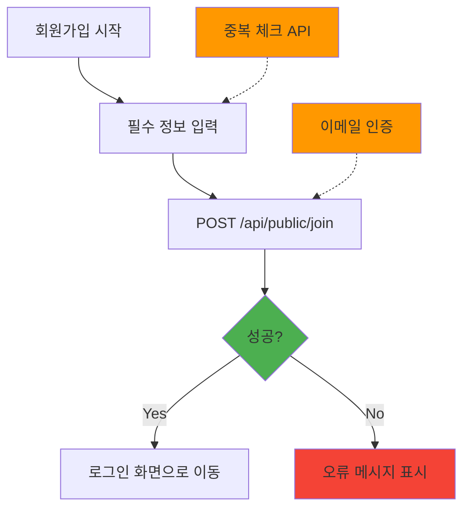

**📋 기능 정보**
- **기능명**: 사용자 인증 - 회원가입
- **프론트엔드 구현 상태**: ✅ **완료** (하지만 이 화면의 직접적인 API 호출에 명시적으로 포함되지 않은 사전 이메일 인증에 의존)
- **백엔드 API 엔드포인트**: `POST /api/public/join`

**🔗 연결/통합 참고사항**:
- ✅ `SignupScreen.tsx`가 `/api/public/join`을 직접 호출
- ✅ `email`, `userPw`(비밀번호), `userName`, `nickname`을 전송
- ⚠️ 백엔드의 `JoinRequest`에는 더 많은 필드들이 있음 (`phone`, `role`, `birthDate`, `gender`, `isPrivate`, `profile`, `code`)
- ⚠️ 프론트엔드는 일부만 전송하며, 백엔드는 기본값을 가지거나 누락된 선택적 필드를 처리할 것으로 추정
- ⚠️ `code` 필드(이메일 인증 코드)가 백엔드 문서 설명에서 필수로 언급되지만 현재 프론트엔드에서 명시적으로 전송되지 않음

**❌ 누락/미구현 (프론트엔드)**:
- 🔄 회원가입 시 `phone`, `birthDate`, `gender`, `isPrivate`, `profile`을 전송하지 않음
- 🔄 제출 전 ID/닉네임 중복 확인 UI 없음 (백엔드에 관련 API는 존재함)

**❌ 누락/미구현 (백엔드 지원)**: 기본 필드를 사용한 핵심 회원가입에 대해 식별된 것 없음

**📝 일반 참고사항/할 일**:
- 이메일 인증이 별도 단계인 경우 `/api/public/join`의 `JoinRequest`에서 `code`가 여전히 필요한지 명확화 필요
- 더 나은 UX를 위해 중복 확인 API에 대한 클라이언트 측 호출 고려

### 3. 이메일 인증

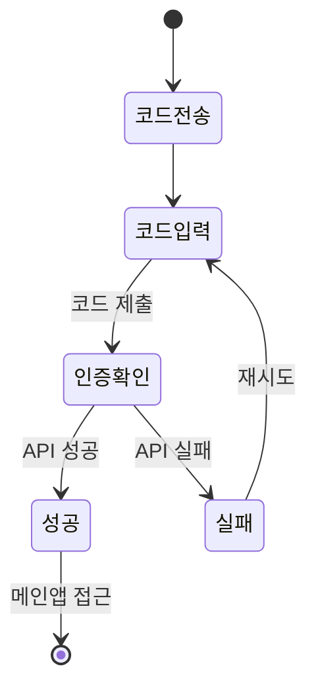

**📋 기능 정보**
- **기능명**: 이메일 인증
- **프론트엔드 구현 상태**: ✅ **완료**
- **백엔드 API 엔드포인트**: 
  - `POST /api/auth/verify-email` (프론트엔드에서 사용)
  - `GET /api/public/emailCheck` (백엔드 문서에 있음, 불일치)

**❌ 중요한 불일치**:
- ⚠️ **엔드포인트 불일치**: 프론트엔드는 `/api/auth/verify-email`을 사용하지만 백엔드 문서는 `/api/public/emailCheck`를 명시
- 🔄 이 불일치는 즉시 해결되어야 함

-   **Feature Name:** User Authentication - Email Verification
-   **Frontend Implementation Status:** Complete
-   **Backend API Endpoint(s):**
    -   Frontend uses: `POST /api/auth/verify-email` (from `EmailVerificationScreen.tsx`)
    -   Backend docs list:
        -   `POST /api/public/emailSend` (to send verification code)
        -   `POST /api/public/emailCheck` (to verify code)
-   **Connection/Integration Notes:**
    -   `EmailVerificationScreen.tsx` calls `fetchWithAuth` with `/api/auth/verify-email` and the `code`.
    -   After successful verification, `refreshUser()` is called to update user state (presumably `emailVerified` flag).
    -   Backend `rev2.1` doc lists `/api/public/emailSend` and `/api/public/emailCheck`. The frontend's `/api/auth/verify-email` is not explicitly in `rev2.1` but might be an endpoint from an older version or a specific detail of the "CBT" project not in the generic auth server docs. The `original_doc` does not list `/api/auth/verify-email` either.
    -   The `EmailVerificationScreen` does not handle sending the email itself; it assumes the code has already been sent (likely triggered after signup).
-   **Missing/Unimplemented (Frontend):**
    -   No frontend UI to trigger `/api/public/emailSend` if the user didn't receive the code or it expired.
-   **Missing/Unimplemented (Backend Support):** The endpoint `/api/auth/verify-email` used by the frontend is not clearly documented in the provided backend API docs (rev2.1 or original). The documented endpoint is `/api/public/emailCheck`. This needs clarification.
-   **General Notes/Todos:**
    -   Verify the correct backend endpoint for email verification (`/api/auth/verify-email` vs `/api/public/emailCheck`).
    -   The `AuthStack.tsx` has logic to show `VerifyEmail` screen if `user && !user.emailVerified`. This relies on the `user.emailVerified` flag being correctly set by the backend and fetched by `refreshUser()`.

### 4. User Sign-Out (Logout)

-   **Feature Name:** User Authentication - Sign Out
-   **Frontend Implementation Status:** Complete
-   **Backend API Endpoint(s):**
    -   `POST /api/auth/logout` (used by `AuthContext`)
    -   Backend doc also lists `POST /api/public/clean/userTokenCookie` (for soft logout, not used by frontend `AuthContext`)
-   **Connection/Integration Notes:**
    -   `AuthContext`'s `signOut` function calls `fetchWithAuth` with `/api/auth/logout`.
    -   Keychain is reset, and local `userToken` and `user` state are cleared.
-   **Missing/Unimplemented (Frontend):** None for basic logout.
-   **Missing/Unimplemented (Backend Support):** None for basic logout.
-   **General Notes/Todos:** The frontend implements a full logout. The backend's `/api/public/clean/userTokenCookie` for just clearing cookies is not used.

---

## Diary Management

### 1. Create New Diary Entry

-   **Feature Name:** Diary - Create Entry
-   **Frontend Implementation Status:** Complete
-   **Backend API Endpoint(s):**
    -   Frontend uses: `POST /api/diaryposts` (from `WriteScreen.tsx`)
    -   Backend docs (`rev2.1` and `original_doc`): `POST /api/diaries`
-   **Connection/Integration Notes:**
    -   `WriteScreen.tsx` (in create mode) calls `fetchWithAuth` to `https://<BASIC_URL>/api/diaryposts` with `date`, `title`, `content`.
    -   Backend docs specify `POST /api/diaries` with `title` (optional) and `content` (required). The frontend sends `date` as well.
    -   The frontend navigates to `AnalyzeScreen` with the new `postId` from the response.
    -   Field discrepancy: Frontend sends `date`, backend `DiaryCreateRequest` in `rev2.1` does not list `date`. `original_doc`'s `DiaryCreateRequest` also only lists `title` and `content`. This might be a mismatch or the backend handles the extra `date` field gracefully.
-   **Missing/Unimplemented (Frontend):** None for basic creation.
-   **Missing/Unimplemented (Backend Support):** Clarify if `/api/diaries` accepts a `date` field or if the frontend should only send `title` and `content`. The endpoint path also differs (`/api/diaryposts` vs `/api/diaries`).
-   **General Notes/Todos:** Critical mismatch in endpoint path (`/api/diaryposts` vs `/api/diaries`) and potentially request body (`date` field). This needs immediate clarification.

### 2. View Diary Entries (List)

-   **Feature Name:** Diary - View List & Calendar
-   **Frontend Implementation Status:** Complete
-   **Backend API Endpoint(s):**
    -   Frontend uses: `GET /api/diaries` (from `MainScreen.tsx` for fetching posts and dates for calendar)
    -   Backend docs (`rev2.1` and `original_doc`): `GET /api/diaries` (for list)
-   **Connection/Integration Notes:**
    -   `MainScreen.tsx` uses `fetchWithAuth` to get a list of posts and dates. Supports pagination (`page`, `size`), sorting (`sort`), and `searchText`. Also uses `startDate`, `endDate` for date-specific filtering.
    -   The backend `GET /api/diaries` endpoint in docs supports pagination and sorting. The response structure in docs (`diaries` list and `pageInfo`) matches general frontend expectations.
    -   `MainScreen.tsx` expects `dates` array in the response for `PostData` when loading dates for the calendar. The backend API doc for `GET /api/diaries` in `rev2.1` shows a response with `diaries` (list of `DiaryListItem`) and `pageInfo`. It does not explicitly mention a top-level `dates` array. `original_doc` is similar. This is a potential mismatch.
-   **Missing/Unimplemented (Frontend):** None apparent for basic list viewing.
-   **Missing/Unimplemented (Backend Support):** The `dates` array expected by `MainScreen.tsx` in the response of `GET /api/diaries` is not documented in the backend API.
-   **General Notes/Todos:** Clarify the response structure of `GET /api/diaries`, specifically the presence of the `dates` array for calendar marking.

### 3. View Single Diary Entry (Details)

-   **Feature Name:** Diary - View Entry Details
-   **Frontend Implementation Status:** Complete
-   **Backend API Endpoint(s):**
    -   Frontend uses: `GET /api/diaryposts/{postId}` (from `ViewScreen.tsx`)
    -   Backend docs (`rev2.1` and `original_doc`): `GET /api/diaries/{diaryId}`
-   **Connection/Integration Notes:**
    -   `ViewScreen.tsx` uses `fetchWithAuth` to get details for a `postId`.
    -   Expects `id`, `date`, `title`, `content`, `aiResponse` (boolean indicating if analysis exists).
    -   Backend `GET /api/diaries/{diaryId}` in `rev2.1` doc returns `id`, `userId`, `title`, `content`, `alternativeThoughtByAI`, `createdAt`, `updatedAt`, and an `analysis` object.
    -   The `original_doc` for `GET /api/diaries/{diaryId}` is more aligned with frontend expectation of an `analysis` object, which would imply `aiResponse` can be derived.
-   **Missing/Unimplemented (Frontend):** Frontend does not display all fields from backend (e.g., `alternativeThoughtByAI` directly on this screen, `userId`, `createdAt`, `updatedAt` from the main diary object).
-   **Missing/Unimplemented (Backend Support):** Endpoint path mismatch (`/api/diaryposts/{postId}` vs `/api/diaries/{diaryId}`). The structure for `aiResponse` flag needs to be confirmed against the `analysis` object from backend.
-   **General Notes/Todos:** Endpoint path mismatch. Frontend should derive `aiResponse` from the presence/status of the `analysis` object if the backend sends the detailed analysis object.

### 4. Edit Diary Entry

-   **Feature Name:** Diary - Edit Entry
-   **Frontend Implementation Status:** Complete
-   **Backend API Endpoint(s):**
    -   Fetch existing: `GET /api/diaryposts/{postId}` (from `WriteScreen.tsx`)
    -   Update: `PUT /api/diaryposts/{postId}` (from `WriteScreen.tsx`)
    -   Backend docs (`rev2.1` and `original_doc`):
        -   Fetch existing: `GET /api/diaries/{diaryId}`
        -   Update: `PUT /api/diaries/{diaryId}`
-   **Connection/Integration Notes:**
    -   `WriteScreen.tsx` (in edit mode) fetches existing data.
    -   Sends `title`, `content` for update. Backend `DiaryUpdateRequest` also expects `title` (optional), `content` (required).
    -   Path mismatch for both GET and PUT operations.
-   **Missing/Unimplemented (Frontend):** Frontend does not allow editing the `date` of an existing post, though it's fetched. The PUT request only sends `title` and `content`.
-   **Missing/Unimplemented (Backend Support):** Endpoint path mismatch.
-   **General Notes/Todos:** Clarify endpoint paths. Backend API for PUT does not mention updating the `date`.

### 5. Delete Diary Entry

-   **Feature Name:** Diary - Delete Entry
-   **Frontend Implementation Status:** Not Started (No UI element or function call observed for deleting entries)
-   **Backend API Endpoint(s):**
    -   `DELETE /api/diaries/{diaryId}`
-   **Connection/Integration Notes:** -
-   **Missing/Unimplemented (Frontend):** Entire feature.
-   **Missing/Unimplemented (Backend Support):** None (endpoint exists).
-   **General Notes/Todos:** This is a potential future feature.

### 6. AI Analysis of Diary Entry

-   **Feature Name:** Diary - AI Analysis
-   **Frontend Implementation Status:** Complete (for viewing and initiating)
-   **Backend API Endpoint(s):**
    -   Get Analysis / Check Status: `GET /api/diaries/{postId}/analysis` (from `AnalyzeScreen.tsx`)
    -   Request Analysis: `POST /api/diaries/{postId}/analysis` (from `ViewScreen.tsx` if `aiResponse` is false)
    -   Backend docs (`rev2.1` and `original_doc`): The Diary API section in `rev2.1` does not explicitly list `/analysis` sub-resource endpoints. However, `DiaryDetailResponse` includes an `analysis` object. The `original_doc` (section 6.3) for `GET /api/diaries/{diaryId}` includes the `analysis` object. It does not explicitly list an endpoint to *request* analysis if not present. The `AnalyzeScreen.tsx` also mentions a response structure for "analysis in progress" (`message`, `progress`, `estimatedRemaining`), which isn't detailed in the backend API docs for diary analysis.
-   **Connection/Integration Notes:**
    -   `AnalyzeScreen.tsx` fetches analysis results. It handles responses indicating "analysis in progress" or "analysis complete".
    -   `ViewScreen.tsx` can trigger a POST request to `/api/diaries/{postId}/analysis` to initiate analysis.
-   **Missing/Unimplemented (Frontend):** None for basic viewing/requesting.
-   **Missing/Unimplemented (Backend Support):**
    -   The backend docs for Diary API (both `rev2.1` and `original_doc`) do not clearly define the `GET /api/diaries/{postId}/analysis` for polling status or the `POST /api/diaries/{postId}/analysis` for initiating analysis. The `DiaryDetailResponse` implies analysis is part of the diary details, but the frontend actively polls/requests it separately.
    -   The "analysis in progress" response structure (`message`, `progress`, `estimatedRemaining`) is not documented.
-   **General Notes/Todos:** This area has significant discrepancies between frontend implementation and backend documentation. The frontend seems to expect more specific endpoints and response types for handling asynchronous analysis than what is documented.

---

## Other Features

### 1. User Profile Management

-   **Feature Name:** User Profile Management
-   **Frontend Implementation Status:** Not Started (No dedicated screen or UI elements observed for viewing/editing user profile details like name, nickname, phone, profile image etc., beyond what's entered at sign-up)
-   **Backend API Endpoint(s):**
    -   `POST /api/public/profileUpload` (for uploading profile image)
    -   (Potentially an endpoint like `PUT /api/users/me` or `PUT /api/protected/user/update` would be needed for updating user details, but not explicitly found in a way that frontend `AuthContext.User` type would map to for update).
-   **Connection/Integration Notes:** -
-   **Missing/Unimplemented (Frontend):** Entire feature.
-   **Missing/Unimplemented (Backend Support):** While profile image upload exists, a clear endpoint for updating other user details (nickname, name etc.) is not obvious or seems missing.
-   **General Notes/Todos:** Potential future feature.

### 2. Settings Management

-   **Feature Name:** Application/User Settings
-   **Frontend Implementation Status:** Not Started
-   **Backend API Endpoint(s):**
    -   `GET /api/settings`
    -   `PUT /api/settings`
-   **Connection/Integration Notes:** -
-   **Missing/Unimplemented (Frontend):** Entire feature.
-   **Missing/Unimplemented (Backend Support):** None (endpoints exist).
-   **General Notes/Todos:** Potential future feature.

### 3. Password Management

### 4. 비밀번호 관리

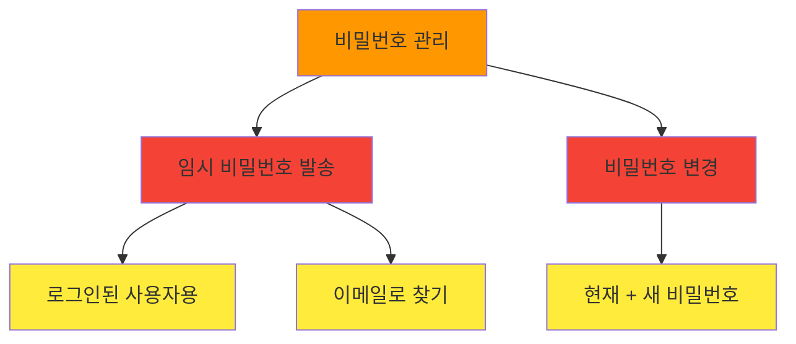

**📋 기능 정보**
- **기능명**: 비밀번호 관리 (비밀번호 변경, 비밀번호 찾기)
- **프론트엔드 구현 상태**: ❌ **미시작**
- **백엔드 API 엔드포인트**:
  - `POST /api/protected/sendEmailPassword` (로그인된 사용자의 이메일로 임시 비밀번호 발송)
  - `GET /api/public/findPassWithEmail` (userId로 찾은 이메일로 임시 비밀번호 발송)
  - (현재 + 새 비밀번호로 비밀번호 변경하는 전용 엔드포인트는 명시적으로 찾을 수 없음, 예: `PUT /api/protected/user/change-password`)

**🔗 연결/통합 참고사항**: 해당 없음

**❌ 누락/미구현 (프론트엔드)**: 전체 기능

**❌ 누락/미구현 (백엔드 지원)**: 전용 "비밀번호 변경" 엔드포인트(현재 + 새 비밀번호)가 누락된 것으로 보임

**📝 일반 참고사항/할 일**: 향후 기능으로 가능

---

## 📝 일기 관리

### 5. 일기 CRUD 작업

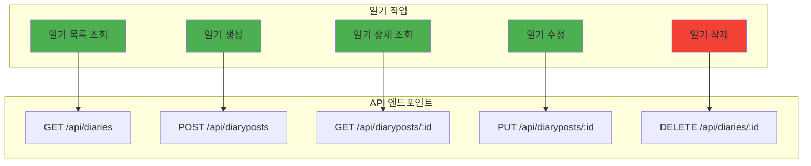

**📋 기능 정보**
- **기능명**: 일기 CRUD 작업
- **프론트엔드 구현 상태**: 🔄 **부분적으로 완료** (삭제 제외)
- **백엔드 API 엔드포인트**:
  - `GET /api/diaries` (목록, 검색, 페이지네이션)
  - `POST /api/diaryposts` (생성)
  - `GET /api/diaryposts/{postId}` (상세 조회)
  - `PUT /api/diaryposts/{postId}` (수정)
  - `DELETE /api/diaries/{postId}` (삭제)

**❌ 중요한 문제**:
- 🚨 **엔드포인트 경로 불일치**: 프론트엔드는 `/api/diaryposts`를 사용하지만 백엔드는 `/api/diaries`를 문서화함
- ⚠️ **필드 불일치**: 프론트엔드는 일기 생성 시 `date` 필드를 전송하지만 백엔드 요청 모델에 문서화되지 않음
- ⚠️ **응답 구조**: `MainScreen.tsx`는 `GET /api/diaries` 응답에서 `dates` 배열을 기대하지만 백엔드 문서에 없음

**✅ 구현된 기능**:
- ✅ 일기 목록 조회 (검색, 페이지네이션 포함)
- ✅ 일기 생성
- ✅ 일기 상세 조회
- ✅ 일기 수정

**❌ 누락/미구현 (프론트엔드)**:
- 🔄 일기 삭제 기능이 프론트엔드에 구현되지 않음

### 6. AI 분석

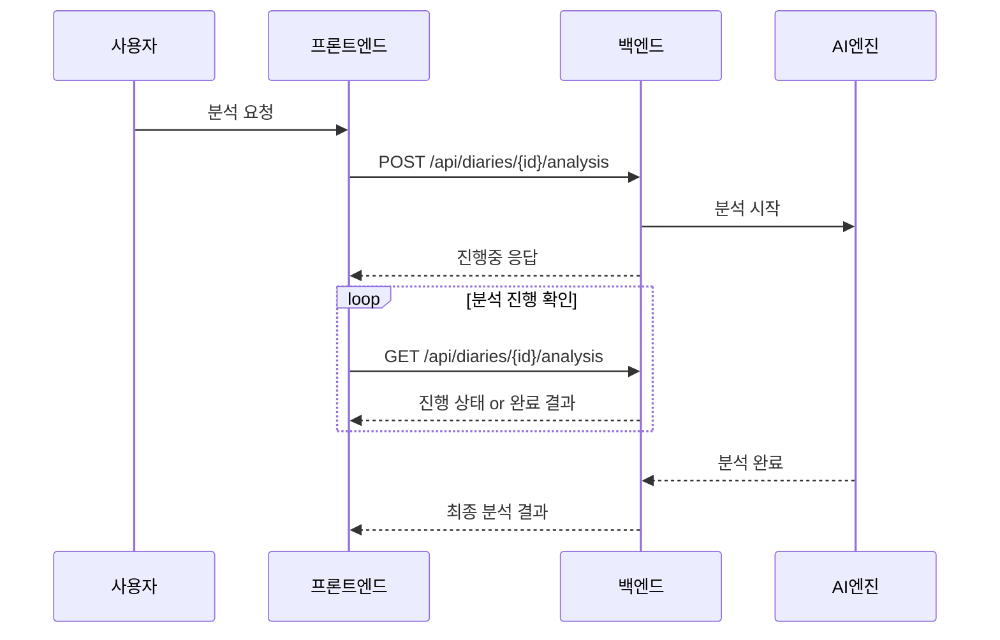

**📋 기능 정보**
- **기능명**: AI 분석
- **프론트엔드 구현 상태**: ✅ **완료**
- **백엔드 API 엔드포인트**: `/api/diaries/{postId}/analysis` (POST 및 GET)

**❌ 중요한 문제**:
- 🚨 **문서화 부족**: 분석 시작(POST) 및 결과 조회/폴링(GET) 엔드포인트가 백엔드 문서에 명확히 문서화되지 않음
- ⚠️ **진행중 응답 구조**: "진행중" 응답 구조가 프론트엔드에서 사용되지만 백엔드 문서에 명시되지 않음

**✅ 프론트엔드 구현**:
- ✅ 분석 시작 요청
- ✅ 진행 상태 폴링
- ✅ 완료된 분석 결과 표시
- ✅ 진행률 및 예상 시간 표시

---

## 👤 사용자 프로필 관리

### 7. 프로필 조회 및 수정

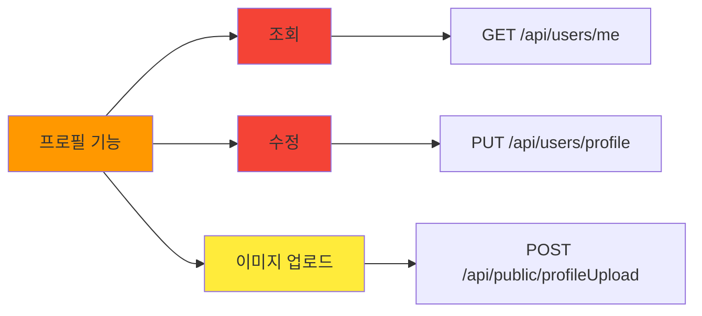

**📋 기능 정보**
- **기능명**: 사용자 프로필 관리
- **프론트엔드 구현 상태**: ❌ **미구현**
- **백엔드 API 엔드포인트**:
  - `GET /api/users/me` (프로필 조회 - AuthContext에서 부분적으로 사용됨)
  - `POST /api/public/profileUpload` (프로필 이미지 업로드)
  - 텍스트 기반 프로필 정보 업데이트를 위한 엔드포인트 필요

**❌ 누락/미구현 (프론트엔드)**: 전체 기능

**❌ 누락/미구현 (백엔드 지원)**: 텍스트 기반 프로필 정보(이름, 닉네임 등) 업데이트를 위한 전용 엔드포인트

### 8. 애플리케이션 설정

**📋 기능 정보**
- **기능명**: 앱 설정 (알림, 테마, 기본 설정 등)
- **프론트엔드 구현 상태**: ❌ **미구현**
- **백엔드 API 엔드포인트**: 식별되지 않음

**📝 참고사항**: 향후 기능으로 가능

---

## 🔐 OAuth 통합

### 9. 소셜 로그인

```mermaid
graph TB
    subgraph "OAuth 제공자"
        A[네이버 로그인]
        B[카카오 로그인]
    end
    
    subgraph "백엔드 OAuth 엔드포인트"
        C[GET /api/public/oauth2/login_url/{provider}]
        D[GET /api/public/oauth2/callback/{provider}]
        E[POST /oauth2/callback/{provider}]
    end
    
    A -.-> C
    B -.-> C
    C -.-> D
    D -.-> E
    
    style A fill:#f44336
    style B fill:#f44336
    style C fill:#ffeb3b
    style D fill:#ffeb3b
    style E fill:#ffeb3b
```

**📋 기능 정보**
- **기능명**: OAuth 로그인 (네이버, 카카오)
- **프론트엔드 구현 상태**: ❌ **미구현**
- **백엔드 API 엔드포인트**:
  - `GET /api/public/oauth2/login_url/{provider}`
  - `GET /api/public/oauth2/callback/{provider}`
  - `POST /oauth2/callback/{provider}`

**🔗 연결/통합 참고사항**:
- ⚠️ 백엔드에는 광범위한 OAuth2 엔드포인트가 있음
- ⚠️ 프론트엔드에는 OAuth 설정(`oauthConfig.ts`)이 있지만 현재 사용되지 않음
- ⚠️ 표준 로그인이 구현되어 있음

**❌ 누락/미구현 (프론트엔드)**: 소셜 로그인이 필요한 경우 주요 미구현 영역

**📝 일반 참고사항/할 일**:
- 소셜 로그인이 원하는 경우 백엔드의 OAuth2 엔드포인트를 사용하도록 프론트엔드 로직 구현
- `oauthConfig.ts`의 설정을 실제 OAuth 플로우와 통합

---

## 📊 전체 백엔드 통합 상태 및 주요 이슈

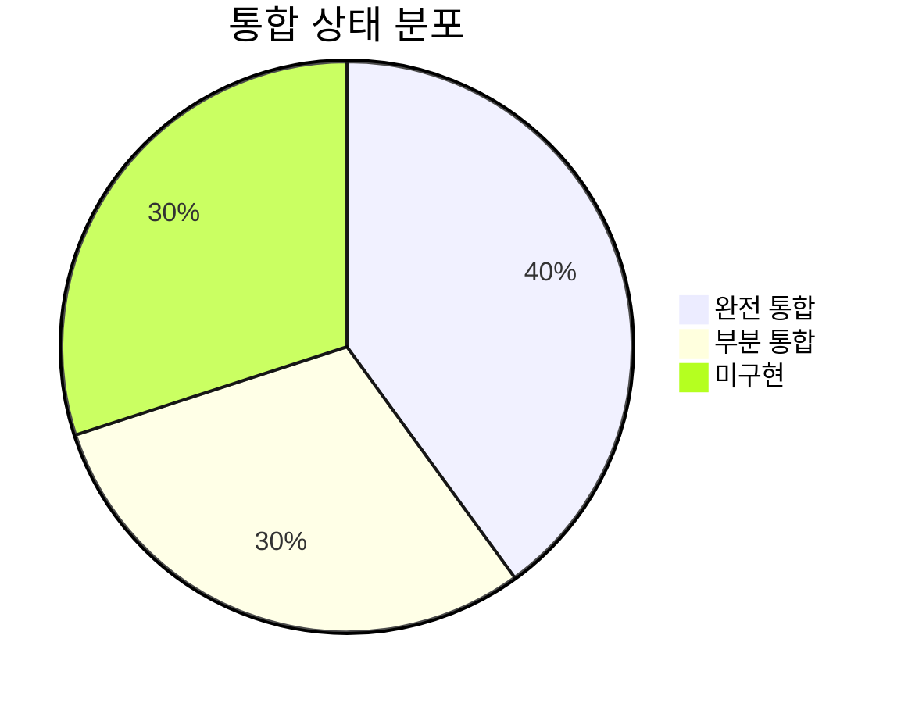

### ✅ 핵심 인증 시스템
- **상태**: 대부분 완료 및 기능적
- **포함사항**: 토큰 갱신을 포함한 완전한 인증 플로우
- **이슈**: 이메일 인증 엔드포인트 불일치 (`/api/auth/verify-email` vs `/api/public/emailCheck`)

### 🚨 일기 CRUD 시스템
**중요한 이슈들**:
- 🔥 **기본 엔드포인트 경로 불일치**: 프론트엔드는 `/api/diaryposts`, 백엔드는 `/api/diaries` 문서화
- ⚠️ **필드 불일치**: 프론트엔드는 일기 생성 시 `date` 필드 전송하지만 백엔드 요청 모델에 문서화되지 않음
- ⚠️ **응답 구조**: `MainScreen.tsx`는 `GET /api/diaries` 응답에서 `dates` 배열 기대하지만 백엔드 문서에 없음
- 🔄 **삭제 기능**: 프론트엔드에 일기 삭제 기능 미구현

### 🤖 AI 분석 시스템
**중요한 이슈들**:
- 🔥 **문서화 부족**: 분석 시작(`POST`) 및 결과 조회/폴링(`GET`) 엔드포인트(`/api/diaries/{postId}/analysis`)와 "진행중" 응답 구조가 프론트엔드에서 사용되지만 백엔드에 명확히 문서화되지 않음

### ❌ 미구현 기능들
- **사용자 프로필 관리**: 프론트엔드에 미구현, 일부 백엔드 지원 존재
- **설정 관리**: 포괄적인 비밀번호 관리 미구현
- **OAuth 로그인**: 백엔드에 광범위한 OAuth2 엔드포인트 존재하지만 프론트엔드에서 사용하지 않음

### 🔐 OAuth 로그인 시스템
**현황**:
- **백엔드**: 네이버/카카오용 완전한 OAuth2 엔드포인트 세트 보유
- **프론트엔드**: OAuth 설정(`oauthConfig.ts`) 존재하지만 미사용
- **현재**: 표준 로그인만 구현됨
- **격차**: 소셜 로그인이 원하는 경우 주요 미구현 영역

---

## 🚀 향후 작업 / 불분명한 영역

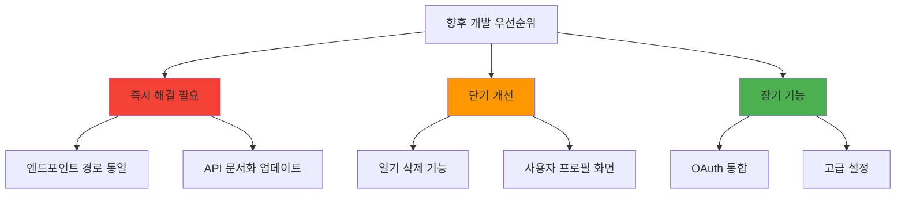

### 🔥 즉시 해결 필요

1. **엔드포인트 경로 통일**
   - 일기 CRUD: `/api/diaryposts` vs `/api/diaries` 불일치 해결
   - 이메일 인증: `/api/auth/verify-email` vs `/api/public/emailCheck` 불일치 해결

2. **API 문서화 완성**
   - AI 분석 엔드포인트 및 응답 구조 문서화
   - "진행중" 응답 형식 명시

### 🔧 단기 개선 (1-2주)

1. **일기 삭제 기능 구현**
   - 프론트엔드에 삭제 UI 및 로직 추가
   - 백엔드 DELETE 엔드포인트와 연결

2. **사용자 프로필 화면 생성**
   - 사용자가 프로필을 보고 업데이트할 수 있는 UI
   - 텍스트 기반 프로필 정보 업데이트를 위한 백엔드 엔드포인트 필요

3. **필드 일치성 확보**
   - 일기 생성 시 `date` 필드 처리 표준화
   - `MainScreen.tsx`의 `dates` 배열 요구사항 해결

### 🚀 장기 기능 (1-3개월)

1. **OAuth 통합 구현**
   - 백엔드의 OAuth2 엔드포인트를 사용하도록 프론트엔드 로직 구현
   - 네이버/카카오 소셜 로그인 완전 통합

2. **포괄적인 설정 시스템**
   - 사용자 설정 관리 (알림, 테마, 기본 설정)
   - 비밀번호 변경 기능

3. **고급 기능**
   - 오프라인 지원
   - 푸시 알림
   - 데이터 내보내기/가져오기

### ❓ 명확화 필요 사항

1. **이메일 인증 플로우**
   - 회원가입 전 이메일 인증이 별도 단계인 경우 `/api/public/join`의 `code` 필드 필요성

2. **선택적 필드 처리**
   - 회원가입 시 `phone`, `birthDate`, `gender` 등의 필드를 나중에 수집할 계획인지

3. **프로필 업데이트 전략**
   - 텍스트 기반 프로필 정보 업데이트를 위한 백엔드 엔드포인트 설계

---

## 📈 성공 메트릭

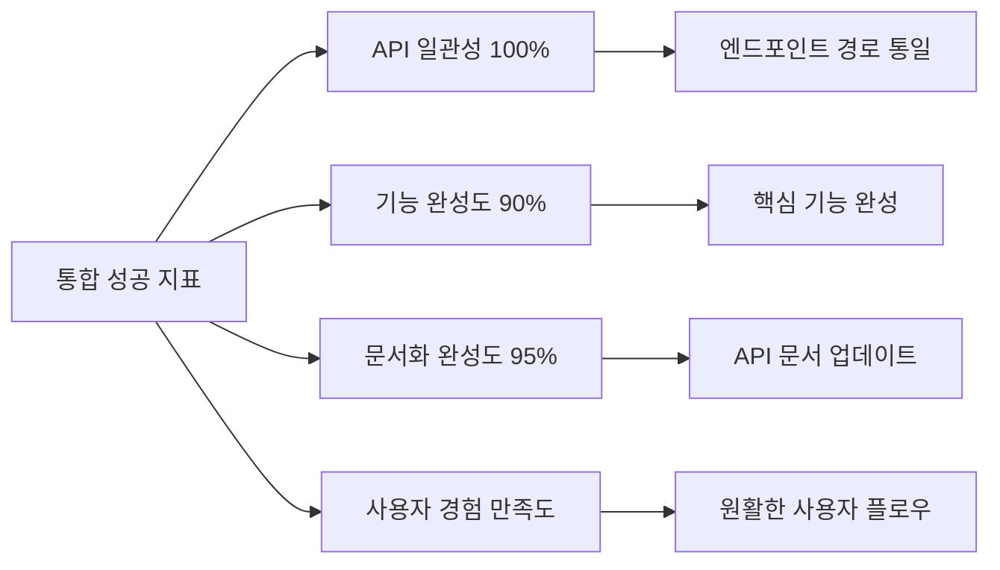

### 🎯 단기 목표 (2주 내)
- [ ] 일기 CRUD 엔드포인트 경로 통일
- [ ] 이메일 인증 엔드포인트 불일치 해결
- [ ] AI 분석 API 문서화 완성
- [ ] 일기 삭제 기능 구현

### 🎯 중기 목표 (1개월 내)
- [ ] 사용자 프로필 관리 기능 완성
- [ ] 모든 API 필드 일치성 확보
- [ ] 중복 확인 API 프론트엔드 통합

### 🎯 장기 목표 (3개월 내)
- [ ] OAuth 소셜 로그인 완전 통합
- [ ] 포괄적인 사용자 설정 시스템
- [ ] 고급 기능 (오프라인 지원, 푸시 알림) 구현

---

## 📋 결론

현재 CBT-Diary 애플리케이션은 **핵심 인증 및 일기 작성 기능에서 견고한 기반**을 가지고 있습니다. 그러나 몇 가지 **중요한 API 불일치 문제**가 즉시 해결되어야 하며, 사용자 프로필 관리 및 OAuth 통합과 같은 **고급 기능들이 완전한 사용자 경험**을 위해 구현되어야 합니다.

**우선순위 순서**:
1. 🔥 **즉시**: API 엔드포인트 경로 불일치 해결
2. 🚧 **단기**: 누락된 핵심 기능 (삭제, 프로필) 구현  
3. 🚀 **장기**: 고급 기능 (OAuth, 설정) 추가

이러한 개선사항이 완료되면 애플리케이션은 **완전히 기능적이고 사용자 친화적인 CBT 일기 솔루션**이 될 것입니다.
3.  **Settings Screen:** Implement UI for user settings, integrating with `GET/PUT /api/settings`.
4.  **Password Management UI:** Implement "Forgot Password" (using `/api/public/findPassWithEmail`) and "Change Password" (needs new backend endpoint).
5.  **Diary Deletion:** Add UI for deleting diary entries.
6.  **Resolve API Endpoint Mismatches:** Align frontend and backend for diary paths and `/api/auth/verify-email`.
7.  **Clarify AI Analysis Flow:** Document and align the asynchronous AI analysis request/poll/retrieve flow between frontend and backend.
8.  **SSE Notifications:** Backend has `/api/protected/sse/subscribe`. Frontend does not seem to use this. Could be for real-time notifications.
9.  **Admin Features:** Backend has "Admin Filter Management API". No corresponding frontend. (Likely out of scope for user-facing app).
10. **RootNavigator Logic:** The logic for switching between AuthStack and AppStack based on `user.emailVerified` in `RootNavigator.tsx` is currently commented out. This should be reviewed and enabled if email verification is a strict requirement before accessing app features.

---
