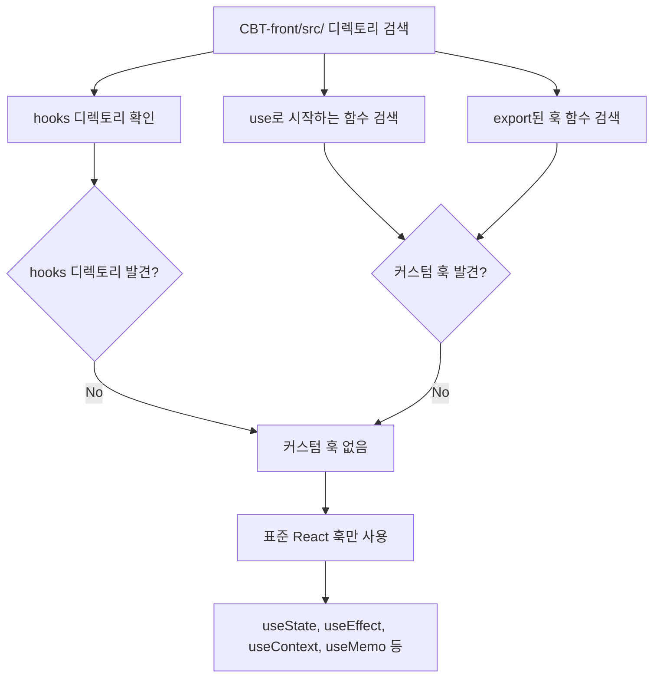
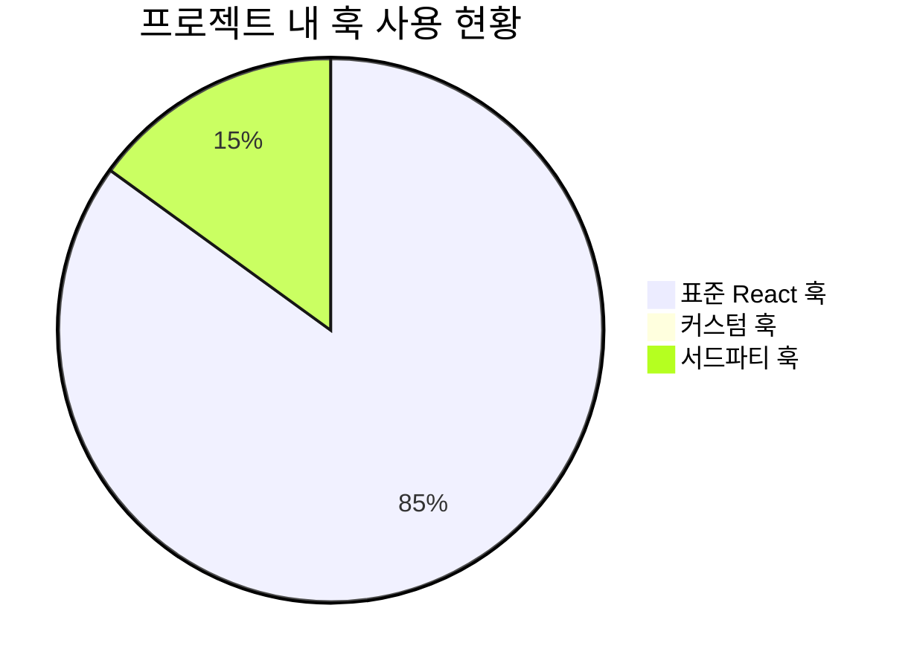
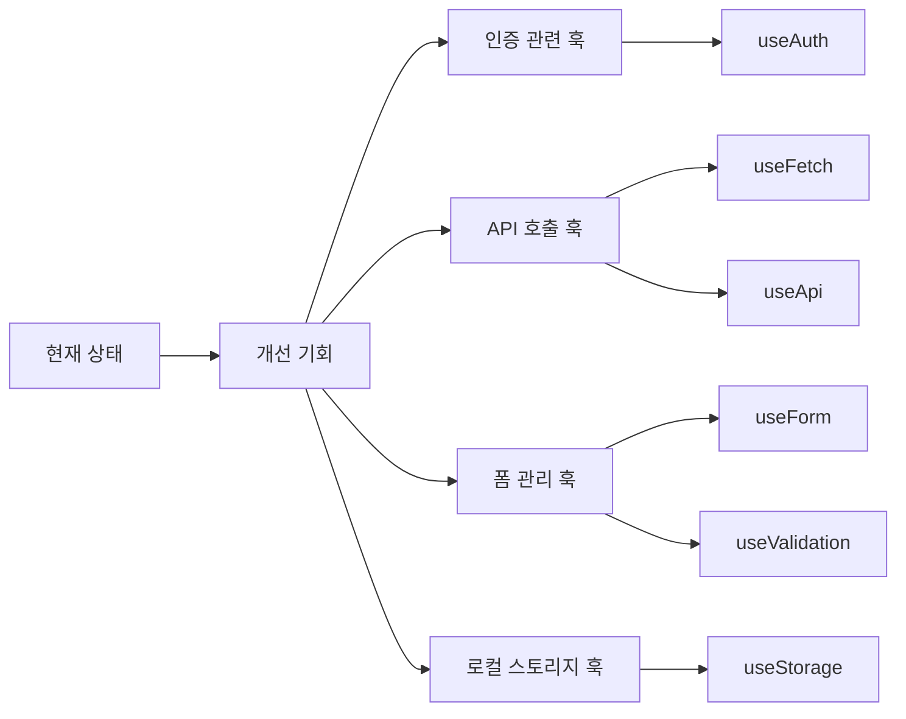

# 🎣 커스텀 React 훅 문서



## 🔍 검색 결과

`CBT-front/src/` 디렉토리 내에서 커스텀 React 훅에 대한 철저한 검색을 수행했습니다. 다음과 같은 검색을 포함했습니다:

### 📂 검색 방법

1. **디렉토리 구조 분석**: 잠재적인 `hooks` 디렉토리나 훅 관련 파일명을 식별하기 위해 디렉토리 내용을 나열했습니다.

2. **함수 선언 검색**: `use`로 시작하는 내보낸 함수 선언을 검색했습니다.
   ```typescript
   // 검색 대상 예시
   export function useMyHook(...) { }
   ```

3. **화살표 함수 검색**: `use`로 시작하는 내보낸 화살표 함수 선언을 검색했습니다.
   ```typescript
   // 검색 대상 예시
   export const useMyHook = (...) => { }
   ```

## 📋 검색 결과 요약



### ❌ 커스텀 훅 없음

현재 프로젝트에서는 **커스텀 React 훅이 식별되지 않았습니다**. 

### ✅ 사용 중인 표준 훅

프로젝트에서는 다음과 같은 표준 React 훅들이 활용되고 있습니다:

- `useState` - 컴포넌트 상태 관리
- `useEffect` - 부수 효과 및 생명주기 관리  
- `useContext` - Context API를 통한 전역 상태 접근
- `useMemo` - 메모이제이션을 통한 성능 최적화

## 🚀 향후 개선 제안



### 💡 추천 커스텀 훅 후보

1. **`useAuth`** - AuthContext 로직 캡슐화
2. **`useFetch`** - API 호출 패턴 재사용
3. **`useForm`** - 폼 상태 및 유효성 검사 관리
4. **`useLocalStorage`** - 로컬 스토리지 상태 동기화
5. **`useDebounce`** - 검색 입력 최적화

### 📝 구현 예시

```typescript
// 예시: useAuth 훅
const useAuth = () => {
  const context = useContext(AuthContext);
  if (!context) {
    throw new Error('useAuth must be used within AuthProvider');
  }
  return context;
};

// 예시: useFetch 훅  
const useFetch = (url: string) => {
  const [data, setData] = useState(null);
  const [loading, setLoading] = useState(true);
  const [error, setError] = useState(null);
  
  // 로직 구현...
  
  return { data, loading, error };
};
```

## 📊 프로젝트 훅 사용 현황

| 컴포넌트 | useState | useEffect | useContext | 기타 |
|----------|----------|-----------|------------|------|
| EmailVerificationScreen | ✅ | ❌ | ✅ | ❌ |
| SignInScreen | ✅ | ❌ | ✅ | ❌ |
| SignupScreen | ✅ | ❌ | ❌ | ❌ |
| AnalyzeScreen | ✅ | ✅ | ✅ | ❌ |
| MainScreen | ✅ | ✅ | ✅ | ❌ |
| ViewScreen | ✅ | ✅ | ✅ | ❌ |
| WriteScreen | ✅ | ✅ | ✅ | ❌ |

---

> **📌 참고**: 프로젝트별 재사용 가능한 커스텀 훅은 발견되지 않았지만, 표준 React 훅들이 컴포넌트 내에서 적절히 활용되고 있습니다. 향후 코드 재사용성과 유지보수성을 향상시키기 위해 위에서 제안한 커스텀 훅들의 구현을 고려해볼 수 있습니다.
