<!-- filepath: /workspace/CBT-Diary/docs/front/rev0.1/state_life.md -->
# 🔄 상태 관리 및 생명주기

이 문서는 React Context를 사용한 전역 상태 관리 접근 방식, 특히 `AuthContext`에 대해 설명하고 로컬 컴포넌트 상태에 대해서도 간략히 다룹니다.

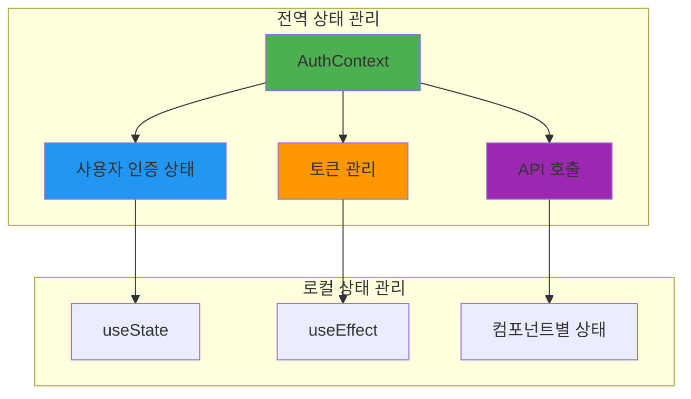

---

## 🌐 전역 상태: `AuthContext`

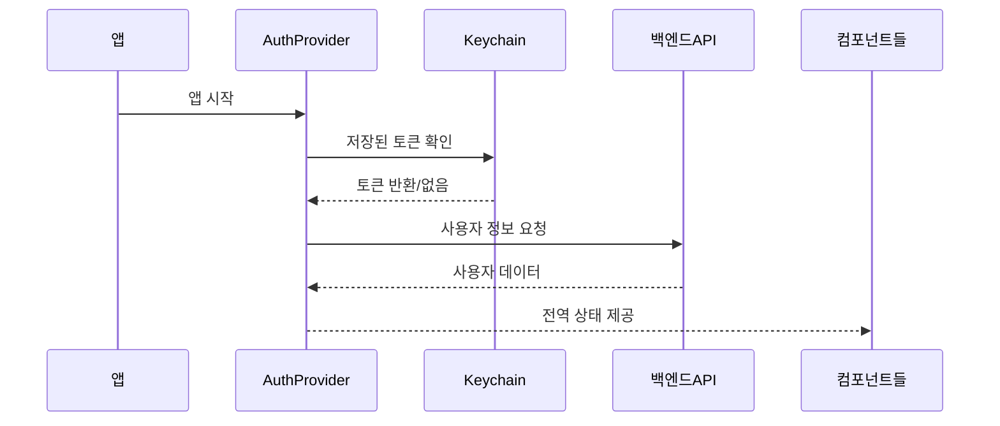

### 📋 AuthContext 개요

- **경로**: `CBT-front/src/context/AuthContext.tsx`
- **목적**: `AuthContext`는 prop drilling 없이 컴포넌트 트리 전체에서 인증 관련 데이터와 함수를 공유하는 방법을 제공합니다. 사용자 인증, 세션 지속성(Keychain을 통한), 그리고 인증된 API 호출을 위한 중앙화된 방법을 처리합니다.

---

## 📊 2. 상태 구조

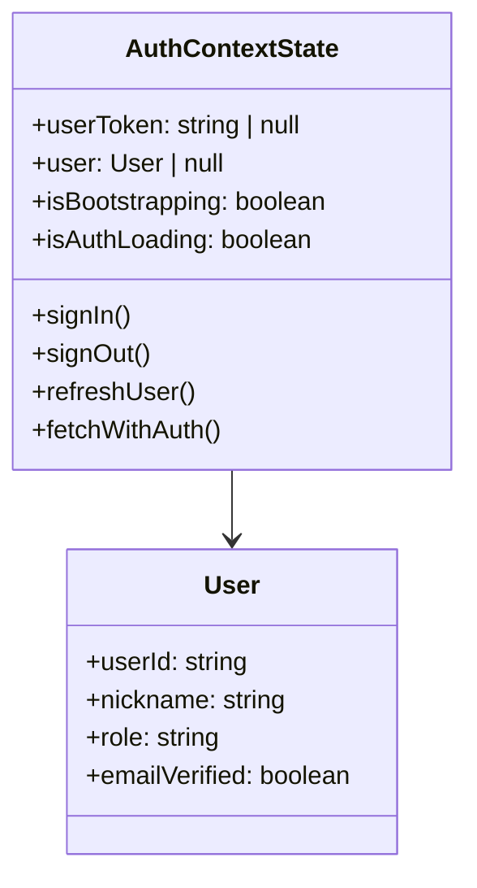

컨텍스트는 다음과 같은 상태를 관리합니다:

### 🔑 `userToken`
- **타입**: `string | null`
- **설명**: 인증된 사용자를 위한 JWT 액세스 토큰을 저장합니다. 사용자가 로그인하지 않은 경우 `null`입니다. 이 토큰은 인증된 API 요청의 `Authorization` 헤더에 사용됩니다.

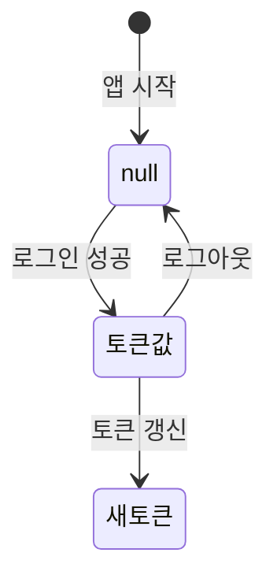

### 👤 `user`
- **타입**: `User | null`  
- **설명**: 현재 로그인한 사용자의 정보를 포함하는 객체를 저장합니다(ID, 닉네임, 역할, 이메일 인증 상태). 사용자가 로그인하지 않은 경우 `null`입니다.

```typescript
export type User = {
  userId: string;
  nickname: string;
  role: string;
  emailVerified: boolean; // 이메일 인증 상태
};
```

### ⏳ `isBootstrapping`
- **타입**: `boolean`
- **설명**: 애플리케이션이 현재 기존 자격 증명을 확인하는 과정(예: 앱 시작 시)에 있는지를 나타냅니다. Keychain에서 토큰을 검색하고 초기 사용자 데이터를 가져오는 동안 `true`이고, 그렇지 않으면 `false`입니다. 앱이 처음 실행될 때 로딩 화면을 표시하는 데 유용합니다.

### 🔄 `isAuthLoading`
- **타입**: `boolean`
- **설명**: 인증 관련 작업(로그인, 로그아웃 또는 토큰 갱신 등)이 현재 진행 중인지를 나타냅니다. 이러한 작업 중에 사용자에게 피드백을 제공하는 데 유용합니다(예: 버튼 비활성화 또는 스피너 표시).

---

## ⚙️ 3. 액션/함수들

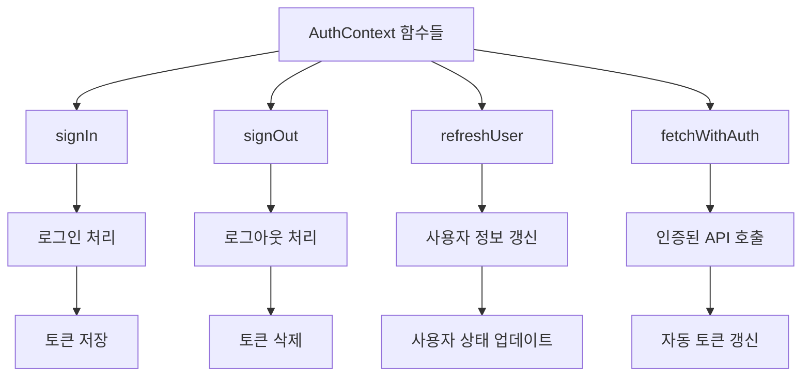

컨텍스트는 인증 상태와 상호작용하기 위한 다음 함수들을 노출합니다:

### 🔐 `signIn(userId: string, password: string): Promise<void>`

**매개변수**:
- `userId` (문자열): 사용자의 ID (이메일일 가능성 높음)
- `password` (문자열): 사용자의 비밀번호

**처리 과정**:
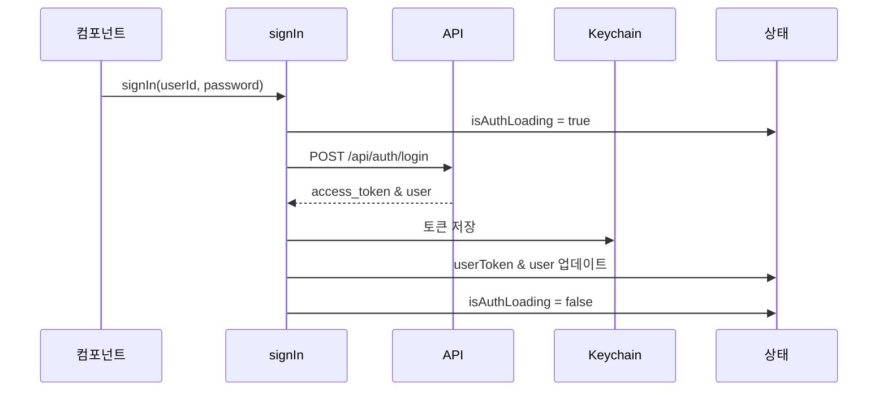

1. `isAuthLoading`을 `true`로 설정
2. `userId`와 `password`로 `/api/auth/login`에 POST 요청
3. 성공 시 `access_token`과 `user` 객체 수신
4. `Keychain.setGenericPassword()`를 사용하여 Keychain에 `access_token` 저장
5. `userToken`과 `user` 상태 업데이트
6. `finally` 블록에서 `isAuthLoading`을 `false`로 설정
7. 로그인 요청 실패 시 오류 발생

### 🚪 `signOut(): Promise<void>`

**처리 과정**:
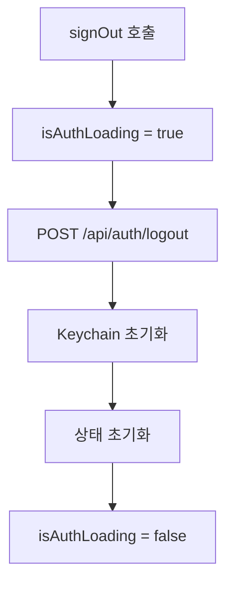

1. `isAuthLoading`을 `true`로 설정
2. `fetchWithAuth`를 사용하여 `/api/auth/logout`에 인증된 POST 요청
3. `Keychain.resetGenericPassword()`를 사용하여 Keychain 자격 증명 재설정
4. `userToken`과 `user` 상태를 `null`로 설정
5. `finally` 블록에서 `isAuthLoading`을 `false`로 설정

### 🌐 `fetchWithAuth(url: string, options?: RequestInit): Promise<Response>`

**매개변수**:
- `url` (문자열): API 요청을 위한 URL
- `options` (RequestInit, 선택적): 표준 `fetch` 옵션

**처리 과정**:
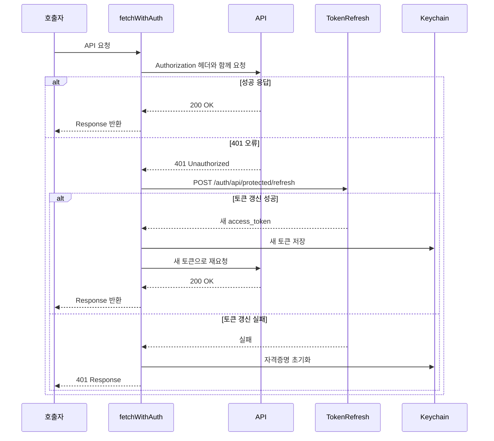

1. 현재 `userToken` 검색
2. 요청에 `Authorization: Bearer <userToken>`과 `Content-Type: application/json` 헤더 추가
3. `fetch` 요청 수행
4. 응답 상태가 `401` (Unauthorized)인 경우:
   - `expiredToken`을 `/auth/api/protected/refresh`에 POST하여 토큰 갱신 시도
   - 토큰 갱신 성공 시 새 `access_token` 수신
   - 새 `access_token`을 Keychain에 저장하고 `userToken` 상태 업데이트
   - 새 토큰으로 원본 요청 재시도
   - 토큰 갱신 실패 시 Keychain 재설정, `userToken`과 `user`를 `null`로 설정, `401` 응답 반환
5. fetch 호출의 `Response` 객체 반환

### 🔄 `refreshUser(): Promise<void>`

**처리 과정**:
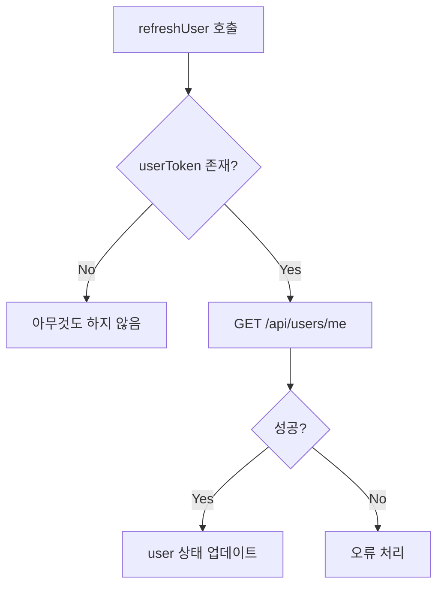

1. `userToken`을 사용할 수 없으면 아무것도 하지 않음
2. `fetchWithAuth`를 사용하여 `/api/users/me`에 인증된 GET 요청
3. 성공 시 받은 사용자 데이터로 `user` 상태 업데이트

---

## 🏗️ 4. AuthProvider

```mermaid
flowchart TD
    A[AuthProvider 마운트] --> B[초기 상태 설정]
    B --> C[bootstrapAsync 실행]
    C --> D[Keychain에서 토큰 확인]
    D --> E{토큰 존재?}
    
    E -->|Yes| F[userToken 상태 설정]
    E -->|No| G[토큰 없음]
    
    F --> H[/api/users/me 호출]
    H --> I{사용자 정보 성공?}
    I -->|Yes| J[user 상태 업데이트]
    I -->|No| K[토큰 무효]
    
    G --> L[isBootstrapping = false]
    J --> L
    K --> L
    
    L --> M[컨텍스트 값 제공]
```

### 🎯 컴포넌트 역할
- **컴포넌트**: `AuthProvider`
- **목적**: 인증 컨텍스트에 액세스해야 하는 애플리케이션 부분(일반적으로 전체 애플리케이션)을 래핑하는 React 컴포넌트입니다.

### 🚀 초기화 과정
- `useState`를 사용하여 `userToken`, `user`, `isBootstrapping`, `isAuthLoading` 관리
- 컴포넌트 마운트(앱 시작) 시 실행되는 `useEffect` 훅:
  - `bootstrapAsync` 효과는 `Keychain.getGenericPassword()`에서 자격 증명(`authToken`) 로드 시도
  - 자격 증명이 존재하면 `userToken` 상태 설정
  - 그 다음 `fetchWithAuth`를 호출하여 `/api/users/me`에서 현재 사용자 데이터 가져오고 `user` 상태 업데이트
  - 이 과정이 완료된 후 `isBootstrapping`을 `false`로 설정

### 🔗 컨텍스트 제공
- `AuthContext.Provider`를 렌더링하고 현재 상태 값과 액션 함수가 포함된 `contextValue` 객체(`useMemo`로 메모화됨)를 전달합니다.

---

## 📱 5. 사용법

인증 상태나 함수에 액세스해야 하는 컴포넌트는 `useContext` 훅을 사용하여 컨텍스트를 사용할 수 있습니다:

```typescript
import React, { useContext } from 'react';
import { AuthContext } from './AuthContext'; // 필요에 따라 경로 조정

function MyComponent() {
  const { user, userToken, signIn, isAuthLoading } = useContext(AuthContext);

  if (isAuthLoading) {
    // 로딩 인디케이터 표시
  }

  if (user) {
    return <Text>환영합니다, {user.nickname}님!</Text>;
  } else {
    // 로그인 버튼이나 폼 표시
  }
  // ...
}
```

---

## 📱 로컬 컴포넌트 상태

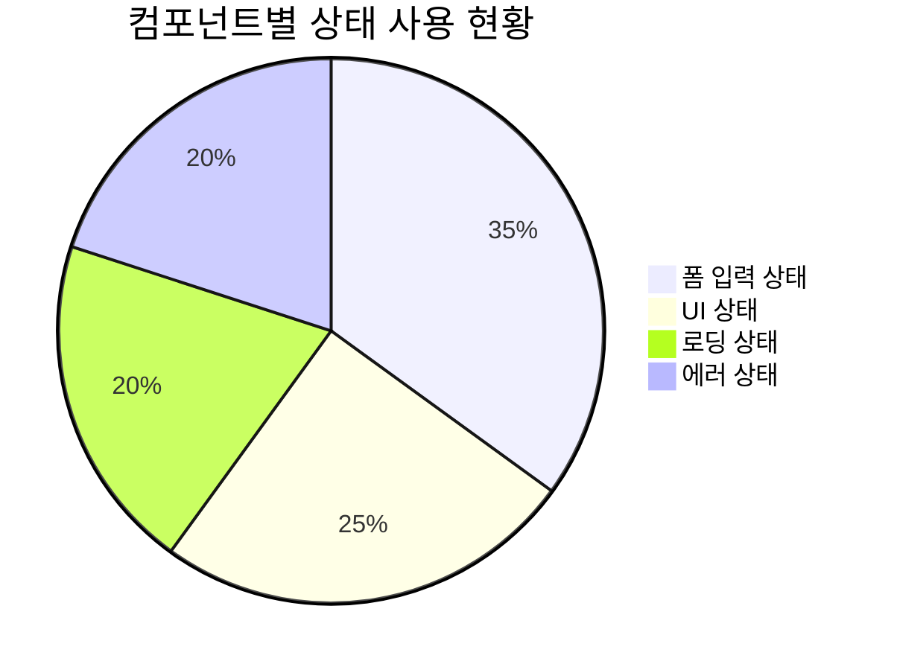

`AuthContext`가 전역 인증 상태를 관리하는 동안, 개별 컴포넌트는 `useState` 훅을 사용하여 자체 내부 상태도 관리합니다.

### 🎯 목적
로컬 상태는 특정 컴포넌트와 그 자식들에게만 관련된 데이터나 전역적으로 공유할 필요가 없는 UI별 상태에 사용됩니다.

### 🔧 일반적인 사용 사례

#### 📝 폼 입력
제출 전 텍스트 입력, 선택 등의 값을 저장합니다.
```typescript
// 예시: SignInScreen의 이메일/비밀번호
const [email, setEmail] = useState('');
const [password, setPassword] = useState('');

// 예시: WriteScreen의 일기 제목/내용
const [title, setTitle] = useState('');
const [content, setContent] = useState('');
```

#### 🎛️ UI 토글
모달, 날짜 선택기, 달력 표시 등 UI 요소의 표시 여부나 상태를 관리합니다.
```typescript
// 예시: SignupScreen의 모달 표시
const [modalVisible, setModalVisible] = useState(true);

// 예시: WriteScreen의 날짜 선택기
const [showPicker, setShowPicker] = useState(false);

// 예시: MainScreen의 달력 표시
const [calendarVisible, setCalendarVisible] = useState(false);
```

#### 📊 컴포넌트별 데이터
단일 컴포넌트에서 가져오거나 처리한 데이터로 다른 곳에서는 필요하지 않은 데이터를 저장합니다.
```typescript
// 예시: MainScreen의 필터된 게시물
const [filteredPosts, setFilteredPosts] = useState([]);

// 예시: AnalyzeScreen의 분석 데이터
const [analysis, setAnalysis] = useState(null);
```

#### ⏳ 로딩/오류 상태
컴포넌트별 API 호출이나 작업의 로딩 및 오류 상태를 관리합니다.
```typescript
// 예시: 일반적인 패턴
const [isLoading, setIsLoading] = useState(false);
const [error, setError] = useState('');
```

---

## 🔗 6. 전역 상태와 로컬 상태의 상호작용

```mermaid
graph LR
    subgraph "전역 상태 (AuthContext)"
        A[사용자 인증 정보]
        B[토큰 관리]
    end
    
    subgraph "로컬 상태"
        C[폼 입력값]
        D[UI 상태]
        E[임시 데이터]
    end
    
    A --> C: 인증 상태에 따른 폼 제어
    B --> D: 로딩 상태 동기화
    C --> A: 로그인/가입 데이터 전송
    
    style A fill:#4caf50
    style B fill:#2196f3
    style C fill:#ff9800
    style D fill:#9c27b0
    style E fill:#795548
```

### 🔄 상호작용 패턴

1. **인증 상태 → UI 제어**: `AuthContext`의 `isAuthLoading`이 버튼 비활성화/로딩 스피너를 제어
2. **로컬 입력 → 전역 액션**: 폼 입력값이 `signIn()` 함수로 전달되어 전역 상태 변경
3. **전역 상태 → 네비게이션**: 사용자 인증 상태 변화가 화면 스택 전환을 트리거

---

## 📊 상태 관리 모범 사례

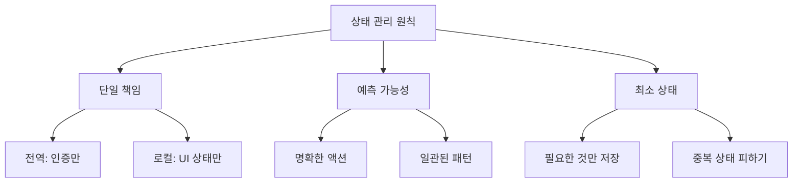

### ✅ 현재 프로젝트의 장점

- ✅ **명확한 책임 분리**: 인증은 전역, UI 상태는 로컬
- ✅ **일관된 패턴**: 모든 컴포넌트가 유사한 상태 관리 패턴 사용
- ✅ **자동 토큰 관리**: `fetchWithAuth`를 통한 투명한 토큰 갱신

### 🔄 개선 가능한 영역

- 🔄 **커스텀 훅 도입**: 반복되는 상태 로직의 재사용성 향상
- 🔄 **에러 상태 표준화**: 전역 에러 처리 패턴 도입
- 🔄 **상태 타입 강화**: TypeScript를 활용한 더 강한 타입 체크

이러한 분리는 전역 관심사(인증 등)와 로컬 컴포넌트 책임 간의 명확한 구분을 가능하게 합니다.
