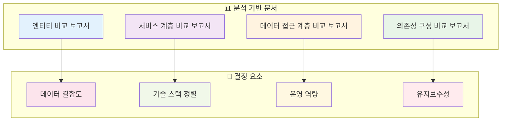
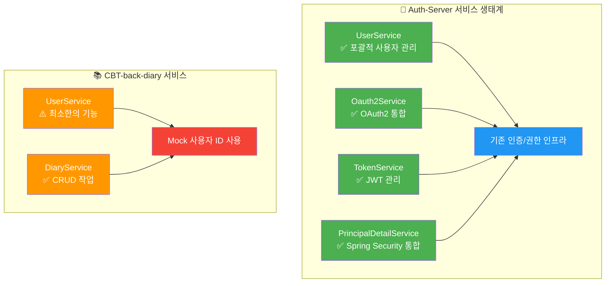
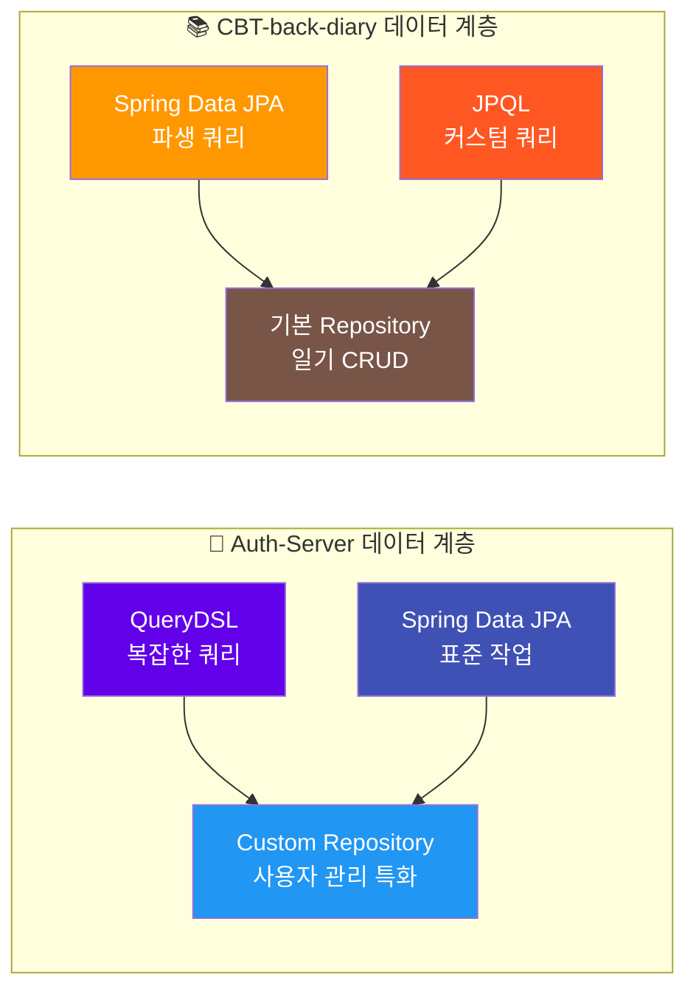
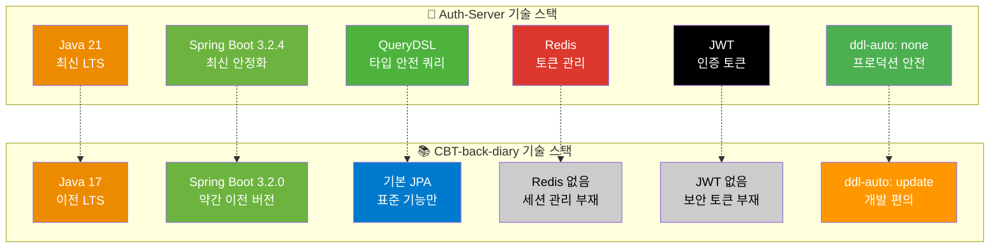
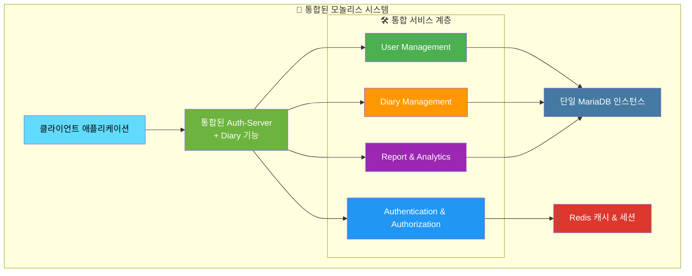
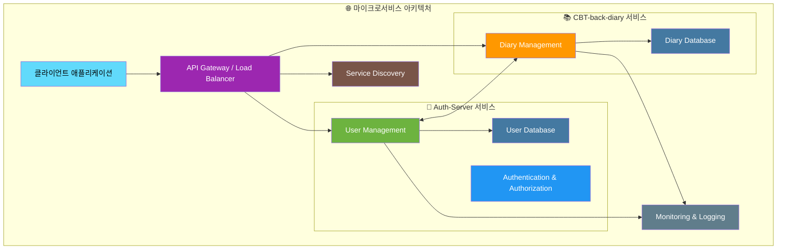
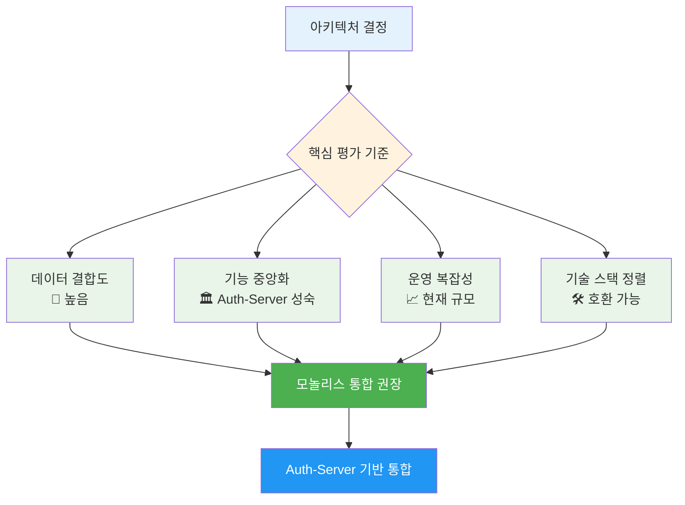
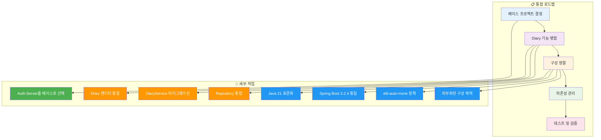
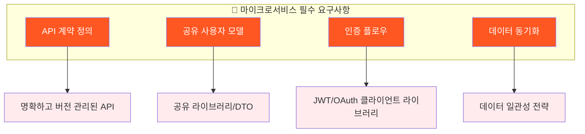

# 🏛️ 아키텍처 권장 보고서: Auth-Server & CBT-back-diary

## 1. 📖 서론

이 보고서는 `Auth-Server`와 `CBT-back-diary` 프로젝트의 통합 또는 분리에 대한 아키텍처 권장사항을 제공합니다. 이 권장사항은 다음 문서들에 기록된 상세 분석을 기반으로 합니다:



**📋 분석 문서 목록:**

- `entity_comparison_report.md`
- `service_layer_comparison_report.md`
- `data_access_layer_comparison_report.md`
- `dependency_config_comparison_report.md`

**🎯 목표**: 데이터 결합도, 기술 스택 정렬, 운영 역량, 향후 유지보수성을 고려하여 가장 적합한 아키텍처 접근 방식(모놀리스 또는 마이크로서비스)을 결정합니다.

## 2. 📊 주요 비교 분석 결과 요약

이전 분석 보고서에서 도출된 결정에 중요한 핵심 포인트들:

### 🔗 엔티티 중복 및 결합도

```mermaid
erDiagram
    Auth-Server {
        User ||--o{ Diary : "owns"
        User ||--o{ AuthProvider : "has"
        Diary ||--o{ Report : "generates"
        Report ||--o{ DiaryReportLink : "links"
    }

    CBT-back-diary {
        User ||--o{ Diary : "creates"
        Diary {
            string user_id "FK"
        }
    }
```

**🔍 주요 발견사항:**

- **중복 엔티티**: `User`, `AuthProvider`, `Diary`와 같은 핵심 엔티티가 양쪽 프로젝트에 존재
- **강한 의존성**: `CBT-back-diary`의 `Diary` 엔티티가 `User` 엔티티에 강한 의존성 (외래 키 `user_id`)
- **기능 확장 징후**: Auth-Server에 이미 `Diary`, `Report`, `DiaryReportLink` 엔티티 존재

### ⚙️ 서비스 계층 기능성



**📈 서비스 성숙도 비교:**

| 영역            | 🔐 Auth-Server                               | 📚 CBT-back-diary  |
| --------------- | -------------------------------------------- | ------------------ |
| **사용자 관리** | ✅ 완전한 등록, 비밀번호 업데이트, 중복 확인 | ⚠️ 기본적인 조회만 |
| **인증**        | ✅ OAuth2, JWT, Spring Security              | ❌ 없음            |
| **보안**        | ✅ 포괄적 보안 체계                          | ❌ Mock 사용자 ID  |
| **일기 기능**   | ⚠️ 기본 엔티티 존재                          | ✅ 완전한 CRUD     |

### 🗄️ 데이터 접근 계층



### 🛠️ 기술 스택 및 의존성



## 3. 🔍 아키텍처 접근 방식 평가

### 3.1. 🏢 모놀리스 통합

`CBT-back-diary` 기능을 `Auth-Server`에 통합 (또는 그 반대, 단 Auth-Server가 더 기능 완성도가 높은 베이스로 보임)



#### ✅ 장점

| 💚 장점                   | 📝 상세 설명                                                                                        | 🎯 비즈니스 가치                     |
| ------------------------- | --------------------------------------------------------------------------------------------------- | ------------------------------------ |
| **중복 제거**             | 중복된 `User`, `AuthProvider` 엔티티 및 중복 사용자 관리 로직 제거                                  | 개발 효율성 향상, 유지보수 비용 절감 |
| **데이터 일관성 단순화**  | 단일 데이터베이스로 강력한 트랜잭션 일관성 보장, 복잡한 데이터 동기화 메커니즘 불필요               | 데이터 무결성 보장, 버그 위험 감소   |
| **지연 시간 감소**        | 사용자와 일기 데이터가 필요한 작업에서 직접 메서드 호출이 서비스 간 API 호출보다 빠름               | 사용자 경험 향상, 응답 속도 개선     |
| **개발/배포 단순화**      | 단일 코드베이스로 관리, 빌드, 배포가 용이 (특히 소규모 팀이나 초기 프로젝트 단계)                   | 운영 복잡성 감소, 출시 시간 단축     |
| **Auth-Server 강점 활용** | 성숙한 인증, 권한 부여(OAuth2, JWT, Redis 기반 토큰 관리), 사용자 관리 기능을 일기 기능이 직접 활용 | 보안 강화, 기능 재사용성 증대        |
| **원자적 트랜잭션**       | 사용자와 일기 데이터를 포괄하는 작업을 단일 데이터베이스 트랜잭션으로 처리하여 데이터 무결성 보장   | 비즈니스 로직 신뢰성 향상            |

#### ❌ 단점

| 🔴 단점                        | 📝 상세 설명                                                                                                | ⚠️ 위험 요소                                   |
| ------------------------------ | ----------------------------------------------------------------------------------------------------------- | ---------------------------------------------- |
| **기술 통합 노력**             | Java 버전 통일(21 vs 17), Spring Boot 버전 정렬, `Diary` 엔티티 충돌 해결, `ddl-auto` 정책 통일             | 초기 통합 비용, 개발 일정 지연 가능성          |
| **애플리케이션 복잡성 증가**   | 더 크고 복잡한 모놀리스로 인한 빌드 시간 증가, 전체 시스템 이해 난이도 상승                                 | 개발자 온보딩 시간 증가, 코드 품질 관리 어려움 |
| **확장성 도전**                | 특정 부분(일기 서비스 vs 인증 서비스)의 독립적 확장 어려움, 전체 애플리케이션을 함께 확장해야 함            | 리소스 비효율성, 성능 병목 가능성              |
| **배포 경직성**                | 모놀리스의 어떤 부분이든 변경 시 전체 애플리케이션 재배포 필요                                              | 배포 위험 증가, 다운타임 발생 가능성           |
| **CBT-back-diary 단순성 손실** | 원래 간단하고 집중된 서비스였던 CBT-back-diary가 복잡한 Auth-Server에 통합되는 것이 단점으로 인식될 수 있음 | 서비스 특화성 감소, 복잡성 증가                |

### 3.2. 🔗 마이크로서비스 분리

`Auth-Server`와 `CBT-back-diary`를 API를 통해 통신하는 별도 서비스로 유지



#### ✅ 장점

| 💚 장점                   | 📝 상세 설명                                                                                      | 🎯 비즈니스 가치                  |
| ------------------------- | ------------------------------------------------------------------------------------------------- | --------------------------------- |
| **관심사 분리**           | 인증/사용자 관리와 일기 기능 간 명확한 경계                                                       | 도메인 전문화, 코드 응집도 향상   |
| **독립적 개발/배포**      | 팀이 각 서비스를 독립적으로 작업, 업데이트, 배포 가능 → 개별 서비스의 개발 사이클 가속화          | 개발 속도 향상, 팀 자율성 증대    |
| **기술 다양성**           | 두 서비스 모두 Spring Boot이지만, 특정 라이브러리 버전이나 장기적으로 언어까지도 다양화 가능      | 기술 선택의 유연성, 최적화 가능성 |
| **독립적 확장성**         | 각 서비스가 특정 로드 요구사항에 따라 확장 가능                                                   | 리소스 효율성, 비용 최적화        |
| **장애 격리**             | 한 서비스의 문제가 다른 서비스를 다운시킬 가능성 감소 (복원력 설계 시)                            | 시스템 안정성 향상, 가용성 개선   |
| **CBT-back-diary 단순성** | CBT-back-diary가 모든 사용자 관리를 Auth-Server에 API 호출로 위임하여 집중되고 단순하게 유지 가능 | 서비스 집중도 유지, 복잡성 관리   |

#### ❌ 단점

| 🔴 단점                     | 📝 상세 설명                                                                                                                               | ⚠️ 위험 요소                           |
| --------------------------- | ------------------------------------------------------------------------------------------------------------------------------------------ | -------------------------------------- |
| **서비스 간 통신 오버헤드** | 서비스 간 API 호출(예: DiaryService가 사용자 토큰 검증이나 사용자 세부 정보 가져오기 위해 Auth-Server 호출)로 인한 네트워크 지연 및 복잡성 | 성능 저하, 통신 장애 위험              |
| **데이터 일관성 도전**      | 여러 서비스에서 참조되거나 부분적으로 중복될 수 있는 데이터(사용자 정보 등)의 일관성 유지 복잡성, 최종 일관성 모델 필요 가능성             | 데이터 불일치, 동기화 복잡성           |
| **중복된 모델/DTO**         | `User` 정보(ID나 기본 프로필 데이터라도)가 `CBT-back-diary`에서 표현되어야 하여 중복된 DTO나 공유 클라이언트 라이브러리 발생 가능성        | 코드 중복, 버전 관리 복잡성            |
| **분산 트랜잭션**           | 여러 서비스에 걸친 트랜잭션 관리가 모놀리스의 로컬 트랜잭션보다 훨씬 복잡                                                                  | 데이터 일관성 위험, 구현 복잡성        |
| **운영 복잡성**             | 여러 서비스 관리, 모니터링, 디버깅이 단일 애플리케이션보다 복잡, 서비스 디스커버리, 로드 밸런싱, 복원력 통신 패턴 필요                     | 운영 비용 증가, 장애 대응 복잡성       |
| **API 계약 관리**           | 서비스 간 잘 정의되고 버전 관리된 API 필요, Auth-Server API 변경이 CBT-back-diary를 중단시킬 수 있음                                       | 인터페이스 호환성 위험, 배포 조정 필요 |
| **보안**                    | 서비스 간 통신 보안이 추가적인 복잡성 계층 추가                                                                                            | 보안 취약점 증가, 설정 복잡성          |

## 4. 💡 권장사항



**🎯 권장사항: Auth-Server를 기반으로 한 모놀리스 통합**

### 🔍 근거

1. **🔗 강한 데이터 결합도**: `CBT-back-diary`의 `Diary` 기능은 본질적으로 `User` 엔티티와 연결되어 있습니다. 일기 생성, 조회, 업데이트와 같은 작업은 거의 항상 사용자 컨텍스트와 권한 부여가 필요합니다. 마이크로서비스 간에 이러한 관계를 관리하면 API 호출, 데이터 동기화, 트랜잭션 무결성 측면에서 상당한 복잡성이 발생합니다.

2. **🏛️ 핵심 기능 중앙화**: `Auth-Server`는 사용자 관리, 인증(OAuth2, JWT), 권한 부여를 위한 더 성숙하고 기능이 풍부한 플랫폼을 제공합니다. `CBT-back-diary`를 이 기존 프레임워크에 통합하면 일기 기능이 이러한 강력한 서비스를 직접 활용할 수 있습니다.

3. **📈 운영 복잡성 감소**: 마이크로서비스가 확장성 이점을 제공하지만, 현재 설정은 밀접하게 관련된 두 도메인을 시사합니다. 이 애플리케이션의 예상 규모에서는 잘 구조화된 단일 모놀리스 관리가 분산 시스템의 복잡성을 가진 두 마이크로서비스 관리보다 운영상 더 간단할 수 있습니다.

4. **🛠️ 기술 스택 정렬**: 두 프로젝트 모두 Spring Boot와 MariaDB를 사용합니다. Spring Boot 버전(3.2.4와 3.2.0)이 매우 가깝고 같은 주요 버전(3.x)에 있어 모놀리스 내에서 의존성 관리가 가능합니다.

5. **🔄 중복 해결**: 모놀리스 접근 방식은 `User`와 `AuthProvider` 엔티티 및 관련 로직의 중복을 직접 해결합니다.

6. **📊 Auth-Server의 기존 일기 관련 엔티티**: Auth-Server에 `Diary`, `Report`, `DiaryReportLink` 엔티티가 존재한다는 것은 이미 순수 인증을 넘어선 기능을 처리하도록 설계되었거나 발전하고 있음을 시사합니다.

### 🚀 통합 전략 (모놀리스 선택 시)



#### 📦 베이스 프로젝트

- **Auth-Server**를 베이스 프로젝트로 사용 (더 포괄적인 보안 및 사용자 관리 인프라 보유)

#### 🔄 Diary 기능 병합

- **엔티티 분석**: `CBT-back-diary`의 `Diary` 엔티티와 `Auth-Server`의 `Diary` 엔티티를 신중히 분석하여 통합된 `Diary` 모델 결정
- **서비스 마이그레이션**: `CBT-back-diary`의 `DiaryService` 로직을 `Auth-Server`로 마이그레이션
- **리포지토리 통합**: Diary 관련 리포지토리를 Auth-Server에 추가 또는 병합

#### ⚙️ 구성 정렬

- **Java 21**과 **Spring Boot 3.2.4** (또는 최신 안정 3.x 버전)로 표준화
- **ddl-auto=none** 정책 채택 및 데이터베이스 마이그레이션 구현 (Flyway 또는 Liquibase 사용)
- Auth-Server의 외부화된 구성 접근 방식을 모델로 `application.properties` 통합

#### 📦 의존성 관리

- `CBT-back-diary`의 필요한 의존성을 Auth-Server의 `build.gradle`에 추가
- `CBT-back-diary`의 `build.gradle`은 실질적으로 대체됨

### 🔍 마이크로서비스 고려사항 (모놀리스 미선택 시)

권장사항에도 불구하고 마이크로서비스 접근 방식을 추구할 경우 다음이 중요합니다:



- **📝 API 계약**: Auth-Server와 CBT-back-diary 간 사용자 인증, 권한 부여, 필요한 사용자 정보 검색을 위한 명확하고 버전 관리된 API 계약 정의
- **👥 공유 사용자 모델**: 불일치를 피하기 위한 사용자 표현을 위한 공유 라이브러리 또는 명확한 DTO 생성
- **🔐 인증 플로우**: CBT-back-diary에 토큰 검증 및 사용자 컨텍스트를 위해 Auth-Server와 상호작용하는 강력한 클라이언트 측 로직 구현
- **🔄 데이터 동기화**: CBT-back-diary에서 로컬로 필요할 수 있는 사용자 데이터 처리 전략 신중히 고려

### 🎯 결론

사용자 데이터 주변의 긴밀한 결합과 Auth-Server의 기존 포괄적 기능을 고려할 때, **모놀리스로의 통합이 현재 단계에서 이 두 구성 요소에 대해 더 실용적이고 효율적인 접근 방식**으로 보입니다.

---

> 💡 **참고**: 이 권장사항은 현재 프로젝트 규모와 팀 역량을 고려한 것이며, 향후 시스템이 성장하고 팀이 확장되면 마이크로서비스로의 분해를 재고려할 수 있습니다.
