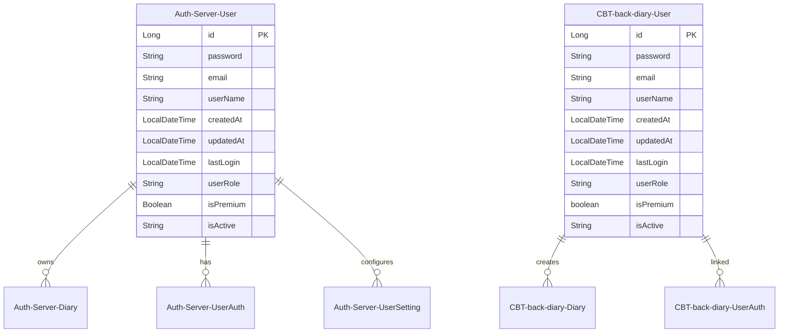
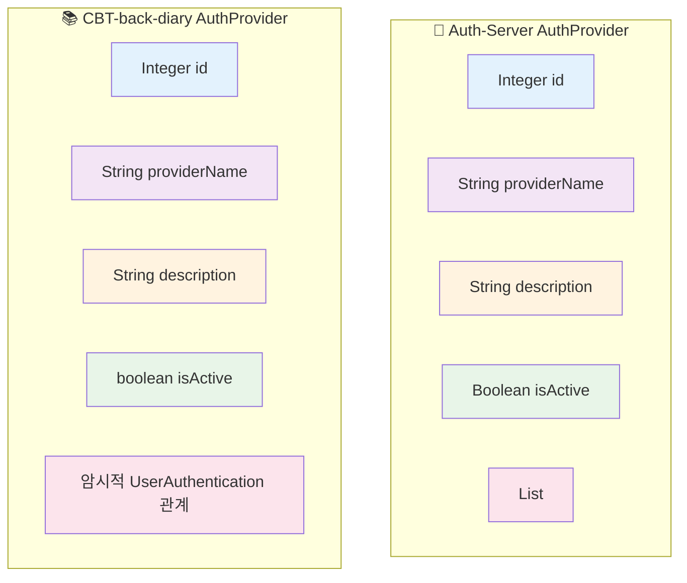
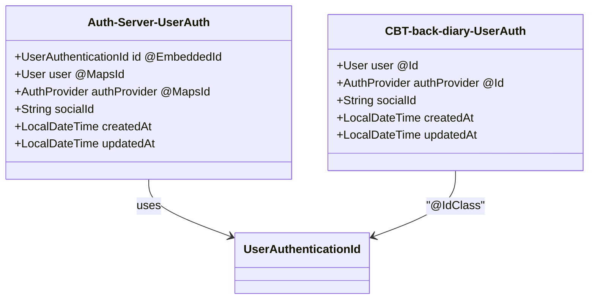
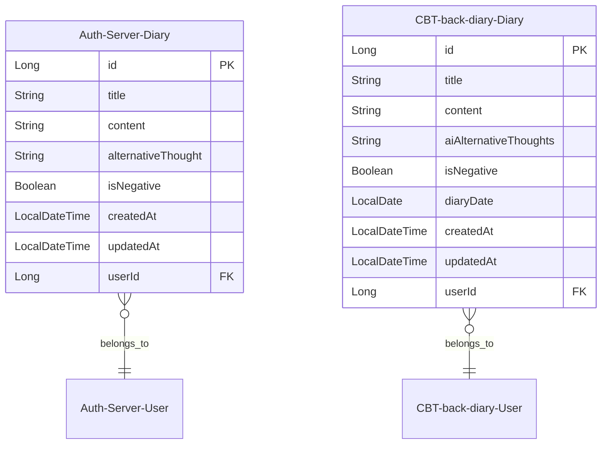
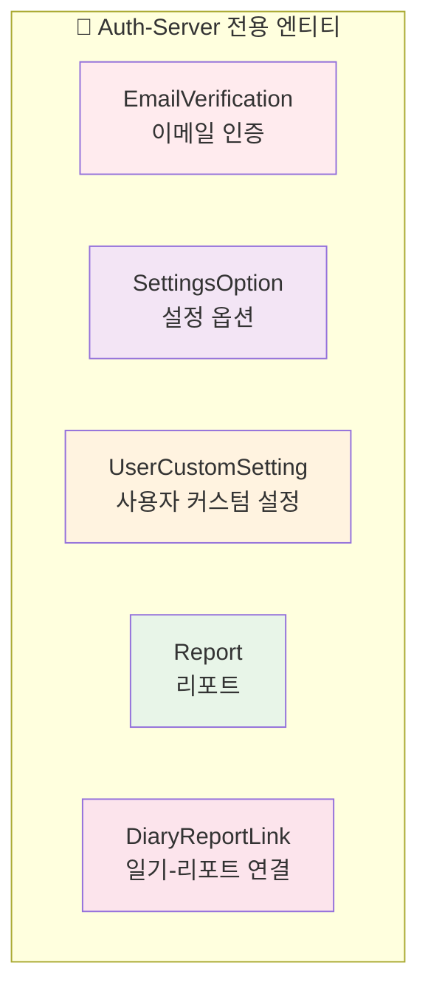
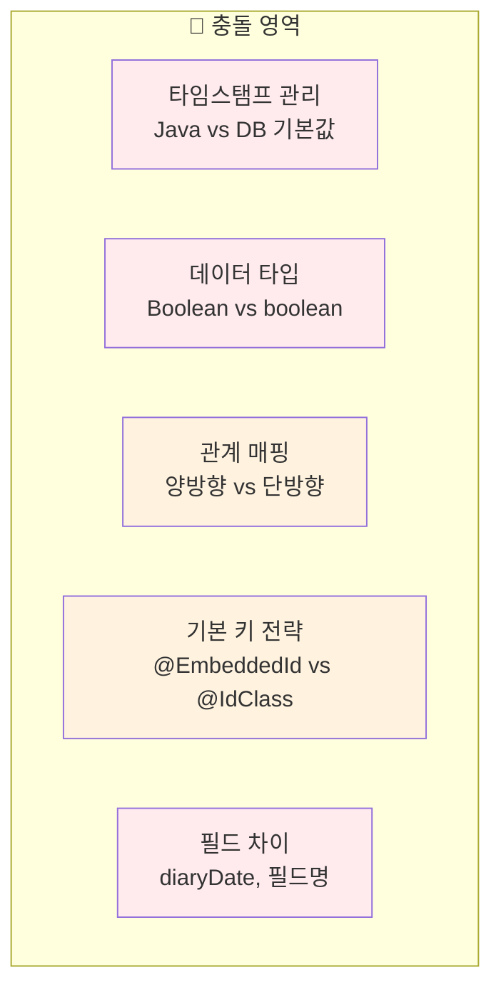
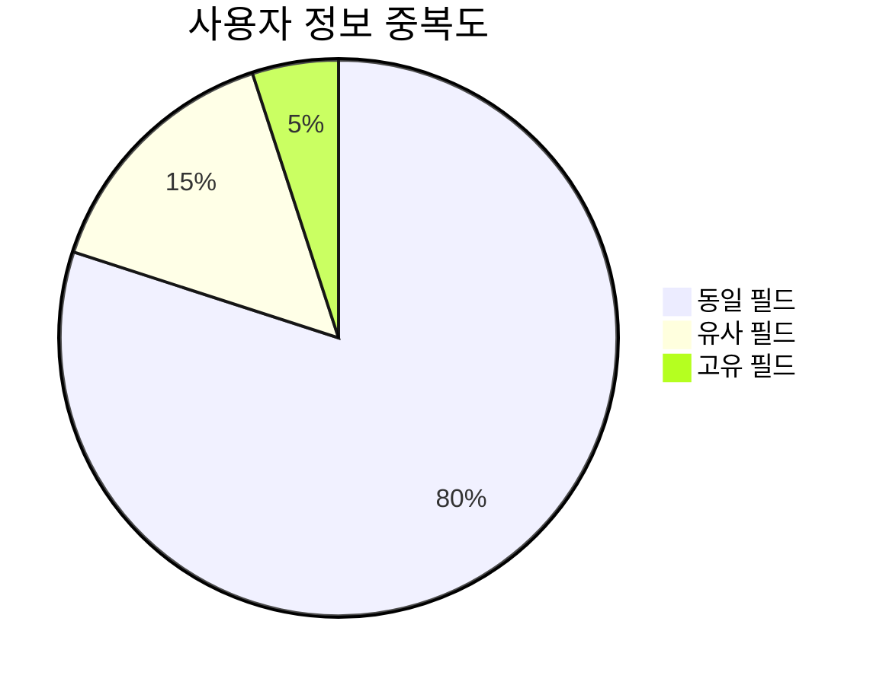
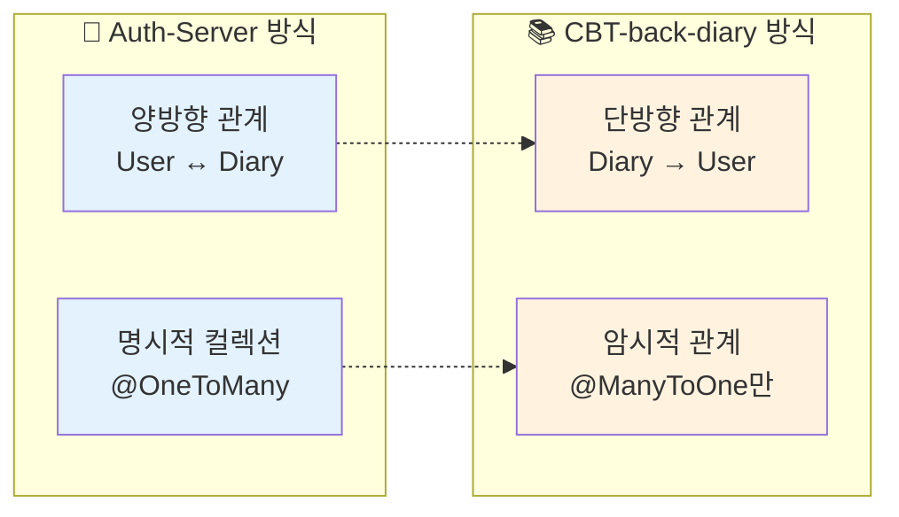

# 🗃️ 엔티티 비교 보고서

이 보고서는 `Auth-Server`와 `CBT-back-diary` 프로젝트의 엔티티를 비교 분석합니다.

## 📊 동일하거나 유사한 이름의 엔티티

### 👤 User 엔티티 비교



#### 📋 상세 비교 표

| 🔍 기능           | 🔐 Auth-Server                                                                                 | 📚 CBT-back-diary                                                                                                                                                     | 🔄 차이점/참고사항                                                      |
| ----------------- | ---------------------------------------------------------------------------------------------- | --------------------------------------------------------------------------------------------------------------------------------------------------------------------- | ----------------------------------------------------------------------- |
| **엔티티명**      | `User`                                                                                         | `User`                                                                                                                                                                | -                                                                       |
| **목적**          | 시스템 내 사용자 표현                                                                          | 시스템 내 사용자 표현                                                                                                                                                 | 동일한 기본 목적                                                        |
| **📍 필드 분석**  |
| `id`              | `Long`, `@Id`, `@GeneratedValue(IDENTITY)`                                                     | `Long`, `@Id`, `@GeneratedValue(IDENTITY)`, `@Column(name="id", updatable=false, nullable=false)`                                                                     | CBT-back-diary는 `@Column` 명시적 정의                                  |
| `password`        | `String`, `@Column(nullable=false)`                                                            | `String`, `@Column(name="password", nullable=false)`                                                                                                                  | CBT-back-diary는 컬럼명 명시적 지정                                     |
| `email`           | `String`, `@Column(name="email", nullable=false, length=255, unique=true)`                     | `String`, `@Column(name="email", unique=true, nullable=false)`                                                                                                        | Auth-Server는 length 255 지정                                           |
| `userName`        | `String`, `@Column(name="user_name", nullable=false, length=50, unique=true)`                  | `String`, `@Column(name="user_name", unique=true, nullable=false, length=50)`                                                                                         | 동일, CBT-back-diary에서 DTO의 `nickname`으로 매핑                      |
| `createdAt`       | `LocalDateTime`, `@Column(name="created_at", nullable=false, updatable=false)`                 | `LocalDateTime`, `@Builder.Default`, `@Column(name="created_at", updatable=false, nullable=false, columnDefinition="TIMESTAMP DEFAULT CURRENT_TIMESTAMP")`            | CBT-back-diary는 DB 기본값 사용, Auth-Server는 `@PrePersist` 사용       |
| `updatedAt`       | `LocalDateTime`, `@Column(name="updated_at", nullable=false)`                                  | `LocalDateTime`, `@Builder.Default`, `@Column(name="updated_at", nullable=false, columnDefinition="TIMESTAMP DEFAULT CURRENT_TIMESTAMP ON UPDATE CURRENT_TIMESTAMP")` | CBT-back-diary는 DB 자동 업데이트, Auth-Server는 `@PreUpdate` 사용      |
| `userRole`        | `String`, `@Builder.Default("USER")`, `@Column(name="user_role", nullable=false, length=20)`   | `String`, `@Column(name="user_role", nullable=false, length=20)`                                                                                                      | Auth-Server는 Java 레벨 기본값 "USER" 설정                              |
| `isPremium`       | `Boolean`, `@Builder.Default(false)`, `@Column(name="is_premium", nullable=false)`             | `boolean`, `@Builder.Default(false)`, `@Column(name="is_premium", nullable=false)`                                                                                    | Auth-Server는 `Boolean` (래퍼), CBT-back-diary는 `boolean` (프리미티브) |
| `isActive`        | `String`, `@Builder.Default("ACTIVE")`, `@Column(name="is_active", nullable=false, length=20)` | `String`, `@Builder.Default("ACTIVE")`, `@Column(name="is_active", nullable=false, length=20)`                                                                        | 동일                                                                    |
| **🔗 관계**       |
| `diaries`         | `List<Diary>`, `@OneToMany(mappedBy="user")`                                                   | 직접 없음, `Diary.user`를 통해 암시적 관계                                                                                                                            | Auth-Server는 양방향 관계 정의                                          |
| `authentications` | `List<UserAuthentication>`, `@OneToMany(mappedBy="user", cascade=ALL, orphanRemoval=true)`     | 직접 없음, `UserAuthentication.user`를 통해 암시적 관계                                                                                                               | Auth-Server는 소유 측면 정의                                            |
| `customSettings`  | `List<UserCustomSetting>`, `@OneToMany(mappedBy="user", cascade=ALL, orphanRemoval=true)`      | 해당 없음 (CBT-back-diary에 `UserCustomSetting` 엔티티 없음)                                                                                                          | Auth-Server만 사용자 설정 기능 보유                                     |

### 🔐 AuthProvider 엔티티 비교



#### 📋 AuthProvider 비교 표

| 🔍 기능        | 🔐 Auth-Server                                                                    | 📚 CBT-back-diary                                                                                    | 🔄 차이점/참고사항                                                      |
| -------------- | --------------------------------------------------------------------------------- | ---------------------------------------------------------------------------------------------------- | ----------------------------------------------------------------------- |
| **엔티티명**   | `AuthProvider`                                                                    | `AuthProvider`                                                                                       | -                                                                       |
| **목적**       | 인증 제공자 표현                                                                  | 인증 제공자 표현                                                                                     | 동일한 기본 목적                                                        |
| `id`           | `Integer`, `@Id`, `@GeneratedValue(IDENTITY)`                                     | `Integer`, `@Id`, `@GeneratedValue(IDENTITY)`, `@Column(name="id", updatable=false, nullable=false)` | CBT-back-diary는 `@Column` 명시적 정의                                  |
| `providerName` | `String`, `@Column(name="provider_name", nullable=false, length=50, unique=true)` | `String`, `@Column(name="provider_name", unique=true, nullable=false, length=50)`                    | 동일                                                                    |
| `description`  | `String`, `@Column(nullable=true)`                                                | `String`, `@Column(name="description")`                                                              | CBT-back-diary는 컬럼명 명시적 지정                                     |
| `isActive`     | `Boolean`, `@Builder.Default(true)`, `@Column(name="is_active", nullable=false)`  | `boolean`, `@Builder.Default(true)`, `@Column(name="is_active", nullable=false)`                     | Auth-Server는 `Boolean` (래퍼), CBT-back-diary는 `boolean` (프리미티브) |
| **관계**       | `List<UserAuthentication>`, `@OneToMany(mappedBy="authProvider", cascade=ALL)`    | 직접 없음, `UserAuthentication.authProvider`를 통해 암시적 관계                                      | Auth-Server는 소유 측면 정의                                            |

### 🔗 UserAuthentication 엔티티 비교



#### 📋 UserAuthentication 비교 표

| 🔍 기능      | 🔐 Auth-Server                                        | 📚 CBT-back-diary                                                                                  | 🔄 차이점/참고사항                        |
| ------------ | ----------------------------------------------------- | -------------------------------------------------------------------------------------------------- | ----------------------------------------- |
| **엔티티명** | `UserAuthentication`                                  | `UserAuthentication`                                                                               | -                                         |
| **목적**     | 사용자를 인증 제공자에 연결                           | 사용자를 인증 제공자에 연결                                                                        | 동일한 기본 목적                          |
| **기본 키**  | `@EmbeddedId` (`UserAuthenticationId` 클래스)         | `@IdClass(UserAuthenticationId.class)` (별도 ID 클래스, `user`와 `authProvider` 필드에 `@Id` 표시) | 두 방식 모두 복합 키 사용, 구현 방식 다름 |
| **필드**     |
| `socialId`   | `String`, `@Column(name="social_id", nullable=false)` | `String`, `@Column(name="social_id", nullable=false)`                                              | 동일                                      |
| `createdAt`  | `LocalDateTime`, `@PrePersist` 관리                   | `LocalDateTime`, `@Builder.Default`, DB 기본값 사용                                                | 타임스탬프 관리 방식 차이                 |
| `updatedAt`  | `LocalDateTime`, `@PreUpdate` 관리                    | `LocalDateTime`, `@Builder.Default`, DB 자동 업데이트                                              | 타임스탬프 관리 방식 차이                 |

### 📚 Diary 엔티티 비교



#### 📋 Diary 비교 표

| 🔍 기능                                         | 🔐 Auth-Server                                                                      | 📚 CBT-back-diary                                                 | 🔄 차이점/참고사항                                    |
| ----------------------------------------------- | ----------------------------------------------------------------------------------- | ----------------------------------------------------------------- | ----------------------------------------------------- |
| **엔티티명**                                    | `Diary`                                                                             | `Diary`                                                           | -                                                     |
| **목적**                                        | 사용자 일기 항목 표현                                                               | 사용자 일기 항목 표현                                             | 동일한 기본 목적                                      |
| `id`                                            | `Long`, `@Id`, `@GeneratedValue(IDENTITY)`                                          | `Long`, `@Id`, `@GeneratedValue(IDENTITY)`, `@Column` 명시적 정의 | CBT-back-diary는 `@Column` 명시적 정의                |
| `title`                                         | `String`, `@Column(name="title")`                                                   | `String`, `@Column(name="title")`                                 | 동일                                                  |
| `content`                                       | `String`, `@Lob`, `@Column(name="content", nullable=false)`                         | `String`, `@Lob`, `@Column(name="content", nullable=false)`       | 동일                                                  |
| `alternativeThought` vs `aiAlternativeThoughts` | `String`, `@Column(name="alternative_thought")`                                     | `String`, `@Column(name="alternative_thought")`                   | 필드명 다름, 목적 유사 (AI 생성 대안적 사고)          |
| `isNegative`                                    | `Boolean`, `@Builder.Default(false)`, `@Column(name="is_negative", nullable=false)` | `Boolean`, `@Column(name="is_negative")` (nullable)               | Auth-Server는 기본값 false, CBT-back-diary는 nullable |
| `diaryDate`                                     | 없음                                                                                | `LocalDate`, `@Column(name="diary_date")`                         | CBT-back-diary만 추가 일기 날짜 필드 보유             |
| **관계**                                        | `@ManyToOne` User 관계                                                              | `@ManyToOne` User 관계                                            | 동일                                                  |

## 🎯 고유 엔티티 분석

### 🔐 Auth-Server 전용 엔티티



### 📚 CBT-back-diary 전용 엔티티

현재 CBT-back-diary에만 있는 고유한 엔티티는 없습니다. 모든 주요 엔티티가 Auth-Server에도 존재합니다.

## 🔍 주요 발견사항 요약

### ⚠️ 잠재적 충돌 및 불일치



#### 1. 👤 User 엔티티 충돌

- **타임스탬프 처리**: `createdAt`과 `updatedAt` 처리 방식 차이 (Java 레벨 기본값 vs DB 기본값)
- **데이터 타입**: `isPremium`에서 `Boolean` vs `boolean` 차이
- **관계 매핑**: Auth-Server는 명시적 컬렉션 정의, CBT-back-diary는 반대편 관계에 의존

#### 2. 🔐 AuthProvider 엔티티 충돌

- **데이터 타입**: `isActive`에서 `Boolean` vs `boolean` 차이

#### 3. 🔗 UserAuthentication 엔티티 충돌

- **기본 키 전략**: `@EmbeddedId` vs `@IdClass` 전략 차이
- **타임스탬프 관리**: User 엔티티와 동일한 차이점

#### 4. 📚 Diary 엔티티 충돌

- **필드 차이**: CBT-back-diary의 `diaryDate` 필드가 Auth-Server에 없음
- **필드명**: `alternativeThought` vs `aiAlternativeThoughts` (DB 컬럼명은 동일)
- **nullable 설정**: `isNegative` 필드의 nullable 설정 차이

### 💡 사용자 정보 중복성



사용자 정보는 두 `User` 엔티티에서 실제로 중복됩니다. 핵심 필드들이 양쪽에 모두 존재하며, 어노테이션, 기본값 처리, 프리미티브 vs 래퍼 타입에서 미미한 차이만 있습니다.

### 🔗 관계 충돌 가능성



**주요 "충돌"은 관계 표현 방식의 차이입니다:**

- **Auth-Server**: 양방향 관계 정의 (User가 Diary 목록을 가지고, Diary가 User 참조를 가짐)
- **CBT-back-diary**: 단방향 `@ManyToOne` 관계 의존 (Diary가 User를 가지고, 필요시 쿼리나 서비스를 통해 관련 컬렉션 조회)

## 📊 통합 권장사항

### 🎯 우선순위별 통합 작업

```mermaid
gantt
    title 엔티티 통합 로드맵
    dateFormat  YYYY-MM-DD
    section 1단계: 핵심 엔티티
    User 엔티티 통합        :crit, user, 2025-06-15, 3d
    AuthProvider 통합       :crit, auth, after user, 2d
    section 2단계: 관계 엔티티
    UserAuthentication 통합 :important, userauth, after auth, 3d
    Diary 엔티티 통합       :important, diary, after userauth, 4d
    section 3단계: 고유 기능
    Auth-Server 전용 기능   :active, unique, after diary, 5d
    관계 매핑 표준화        :active, mapping, after unique, 3d
```

### 🔧 통합 전략

1. **📋 기본 원칙**

   - Auth-Server를 베이스로 사용 (더 성숙한 기능 보유)
   - CBT-back-diary의 추가 기능을 선별적으로 통합
   - 데이터 무결성 우선순위 유지

2. **🔄 필드 통합 규칙**

   - 타임스탬프: Auth-Server의 `@PrePersist`/`@PreUpdate` 방식 채택
   - 데이터 타입: 일관성을 위해 `Boolean` (래퍼) 타입 사용
   - 관계 매핑: Auth-Server의 양방향 관계 방식 채택

3. **📊 추가 기능 처리**
   - `diaryDate` 필드: Auth-Server Diary에 추가
   - 고유 엔티티: Auth-Server의 기존 엔티티 유지 및 확장

---

> 💡 **결론**: 이 상세 분석은 두 프로젝트 간의 엔티티 환경을 이해하는 좋은 기반을 제공합니다. 통합 시 데이터 무결성과 기능 완전성을 보장하기 위한 신중한 계획이 필요합니다.
