# 📄 CBT 프로젝트 통합 분석 보고서 (Rev. 3.0)

## 🏗️ 1. 아키텍처 권장사항

### 📖 1.1. 서론

이 보고서는 `Auth-Server`와 `CBT-back-diary` 프로젝트의 통합 또는 분리에 대한 아키텍처 권장사항을 제공합니다. 이 권장사항은 엔티티, 서비스 계층, 데이터 접근 계층, 빌드/설정 파일에 대한 상세 분석을 기반으로 하며, 다음 문서들에 기록되어 있습니다:

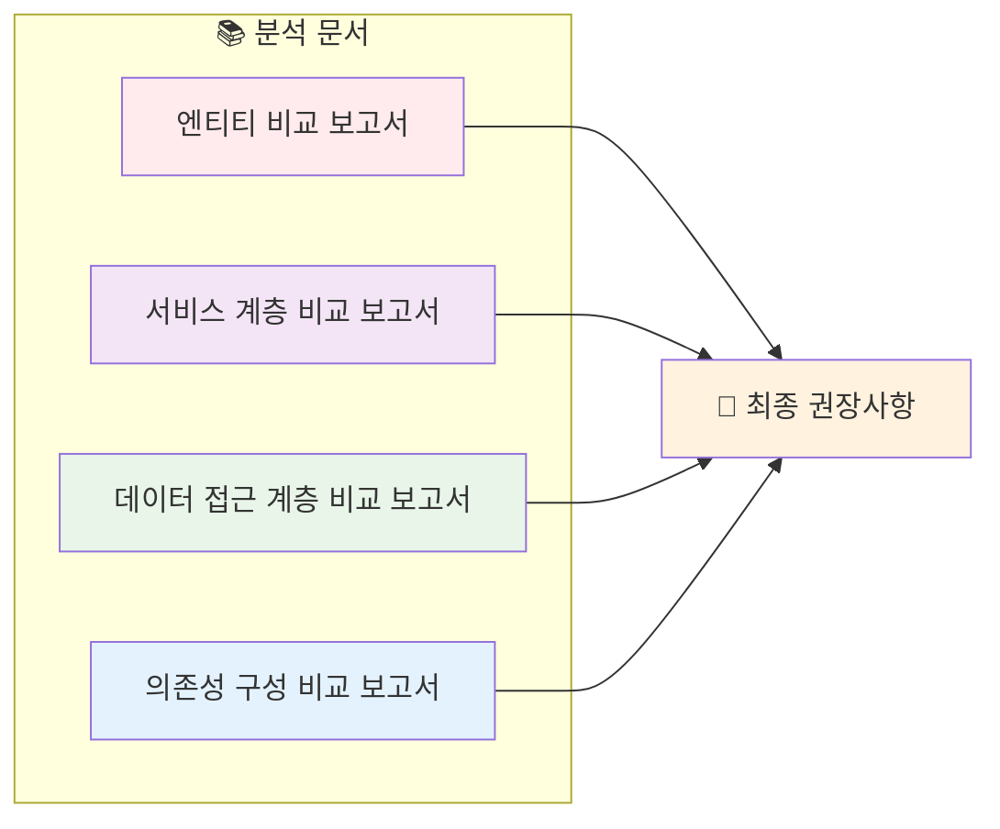

- `entity_comparison_report.md`
- `service_layer_comparison_report.md`
- `data_access_layer_comparison_report.md`
- `dependency_config_comparison_report.md`

**🎯 목표**: 데이터 결합도, 기술 스택 정렬, 운영 역량, 향후 유지보수성을 고려하여 가장 적합한 아키텍처 접근 방식(모놀리스 또는 마이크로서비스)을 결정합니다.

### 📊 1.2. 주요 비교 분석 결과 요약

이전 분석 보고서에서 도출된 다음 핵심 포인트들이 이 결정에 중요합니다:

#### 🔗 엔티티 중복 및 결합도

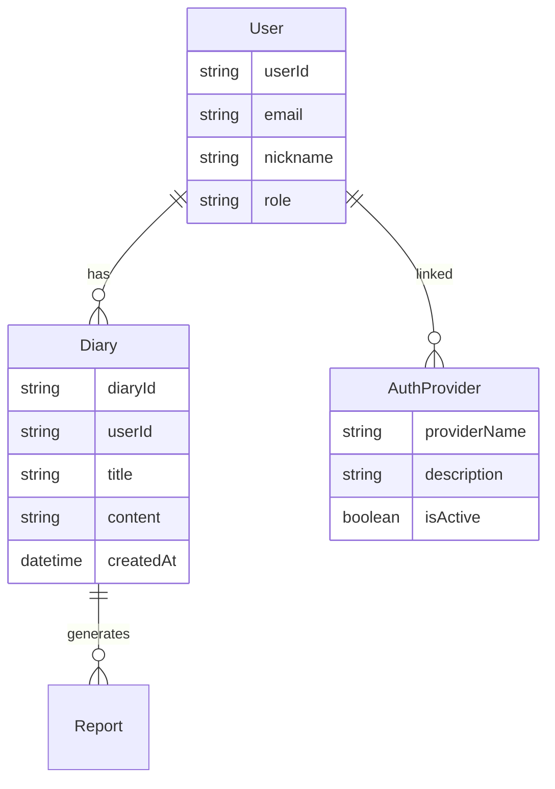

- **🔄 핵심 엔티티**: `User`, `AuthProvider`, `Diary`와 같은 핵심 엔티티가 두 프로젝트에 모두 존재하며, `User`와 `AuthProvider` 엔티티에서 상당한 중복이 있습니다.
- **📊 강한 의존성**: `CBT-back-diary`의 `Diary` 엔티티는 `User` 엔티티에 강한 의존성을 가집니다(외래키 `user_id`).
- **🔧 기존 기능**: Auth-Server에도 `Diary` 엔티티, `Report` 엔티티, `DiaryReportLink`가 포함되어 있어, 순수 인증 기능을 넘어서 일기 관련 기능을 처리하도록 설계되었거나 진화하고 있음을 시사합니다.

#### ⚙️ 서비스 계층 기능

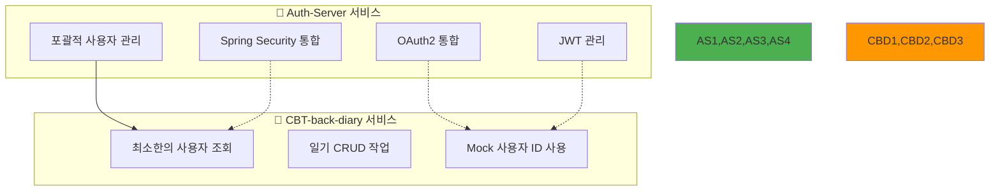

- **🔷 Auth-Server**: OAuth2 통합(`Oauth2Service`), JWT 관리(`TokenService`), Spring Security 통합(`PrincipalDetailService`)을 포함한 포괄적인 사용자 관리 및 인증 시스템을 보유합니다.
- **🔶 CBT-back-diary**: 현재 `UserService`는 최소한이며, 주로 (모의) 사용자 세부정보 조회에 중점을 둡니다. `DiaryService`는 현재 모의 사용자 ID를 사용하여 일기에 대한 CRUD 작업을 처리합니다.

#### 🗄️ 데이터 접근 계층

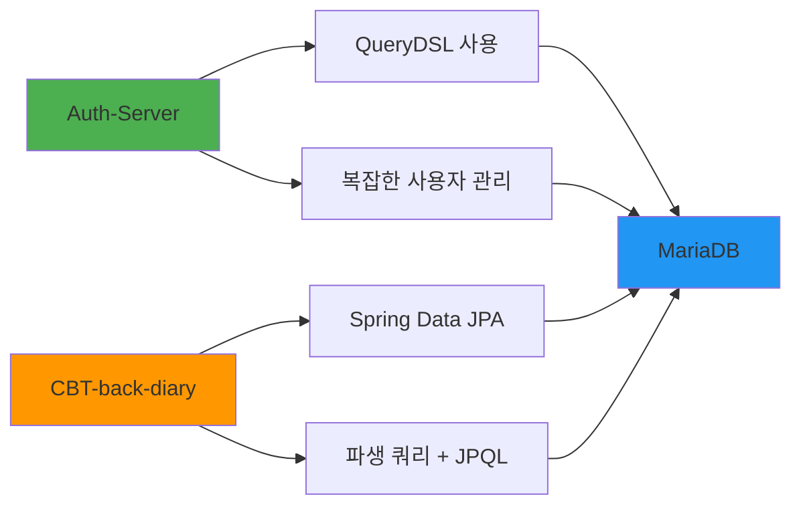

- **🔧 Auth-Server**: 일부 사용자 정의 사용자 리포지토리 메서드에 QueryDSL을 활용하여 사용자 관리를 위한 더 복잡한 데이터 접근 패턴을 나타냅니다.
- **📊 CBT-back-diary**: Spring Data JPA 파생 쿼리와 JPQL에 의존합니다.
- **🗄️ 공통점**: 둘 다 MariaDB를 사용하지만, 설정 관행이 다릅니다(외부화 vs. 하드코딩).

#### 🔧 기술 스택 및 의존성

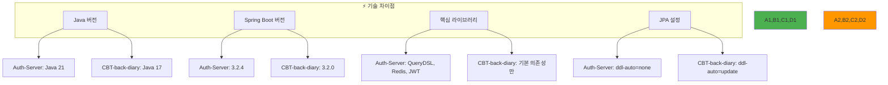

### 🔍 1.3. 아키텍처 접근 방식 평가

#### 🏗️ 1.3.1. 모놀리스 통합

`CBT-back-diary` 기능을 `Auth-Server`에 통합하는 방식(또는 그 반대이지만, Auth-Server가 기반으로 더 완전한 기능을 제공).

**✅ 장점:**

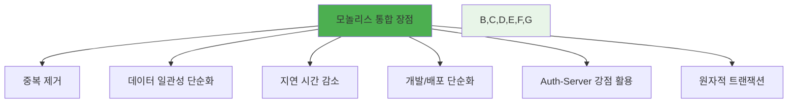

- **🔄 중복 제거**: 중복된 `User` 및 `AuthProvider` 엔티티와 잠재적으로 중복되는 사용자 관리 로직을 제거합니다.
- **📊 데이터 일관성 단순화**: 사용자 및 일기 데이터에 대한 단일 데이터베이스는 강력한 트랜잭션 일관성을 보장합니다.
- **⚡ 지연 시간 감소**: 모놀리스 내 직접 메서드 호출이 서비스 간 API 호출보다 빠릅니다.
- **🛠️ Auth-Server 강점 활용**: OAuth2, JWT, Redis 기반 토큰 관리 등 성숙한 인증 기능의 직접적 이익을 얻습니다.

**❌ 단점:**

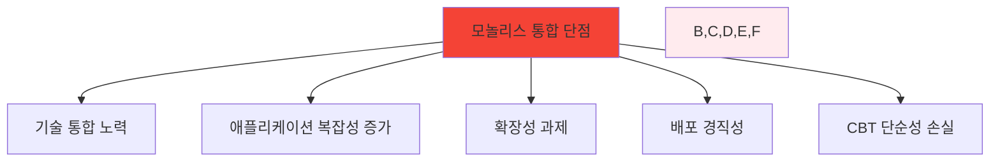

- **🔧 기술 통합 노력**: Java 버전 통일, Spring Boot 버전 정렬, 엔티티 충돌 해결 등이 필요합니다.
- **📈 애플리케이션 복잡성 증가**: 결과적으로 더 크고 복잡한 모놀리스가 됩니다.
- **⚖️ 확장성 과제**: 특정 부분(일기 서비스 vs 인증 서비스)의 독립적 확장이 어려워집니다.

#### 🔗 1.3.2. 마이크로서비스 분리

`Auth-Server`와 `CBT-back-diary`를 API를 통해 통신하는 별도 서비스로 유지하는 방식.

**✅ 장점:**

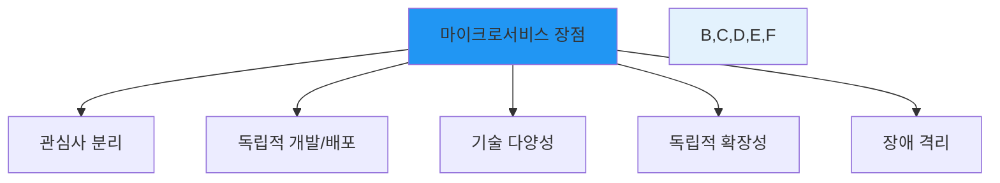

- **🎯 관심사 분리**: 인증/사용자 관리와 일기 기능 간의 명확한 경계를 제공합니다.
- **🚀 독립적 개발/배포**: 팀이 각 서비스를 독립적으로 작업, 업데이트, 배포할 수 있습니다.
- **📈 독립적 확장성**: 각 서비스를 특정 부하 요구사항에 따라 확장할 수 있습니다.

**❌ 단점:**

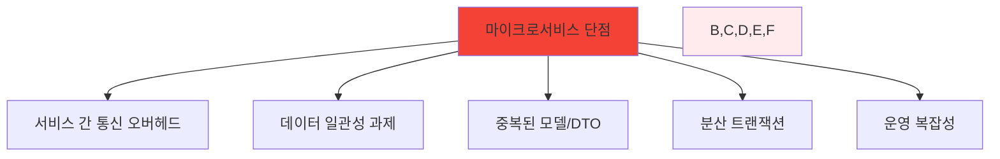

- **🌐 서비스 간 통신 오버헤드**: API 호출로 인한 네트워크 지연 시간과 복잡성이 발생합니다.
- **🔄 데이터 일관성 과제**: 서비스 간에 참조되거나 부분적으로 중복된 데이터의 일관성 유지가 복잡합니다.
- **🔧 운영 복잡성**: 여러 서비스 관리, 모니터링, 디버깅이 단일 애플리케이션보다 복잡합니다.

### 🎯 1.4. 권장사항

**✅ 권장사항: Auth-Server를 기반으로 한 모놀리스 통합**

#### 📋 근거:

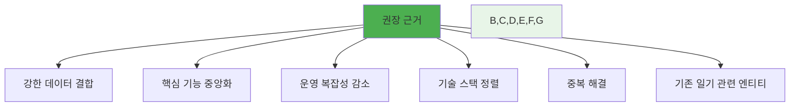

1. **🔗 강한 데이터 결합**: `CBT-back-diary`의 `Diary` 기능이 본질적으로 `User` 엔티티와 연결되어 있어, 마이크로서비스 간 관리 시 상당한 복잡성이 발생합니다.

2. **🏛️ 핵심 기능 중앙화**: `Auth-Server`가 사용자 관리, 인증(OAuth2, JWT)에 대한 더 성숙하고 기능이 풍부한 플랫폼을 제공합니다.

3. **⚖️ 운영 복잡성 감소**: 현재 규모에서는 잘 구조화된 단일 모놀리스가 운영상 더 간단할 수 있습니다.

4. **🔧 기술 스택 정렬**: 두 프로젝트 모두 Spring Boot와 MariaDB를 사용하여 의존성 관리가 가능합니다.

#### 🛠️ 통합 전략 (모놀리스 선택 시):

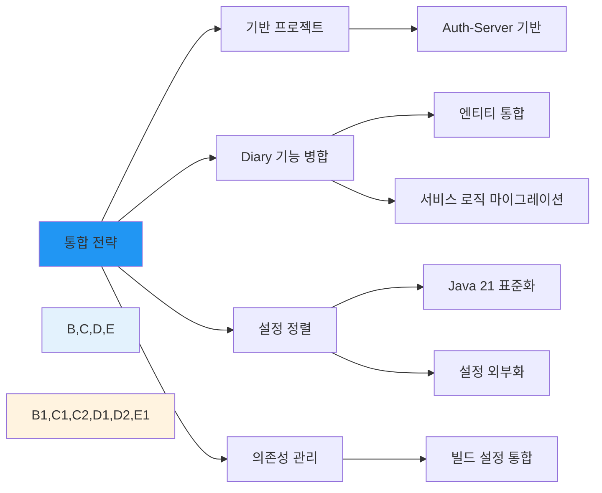

---

## 📊 2. 도메인 모델 및 엔티티 중복 분석

### 🔍 2.1. 동일하거나 유사한 이름의 엔티티

#### 👤 User 엔티티 비교

| 🔧 기능      | 🔷 User (Auth-Server) | 🔶 User (CBT-back-diary) | 📝 차이점/참고사항 |
| ------------ | --------------------- | ------------------------ | ------------------ |
| **엔티티명** | `User`                | `User`                   | -                  |
| **프로젝트** | Auth-Server           | CBT-back-diary           | -                  |
| **목적**     | 시스템 사용자 표현    | 시스템 사용자 표현       | 동일한 기본 목적   |

##### 📋 필드 비교

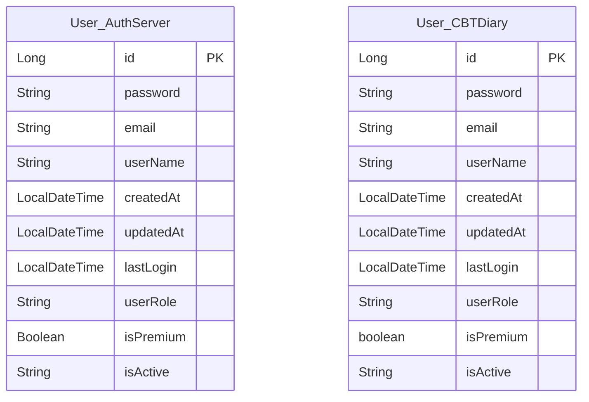

| 필드        | 🔷 Auth-Server                                        | 🔶 CBT-back-diary                                          | 📝 차이점                       |
| ----------- | ----------------------------------------------------- | ---------------------------------------------------------- | ------------------------------- |
| `id`        | `Long`, `@Id`, `@GeneratedValue(IDENTITY)`            | `Long`, `@Id`, `@GeneratedValue(IDENTITY)`, `@Column` 명시 | CBT는 `@Column` 명시적 정의     |
| `password`  | `String`, `@Column(nullable = false)`                 | `String`, `@Column(name = "password", nullable = false)`   | CBT는 컬럼명 명시               |
| `email`     | `String`, `@Column(..., length = 255, unique = true)` | `String`, `@Column(..., unique = true)`                    | Auth-Server는 길이 255 지정     |
| `isPremium` | `Boolean` (객체 래퍼)                                 | `boolean` (원시 타입)                                      | 타입 차이, 둘 다 기본값 `false` |

##### 🔗 관계 매핑

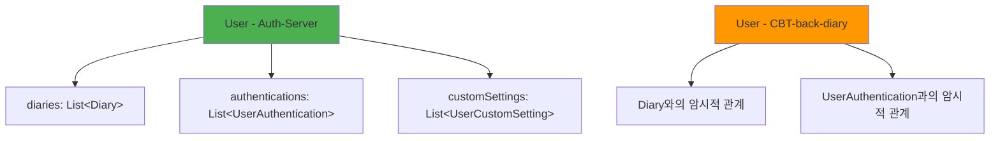

#### 🔐 AuthProvider 엔티티 비교

| 🔧 기능        | 🔷 AuthProvider (Auth-Server)                        | 🔶 AuthProvider (CBT-back-diary)                     | 📝 차이점                   |
| -------------- | ---------------------------------------------------- | ---------------------------------------------------- | --------------------------- |
| **목적**       | 인증 제공자 표현                                     | 인증 제공자 표현                                     | 동일한 기본 목적            |
| `id`           | `Integer`, `@Id`, `@GeneratedValue`                  | `Integer`, `@Id`, `@GeneratedValue`, `@Column` 명시  | CBT는 `@Column` 명시적 정의 |
| `providerName` | `String`, `@Column(..., length = 50, unique = true)` | `String`, `@Column(..., length = 50, unique = true)` | 동일                        |
| `description`  | `String`, `@Column(nullable = true)`                 | `String`, `@Column(name = "description")`            | CBT는 컬럼명 명시           |
| `isActive`     | `Boolean` (기본값 true)                              | `boolean` (기본값 true)                              | 타입 차이                   |

#### 🔑 UserAuthentication 엔티티 비교

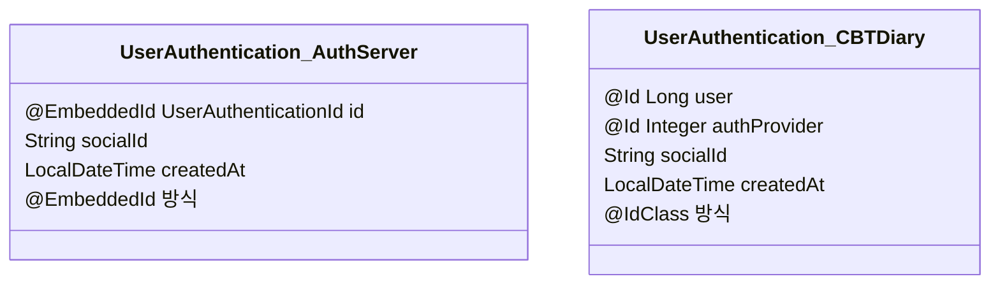

**🔧 주요 차이점**:

- **기본 키 방식**: Auth-Server는 `@EmbeddedId`, CBT-back-diary는 `@IdClass` 사용
- **날짜 관리**: Auth-Server는 `@PrePersist`, CBT-back-diary는 `@Builder.Default`와 DB 기본값 사용

### 📈 2.2. 중복도 분석

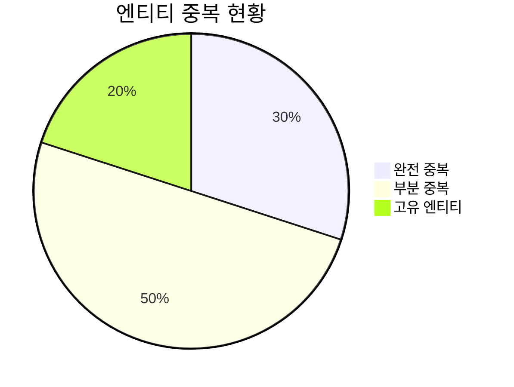

**🎯 결론**: 핵심 사용자 관리 엔티티들에서 높은 중복도가 발견되어, 모놀리스 통합 시 상당한 중복 제거 효과를 기대할 수 있습니다.

---

> 💡 **최종 권장사항**: Auth-Server를 기반으로 한 모놀리스 통합이 현재 프로젝트의 규모와 요구사항에 가장 적합한 아키텍처 접근 방식입니다. 이를 통해 중복 제거, 운영 복잡성 감소, 강력한 데이터 일관성을 달성할 수 있습니다.
