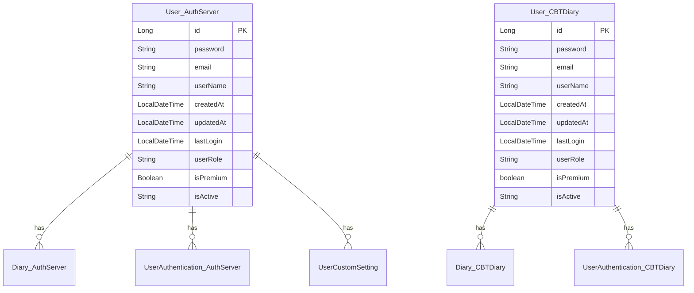
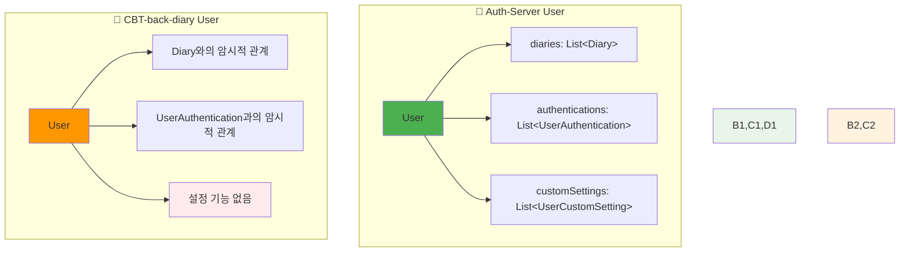
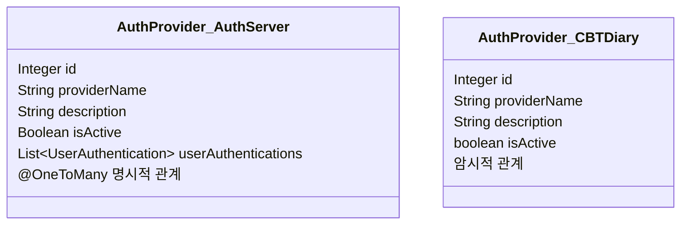
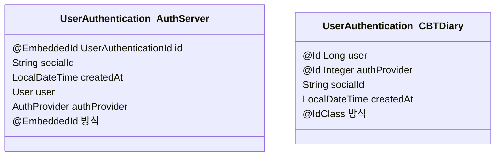
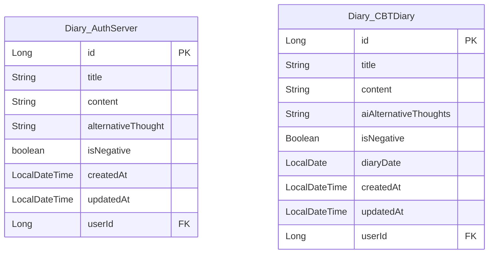
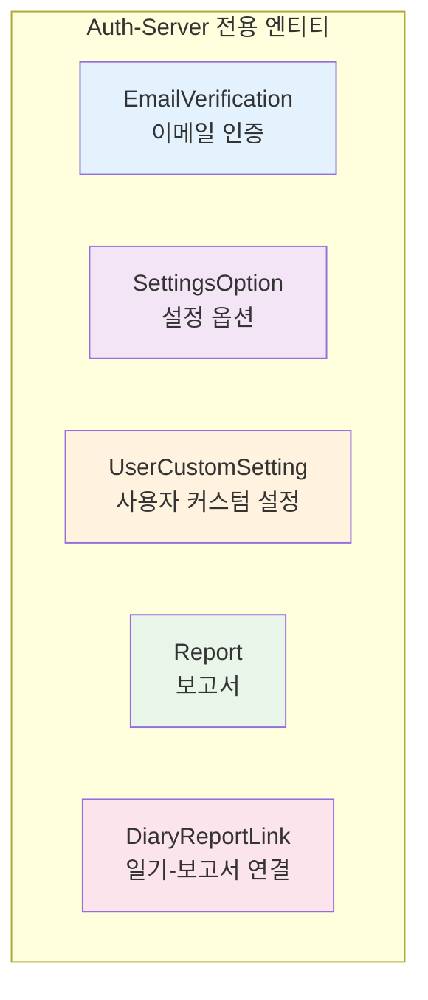
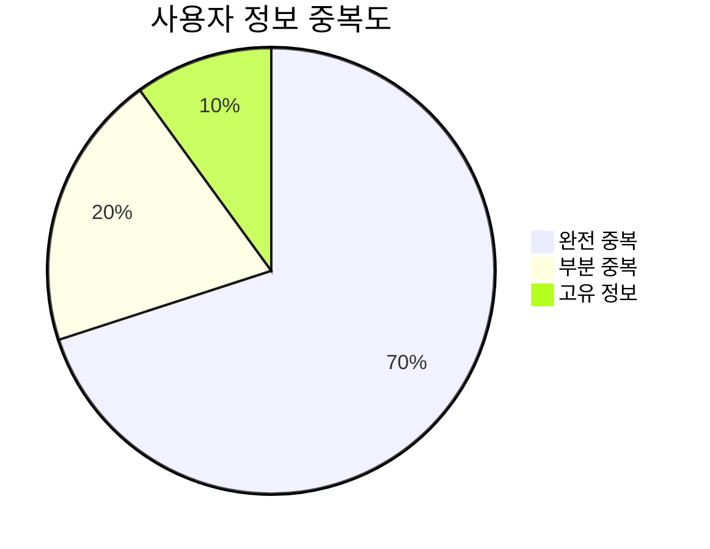
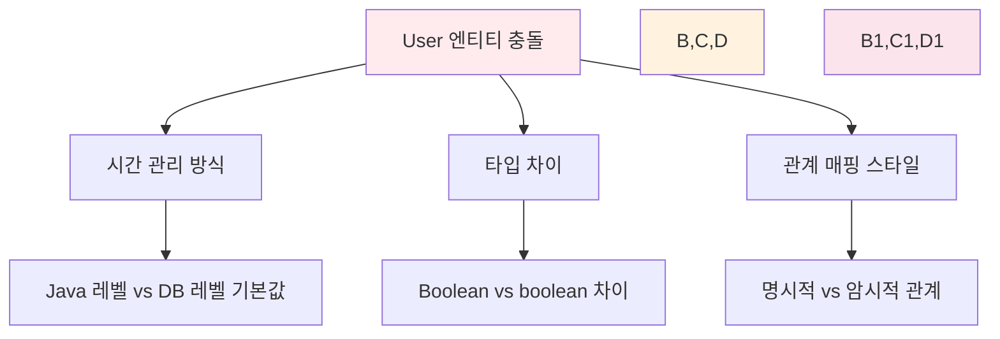
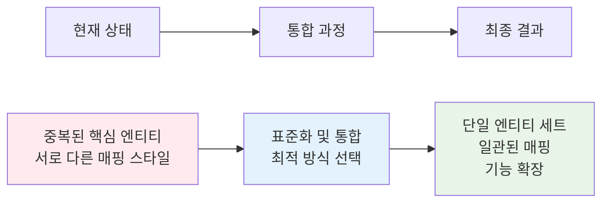

# 📊 엔티티 비교 보고서

> 이 보고서는 `Auth-Server`와 `CBT-back-diary` 프로젝트의 엔티티들을 비교 분석합니다.

## 🔍 동일하거나 유사한 이름의 엔티티

### 👤 User 엔티티 상세 비교



#### 📋 필드별 상세 비교

| 🔧 기능      | 🔷 User (Auth-Server) | 🔶 User (CBT-back-diary) | 📝 차이점/참고사항 |
| ------------ | --------------------- | ------------------------ | ------------------ |
| **엔티티명** | `User`                | `User`                   | -                  |
| **프로젝트** | Auth-Server           | CBT-back-diary           | -                  |
| **목적**     | 시스템 사용자 표현    | 시스템 사용자 표현       | 동일한 기본 목적   |

##### 🔧 필드 세부사항

| 필드            | 🔷 Auth-Server                                        | 🔶 CBT-back-diary                                          | 📝 차이점                                   |
| --------------- | ----------------------------------------------------- | ---------------------------------------------------------- | ------------------------------------------- |
| **`id`**        | `Long`, `@Id`, `@GeneratedValue(IDENTITY)`            | `Long`, `@Id`, `@GeneratedValue(IDENTITY)`, `@Column` 명시 | CBT는 `@Column` 명시적 정의                 |
| **`password`**  | `String`, `@Column(nullable = false)`                 | `String`, `@Column(name = "password", nullable = false)`   | CBT는 컬럼명 명시                           |
| **`email`**     | `String`, `@Column(..., length = 255, unique = true)` | `String`, `@Column(..., unique = true)`                    | Auth-Server는 길이 255 지정                 |
| **`userName`**  | `String`, `@Column(name = "user_name", ...)`          | `String`, `@Column(name = "user_name", ...)`               | 동일. CBT에서는 DTO에서 `nickname`으로 매핑 |
| **`createdAt`** | `LocalDateTime`, `@PrePersist`로 설정                 | `LocalDateTime`, `@Builder.Default` + DB 기본값            | CBT는 DB 레벨 기본값 사용                   |
| **`updatedAt`** | `LocalDateTime`, `@PreUpdate`로 설정                  | `LocalDateTime`, `@Builder.Default` + DB 자동 업데이트     | CBT는 DB 레벨 자동 업데이트                 |
| **`lastLogin`** | `LocalDateTime`, `@Column(name = "last_login")`       | `LocalDateTime`, `@Column(name = "last_login")`            | 동일                                        |
| **`userRole`**  | `String`, `@Builder.Default` "USER"                   | `String`, DTO에서 `role`로 매핑                            | Auth-Server는 기본값 "USER" 지정            |
| **`isPremium`** | `Boolean` (객체 래퍼), 기본값 `false`                 | `boolean` (원시 타입), 기본값 `false`                      | 타입 차이 (객체 vs 원시)                    |
| **`isActive`**  | `String`, `@Builder.Default` "ACTIVE"                 | `String`, `@Builder.Default` "ACTIVE"`                     | 동일                                        |

##### 🔗 관계 매핑



**🔷 Auth-Server**: 명시적 `@OneToMany` 관계 정의
**🔶 CBT-back-diary**: `@ManyToOne` 측에서 암시적 관계

### 🔐 AuthProvider 엔티티 비교



| 🔧 기능            | 🔷 AuthProvider (Auth-Server)            | 🔶 AuthProvider (CBT-back-diary)          | 📝 차이점                   |
| ------------------ | ---------------------------------------- | ----------------------------------------- | --------------------------- |
| **목적**           | 인증 제공자 표현                         | 인증 제공자 표현                          | 동일한 기본 목적            |
| **`id`**           | `Integer`, `@Id`, `@GeneratedValue`      | `Integer`, `@Id`, `@Column` 명시          | CBT는 `@Column` 명시적 정의 |
| **`providerName`** | `String`, `length = 50`, `unique = true` | `String`, `length = 50`, `unique = true`  | 동일                        |
| **`description`**  | `String`, `@Column(nullable = true)`     | `String`, `@Column(name = "description")` | CBT는 컬럼명 명시           |
| **`isActive`**     | `Boolean` (기본값 true)                  | `boolean` (기본값 true)                   | 타입 차이 (객체 vs 원시)    |
| **관계**           | `@OneToMany` 명시                        | 암시적 관계                               | 매핑 스타일 차이            |

### 🔑 UserAuthentication 엔티티 비교



**🔧 주요 차이점**:

| 측면             | 🔷 Auth-Server | 🔶 CBT-back-diary              | 📝 분석                |
| ---------------- | -------------- | ------------------------------ | ---------------------- |
| **기본 키 방식** | `@EmbeddedId`  | `@IdClass`                     | 다른 JPA 복합키 접근법 |
| **날짜 관리**    | `@PrePersist`  | `@Builder.Default` + DB 기본값 | 시간 설정 방식 차이    |
| **관계 매핑**    | `@MapsId` 사용 | `@JoinColumn` 명시             | 외래키 관리 방식 차이  |

### 📖 Diary 엔티티 비교



#### 📊 필드 차이점 분석

| 필드          | 🔷 Auth-Server                | 🔶 CBT-back-diary                  | 📝 차이점                                    |
| ------------- | ----------------------------- | ---------------------------------- | -------------------------------------------- |
| **기본 필드** | `id`, `title`, `content`      | `id`, `title`, `content`           | 동일                                         |
| **AI 관련**   | `alternativeThought`          | `aiAlternativeThoughts`            | 필드명 차이, DB 컬럼은 `alternative_thought` |
| **감정 분석** | `isNegative` (기본값 `false`) | `isNegative` (`Boolean`, nullable) | 타입과 기본값 처리 차이                      |
| **날짜 기능** | 없음                          | `diaryDate` (`LocalDate`)          | CBT만 일기 날짜 필드 보유                    |
| **시간 관리** | `@PrePersist`/`@PreUpdate`    | `@Builder.Default` + DB 기본값     | 시간 설정 방식 차이                          |

## 🔧 고유 엔티티 분석

### 🔷 Auth-Server 전용 엔티티



**🔧 기능별 설명**:

- **EmailVerification**: 이메일 인증 기능
- **SettingsOption**: 시스템 설정 옵션
- **UserCustomSetting**: 사용자별 커스텀 설정
- **Report**: 보고서 생성 및 관리
- **DiaryReportLink**: 일기와 보고서 간 연결

### 🔶 CBT-back-diary 전용 엔티티

현재 CBT-back-diary에는 Auth-Server에 없는 고유 엔티티가 확인되지 않았습니다.

## 📈 중복도 및 충돌 분석

### 📊 사용자 정보 중복 현황



### ⚠️ 잠재적 충돌 및 불일치

#### 1. 👤 User 엔티티 충돌



#### 2. 🔐 AuthProvider 엔티티 충돌

| 충돌 영역     | 설명                                  | 권장 해결책                    |
| ------------- | ------------------------------------- | ------------------------------ |
| **타입 차이** | `Boolean` vs `boolean` for `isActive` | 객체 타입(`Boolean`) 통일 권장 |
| **관계 매핑** | 명시적 vs 암시적 관계 정의            | 명시적 양방향 관계 권장        |

#### 3. 🔑 UserAuthentication 엔티티 충돌

```mermaid
graph LR
    A[복합키 전략] --> B[@EmbeddedId]
    A --> C[@IdClass]

    B --> D[별도 임베디드 클래스]
    C --> E[개별 @Id 필드]

    style A fill:#ff9800
    style B fill:#4caf50
    style C fill:#2196f3
    style D,E fill:#fff3e0
```

#### 4. 📖 Diary 엔티티 충돌

| 충돌 영역     | 🔷 Auth-Server           | 🔶 CBT-back-diary       | 🎯 통합 방안                   |
| ------------- | ------------------------ | ----------------------- | ------------------------------ |
| **AI 필드명** | `alternativeThought`     | `aiAlternativeThoughts` | 의미적으로 명확한 이름 선택    |
| **일기 날짜** | 없음                     | `diaryDate`             | CBT 방식 채택 (날짜 기능 유용) |
| **감정 분석** | `boolean` (기본값 false) | `Boolean` (nullable)    | 비즈니스 요구사항에 따라 결정  |

## 🎯 통합 권장사항

### 📋 사용자 정보 통합 전략

```mermaid
graph TD
    A[통합 전략] --> B[필드 표준화]
    A --> C[관계 매핑 통일]
    A --> D[시간 관리 일원화]

    B --> B1[타입 통일: Boolean → boolean]
    B --> B2[기본값 정책 표준화]

    C --> C1[명시적 양방향 관계]
    C --> C2[일관된 매핑 스타일]

    D --> D1[JPA 라이프사이클 콜백 활용]
    D --> D2[@PrePersist/@PreUpdate 표준화]

    style A fill:#4caf50
    style B,C,D fill:#e8f5e8
    style B1,B2,C1,C2,D1,D2 fill:#fff3e0
```

### 🔧 관계 충돌 해결 방안

**관계 매핑 충돌**은 데이터베이스 무결성을 해치지 않지만, 다른 ORM 매핑 접근법을 나타냅니다:

1. **🔷 Auth-Server 방식**: 양방향 관계 명시 (예: `User`가 `Diary` 목록 보유)
2. **🔶 CBT-back-diary 방식**: 단방향 `@ManyToOne` 관계

**✅ 권장 해결책**: Auth-Server의 명시적 양방향 관계 방식 채택으로 일관된 ORM 매핑 스타일 확립

### 📊 최종 권장사항



## 💡 결론

사용자 정보는 실제로 두 `User` 엔티티 간에 중복됩니다. 핵심 필드들이 양쪽 모두에 존재하며, 어노테이션, 기본값 처리, 원시 타입 vs 래퍼 타입에서 약간의 차이만 있습니다. **기본 구조와 목적은 매우 유사합니다**.

**🎯 통합 시 고려사항**:

- 관계 매핑 스타일 통일 결정
- 타입 차이 해결 (Boolean vs boolean)
- 시간 관리 방식 표준화
- CBT-back-diary의 고유 기능 (diaryDate 등) 보존

이 상세 분석은 두 프로젝트 간 엔티티 현황을 이해하고 통합 전략을 수립하는 데 좋은 기초를 제공합니다.
